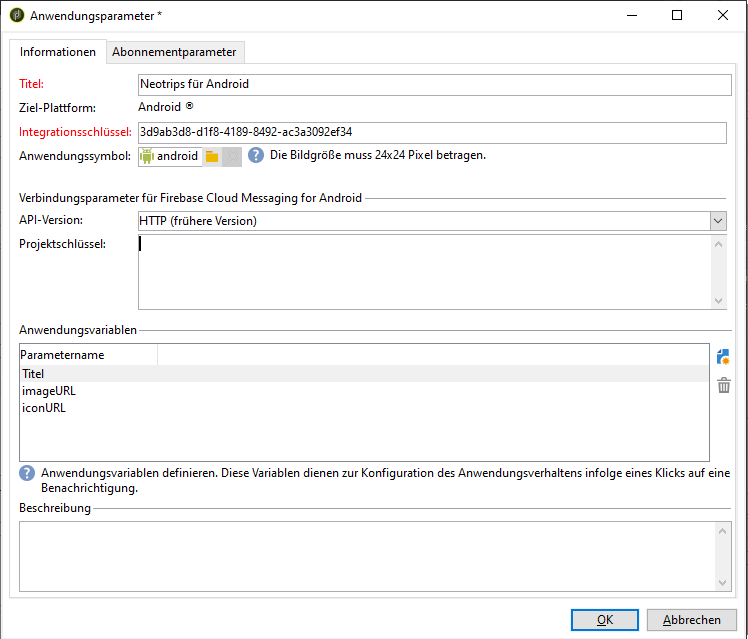

# Konfigurationsschritte für Android

Nachdem das Paket installiert ist, können Sie die Einstellungen Ihrer Android-Mobile-App in Adobe Campaign Classic festlegen.

>[!NOTE]
>
>Informationen dazu, wie Sie Ihre Mobile-App für iOS konfigurieren und einen Versand für iOS erstellen, finden Sie in [diesem Abschnitt](configuring-the-mobile-application.md).

Die wichtigsten Schritte sind:

1. [Konfigurieren des externen Android-Kontos](#configuring-external-account-android)
1. [Konfigurieren des Android-Service](#configuring-android-service)
1. [Erstellen der Mobile App in Campaign](#creating-android-app)
1. [Erweitern des App-Schemas um zusätzliche Daten](#extend-subscription-schema)

Anschließend können Sie eine [Rich-Benachrichtigung für Android erstellen](create-notifications-android.md).

## Konfigurieren des externen Android-Kontos {#configuring-external-account-android}

Für Android sind zwei Connectoren verfügbar:

* Der V1-Connector, der pro untergeordnetem MTA eine Verbindung ermöglicht.
* Der V2-Connector, der gleichzeitige Verbindungen zum FCM-Server ermöglicht, um den Durchsatz zu erhöhen.

Wählen Sie den jeweiligen Connector folgendermaßen aus:

1. Gehen Sie zu **[!UICONTROL Administration > Plattform > Externe Konten]**.
1. Wählen Sie das externe Konto **[!UICONTROL Android-Routing]** aus.
1. Füllen Sie im **[!UICONTROL Connector]**-Tab das Feld **[!UICONTROL Connector-JavaScript]** aus:

   Für Android V2: https://localhost:8080/nms/jsp/androidPushConnectorV2.js

   >[!NOTE]
   >
   > Sie können das Feld auch wie folgt konfigurieren: https://localhost:8080/nms/jsp/androidPushConnector.js; wir empfehlen Ihnen jedoch, Version 2 des Connectors zu verwenden.

   

1. Für Android V2 ist ein zusätzlicher Parameter in der Adobe-Server-Konfigurationsdatei (serverConf.xml) verfügbar:

   * **maxGCMConnectPerChild**: Maximale Anzahl paralleler HTTP-Abfragen bei FCM durch jeden untergeordneten Server (standardmäßig acht).

## Konfigurieren des Android-Service {#configuring-android-service}

 [Erfahren Sie im Video, wie Sie einen Android-Service konfigurieren](https://experienceleague.adobe.com/docs/campaign-classic-learn/getting-started-with-push-notifications-for-android/configuring-an-android-service-in-campaign.html?lang=de#configuring-an-android-service-and-creating-an-android-mobile-application-in-campaign)

1. Klicken Sie im Knoten **[!UICONTROL Profile und Zielgruppen > Dienste und Abonnements]** auf die Schaltfläche **[!UICONTROL Neu]**.

   

1. Bestimmen Sie einen **[!UICONTROL Titel]** und einen **[!UICONTROL internen Namen]**.
1. Wählen Sie im Feld **[!UICONTROL Typ]** die Option **[!UICONTROL Mobile App]**.

   >[!NOTE]
   >
   >Das standardmäßig vorgeschlagene Zielgruppen-Mapping **[!UICONTROL Abonnierte Anwendungen (nms:appSubscriptionRcp)]** bezieht sich auf die Empfängertabelle. Wenn Sie ein anderes Zielgruppen-Mapping verwenden wollen, haben Sie die Möglichkeit, im Feld **[!UICONTROL Zielgruppen-Mapping]** des Service ein neues Zielgruppen-Mapping anzugeben. Weiterführende Informationen zur Erstellung des Zielgruppen-Mappings finden Sie in [diesem Abschnitt](../../configuration/using/about-custom-recipient-table.md).

   

1. Klicken Sie dann auf die Schaltfläche **[!UICONTROL Hinzufügen]**, um den Anwendungstyp auszuwählen.

   

1. Erstellen Sie Ihre Android-Mobile-App. Weiterführende Informationen hierzu finden Sie in [diesem Abschnitt](configuring-the-mobile-application-android.md#creating-android-app).

## Android-Mobile-App erstellen {#creating-android-app}

Nachdem Sie den Dienst erstellt haben, müssen Sie jetzt Ihre Android-Mobile-App erstellen:

1. Klicken Sie in Ihrem neu erstellten Dienst auf die Schaltfläche **[!UICONTROL Hinzufügen]**, um den Anwendungstyp auszuwählen.

   

1. Wählen Sie **[!UICONTROL Android-Anwendung erstellen]** aus und geben Sie einen **[!UICONTROL Titel]** ein.

   

1. Stellen Sie sicher, dass in Adobe Campaign und im Anwendungs-Code derselbe **[!UICONTROL Integrationsschlüssel]** definiert ist (über das SDK). Weiterführende Informationen hierzu finden Sie in [diesem Abschnitt](integrating-campaign-sdk-into-the-mobile-application.md).

   >[!NOTE]
   >
   > Der **[!UICONTROL Integrationsschlüssel]** kann mit einem Zeichenfolgenwert vollständig angepasst werden, muss jedoch mit dem im SDK angegebenen Schlüssel identisch sein.

1. Wählen Sie die **[!UICONTROL API-Version]** aus: HTTP Version 1 oder HTTP (frühere Version). Näheres zu diesen Konfigurationen finden Sie in [diesem Abschnitt](#select-api-version).

1. Füllen Sie die Felder für **[!UICONTROL Verbindungsparameter für Firebase Cloud Messaging for Android]** aus.

1. Klicken Sie auf **[!UICONTROL Beenden]** und danach auf **[!UICONTROL Speichern]**. Ihre Android-Anwendung kann jetzt in Campaign Classic verwendet werden.

Standardmäßig speichert Adobe Campaign einen Schlüssel im Feld **[!UICONTROL User-Kennung]** (@userKey) der Tabelle **[!UICONTROL Abonnentenanwendungen (nms:appSubscriptionRcp)]**. Mit diesem Schlüssel können Sie ein Abonnement mit einem Empfänger verknüpfen. Um zusätzliche Daten (z. B. einen komplexen Abstimmschlüssel) zu erfassen, müssen Sie die folgende Konfiguration übernehmen:

### API-Version auswählen{#select-api-version}

Nachdem Sie einen Service und eine neue Mobile App erstellt haben, müssen Sie Ihre Mobile App entsprechend der ausgewählten API-Version konfigurieren.

* **Näheres zur Konfiguration von HTTP v1** finden Sie in [diesem Abschnitt](configuring-the-mobile-application-android.md#android-service-httpv1).
* **Näheres zur Konfiguration für HTTP (frühere Version)** finden Sie in [diesem Abschnitt](configuring-the-mobile-application-android.md#android-service-http).

#### Konfigurieren der HTTP v1-API{#android-service-httpv1}

Gehen Sie wie folgt vor, um die HTTP v1-API-Version zu konfigurieren:

1. Wählen Sie im Fenster des **[!UICONTROL Mobile-App-Assistenten]** die Option **[!UICONTROL HTTP v1]** aus der Dropdown-Liste **[!UICONTROL API-Version]** aus.

1. Klicken Sie auf **[!UICONTROL Projekt-JSON-Datei zum Extrahieren der Projektdetails laden...]**, um Ihre JSON-Schlüsseldatei direkt zu laden. Weitere Informationen dazu, wie Sie die JSON-Datei extrahieren, finden Sie auf [dieser Seite](https://firebase.google.com/docs/admin/setup#initialize-sdk).

   Sie können auch die folgenden Details manuell eingeben:
   * **[!UICONTROL Projektkennung]**
   * **[!UICONTROL Privater Schlüssel]**
   * **[!UICONTROL Client-E-Mail]**

   

1. Klicken Sie auf **[!UICONTROL Verbindung testen]**, um zu prüfen, ob Ihre Konfiguration korrekt ist und ob der Marketing-Server Zugriff auf den FCM-Server hat.

   >[!CAUTION]
   >
   >Bei Mid-Sourcing-Implementierungen wird mit der Schaltfläche **[!UICONTROL Verbindung testen]** nicht geprüft, ob der MID-Server Zugriff auf den FCM-Server hat.

   

1. Bei Bedarf können Sie die Inhalte von Push-Nachrichten mit bestimmten **[!UICONTROL Anwendungsvariablen]** anreichern. Diese sind vollständig anpassbar; ein Teil der Payload der Nachricht wird an das Mobilgerät gesendet.

1. Klicken Sie auf **[!UICONTROL Beenden]** und danach auf **[!UICONTROL Speichern]**. Ihre Android-Anwendung kann jetzt in Campaign Classic verwendet werden.

Im Folgenden finden Sie die FCM-Payload-Namen, mit denen Sie Ihre Push-Benachrichtigung weiter personalisieren können:

| Nachrichtentyp | Konfigurierbares Nachrichtenelement (FCM-Payload-Name) | Konfigurierbare Optionen (Name der FCM-Payload) |
|:-:|:-:|:-:|
| Datennachricht | K. A. | validate_only |
| Benachrichtigungsinhalt | title, body, android_channel_id, icon, sound, tag, color, click_action, image, ticker, sticky, visibility, notification_priority, notification_count   | validate_only |

 
 

#### Konfigurieren der HTTP-API (frühere Version){#android-service-http}

Gehen Sie wie folgt vor, um die HTTP-API-Version (frühere Version) zu konfigurieren:

1. Wählen Sie im Fenster des **[!UICONTROL Mobile-App-Assistenten]** aus der Dropdown-Liste **[!UICONTROL API-Version]** die Option **[!UICONTROL HTTP (frühere Version)]** aus.

1. Geben Sie den **[!UICONTROL Projektschlüssel]** ein, den der Entwickler der Mobile App bereitgestellt hat.

1. Bei Bedarf können Sie die Inhalte von Push-Nachrichten mit bestimmten **[!UICONTROL Anwendungsvariablen]** anreichern. Diese sind vollständig anpassbar; ein Teil der Payload der Nachricht wird an das Mobilgerät gesendet.

   Im folgenden Beispiel werden **title**, **imageURL** und **iconURL** hinzugefügt, um eine Rich-Push-Benachrichtigung einzurichten. Danach werden der Anwendung das Bild, der Titel und das Symbol bereitgestellt, die in der Benachrichtigung angezeigt werden sollen.

   

1. Klicken Sie auf **[!UICONTROL Beenden]** und danach auf **[!UICONTROL Speichern]**. Ihre Android-Anwendung kann jetzt in Campaign Classic verwendet werden.

Im Folgenden finden Sie die FCM-Payload-Namen, mit denen Sie Ihre Push-Benachrichtigung weiter personalisieren können:

| Nachrichtentyp | Konfigurierbares Nachrichtenelement (FCM-Payload-Name) | Konfigurierbare Optionen (Name der FCM-Payload) |
|:-:|:-:|:-:|
| Datennachricht | K. A. | dryRun |
| Benachrichtigungsinhalt | title, body, android_channel_id, icon, sound, tag, color, click_action   | dryRun |

 

## Erweitern des appsubscriptionRcp-Schemas {#extend-subscription-schema}

 [Erfahren Sie im Video, wie Sie das appsubscriptionRcp-Schema erweitern](https://experienceleague.adobe.com/docs/campaign-classic-learn/getting-started-with-push-notifications-for-android/extending-the-app-subscription-schema.html?lang=de#extending-the-app-subscription-schema-to-personalize-push-notifications)

Sie müssen die **appsubscriptionRcp** erweitern, um in der Campaign-Datenbank neue zusätzliche Felder zum Speichern von Parametern aus der App zu definieren. Diese Felder werden beispielsweise für die Personalisierung verwendet. Gehen Sie dazu wie folgt vor:

1. Erstellen Sie eine Erweiterung des Schemas **[!UICONTROL Abonnentenanwendungen (nms:appsubscriptionRcp)]** und definieren Sie die neuen Felder. Weitere Informationen zur Erweiterung eines Schemas finden Sie auf [dieser Seite](../../configuration/using/about-schema-edition.md)

1. Geben Sie im Tab **[!UICONTROL Abonnementparameter]** das Mapping an.

   >[!CAUTION]
   >
   >Stellen Sie sicher, dass die Parameterbezeichnungen im Tab **[!UICONTROL Abonnementparameter]** mit denen im Anwendungs-Code übereinstimmen. Weitere Informationen finden Sie in [diesem Abschnitt](integrating-campaign-sdk-into-the-mobile-application.md).
