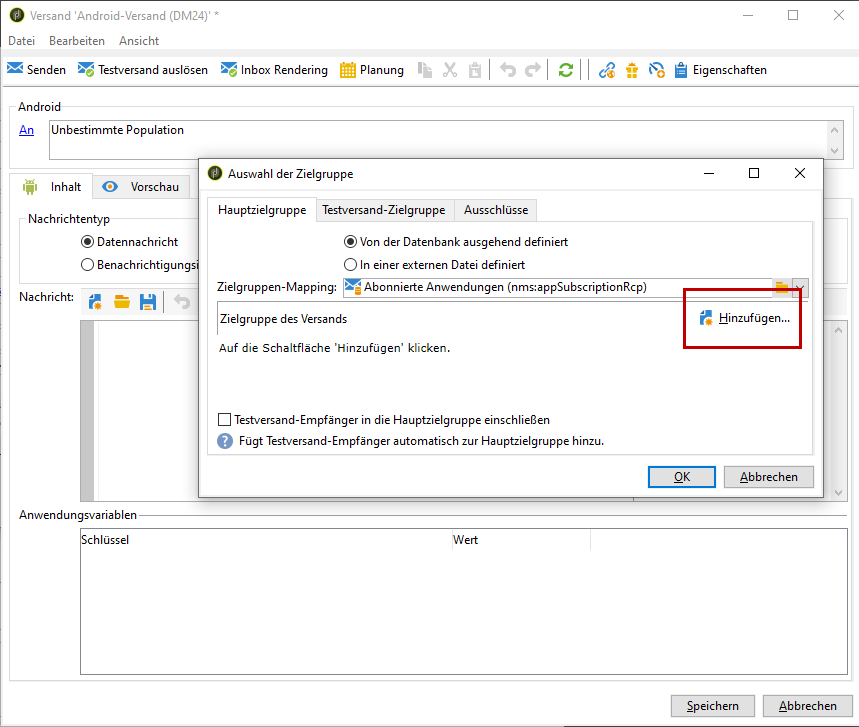

# Konfigurationsschritte für Android

Nachdem das Paket installiert wurde, können Sie Ihre Android-App-Einstellungen in Adobe Campaign Classic definieren.

>[!NOTE]
>
>Informationen zum Konfigurieren der App für iOS und zum Erstellen eines Versands für iOS finden Sie in diesem [Abschnitt](../../delivery/using/configuring-the-mobile-application.md).

## Configuring Android external account {#configuring-external-account-android}

Für Android sind zwei Connectoren verfügbar:

* Der V1-Connector, der pro MTA-Kind eine Verbindung ermöglicht.
* Der V2-Connector, der gleichzeitige Verbindungen zum FCM-Server ermöglicht, um den Durchsatz zu erhöhen.

Wählen Sie den jeweiligen Connector folgendermaßen aus:

1. Gehen Sie zu **[!UICONTROL Administration > Plattform > Externe Konten]**.
1. Wählen Sie das externe Konto **[!UICONTROL Android-Routing]** aus.
1. Füllen Sie im **[!UICONTROL Connector]**-Tab das Feld **[!UICONTROL Connector-JavaScript]** aus:

   Für Android V2: https://localhost:8080/nms/jsp/androidPushConnectorV2.js

   >[!NOTE]
   >
   > Sie können das Feld auch wie folgt konfigurieren: https://localhost:8080/nms/jsp/androidPushConnector.js; wir empfehlen Ihnen jedoch, Version 2 des Connectors zu verwenden.

   

1. Für Android V2 ist ein zusätzlicher Parameter in der Adobe-Server-Konfigurationsdatei (serverConf.xml) verfügbar:

   * **maxGCMConnectPerChild**: Maximale Anzahl paralleler HTTP-Abfragen bei FCM durch jeden Kindserver (standardmäßig acht).

## Konfigurieren des Android-Dienstes {#configuring-android-service}

1. Klicken Sie im Knoten **[!UICONTROL Profile und Zielgruppen > Dienste und Abonnements]** auf die Schaltfläche **[!UICONTROL Neu]**.

   

1. Bestimmen Sie einen **[!UICONTROL Titel]** und einen **[!UICONTROL internen Namen]**.
1. Wählen Sie im Feld **[!UICONTROL Typ]** die Option **[!UICONTROL Mobile App]**.

   >[!NOTE]
   >
   >Das standardmäßig vorgeschlagene Zielgruppen-Mapping **[!UICONTROL Abonnierte Anwendungen (nms:appSubscriptionRcp)]** bezieht sich auf die Empfängertabelle. Sie haben die Möglichkeit, im Feld **[!UICONTROL Zielgruppen-Mapping]** des Dienstes ein anderes, zuvor erstelltes Mapping anzugeben. Weiterführende Informationen hierzu finden Sie im [Konfigurationshandbuch](../../configuration/using/about-custom-recipient-table.md).

   

1. Klicken Sie dann auf die Schaltfläche **[!UICONTROL Hinzufügen]**, um den Anwendungstyp auszuwählen.

   

1. Erstellen Sie Ihre Android-Anwendung. Weiterführende Informationen hierzu finden Sie in diesem [Abschnitt](../../delivery/using/configuring-the-mobile-application-android.md#creating-android-app).

## Erstellen einer mobilen Android-Anwendung {#creating-android-app}

Nachdem Sie den Dienst erstellt haben, müssen Sie jetzt Ihre Android-Anwendung erstellen:

1. Klicken Sie in Ihrem neu erstellten Dienst auf die Schaltfläche **[!UICONTROL Hinzufügen]** , um den Anwendungstyp auszuwählen.

   

1. Wählen Sie &quot; **[!UICONTROL Android-Anwendung]** erstellen&quot;und geben Sie eine **[!UICONTROL Beschriftung]** ein.

   

1. Stellen Sie sicher, dass in Adobe Campaign und im Anwendungs-Code derselbe **[!UICONTROL Integrationsschlüssel]** definiert ist (über das SDK). Weiterführende Informationen finden Sie unter [Integration des Campaign SDK in Mobile Apps](../../delivery/using/integrating-campaign-sdk-into-the-mobile-application.md).

   >[!NOTE]
   >
   > Der **[!UICONTROL Integrationsschlüssel]** kann mit einem Zeichenfolgenwert vollständig angepasst werden, muss jedoch mit dem im SDK angegebenen Schlüssel identisch sein.

1. Wählen Sie eine **[!UICONTROL API-Version]** aus:
   * HTTP. For more information refer to this [section](../../delivery/using/configuring-the-mobile-application-android.md#android-service-http).
   * HTTPV1. For more information refer to this [section](../../delivery/using/configuring-the-mobile-application-android.md#android-service-httpv1).

1. Füllen Sie die **[!UICONTROL Firebase Cloud Messaging-Einstellungen für die Android-Verbindungsfelder]** aus.

1. Klicken Sie auf **[!UICONTROL Beenden]** und danach auf **[!UICONTROL Speichern]**. Ihre Android-Anwendung kann jetzt in Campaign Classic verwendet werden.

Standardmäßig speichert Adobe Campaign in der Tabelle **[!UICONTROL Abonnierte Anwendungen (nms:appSubscriptionRcp)]** im Feld **[!UICONTROL Nutzerkennung]** (@userKey) einen Schlüssel, der die Relation zwischen einem Empfänger und einem Abonnement herstellt. Gehen Sie wie folgt vor, wenn Sie zusätzliche Daten erheben möchten (beispielsweise einen komplexen Abstimmschlüssel):

1. Erweitern Sie das Schema **[!UICONTROL Abonnierte Anwendungen (nms:appsubscriptionRcp)]** und konfigurieren Sie die neuen Felder.

1. Geben Sie im Tab **[!UICONTROL Abonnementparameter]** das Mapping an.

   >[!CAUTION]
   >
   >Stellen Sie sicher, dass die Parameterbezeichnungen im Tab **[!UICONTROL Abonnementparameter]** mit denen im Anwendungs-Code übereinstimmen. Weiterführende Informationen finden Sie im Abschnitt [Integration des Campaign SDK in Mobile Apps](../../delivery/using/integrating-campaign-sdk-into-the-mobile-application.md).

### API-Version auswählen{#select-api-version}

Nachdem Sie einen Dienst und eine neue mobile Anwendung erstellt haben, müssen Sie die Mobilanwendung je nach der gewählten API-Version konfigurieren.

Weitere Informationen zu Service- und Mobilanwendungserstellungen finden Sie in diesem [Abschnitt](../../delivery/using/configuring-the-mobile-application-android.md#configuring-android-service)

#### HTTP v1 API-Version verwenden{#android-service-httpv1}

Gehen Sie wie folgt vor, um die HTTP v1 API-Version zu konfigurieren:

1. Wählen Sie im Fenster des Assistenten **[!UICONTROL zum Erstellen von]** mobilen Anwendungen **[!UICONTROL HTTPV1]** in der Dropdownliste **[!UICONTROL API-Version]** aus.

1. Klicken Sie auf Projektdatei **[!UICONTROL laden, um Projektdetails zu extrahieren...]** , um die JSON-Schlüsseldatei direkt zu laden. For more information on how to extract your JSON file, refer to this [page](https://firebase.google.com/docs/admin/setup#initialize-sdk).

1. Sie können auch manuell die folgenden Details eingeben:
   * **[!UICONTROL Projektkennung]**
   * **[!UICONTROL Privater Schlüssel]**
   * **[!UICONTROL Client-E-Mail]**

   

1. Klicken Sie auf Verbindung **** testen, um zu prüfen, ob Ihre Konfiguration korrekt ist und ob der Marketingserver Zugriff auf den FCM hat.

   >[!CAUTION]
   >
   >Bei der Mid-Sourcing-Bereitstellung wird mit der Schaltfläche **[!UICONTROL Verbindung]** testen nicht geprüft, ob der MID-Server Zugriff auf den FCM-Server hat.

   

1. Bei Bedarf können Sie die Inhalte von Push-Nachrichten mit bestimmten **[!UICONTROL Anwendungsvariablen]** anreichern. Diese sind vollständig anpassbar; ein Teil der Payload der Nachricht wird an das Mobilgerät gesendet.

1. Klicken Sie auf **[!UICONTROL Beenden]** und danach auf **[!UICONTROL Speichern]**. Ihre Android-Anwendung kann jetzt in Campaign Classic verwendet werden.

Im Folgenden finden Sie die FCM-Nutzlastnamen, um Ihre Push-Benachrichtigung weiter zu personalisieren:

| Nachrichtentyp | Konfigurierbares Meldungselement (FCM-Nutzlastname) | Konfigurierbare Optionen (Name der FCM-Payload) |
|:-:|:-:|:-:|
| Datennachricht | K. A. | validate_only |
| Benachrichtigungsinhalt | title, body, android_Kanal_id, icon, sound, tag, color, click_action, image, ticker, sticky, visible, notification_priority, notification_count   | validate_only |

 
 

#### HTTP API-Version{#android-service-http}

Gehen Sie wie folgt vor, um die HTTP-API-Version (ältere Version) zu konfigurieren:

1. Wählen Sie im Fenster des Assistenten **[!UICONTROL zum Erstellen von]** mobilen Anwendungen in der Dropdownliste **[!UICONTROL API-Version]** die Option **[!UICONTROL HTTP (Veraltet)]** .

1. Geben Sie den **[!UICONTROL Projektschlüssel]** ein, der vom Entwickler der mobilen Anwendung bereitgestellt wurde.

1. Bei Bedarf können Sie die Inhalte von Push-Nachrichten mit bestimmten **[!UICONTROL Anwendungsvariablen]** anreichern. Diese sind vollständig anpassbar; ein Teil der Payload der Nachricht wird an das Mobilgerät gesendet.

   Im folgenden Beispiel werden **title**, **imageURL** und **iconURL** hinzugefügt, um eine Rich-Push-Benachrichtigung einzurichten. Danach werden der Anwendung das Bild, der Titel und das Symbol bereitgestellt, die in der Benachrichtigung angezeigt werden sollen.

   

1. Klicken Sie auf **[!UICONTROL Beenden]** und danach auf **[!UICONTROL Speichern]**. Ihre Android-Anwendung kann jetzt in Campaign Classic verwendet werden.

Im Folgenden finden Sie die FCM-Nutzlastnamen, um Ihre Push-Benachrichtigung weiter zu personalisieren:

| Nachrichtentyp | Konfigurierbares Meldungselement (FCM-Nutzlastname) | Konfigurierbare Optionen (Name der FCM-Payload) |
|:-:|:-:|:-:|
| Datennachricht | K. A. | dryRun |
| Benachrichtigungsinhalt | title, body, android_Kanal_id, icon, sound, tag, color, click_action   | dryRun |

 

## Creating an Android rich notification {#creating-android-delivery}

Mit Firebase Cloud Messaging können Sie zwischen zwei Arten von Nachrichten wählen:

* **[!UICONTROL Datenmeldung]**, die von der Client-App verarbeitet wird.
    Nachrichten werden direkt an die mobile Anwendung gesendet, die die Android-Benachrichtigung generiert und dem Gerät anzeigt. Datenmeldungen enthalten nur Ihre benutzerdefinierten Anwendungsvariablen.

* **[!UICONTROL Benachrichtigungsmeldung]**, die automatisch vom FCM-SDK verarbeitet wird.
     FCM zeigt die Nachricht automatisch auf den Geräten Ihrer Benutzer im Auftrag der Client-App an. Benachrichtigungsmeldungen enthalten einen vordefinierten Satz von Parametern und Optionen, können aber weiterhin mit benutzerspezifischen Anwendungsvariablen personalisiert werden.

Weitere Informationen zu Firebase Cloud-Nachrichtentypen finden Sie in der [FCM-Dokumentation](https://firebase.google.com/docs/cloud-messaging/concept-options#notifications_and_data_messages).

### Erstellen einer Datenmeldung {#creating-data-message}

1. Gehen Sie zu **[!UICONTROL Kampagnenverwaltung]** > **[!UICONTROL Sendungen]**.

1. Klicken Sie auf **[!UICONTROL Neu]**.

   

1. Wählen Sie **[!UICONTROL Android-Versand (Android)]** aus der Dropdown-Liste **[!UICONTROL Versandvorlage]**. Fügen Sie Ihrem Versand einen **[!UICONTROL Titel]** hinzu.

1. Klicken Sie auf **[!UICONTROL An]**, um die Zielpopulation zu definieren. Standardmäßig wird das Zielgruppen-Mapping **[!UICONTROL Abonnierte Anwendung]** angewendet. Klicken Sie auf **[!UICONTROL Hinzufügen]** , um Ihren Dienst auszuwählen.

   

1. Wählen Sie im Fenster **[!UICONTROL Zieltyp]****** die Option „Abonnenten einer Android-Mobile-App“ und klicken Sie auf **[!UICONTROL Weiter]**.

1. Wählen Sie aus der Dropdown-Liste **[!UICONTROL Dienst]** den zuvor erstellten Dienst und dann die Anwendung aus und wählen Sie danach **[!UICONTROL Beenden]**.
Die **[!UICONTROL Anwendungsvariablen]** werden je nachdem, was bei den Konfigurationsschritten hinzugefügt wurde, automatisch hinzugefügt.

   

1. Wählen Sie **[!UICONTROL Datenmeldung]** als **[!UICONTROL Nachrichtentyp]**.

1. Bearbeiten Sie Ihre Rich-Benachrichtigung.

   

1. Sie können bei Bedarf Informationen zu Ihren zuvor konfigurierten **[!UICONTROL Anwendungsvariablen]** hinzufügen. **[!UICONTROL Anwendungsvariablen]** müssen im Android-Dienst konfiguriert werden und sind Teil der an das Mobilgerät gesendeten Nutzlast.

1. Klicken Sie auf **[!UICONTROL Speichern]** und führen Sie den Versand durch.

Auf den Android-Mobilgeräten der Abonnenten sollten das Bild und die Webseite in der Push-Benachrichtigung angezeigt werden.

### Benachrichtigungsmeldung erstellen {#creating-notification-message}

>[!NOTE]
>
>Zusätzliche Optionen für die Benachrichtigung sind nur bei der HTTP-API-Konfiguration der Version 1 verfügbar. Weiterführende Informationen hierzu finden Sie in diesem [Abschnitt](../../delivery/using/configuring-the-mobile-application-android.md#android-service-httpv1).

1. Gehen Sie zu **[!UICONTROL Kampagnenverwaltung]** > **[!UICONTROL Sendungen]**.

1. Klicken Sie auf **[!UICONTROL Neu]**.

   

1. Wählen Sie **[!UICONTROL Android-Versand (Android)]** aus der Dropdown-Liste **[!UICONTROL Versandvorlage]**. Fügen Sie Ihrem Versand einen **[!UICONTROL Titel]** hinzu.

1. Klicken Sie auf **[!UICONTROL An]**, um die Zielpopulation zu definieren. Standardmäßig wird das Zielgruppen-Mapping **[!UICONTROL Abonnierte Anwendung]** angewendet. Klicken Sie auf **[!UICONTROL Hinzufügen]** , um Ihren Dienst auszuwählen.

   

1. Wählen Sie im Fenster **[!UICONTROL Zieltyp]****** die Option „Abonnenten einer Android-Mobile-App“ und klicken Sie auf **[!UICONTROL Weiter]**.

1. Wählen Sie aus der Dropdown-Liste **[!UICONTROL Dienst]** den zuvor erstellten Dienst und dann die Anwendung aus und wählen Sie danach **[!UICONTROL Beenden]**.

   

1. Wählen Sie **[!UICONTROL Benachrichtigungsmeldung]** als **[!UICONTROL Nachrichtentyp]**.

1. hinzufügen Sie einen Titel und bearbeiten Sie Ihre Nachricht. Personalisieren Sie Ihre Push-Benachrichtigung mit den **[!UICONTROL Benachrichtigungsoptionen]**:

   * **[!UICONTROL Kanal-ID]**: Legen Sie die Kanal-ID der Benachrichtigung fest. Die App muss einen Kanal mit dieser Kanal-ID erstellen, bevor eine Benachrichtigung mit dieser Kanal-ID empfangen wird.
   * **[!UICONTROL Ton]**: Stellen Sie den Ton ein, der abgespielt werden soll, wenn das Gerät Ihre Benachrichtigung erhält.
   * **[!UICONTROL Farbe]**: Legen Sie die Symbolfarbe der Benachrichtigung fest.
   * **[!UICONTROL Symbol]**: Legen Sie das Benachrichtigungssymbol fest, das auf den Geräten Ihrer Profile angezeigt werden soll.
   * **[!UICONTROL Tag]**: Legen Sie den Bezeichner fest, der zum Ersetzen vorhandener Benachrichtigungen im Benachrichtigungsfenster verwendet wird.
   * **[!UICONTROL Klickaktion]**: Legen Sie die Aktion fest, die einem Benutzer zugeordnet ist, indem Sie auf Ihre Benachrichtigung klicken.

   Weitere Informationen zu den **[!UICONTROL Benachrichtigungsoptionen]** und zum Ausfüllen dieser Felder finden Sie in der [FCM-Dokumentation](https://firebase.google.com/docs/reference/fcm/rest/v1/projects.messages#androidnotification).

   

1. Wenn Ihre Anwendung mit dem HTTP v1 API-Protokoll konfiguriert ist, können Sie Ihre Push-Benachrichtigung mit den folgenden **[!UICONTROL HTTPV1-Optionen]** weiter personalisieren:

   * **[!UICONTROL Ticker]**: Legen Sie den Tickertext Ihrer Benachrichtigung fest. Nur verfügbar für Geräte mit Android 5.0 Lollipop.
   * **[!UICONTROL Bild]**: Legen Sie die URL des Bilds fest, die in Ihrer Benachrichtigung angezeigt werden soll.
   * **[!UICONTROL Benachrichtigungszähler]**: Legen Sie die Anzahl der neuen ungelesenen Informationen fest, die direkt auf dem Anwendungssymbol angezeigt werden sollen.
   * **[!UICONTROL Sticky]**: Auf true oder false setzen. Bei der Einstellung false wird die Benachrichtigung automatisch geschlossen, wenn der Benutzer darauf klickt. Bei der Einstellung &quot;true&quot;wird die Benachrichtigung auch dann angezeigt, wenn der Benutzer darauf klickt.
   * **[!UICONTROL Benachrichtigungspriorität]**: Legen Sie die Prioritätsstufen Ihrer Benachrichtigung auf &quot;Standard&quot;, &quot;Minimum&quot;, &quot;Niedrig&quot;oder &quot;Hoch&quot;fest. For more on this, refer to [FCM documentation](https://firebase.google.com/docs/reference/fcm/rest/v1/projects.messages#NotificationPriority).
   * **[!UICONTROL Sichtbarkeit]**: Legen Sie die Sichtbarkeitsstufen Ihrer Benachrichtigung auf öffentlich, privat oder geheim fest. For more on this, refer to [FCM documentation](https://firebase.google.com/docs/reference/fcm/rest/v1/projects.messages#visibility).

   Weitere Informationen zu den **[!UICONTROL HTTP v1-Optionen]** und dazu, wie diese Felder ausgefüllt werden, finden Sie in der [FCM-Dokumentation](https://firebase.google.com/docs/reference/fcm/rest/v1/projects.messages#androidnotification).

   

1. Sie können bei Bedarf Informationen zu Ihren zuvor konfigurierten **[!UICONTROL Anwendungsvariablen]** hinzufügen. **[!UICONTROL Anwendungsvariablen]** müssen im Android-Dienst konfiguriert werden und sind Teil der an das Mobilgerät gesendeten Nutzlast.

1. Klicken Sie auf **[!UICONTROL Speichern]** und führen Sie den Versand durch.

Auf den Android-Mobilgeräten der Abonnenten sollten das Bild und die Webseite in der Push-Benachrichtigung angezeigt werden.
