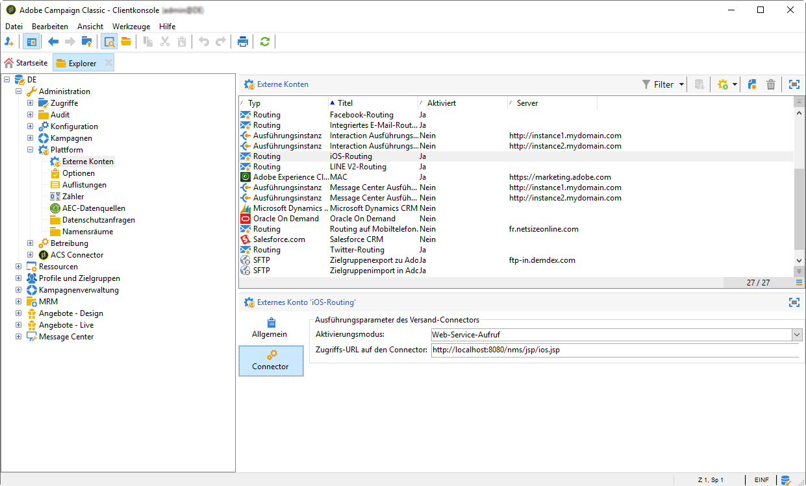
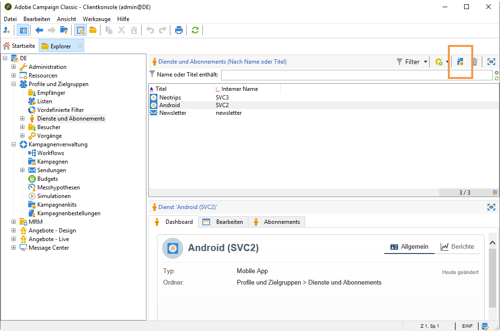
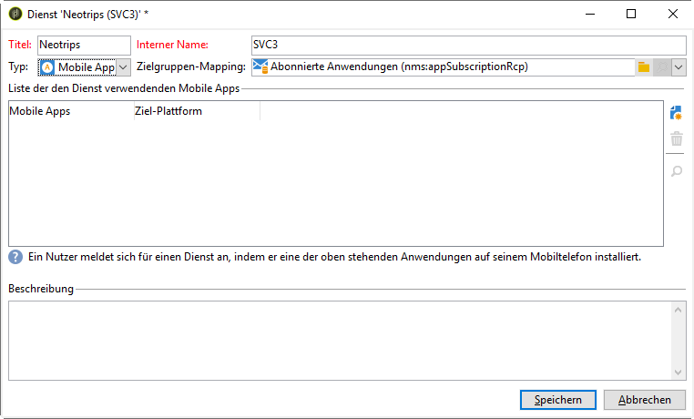
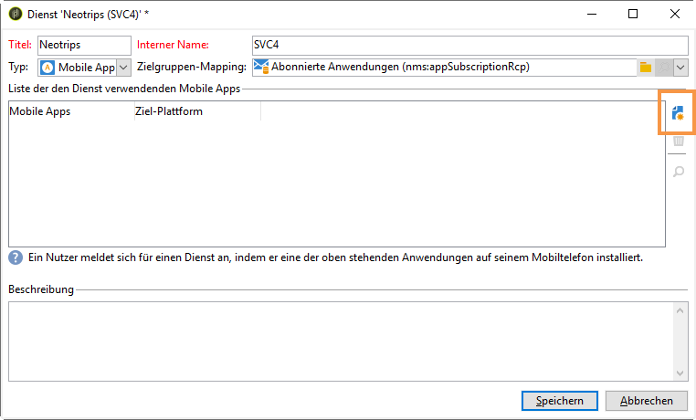
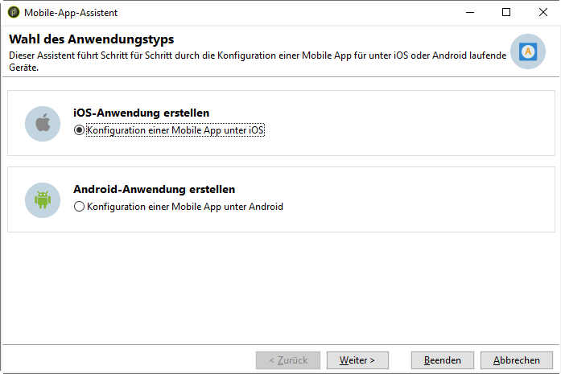
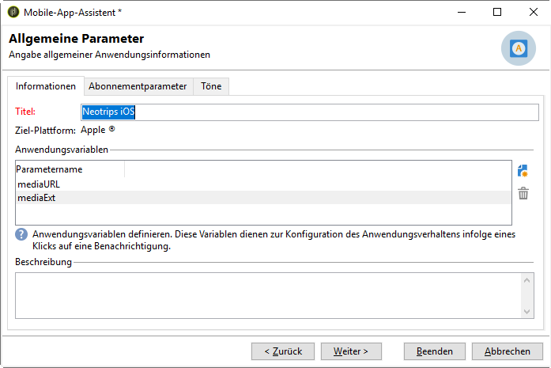
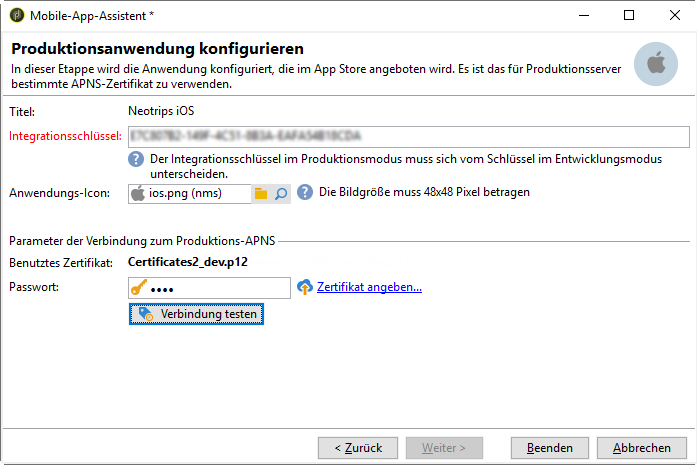

# Konfigurationsschritte für iOS {#configuring-the-mobile-application-in-adobe-campaign-ios}

Nachdem das Paket installiert ist, können Sie in Adobe Campaign Classic die Einstellungen für Ihre iOS-Mobile-App festlegen.

Die wichtigsten Schritte sind:

1. [Konfigurieren des externen iOS-Kontos](#configuring-external-account-ios)
1. [Konfigurieren des iOS-Service](#configuring-ios-service)
1. [Integrieren der iOS-Mobile-App in Campaign](#creating-ios-app)

Anschließend können Sie [eine Push-Benachrichtigung für iOS-Geräte erstellen](create-notifications-ios.md).

## Konfigurieren des externen iOS-Kontos {#configuring-external-account-ios}

Bei iOS sendet der iOS-HTTP/2-Connector Benachrichtigungen an HTTP/2-APNS.

Gehen Sie wie folgt vor, um diesen Connector zu konfigurieren:

1. Gehen Sie zu **[!UICONTROL Administration > Plattform > Externe Konten]**.
1. Wählen Sie das externe Konto **[!UICONTROL iOS-Routing]** aus.
1. Füllen Sie im Tab **[!UICONTROL Connector]** das Feld **[!UICONTROL Zugriffs-URL auf den Connector]** mit der folgenden URL aus: `http://localhost:8080/nms/jsp/iosHTTP2.jsp`

   

1. Wählen Sie **[!UICONTROL Speichern]** aus.

Ihr iOS-Connector ist jetzt konfiguriert. Sie können mit dem Einrichten Ihres Dienstes beginnen.

## Konfigurieren des iOS-Service {#configuring-ios-service}

>[!CAUTION]
>
>Die Anwendung muss für Push-Aktionen konfiguriert worden sein, BEVOR eine Integration in das Adobe SDK erfolgt.
>
>Sollte dies nicht der Fall sein, besuchen Sie bitte [diese Seite](https://developer.apple.com/documentation/usernotifications).

1. Klicken Sie im Knoten **[!UICONTROL Profile und Zielgruppen > Dienste und Abonnements]** auf die Schaltfläche **[!UICONTROL Neu]**.

   

1. Bestimmen Sie einen **[!UICONTROL Titel]** und einen **[!UICONTROL internen Namen]**.
1. Wählen Sie im Feld **[!UICONTROL Typ]** die Option **[!UICONTROL Mobile App]**.

   >[!NOTE]
   >
   >Das standardmäßige Zielgruppen-Mapping für **[!UICONTROL abonnierte Anwendungen (nms:appSubscriptionRcp)]** ist mit der Empfängertabelle verknüpft. Wenn Sie ein anderes Zielgruppen-Mapping verwenden möchten, müssen Sie ein neues Zielgruppen-Mapping erstellen und es im Feld **[!UICONTROL Zielgruppen-Mapping]** des Dienstes eingeben. Weiterführende Informationen zur Erstellung des Zielgruppen-Mappings finden Sie im [Konfigurationshandbuch](../../configuration/using/about-custom-recipient-table.md).

   

1. Klicken Sie dann auf die Schaltfläche **[!UICONTROL Hinzufügen]**, um den Anwendungstyp auszuwählen.

   

1. Erstellen Sie Ihre iOS-Mobile-Apps für Entwicklung und Produktion. Weitere Informationen hierzu finden Sie in [diesem Abschnitt](configuring-the-mobile-application.md#creating-ios-app).

## Erstellen einer iOS-Mobile-App {#creating-ios-app}

Erstellen Sie nach der Erstellung Ihres Services Ihre iOS-Mobile-App in Campaign. Gehen Sie wie folgt vor:

1. Klicken Sie in Ihrem neu erstellten Dienst auf die Schaltfläche **[!UICONTROL Hinzufügen]**, um den Anwendungstyp auszuwählen.

   

1. Das folgende Fenster wird angezeigt. Wählen Sie **[!UICONTROL iOS-Anwendung erstellen]** und beginnen Sie, indem Sie den **[!UICONTROL Titel]** eingeben.

   

1. Als Option können Sie bei Bedarf den Inhalt einer Push-Nachricht mit einigen **[!UICONTROL Anwendungsvariablen]** anreichern. Diese sind vollständig anpassbar und Teil der Nachrichten-Payload, die an das Mobilgerät gesendet wird.
Im folgenden Beispiel fügen wir &quot;**mediaURl** und **mediaExt** hinzu, um eine Rich-Push-Benachrichtigung zu erstellen, und stellen dann der Anwendung das Bild bereit, das in der Benachrichtigung angezeigt werden soll.

   

1. Auf der Registerkarte **[!UICONTROL Abonnementparameter]** können Sie das Mapping mit einer Erweiterung des Schemas **[!UICONTROL Abonnierte Anwendungen (nms:appsubscriptionRcp)]** definieren.

   >[!NOTE]
   >
   >Vergewissern Sie sich, dass Sie nicht dasselbe Zertifikat sowohl für die Entwicklungsversion (Sandbox) als auch für die Produktionsversion der Anwendung verwenden.

1. Auf dem Tab **[!UICONTROL Töne]** können Sie einen abzuspielenden Ton festlegen. Klicken Sie auf **[!UICONTROL Hinzufügen]** und füllen Sie das Feld **[!UICONTROL Interner Name]** aus, das den Namen der in die Anwendung eingebetteten Datei oder den Namen des Systemtons enthalten muss.

1. Klicken Sie auf **[!UICONTROL Weiter]**, um mit dem Konfigurieren der Entwicklungsanwendung zu beginnen.

1. Stellen Sie sicher, dass in Adobe Campaign und im Anwendungs-Code derselbe **[!UICONTROL Integrationsschlüssel]** definiert ist (über das SDK). <!--For more on this, refer to [this page](integrating-campaign-sdk-into-the-mobile-application.md).--> Mit diesem programmspezifischen Integrationsschlüssel können Sie die Mobile App mit der Adobe Campaign-Plattform verknüpfen.

   >[!NOTE]
   >
   > Der **[!UICONTROL Integrationsschlüssel]** kann mit einem Zeichenfolgenwert vollständig angepasst werden, muss jedoch mit dem im SDK angegebenen Schlüssel identisch sein.

1. Wählen Sie im Feld **[!UICONTROL Anwendungssymbol]** ein vordefiniertes Symbol aus, um die Mobile App in Ihrem Dienst zu personalisieren.

1. Wählen Sie den **[!UICONTROL Authentifizierungsmodus]** aus.

   

   Zwei Modi sind verfügbar:

   * (Empfohlen) **[!UICONTROL Token-basierte Authentifizierung]**: Füllen Sie die APNs-Verbindungseinstellungen **[!UICONTROL Schlüssel-ID]**, **[!UICONTROL Team-ID]** und **[!UICONTROL Paket-ID]** aus und wählen Sie dann Ihr p8-Zertifikat, indem Sie auf **[!UICONTROL Privaten Schlüssel eingeben…]** klicken. Weitere Informationen zur **[!UICONTROL Token-basierten Authentifizierung]** finden Sie in der [Dokumentation zu Apple](https://developer.apple.com/documentation/usernotifications/setting_up_a_remote_notification_server/establishing_a_token-based_connection_to_apns){target="_blank"}.

   * **[!UICONTROL Zertifikatbasierte Authentifizierung]**: Klicken Sie auf **[!UICONTROL Zertifikat eingeben…]**. Wählen Sie dann Ihren p12-Schlüssel und geben Sie das Passwort ein, das der Entwickler bzw. die Entwicklerin der Mobile App bereitgestellt hat.

   >[!NOTE]
   >
   > Adobe empfiehlt die Verwendung der **[!UICONTROL Token-basierten Authentifizierung]** für Ihre iOS-Konfiguration, da die P8-Authentifizierungsschlüssel neuer und sicherer sind.

1. Klicken Sie auf die Schaltfläche **[!UICONTROL Verbindung testen]**, um Ihre Konfiguration zu validieren.

1. Nun können Sie die Produktionsanwendung konfigurieren, indem Sie auf **[!UICONTROL Weiter]** klicken und nach dem gleichen Verfahren wie oben beschrieben vorgehen.

1. Klicken Sie auf **[!UICONTROL Beenden]**.

Ihre iOS-Mobile-App kann jetzt in Campaign Classic verwendet werden.
