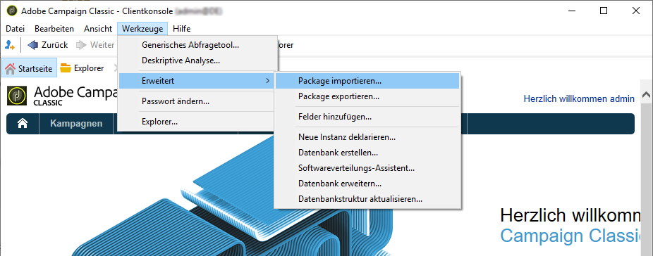
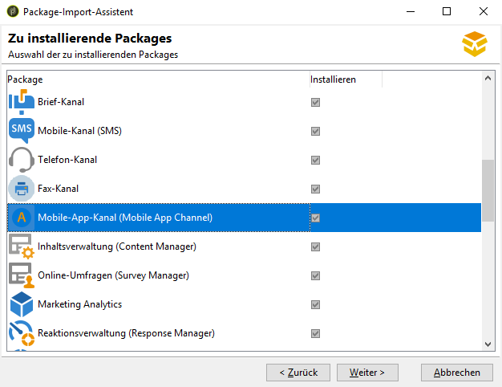
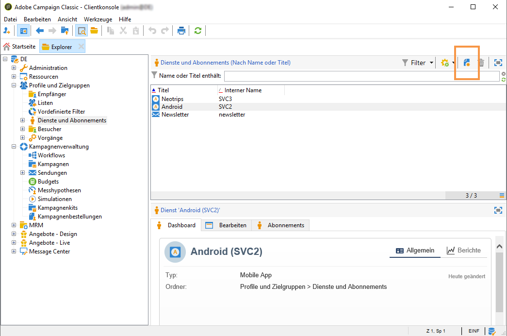
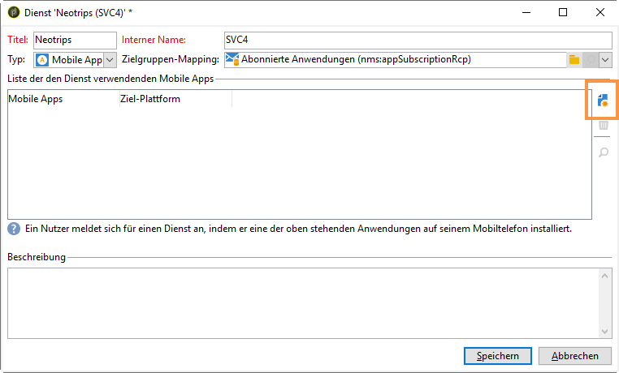
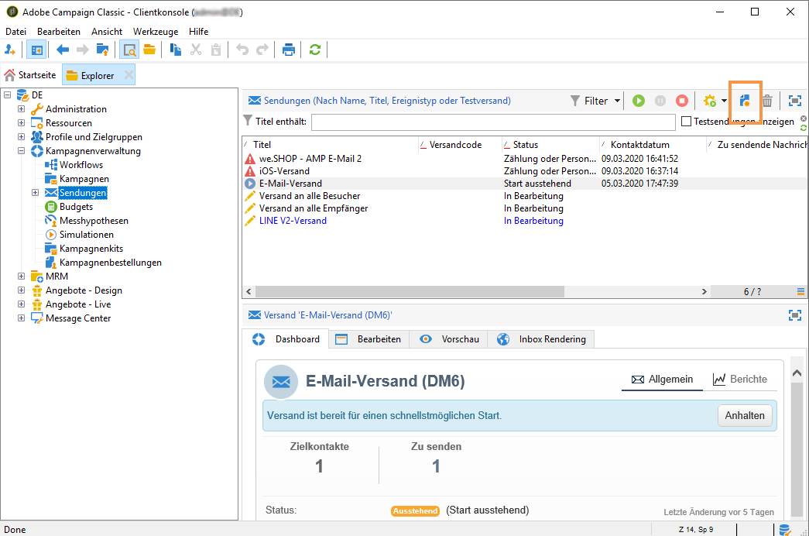
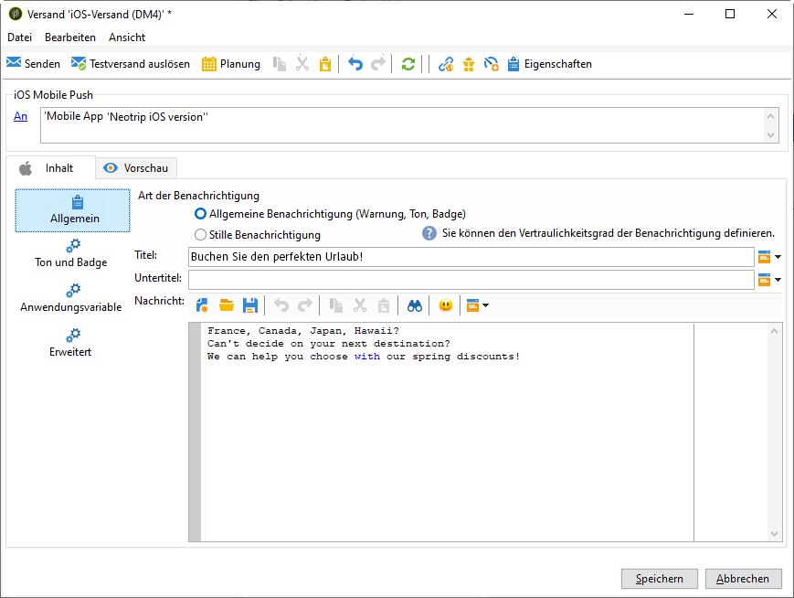
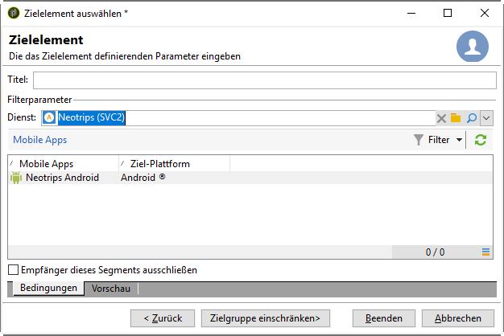

# Konfiguration der Mobile App in Adobe Campaign {#configuring-the-mobile-application-in-adobe-campaign}

Nachfolgend finden Sie ein Beispiel für eine Konfiguration, die auf einem Unternehmen basiert, das online Urlaubspakete verkauft. Seine Mobile App (Neotrips) steht den Kunden in zwei Versionen zur Verfügung: Neotrips für Android und Neotrips für iOS. Um die Mobile App in Adobe Campaign zu konfigurieren, müssen Sie Folgendes tun:

* Erstellen Sie für die Neotrips-App einen Informationsdienst vom Typ **[!UICONTROL Mobile App]**.
* Fügen Sie diesem Dienst die iOS- und Android-Versionen der App hinzu.
* Erstellen Sie je einen Versand für iOS und Android.

>[!NOTE]
>
>Im **[!UICONTROL Abonnement]**-Tab des Dienstes finden Sie alle Abonnenten, d. h. alle Nutzer, die die App auf ihrem Mobilgerät installiert und dem Erhalt von Benachrichtigungen zugestimmt haben.

## Konfiguration der Mobile App mit iOS {#configuring-the-mobile-application-ios}

>[!CAUTION]
>
>Bevor Sie die SDK integrieren, ist sicherzustellen, dass die Anwendungen für den Versand von Push-Benachrichtigungen konfiguriert wurden.
>
>Sollte dies nicht der Fall sein, besuchen Sie [diese Seite](https://developer.apple.com/library/archive/documentation/NetworkingInternet/Conceptual/RemoteNotificationsPG/).

### Schritt 1: Installieren des Package {#installing-package-ios}

1. Greifen Sie über **[!UICONTROL Tools > Erweitert > Package-Import...]** in der Adobe-Campaign-Clientkonsole auf den Package-Import-Assistenten zu.

   

1. Wählen Sie **[!UICONTROL Standard-Package installieren]** aus.

1. Markieren Sie in der angezeigten Liste **[!UICONTROL Mobile-App-Kanal (Mobile App Channel)]**.

   

1. Klicken Sie auf **[!UICONTROL Weiter]** und dann auf **[!UICONTROL Starten]**, um die Package-Installation zu starten.

   Sobald die Packages installiert sind, wird in der Fortschrittsleiste **100 %** angezeigt. Folgende Meldung wird in den Installationsprotokollen angezeigt: **[!UICONTROL Die Installation der Packages wurde erfolgreich beendet]**.

   

1. **[!UICONTROL Schließen]** Sie das Installationsfenster.

### Schritt 2: Konfigurieren eines externen iOS-Kontos {#configuring-external-account-ios}

Für iOS sind zwei Connectoren verfügbar:

* Der binäre iOS-Connector sendet Benachrichtigungen an APNS-Legacy-Binärserver.
* Der iOS HTTP/2-Connector sendet Benachrichtigungen an HTTP/2-APNS.

Wählen Sie den jeweiligen Connector folgendermaßen aus:

1. Gehen Sie zu **[!UICONTROL Administration > Plattform > Externe Konten]**.
1. Wählen Sie das externe Konto **[!UICONTROL iOS-Routing]** aus.
1. Füllen Sie im **[!UICONTROL Connector]**-Tab das Feld **[!UICONTROL Zugriffs-URL auf den Connector]** aus:

   Für HTTP2-iOS: http://localhost:8080/nms/jsp/iosHTTP2.jsp

   

   >[!NOTE]
   >
   > Sie können es auch wie folgt konfigurieren: https://localhost:8080/nms/jsp/ios.jsp; wir empfehlen Ihnen jedoch, Version 2 des Connectors zu verwenden.

1. Wählen Sie **[!UICONTROL Speichern]** aus.

Ihr iOS-Connector ist jetzt konfiguriert. Sie können mit dem Einrichten Ihres Dienstes beginnen.

### Schritt 3: Konfigurieren des iOS-Dienstes {#configuring-ios-service}

1. Klicken Sie im Knoten **[!UICONTROL Profile und Zielgruppen > Dienste und Abonnements]** auf die Schaltfläche **[!UICONTROL Neu]**.

   

1. Bestimmen Sie einen **[!UICONTROL Titel]** und einen **[!UICONTROL internen Namen]**.
1. Wählen Sie im Feld **[!UICONTROL Typ]** die Option **[!UICONTROL Mobile App]**.

   >[!NOTE]
   >
   >Das standardmäßig vorgeschlagene Zielgruppen-Mapping **[!UICONTROL Abonnierte Anwendungen (nms:appSubscriptionRcp)]** bezieht sich auf die Empfängertabelle. Sie haben die Möglichkeit, im Feld **[!UICONTROL Zielgruppen-Mapping]** des Dienstes ein anderes, zuvor erstelltes Mapping anzugeben. Weiterführende Informationen hierzu finden Sie im [Konfigurationshandbuch](../../configuration/using/about-custom-recipient-table.md).

   

1. Klicken Sie dann auf die Schaltfläche **[!UICONTROL Hinzufügen]**, um den Anwendungstyp auszuwählen.

   

1. Das folgende Fenster wird angezeigt. Wählen Sie **[!UICONTROL iOS-Anwendung erstellen]** und beginnen Sie, indem Sie den **[!UICONTROL Titel]** eingeben.

   

1. Bei Bedarf können Sie Inhalte von Push-Nachrichten mit bestimmten **[!UICONTROL Anwendungsvariablen]** anreichern. Diese sind vollständig anpassbar; ein Teil der Payload der Nachricht wird an das Mobilgerät gesendet.
Im folgenden Beispiel werden **mediaURl** und **mediaExt** hinzugefügt, um Rich-Push-Benachrichtigungen zu erstellen. Danach wird der Anwendung das Bild bereitgestellt, das in der Benachrichtigung angezeigt werden soll.

   

1. Auf dem Tab **[!UICONTROL Abonnementparameter]** können Sie das Mapping mit einer Erweiterung des Schemas **[!UICONTROL Abonnierte Anwendungen (nms:appsubscriptionRcp)]** definieren.

   >[!NOTE]
   >
   >Vergewissern Sie sich, dass Sie nicht dasselbe Zertifikat sowohl für die Entwicklungsversion (Sandbox) als auch für die Produktionsversion der Anwendung verwenden.

1. Auf dem Tab **[!UICONTROL Töne]** können Sie einen abzuspielenden Ton festlegen. Klicken Sie auf **[!UICONTROL Hinzufügen]** und füllen Sie das Feld **[!UICONTROL Interner Name]** aus, das den Namen der in die Anwendung eingebetteten Datei oder den Namen des Systemtons enthalten muss.

1. Klicken Sie auf **[!UICONTROL Weiter]**, um mit dem Konfigurieren der Entwicklungsanwendung zu beginnen.

1. Stellen Sie sicher, dass in Adobe Campaign und im Anwendungs-Code derselbe **[!UICONTROL Integrationsschlüssel]** definiert ist (über das SDK). Weiterführende Informationen finden Sie unter [Integration des Campaign SDK in Mobile Apps](../../delivery/using/integrating-campaign-sdk-into-the-mobile-application.md). Mit diesem anwendungsspezifischen Integrationsschlüssel können Sie die Mobile App mit der Adobe Campaign-Plattform verbinden.

   >[!NOTE]
   >
   > Der **[!UICONTROL Integrationsschlüssel]** kann mit einem Zeichenfolgenwert vollständig angepasst werden, muss jedoch mit dem im SDK angegebenen Schlüssel identisch sein.

1. Wählen Sie im Feld **[!UICONTROL Anwendungssymbol]** ein natives Symbol aus, um die App in Ihrem Dienst zu personalisieren.

1. Verwenden Sie den Link **[!UICONTROL Zertifikat angeben...]** und geben Sie das Authentifizierungszertifikat und das Passwort an, die Sie vom Entwickler der Mobile App erhalten haben. Sie können **[!UICONTROL Verbindung testen]** auswählen, um zu prüfen, ob die Verbindung erfolgreich hergestellt wurde.

   >[!NOTE]
   >
   >Apple erfordert verschiedene Zertifikate für Entwicklungs- und Produktionsversionen derselben App. Sie müssen die beiden Anwendungen in Adobe Campaign separat konfigurieren.

   

1. Klicken Sie auf **[!UICONTROL Weiter]**, um mit der Konfiguration der Produktionsanwendung zu beginnen, und führen Sie die oben beschriebenen Schritte aus.

   

1. Klicken Sie auf **[!UICONTROL Beenden]**. Ihre iOS-Anwendung kann jetzt in Campaign Classic verwendet werden.

### Schritt 4: Erstellen einer iOS-Rich-Benachrichtigung {#creating-ios-delivery}

iOS 10 oder höher ermöglicht die Erstellung von Rich-Benachrichtigungen. Adobe Campaign kann mithilfe von Variablen Benachrichtigungen versenden, durch die das Gerät eine Rich-Benachrichtigung anzeigen kann.

Erstellen Sie dann einen neuen Versand und verknüpfen Sie ihn mit der von Ihnen erstellten Mobile App.

1. Gehen Sie zu **[!UICONTROL Kampagnenverwaltung]** > **[!UICONTROL Sendungen]**.

1. Klicken Sie auf **[!UICONTROL Neu]**.

   

1. Wählen Sie **[!UICONTROL iOS-Versand (iOS)]** aus der Dropdown-Liste **[!UICONTROL Versandvorlage]**. Fügen Sie Ihrem Versand einen **[!UICONTROL Titel]** hinzu.

1. Klicken Sie auf **[!UICONTROL An]**, um die Zielpopulation zu definieren. Standardmäßig wird das Zielgruppen-Mapping **[!UICONTROL Abonnierte Anwendung]** angewendet. Klicken Sie auf **[!UICONTROL Hinzufügen]**, um den zuvor erstellten Dienst auszuwählen.

   

1. Wählen Sie im Fenster **[!UICONTROL Zieltyp]** die Option **[!UICONTROL Abonnenten einer iOS-Mobile-App (iPhone, iPad)]** und klicken Sie auf **[!UICONTROL Weiter]**.

1. Wählen Sie in der Dropdown-Liste **[!UICONTROL Dienst]** den zuvor erstellten Dienst und dann die gewünschte Zielgruppe aus und klicken Sie auf **[!UICONTROL Beenden]**.
Die **[!UICONTROL Anwendungsvariablen]** werden je nachdem, was bei den Konfigurationsschritten hinzugefügt wurde, automatisch hinzugefügt.

   

1. Bearbeiten Sie Ihre Rich-Benachrichtigung.

   

1. Aktivieren Sie im Fenster zur Benachrichtigungsbearbeitung die Option **[!UICONTROL Veränderlicher Inhalt]** an. Dadurch kann die Mobile App Medieninhalte herunterladen.

1. Klicken Sie auf **[!UICONTROL Speichern]** und führen Sie den Versand durch.

Auf iOS-Mobilgeräten der Abonnenten sollten das Bild und die Web-Seite in der Push-Benachrichtigung angezeigt werden.

## Konfigurieren der Mobile App mit Android {#configuring-the-mobile-application-android}

### Schritt 1: Installieren des Package {#installing-package-android}

1. Greifen Sie über **[!UICONTROL Tools > Erweitert > Package-Import...]** in der Adobe-Campaign-Clientkonsole auf den Package-Import-Assistenten zu.

   

1. Wählen Sie **[!UICONTROL Standard-Package installieren]** aus.

1. Markieren Sie in der angezeigten Liste **[!UICONTROL Mobile-App-Kanal (Mobile App Channel)]**.

   

1. Klicken Sie auf **[!UICONTROL Weiter]** und dann auf **[!UICONTROL Starten]**, um die Package-Installation zu starten.

   Sobald die Packages installiert sind, wird in der Fortschrittsleiste **100 %** angezeigt. Folgende Meldung wird in den Installationsprotokollen angezeigt: **[!UICONTROL Die Installation der Packages wurde erfolgreich beendet]**.

   

1. **[!UICONTROL Schließen]** Sie das Installationsfenster.

### Schritt 2: Konfigurieren eines externen Android-Kontos {#configuring-external-account-android}

Für Android sind zwei Connectoren verfügbar:

* Der V1-Connector, der pro MTA-Kind eine Verbindung ermöglicht.
* Der V2-Connector, der gleichzeitige Verbindungen zum FCM-Server ermöglicht, um den Durchsatz zu erhöhen.

Wählen Sie den jeweiligen Connector folgendermaßen aus:

1. Gehen Sie zu **[!UICONTROL Administration > Plattform > Externe Konten]**.
1. Wählen Sie das externe Konto **[!UICONTROL Android-Routing]** aus.
1. Füllen Sie im **[!UICONTROL Connector]**-Tab das Feld **[!UICONTROL Connector-JavaScript]** aus:

   Für Android V2: https://localhost:8080/nms/jsp/androidPushConnectorV2.js

   >[!NOTE]
   >
   > Sie können das Feld auch wie folgt konfigurieren: https://localhost:8080/nms/jsp/androidPushConnector.js; wir empfehlen Ihnen jedoch, Version 2 des Connectors zu verwenden.

   

1. Für Android V2 ist ein zusätzlicher Parameter in der Adobe-Server-Konfigurationsdatei (serverConf.xml) verfügbar:

   * **maxGCMConnectPerChild**: Maximale Anzahl paralleler HTTP-Abfragen bei FCM durch jeden Kindserver (standardmäßig acht).

### Schritt 3: Konfigurieren des Android-Dienstes {#configuring-android-service}

1. Klicken Sie im Knoten **[!UICONTROL Profile und Zielgruppen > Dienste und Abonnements]** auf die Schaltfläche **[!UICONTROL Neu]**.

   

1. Bestimmen Sie einen **[!UICONTROL Titel]** und einen **[!UICONTROL internen Namen]**.
1. Wählen Sie im Feld **[!UICONTROL Typ]** die Option **[!UICONTROL Mobile App]**.

   >[!NOTE]
   >
   >Das standardmäßig vorgeschlagene Zielgruppen-Mapping **[!UICONTROL Abonnierte Anwendungen (nms:appSubscriptionRcp)]** bezieht sich auf die Empfängertabelle. Sie haben die Möglichkeit, im Feld **[!UICONTROL Zielgruppen-Mapping]** des Dienstes ein anderes, zuvor erstelltes Mapping anzugeben. Weiterführende Informationen hierzu finden Sie im [Konfigurationshandbuch](../../configuration/using/about-custom-recipient-table.md).

   

1. Klicken Sie dann auf die Schaltfläche **[!UICONTROL Hinzufügen]**, um den Anwendungstyp auszuwählen.

   

1. Wählen Sie **[!UICONTROL Android-Anwendung erstellen]**.

   

1. Geben Sie einen **[!UICONTROL Titel]** ein.

1. Stellen Sie sicher, dass in Adobe Campaign und im Anwendungs-Code derselbe **[!UICONTROL Integrationsschlüssel]** definiert ist (über das SDK). Weiterführende Informationen finden Sie unter [Integration des Campaign SDK in Mobile Apps](../../delivery/using/integrating-campaign-sdk-into-the-mobile-application.md).

   >[!NOTE]
   >
   > Der **[!UICONTROL Integrationsschlüssel]** kann mit einem Zeichenfolgenwert vollständig angepasst werden, muss jedoch mit dem im SDK angegebenen Schlüssel identisch sein.

1. Wählen Sie im Feld **[!UICONTROL Anwendungssymbol]** ein vordefiniertes Symbol aus, um die App in Ihrem Dienst zu personalisieren.

1. Sie müssen die Verbindungseinstellungen der Anwendung angeben: Geben Sie dazu den Projektschlüssel ein, den Sie vom Entwickler der Mobile App erhalten haben.

1. Bei Bedarf können Sie die Inhalte von Push-Nachrichten mit bestimmten **[!UICONTROL Anwendungsvariablen]** anreichern. Diese sind vollständig anpassbar; ein Teil der Payload der Nachricht wird an das Mobilgerät gesendet.

   Im folgenden Beispiel werden **title**, **imageURL** und **iconURL** hinzugefügt, um eine Rich-Push-Benachrichtigung einzurichten. Danach werden der Anwendung das Bild, der Titel und das Symbol bereitgestellt, die in der Benachrichtigung angezeigt werden sollen.

   

1. Klicken Sie auf **[!UICONTROL Beenden]** und danach auf **[!UICONTROL Speichern]**. Ihre Android-Anwendung kann jetzt in Campaign Classic verwendet werden.

Standardmäßig speichert Adobe Campaign in der Tabelle **[!UICONTROL Abonnierte Anwendungen (nms:appSubscriptionRcp)]** im Feld **[!UICONTROL Nutzerkennung]** (@userKey) einen Schlüssel, der die Relation zwischen einem Empfänger und einem Abonnement herstellt. Gehen Sie wie folgt vor, wenn Sie zusätzliche Daten erheben möchten (beispielsweise einen komplexen Abstimmschlüssel):

1. Erweitern Sie das Schema **[!UICONTROL Abonnierte Anwendungen (nms:appsubscriptionRcp)]** und konfigurieren Sie die neuen Felder.
1. Geben Sie im Tab **[!UICONTROL Abonnementparameter]** das Mapping an.
   >[!CAUTION]
   >
   >Stellen Sie sicher, dass die Parameterbezeichnungen im Tab **[!UICONTROL Abonnementparameter]** mit denen im Anwendungs-Code übereinstimmen. Weiterführende Informationen finden Sie im Abschnitt [Integration des Campaign SDK in Mobile Apps](../../delivery/using/integrating-campaign-sdk-into-the-mobile-application.md).

### Schritt 4: Erstellen einer Rich-Benachrichtigung für Android {#creating-android-delivery}

Erstellen Sie einen neuen Versand und verknüpfen Sie ihn mit der von Ihnen erstellten Mobile App.

1. Gehen Sie zu **[!UICONTROL Kampagnenverwaltung]** > **[!UICONTROL Sendungen]**.

1. Klicken Sie auf **[!UICONTROL Neu]**.

   

1. Wählen Sie **[!UICONTROL Android-Versand (Android)]** aus der Dropdown-Liste **[!UICONTROL Versandvorlage]**. Fügen Sie Ihrem Versand einen **[!UICONTROL Titel]** hinzu.

1. Klicken Sie auf **[!UICONTROL An]**, um die Zielpopulation zu definieren. Standardmäßig wird das Zielgruppen-Mapping **[!UICONTROL Abonnierte Anwendung]** angewendet. Klicken Sie auf **[!UICONTROL Hinzufügen]**, um den zuvor erstellten Dienst auszuwählen.

   

1. Wählen Sie im Fenster **[!UICONTROL Zieltyp]** die Option „Abonnenten einer Android-Mobile-App“ und klicken Sie auf **[!UICONTROL Weiter]**.

1. Wählen Sie aus der Dropdown-Liste **[!UICONTROL Dienst]** den zuvor erstellten Dienst und dann die Anwendung aus und wählen Sie danach **[!UICONTROL Beenden]**.
Die **[!UICONTROL Anwendungsvariablen]** werden je nachdem, was bei den Konfigurationsschritten hinzugefügt wurde, automatisch hinzugefügt.

   

1. Bearbeiten Sie Ihre Rich-Benachrichtigung.

   

1. Klicken Sie auf **[!UICONTROL Speichern]** und führen Sie den Versand durch.

Auf den Android-Mobilgeräten der Abonnenten sollten das Bild und die Webseite in der Push-Benachrichtigung angezeigt werden.

