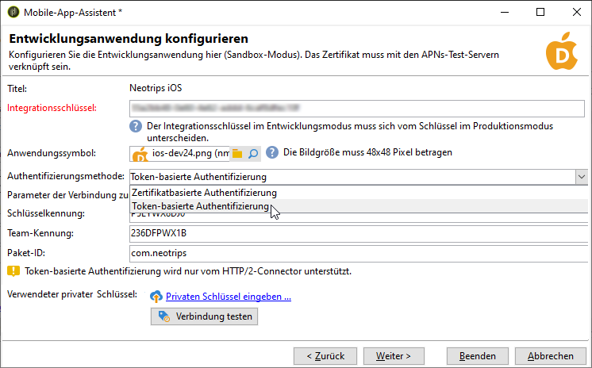
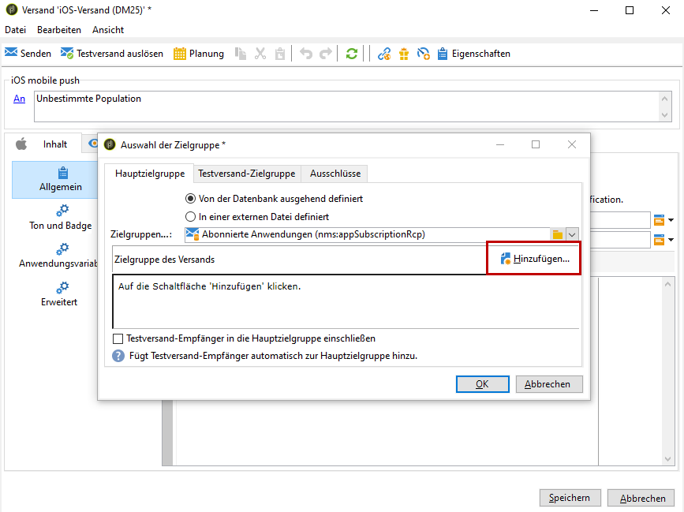
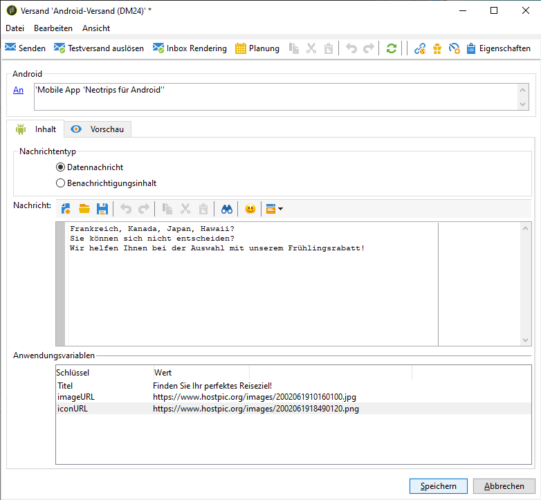
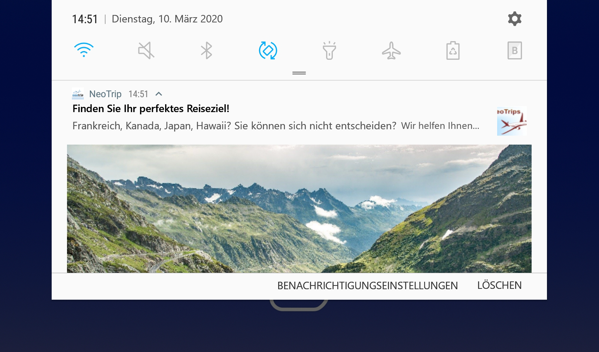

# Konfiguration der Mobile App in Adobe Campaign {#configuring-the-mobile-application-in-adobe-campaign}

Nachfolgend finden Sie ein Beispiel für eine Konfiguration, die auf einem Unternehmen basiert, das online Urlaubspakete verkauft. Seine Mobile App (Neotrips) steht den Kunden in zwei Versionen zur Verfügung: Neotrips für Android und Neotrips für iOS. Um die Mobile App in Adobe Campaign zu konfigurieren, müssen Sie Folgendes tun:

* Create a **[!UICONTROL Mobile application]** type information service for the Neotrips mobile application.
* Fügen Sie diesem Dienst die iOS- und Android-Versionen der App hinzu.
* Erstellen Sie eine Bereitstellung für iOS und Android.

>[!NOTE]
>
>Go to the **[!UICONTROL Subscriptions]** tab of the service to view the list of subscribers to the service, i.e. all people who have installed the application on their mobile and agreed to receive notifications.

## Mobilanwendung mit iOS konfigurieren {#configuring-the-mobile-application-ios}

>[!CAUTION]
>
>Bevor Sie die SDK integrieren, ist sicherzustellen, dass die Anwendungen für den Versand von Push-Benachrichtigungen konfiguriert wurden.
>
>Sollte dies nicht der Fall sein, besuchen Sie bitte [diese Seite](https://developer.apple.com/library/archive/documentation/NetworkingInternet/Conceptual/RemoteNotificationsPG/).

### Schritt 1: Installieren des Pakets {#installing-package-ios}

1. Greifen Sie über **[!UICONTROL Tools > Advanced > Package import...]** die Adobe Campaign-Client-Konsole auf den Paketimportassistenten zu.

   

1. Auswählen **[!UICONTROL Install a standard package]**.

1. Überprüfen Sie in der angezeigten Liste **[!UICONTROL Mobile App Channel]**.

   

1. Klicken Sie auf **[!UICONTROL Next]** und **[!UICONTROL Start]** starten Sie die Paketinstallation.

   Nach der Installation der Pakete wird in der Fortschrittsleiste **100%** angezeigt. Die folgende Meldung wird in den Installationsprotokollen angezeigt: **[!UICONTROL Installation of packages successful]**.

   

1. **[!UICONTROL Close]** das Installationsfenster.

### Schritt 2: Externes iOS-Konto konfigurieren {#configuring-external-account-ios}

Für iOS sind zwei Connectoren verfügbar:

* Der binäre iOS-Connector sendet Benachrichtigungen an APNS-Legacy-Binärserver.
* Der iOS HTTP/2-Connector sendet Benachrichtigungen an HTTP/2-APNS.

Wählen Sie den jeweiligen Connector folgendermaßen aus:

1. Go to **[!UICONTROL Administration > Platform > External accounts]**.
1. Wählen Sie das **[!UICONTROL iOS routing]** externe Konto aus.
1. Füllen Sie auf der **[!UICONTROL Connector]** Registerkarte das **[!UICONTROL Access URL of the connector]** Feld aus:

   Für HTTP2-iOS: http://localhost:8080/nms/jsp/iosHTTP2.jsp

   

   >[!NOTE]
   >
   > Sie können es auch wie folgt konfigurieren https://localhost:8080/nms/jsp/ios.jsp aber wir empfehlen Ihnen, Version 2 des Connectors zu verwenden.

1. Klicks **[!UICONTROL Save]**.

Ihr iOS-Connector ist jetzt konfiguriert. Sie können mit der Erstellung Ihres Dienstes beginnen.

### Schritt 3: Konfigurieren des iOS-Dienstes {#configuring-ios-service}

1. Gehen Sie zum **[!UICONTROL Profiles and Targets > Services and subscriptions]** Knoten und klicken Sie auf **[!UICONTROL New]**.

   

1. Definieren Sie einen **[!UICONTROL Label]** und einen **[!UICONTROL Internal name]**.
1. Gehen Sie zum **[!UICONTROL Type]** Feld und wählen Sie **[!UICONTROL Mobile application]**.

   >[!NOTE]
   >
   >Die standardmäßige **[!UICONTROL Subscriber applications (nms:appSubscriptionRcp)]** Zielzuordnung ist mit der Empfängertabelle verknüpft. Wenn Sie eine andere Zielzuordnung verwenden möchten, müssen Sie eine neue Zielzuordnung erstellen und diese in das **[!UICONTROL Target mapping]** Feld des Dienstes eingeben. Weitere Informationen zum Erstellen der Zielzuordnung finden Sie im Handbuch [Konfiguration](../../configuration/using/about-custom-recipient-table.md).

   

1. Klicken Sie dann auf die **[!UICONTROL Add]** Schaltfläche, um den Anwendungstyp auszuwählen.

   

1. Das folgende Fenster wird angezeigt. Wählen Sie **[!UICONTROL Create an iOS application]** und beginnen Sie mit der Eingabe **[!UICONTROL Label]**.

   

1. Als Option können Sie bei **[!UICONTROL Application variables]** Bedarf Inhalte von Push-Nachrichten anreichern. Diese sind vollständig anpassbar und ein Teil der Nutzlast der Nachricht wird an das Mobilgerät gesendet.
Im folgenden Beispiel fügen wir **mediaURl** und **mediaExt** hinzu, um Rich-Push-Benachrichtigungen zu erstellen, und stellen dann der Anwendung das Bild zur Verfügung, das in der Benachrichtigung angezeigt werden soll.

   

1. Auf der **[!UICONTROL Subscription parameters]** Registerkarte können Sie die Zuordnung mit einer Erweiterung des **[!UICONTROL Subscriber applications (nms:appsubscriptionRcp)]** Schemas definieren.

   >[!NOTE]
   >
   >Vergewissern Sie sich, dass Sie nicht dasselbe Zertifikat sowohl für die Entwicklungsversion (Sandbox) als auch für die Produktionsversion der Anwendung verwenden.

1. Auf der **[!UICONTROL Sounds]** Registerkarte können Sie einen abzuspielenden Sound angeben. Klicken **[!UICONTROL Add]** und füllen Sie **[!UICONTROL Internal name]** das Feld, das den Namen der in die Anwendung eingebetteten Datei oder den Namen des Systemklangs enthalten muss.

1. Klicken Sie auf **[!UICONTROL Next]** , um die Konfiguration der Entwicklungsanwendung zu starten.

1. Stellen Sie sicher, dass dasselbe in Adobe Campaign und im Anwendungscode über das SDK definiert **[!UICONTROL Integration key]** ist. Weitere Informationen finden Sie unter: [Integrieren des Kampagnen-SDK in die Mobilanwendung](../../delivery/using/integrating-campaign-sdk-into-the-mobile-application.md). Mit diesem für jede Anwendung spezifischen Integrationsschlüssel können Sie die mobile Anwendung mit der Adobe Campaign-Plattform verknüpfen.

   >[!NOTE]
   >
   > Die Variable **[!UICONTROL Integration key]** kann vollständig mit dem Zeichenfolgenwert angepasst werden, muss jedoch mit dem im SDK angegebenen Wert identisch sein.

1. Wählen Sie im Feld eines der vordefinierten Symbole aus, um die **[!UICONTROL Application icon]** Mobilanwendung in Ihrem Dienst zu personalisieren.

1. Click the **[!UICONTROL Enter the certificate...]** link then select the authentication certificate and enter the password that was provided by the mobile application developer. Sie können auf klicken, **[!UICONTROL Test the connection]** um sicherzustellen, dass der Vorgang erfolgreich ist.

   >[!NOTE]
   >
   >Apple erfordert verschiedene Zertifikate für Entwicklungs- und Produktionsversionen derselben Mobilanwendung. Sie müssen die beiden separaten Anwendungen in Adobe Campaign konfigurieren.

   

1. Klicken Sie auf , **[!UICONTROL Next]** um die Konfiguration der Produktanwendung zu starten, und führen Sie die gleichen Schritte wie oben beschrieben aus.

   

1. Klicks **[!UICONTROL Finish]**. Ihre iOS-Anwendung kann jetzt in Campaign Classic verwendet werden.

### Schritt 4: Erstellen einer iOS-Rich-Benachrichtigung {#creating-ios-delivery}

iOS 10 oder höher ermöglicht die Erstellung von Rich-Benachrichtigungen. Adobe Campaign kann mithilfe von Variablen Benachrichtigungen versenden, durch die das Gerät eine Rich-Benachrichtigung anzeigen kann.

Sie müssen jetzt eine neue Bereitstellung erstellen und diese mit der von Ihnen erstellten mobilen Anwendung verknüpfen.

1. Go to **[!UICONTROL Campaign management]** > **[!UICONTROL Deliveries]**.

1. Klicks **[!UICONTROL New]**.

   

1. Wählen Sie **[!UICONTROL Deliver on iOS (ios)]** in der **[!UICONTROL Delivery template]** Dropdownliste aus. Fügen Sie Ihrer Auslieferung eine **[!UICONTROL Label]** hinzu.

1. Klicken Sie auf **[!UICONTROL To]** , um die Zielgruppe festzulegen. Standardmäßig wird die **[!UICONTROL Subscriber application]** Zielzuordnung angewendet. Klicken Sie auf **[!UICONTROL Add]** , um unseren zuvor erstellten Dienst auszuwählen.

   

1. Wählen Sie im **[!UICONTROL Target type]** Fenster aus **[!UICONTROL Subscribers of an iOS mobile application (iPhone, iPad)]** und klicken Sie auf **[!UICONTROL Next]**.

1. Wählen Sie in der **[!UICONTROL Service]** Dropdownliste Ihren zuvor erstellten Dienst, dann die Anwendung, die Sie als Ziel auswählen möchten, und klicken Sie auf **[!UICONTROL Finish]**.
Die **[!UICONTROL Application variables]** werden automatisch hinzugefügt, je nachdem, was während der Konfigurationsschritte hinzugefügt wurde.

   

1. Bearbeiten Sie Ihre Rich-Benachrichtigung.

   

1. Check the **[!UICONTROL Mutable content]** box in the edit notification window to allow the mobile application to download media content.

1. Click **[!UICONTROL Save]** and send your delivery.

Das Bild und die Webseite sollten in der Push-Benachrichtigung angezeigt werden, wenn sie auf den mobilen iOS-Geräten des Abonnenten empfangen werden.

## Mobilanwendung mit Android konfigurieren {#configuring-the-mobile-application-android}

### Schritt 1: Installieren des Pakets {#installing-package-android}

1. Greifen Sie über **[!UICONTROL Tools > Advanced > Package import...]** die Adobe Campaign-Client-Konsole auf den Paketimportassistenten zu.

   

1. Auswählen **[!UICONTROL Install a standard package]**.

1. Überprüfen Sie in der angezeigten Liste **[!UICONTROL Mobile App Channel]**.

   

1. Klicken Sie auf **[!UICONTROL Next]** und **[!UICONTROL Start]** starten Sie die Paketinstallation.

   Nach der Installation der Pakete wird in der Fortschrittsleiste **100%** angezeigt. Die folgende Meldung wird in den Installationsprotokollen angezeigt: **[!UICONTROL Installation of packages successful]**.

   

1. **[!UICONTROL Close]** das Installationsfenster.

### Schritt 2: Konfigurieren des externen Android-Kontos {#configuring-external-account-android}

Für Android sind zwei Connectoren verfügbar:

* Der V1-Connector, der pro MTA-Kind eine Verbindung ermöglicht.
* Der V2-Connector, der gleichzeitige Verbindungen zum FCM-Server ermöglicht, um den Durchsatz zu erhöhen.

Wählen Sie den jeweiligen Connector folgendermaßen aus:

1. Go to **[!UICONTROL Administration > Platform > External accounts]**.
1. Wählen Sie das **[!UICONTROL Android routing]** externe Konto aus.
1. Füllen Sie auf der **[!UICONTROL Connector]** Registerkarte das **[!UICONTROL JavaScript used in the connector]** Feld aus:

   Für Android V2: https://localhost:8080/nms/jsp/androidPushConnectorV2.js

   >[!NOTE]
   >
   > Sie können es auch wie folgt konfigurieren https://localhost:8080/nms/jsp/androidPushConnector.js aber wir empfehlen Ihnen, Version 2 des Connectors zu verwenden.

   

1. Für Android V2 ist ein zusätzlicher Parameter in der Adobe-Server-Konfigurationsdatei (serverConf.xml) verfügbar:

   * **maxGCMConnectPerChild**: Maximale Anzahl paralleler HTTP-Abfragen bei FCM durch jeden Kindserver (standardmäßig acht).

### Schritt 3: Konfigurieren des Android-Dienstes {#configuring-android-service}

1. Gehen Sie zum **[!UICONTROL Profiles and Targets > Services and subscriptions]** Knoten und klicken Sie auf **[!UICONTROL New]**.

   

1. Definieren Sie einen **[!UICONTROL Label]** und einen **[!UICONTROL Internal name]**.
1. Gehen Sie zum **[!UICONTROL Type]** Feld und wählen Sie **[!UICONTROL Mobile application]**.

   >[!NOTE]
   >
   >Die standardmäßige **[!UICONTROL Subscriber applications (nms:appSubscriptionRcp)]** Zielzuordnung ist mit der Empfängertabelle verknüpft. Wenn Sie eine andere Zielzuordnung verwenden möchten, müssen Sie eine neue Zielzuordnung erstellen und diese in das **[!UICONTROL Target mapping]** Feld des Dienstes eingeben. Weitere Informationen zum Erstellen der Zielzuordnung finden Sie im Handbuch [Konfiguration](../../configuration/using/about-custom-recipient-table.md).

   

1. Klicken Sie dann auf die **[!UICONTROL Add]** Schaltfläche, um den Anwendungstyp auszuwählen.

   

1. Auswählen **[!UICONTROL Create an Android application]**.

   

1. Geben Sie eine ein **[!UICONTROL Label]**.

1. Stellen Sie sicher, dass dasselbe in Adobe Campaign und im Anwendungscode über das SDK definiert **[!UICONTROL Integration key]** ist. Weitere Informationen finden Sie unter: [Integrieren des Kampagnen-SDK in die Mobilanwendung](../../delivery/using/integrating-campaign-sdk-into-the-mobile-application.md).

   >[!NOTE]
   >
   > Die Variable **[!UICONTROL Integration key]** kann vollständig mit dem Zeichenfolgenwert angepasst werden, muss jedoch mit dem im SDK angegebenen Wert identisch sein.

1. Wählen Sie im Feld eines der vordefinierten Symbole aus, um die **[!UICONTROL Application icon]** Mobilanwendung in Ihrem Dienst zu personalisieren.

1. Geben Sie die Verbindungseinstellungen der Anwendung ein: Geben Sie den Projektschlüssel ein, den der Entwickler der mobilen Anwendung bereitgestellt hat.

1. Als Option können Sie bei **[!UICONTROL Application variables]** Bedarf Inhalte von Push-Nachrichten anreichern. Diese sind vollständig anpassbar und ein Teil der Nutzlast der Nachricht wird an das Mobilgerät gesendet.

   Im folgenden Beispiel fügen wir **title**, **imageURL** und **iconURL** hinzu, um eine Rich-Push-Benachrichtigung zu erstellen, und stellen der Anwendung dann das Bild, den Titel und das Symbol zur Verfügung, die in der Benachrichtigung angezeigt werden sollen.

   

1. Klicken Sie **[!UICONTROL Finish]** dann **[!UICONTROL Save]**. Ihre Android-Anwendung kann jetzt in Campaign Classic verwendet werden.

Standardmäßig speichert Adobe Campaign einen Schlüssel im Feld **[!UICONTROL User identifier]** (@userKey) der **[!UICONTROL Subscriber applications (nms:appSubscriptionRcp)]** Tabelle. Mit diesem Schlüssel können Sie ein Abonnement mit einem Empfänger verknüpfen. Um zusätzliche Daten zu erfassen (z. B. einen komplexen Abgleichschlüssel), müssen Sie die folgende Konfiguration anwenden:

1. Erstellen Sie eine Erweiterung des **[!UICONTROL Subscriber applications (nms:appsubscriptionRcp)]** Schemas und definieren Sie die neuen Felder.
1. Definieren Sie die Zuordnung auf der **[!UICONTROL Subscription parameters]** Registerkarte.
   >[!CAUTION]
   >
   >Stellen Sie sicher, dass die Konfigurationsnamen auf der **[!UICONTROL Subscription parameters]** Registerkarte mit denen im Code der mobilen Anwendung identisch sind. Weitere Informationen finden Sie im Abschnitt [Integrating Campaign SDK im Abschnitt Mobilanwendung](../../delivery/using/integrating-campaign-sdk-into-the-mobile-application.md) .

### Schritt 4: Erstellen einer Rich-Benachrichtigung für Android {#creating-android-delivery}

Sie müssen jetzt eine neue Bereitstellung erstellen und diese mit der von Ihnen erstellten mobilen Anwendung verknüpfen.

1. Go to **[!UICONTROL Campaign management]** > **[!UICONTROL Deliveries]**.

1. Klicks **[!UICONTROL New]**.

   

1. Wählen Sie **[!UICONTROL Deliver on Android (android)]** in der **[!UICONTROL Delivery template]** Dropdownliste aus. Fügen Sie Ihrer Auslieferung eine **[!UICONTROL Label]** hinzu.

1. Klicken Sie auf **[!UICONTROL To]** , um die Zielgruppe festzulegen. Standardmäßig wird die **[!UICONTROL Subscriber application]** Zielzuordnung angewendet. Klicken Sie auf **[!UICONTROL Add]** , um unseren zuvor erstellten Dienst auszuwählen.

   

1. Wählen Sie im **[!UICONTROL Target type]** Fenster Abonnenten einer Android-Mobilanwendung und klicken Sie auf **[!UICONTROL Next]**.

1. Wählen Sie in der **[!UICONTROL Service]** Dropdownliste Ihren zuvor erstellten Dienst und dann die Anwendung aus und klicken Sie auf **[!UICONTROL Finish]**.
Die **[!UICONTROL Application variables]** werden automatisch hinzugefügt, je nachdem, was während der Konfigurationsschritte hinzugefügt wurde.

   

1. Bearbeiten Sie Ihre Rich-Benachrichtigung.

   

1. Click **[!UICONTROL Save]** and send your delivery.

Auf den Android-Mobilgeräten der Abonnenten sollten das Bild und die Webseite in der Push-Benachrichtigung angezeigt werden.

