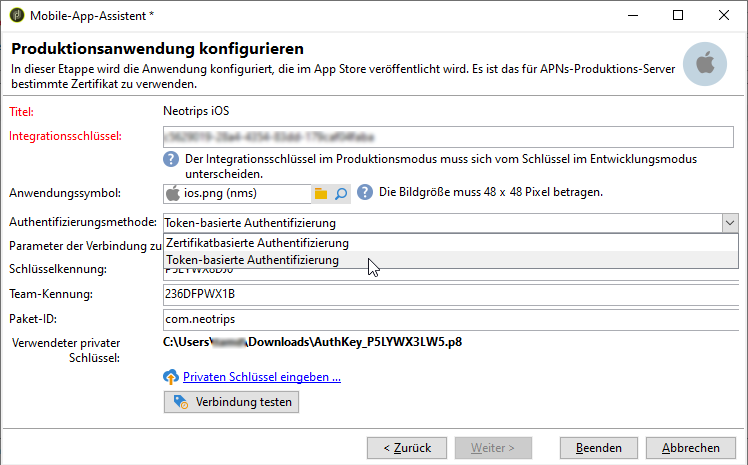

# Konfigurationsschritte für iOS {#configuring-the-mobile-application-in-adobe-campaign-ios}


Nachdem das Paket installiert ist, können Sie in Adobe Campaign Classic die Einstellungen für Ihre iOS-Mobile-App festlegen.

>[!NOTE]
>
>Informationen dazu, wie Sie Ihre Mobile App für iOS und konfigurieren und einen Versand für iOS erstellen, finden Sie in [diesem Abschnitt](configuring-the-mobile-application-android.md).

Die wichtigsten Schritte sind:

1. [Konfigurieren des externen iOS-Kontos](#configuring-external-account-ios)
1. [Konfigurieren des iOS-Service](#configuring-ios-service)
1. [Integrieren der iOS-Mobile-App in Campaign](#creating-ios-app)

Anschließend können Sie [eine Push-Benachrichtigung für iOS-Geräte erstellen](create-notifications-ios.md).


## Konfigurieren des externen iOS-Kontos {#configuring-external-account-ios}

Bei iOS sendet der iOS-HTTP/2-Connector Benachrichtigungen an HTTP/2-APNS.

Gehen Sie wie folgt vor, um diesen Connector zu konfigurieren:

1. Navigieren Sie zu **[!UICONTROL Administration > Plattform > Externe Konten]**.
1. Wählen Sie das externe Konto **[!UICONTROL iOS-Routing]** aus.
1. Füllen Sie im Tab **[!UICONTROL Connector]** das Feld **[!UICONTROL Zugriffs-URL auf den Connector]** mit der folgenden URL aus: ```http://localhost:8080/nms/jsp/iosHTTP2.jsp```

   

1. Wählen Sie **[!UICONTROL Speichern]** aus.

Ihr iOS-Connector ist jetzt konfiguriert. Sie können mit dem Einrichten Ihres Dienstes beginnen.

## Konfigurieren des iOS-Service {#configuring-ios-service}

>[!CAUTION]
>
>Die Anwendung muss für Push-Aktionen konfiguriert worden sein, BEVOR sie mit dem Adobe SDK integriert werden kann.
>
>Sollte dies nicht der Fall sein, besuchen Sie [diese Seite](https://developer.apple.com/documentation/usernotifications).

1. Klicken Sie im Knoten **[!UICONTROL Profile und Zielgruppen > Dienste und Abonnements]** auf die Schaltfläche **[!UICONTROL Neu]**.

   

1. Bestimmen Sie einen **[!UICONTROL Titel]** und einen **[!UICONTROL internen Namen]**.
1. Wählen Sie im Feld **[!UICONTROL Typ]** die Option **[!UICONTROL Mobile App]**.

   >[!NOTE]
   >
   >Das standardmäßig vorgeschlagene Zielgruppen-Mapping **[!UICONTROL Abonnierte Anwendungen (nms:appSubscriptionRcp)]** bezieht sich auf die Empfängertabelle. Sie haben die Möglichkeit, im Feld **[!UICONTROL Zielgruppen-Mapping]** des Dienstes ein anderes, zuvor erstelltes Mapping anzugeben. Weiterführende Informationen hierzu finden Sie im [Konfigurationshandbuch](../../configuration/using/about-custom-recipient-table.md).

   

1. Klicken Sie dann auf die Schaltfläche **[!UICONTROL Hinzufügen]**, um den Anwendungstyp auszuwählen.

   

1. Erstellen Sie Ihre iOS-Mobile-Apps für Entwicklung und Produktion. Weitere Informationen hierzu finden Sie in [diesem Abschnitt](configuring-the-mobile-application.md#creating-ios-app).

## Erstellen einer iOS-Mobile-App {#creating-ios-app}

Erstellen Sie nach der Erstellung Ihres Services Ihre iOS-Mobile-App in Campaign. Gehen Sie wie folgt vor:

1. Klicken Sie in Ihrem neu erstellten Dienst auf die Schaltfläche **[!UICONTROL Hinzufügen]**, um den Anwendungstyp auszuwählen.

   

1. Das folgende Fenster wird angezeigt. Wählen Sie **[!UICONTROL iOS-Anwendung erstellen]** und beginnen Sie, indem Sie den **[!UICONTROL Titel]** eingeben.

   

1. Bei Bedarf können Sie Inhalte von Push-Nachrichten mit bestimmten **[!UICONTROL Anwendungsvariablen]** anreichern. Diese sind vollständig anpassbar; ein Teil der Payload der Nachricht wird an das Mobilgerät gesendet.
Im folgenden Beispiel werden **mediaURl** und **mediaExt** hinzugefügt, um Rich-Push-Benachrichtigungen zu erstellen. Danach wird der Anwendung das Bild bereitgestellt, das in der Benachrichtigung angezeigt werden soll.

   

1. Auf dem Tab **[!UICONTROL Abonnementparameter]** können Sie das Mapping mit einer Erweiterung des Schemas **[!UICONTROL Abonnierte Anwendungen (nms:appsubscriptionRcp)]** definieren.

   >[!NOTE]
   >
   >Vergewissern Sie sich, dass Sie nicht dasselbe Zertifikat sowohl für die Entwicklungsversion (Sandbox) als auch für die Produktionsversion der Anwendung verwenden.

1. Auf dem Tab **[!UICONTROL Töne]** können Sie einen abzuspielenden Ton festlegen. Klicken Sie auf **[!UICONTROL Hinzufügen]** und füllen Sie das Feld **[!UICONTROL Interner Name]** aus, das den Namen der in die Anwendung eingebetteten Datei oder den Namen des Systemtons enthalten muss.

1. Klicken Sie auf **[!UICONTROL Weiter]**, um mit dem Konfigurieren der Entwicklungsanwendung zu beginnen.

1. Stellen Sie sicher, dass in Adobe Campaign und im Anwendungs-Code derselbe **[!UICONTROL Integrationsschlüssel]** definiert ist (über das SDK). Weitere Informationen hierzu finden Sie auf [dieser Seite](integrating-campaign-sdk-into-the-mobile-application.md). Mit diesem programmspezifischen Integrationsschlüssel können Sie die Mobile App mit der Adobe Campaign-Plattform verbinden.

   >[!NOTE]
   >
   > Der **[!UICONTROL Integrationsschlüssel]** kann mit einem Zeichenfolgenwert vollständig angepasst werden, muss jedoch mit dem im SDK angegebenen Schlüssel identisch sein.

1. Wählen Sie im Feld **[!UICONTROL Anwendungssymbol]** ein vordefiniertes Symbol aus, um die Mobile App in Ihrem Dienst zu personalisieren.

1. Wählen Sie den **[!UICONTROL Authentifizierungsmodus]** aus. Beachten Sie, dass Sie den Authentifizierungsmodus Ihrer Mobile App jederzeit über den Tab **[!UICONTROL Zertifikat]** ändern können.
   * **[!UICONTROL Zertifikatbasierte Authentifizierung]**: Klicken Sie auf **[!UICONTROL Zertifikat angeben...]**. Wählen Sie dann Ihren p12-Schlüssel und geben Sie das vom Entwickler der Mobile App bereitgestellte Passwort ein.
   * **[!UICONTROL Token-basierte Authentifizierung]**: Füllen Sie die Verbindungseinstellungen **[!UICONTROL Schlüsselkennung]**, **[!UICONTROL Team-Kennung]** und **[!UICONTROL Paketkennung]** aus und wählen Sie dann Ihr p8-Zertifikat aus, indem Sie auf **[!UICONTROL Privaten Schlüssel eingeben]** klicken. Weitere Informationen zur **[!UICONTROL Token-basierten Authentifizierung]** finden Sie in der [Apple-Dokumentation](https://developer.apple.com/documentation/usernotifications/setting_up_a_remote_notification_server/establishing_a_token-based_connection_to_apns).

   >[!NOTE]
   >
   > Adobe empfiehlt für Ihre iOS-Konfiguration die Verwendung der **[!UICONTROL Token-basierten Authentifizierung]**, da dieser Authentifizierungsmodus besser geschützt ist und nicht von der Gültigkeit von Zertifikaten abhängt.

   

1. Durch Klicken auf **[!UICONTROL Verbindung testen]** können Sie prüfen, ob die Verbindung erfolgreich hergestellt wurde.

1. Nun können Sie die Produktionsanwendung konfigurieren, indem Sie auf **[!UICONTROL Weiter]** klicken und nach dem gleichen Verfahren wie oben beschrieben vorgehen.

   

1. Klicken Sie auf **[!UICONTROL Beenden]**.

Ihre iOS-Mobile-App kann jetzt in Campaign Classic verwendet werden.
