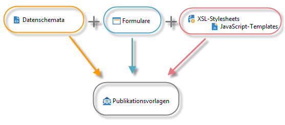

# Ressourcen und Grundlagen des Content-Manager-Moduls{#content-manager-resources-and-principles}

Für jeden Inhalt muss eine Publikationsvorlage mit entsprechenden Umwandlungsvorlagen erstellt werden.

Die Struktur der Inhalte wird in XML-Dokumenten festgeschrieben. Die eigentliche Erstellung des Inhalts erfolgt über Eingabeschnittstellen in der Adobe-Campaign-Clientkonsole oder über einen Web-Browser. Inhalte können außerdem automatisch durch Abruf von XML-Streams oder durch Aggregation von Daten aus einer Datenbank eingefügt werden.

Es ist die Kombination aus einem XML-Dokument mit XSL-Stylesheets oder JavaScript-Templates, die die automatische Umwandlung des Inhalts in die verschiedenen Formate (HTML, Text) der Publikationsvorlage ermöglicht.

Für die Konfiguration des Inhalts werden die folgenden Ressourcen benötigt:

* Datenschemata: Beschreibung der XML-Inhaltsstruktur. Weitere Informationen dazu finden Sie im Abschnitt [Datenschemata](../../delivery/using/data-schemas.md).
* Formulare: Erstellen von Bildschirmen zur Dateneingabe. Weitere Informationen hierzu finden Sie im Abschnitt [Formulare](../../delivery/using/input-forms.md).
* Bilder: Bilder, die in Formularen verwendet werden. Weitere Informationen hierzu finden Sie im Abschnitt [Hintergrundbild und Symbole](../../delivery/using/formatting.md#image-management).
* Stylesheets: Formatieren von Ausgabedokumenten mit XSLT-Sprache. Weitere Informationen hierzu finden Sie im Abschnitt [Formatierung](../../delivery/using/formatting.md).
* JavaScript-Vorlagen: Formatieren von Ausgabedokumenten mit JavaScript-Sprache. Weitere Informationen hierzu finden Sie im Abschnitt [Publikationsvorlagen](../../delivery/using/publication-templates.md).
* JavaScript-Codes: JavaScript-Codes für Datenaggregation. Weitere Informationen hierzu finden Sie im Abschnitt [Aggregator](../../delivery/using/publication-templates.md#aggregator).
* Publikationsvorlagen: Definieren von Publikationsvorlagen. Weitere Informationen hierzu finden Sie im Abschnitt [Publikationsvorlagen](../../delivery/using/publication-templates.md).
* Inhalt: Inhaltsinstanzen, die erstellt und veröffentlicht werden sollen. Weitere Informationen hierzu finden Sie unter [Verwendung von Inhaltsvorlagen](../../delivery/using/using-a-content-template.md).
