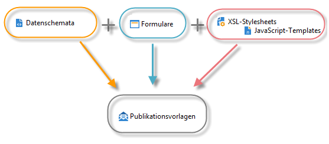

# Ressourcen und Grundlagen des Content-Manager-Moduls{#content-manager-resources-and-principles}

Für jeden Inhalt muss eine Veröffentlichungsvorlage mit entsprechenden Umwandlungsvorlagen erstellt werden.

Ein Inhaltsbaustein ist zur Datenspeicherung in einem XML-Dokument strukturiert. Eine Bearbeitungsschnittstelle wird verwendet, um den Inhalt über die Adobe Campaign-Client-Konsole oder einen Webbrowser einzugeben. Der Inhalt kann auch automatisch über die Erfassung von XML-Datenflüssen oder aggregierten Daten in einer Datenbank eingegeben werden.

Es ist die Kombination aus einem XML-Dokument mit XSL-Stylesheets oder JavaScript-Templates, die die automatische Umwandlung des Inhalts in die verschiedenen Formate (HTML, Text) der Veröffentlichungsvorlage ermöglicht.

Für die Konfiguration des Inhalts werden die folgenden Ressourcen benötigt:

* Datenschemata: Beschreibung der XML-Inhaltsstruktur. Weitere Informationen dazu finden Sie im Abschnitt [Datenschemata](data-schemas.md).
* Formulare: Erstellen von Bildschirmen zur Dateneingabe. Weitere Informationen hierzu finden Sie im Abschnitt [Formulare](input-forms.md).
* Bilder: Bilder, die in Formularen verwendet werden. Weitere Informationen hierzu finden Sie im Abschnitt [Hintergrundbild und Symbole](formatting.md#image-management).
* Stylesheets: Formatieren von Ausgabedokumenten mit XSLT-Sprache. Weitere Informationen hierzu finden Sie im Abschnitt [Formatierung](formatting.md).
* JavaScript-Vorlagen: Formatieren von Ausgabedokumenten mit JavaScript-Sprache. Weitere Informationen hierzu finden Sie im Abschnitt [Veröffentlichungsvorlagen](publication-templates.md).
* JavaScript-Codes: JavaScript-Codes für Datenaggregation. Weitere Informationen hierzu finden Sie im Abschnitt [Aggregator](publication-templates.md#aggregator).
* Veröffentlichungsvorlagen: Definieren von Veröffentlichungsvorlagen. Weitere Informationen hierzu finden Sie im Abschnitt [Veröffentlichungsvorlagen](publication-templates.md).
* Inhalt: Inhaltsinstanzen, die erstellt und veröffentlicht werden sollen. Weitere Informationen hierzu finden Sie unter [Verwendung von Inhaltsvorlagen](using-a-content-template.md).
