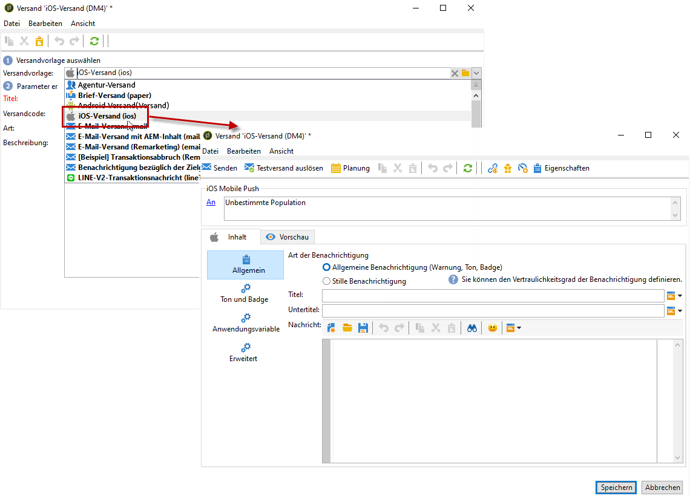
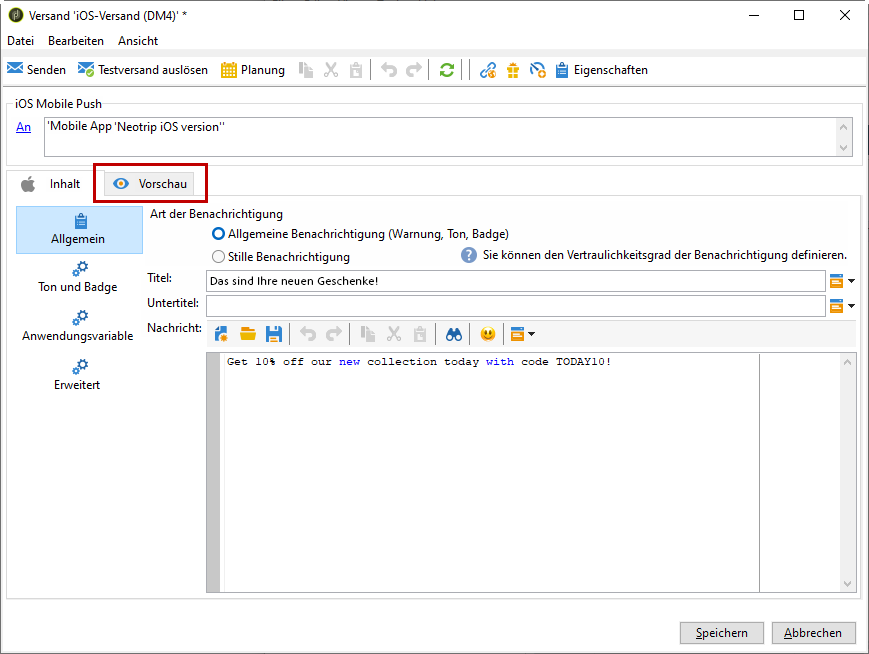

# Erstellen von Benachrichtigungen für iOS{#create-notifications-ios}

In diesem Abschnitt werden die Elemente beschrieben, die für den Versand von iOS-Benachrichtigungen erforderlich sind. Allgemeine Methoden zur Versanderstellung finden Sie in [diesem Abschnitt](steps-about-delivery-creation-steps.md).

Erstellen Sie zunächst einen neuen Versand:

Gehen Sie wie folgt vor, um eine Push-Benachrichtigung für iOS-Geräte zu erstellen:

1. Wählen Sie die Versandvorlage **[!UICONTROL iOS-Versand]**.

   

1. Klicken Sie zur Bestimmung der Zielgruppe der Benachrichtigung auf den Link **[!UICONTROL An]** und anschließend auf **[!UICONTROL Hinzufügen]**.

   

   >[!NOTE]
   >
   >Die detaillierten Schritte zur Auswahl der Zielpopulation eines Versands finden Sie in [diesem Abschnitt](steps-defining-the-target-population.md).
   >
   >Weitere Informationen zur Verwendung von Personalisierungsfeldern finden Sie in [diesem Abschnitt](about-personalization.md).
   >
   >Weitere Informationen zur Verwendung von Testadressen finden Sie unter [Über Testadressen](about-seed-addresses.md).

1. Wählen Sie **[!UICONTROL Abonnenten einer iOS-Mobile-App (iPhone, iPad)]**, dann den Ihrer Mobile App entsprechenden Dienst (hier Neotrips) und schließlich die iOS-Version der App.

   

1. Wählen Sie Ihre **[!UICONTROL Art der Benachrichtigung]** aus **[!UICONTROL Allgemeine Benachrichtigung (Warnung, Ton, Badge)]** oder **[!UICONTROL Stille Benachrichtigung]**.

   

   >[!NOTE]
   >
   >Im Modus **Silent Push** kann eine &quot;stille&quot; Benachrichtigung an eine Mobile App gesendet werden. Dem Benutzer wird das Eintreffen der Benachrichtigung nicht mitgeteilt. Sie wird direkt an die Mobile App übertragen.

1. Geben Sie in das Feld **[!UICONTROL Titel]** die Bezeichnung ein, die in der Liste der im Benachrichtigungscenter verfügbaren Benachrichtigungen erscheinen soll.

   In diesem Feld können Sie den Wert des Parameters **title** der iOS-Benachrichtigungs-Payload definieren.

1. Sie können einen **[!UICONTROL Untertitel]** hinzufügen, den Wert des Parameters „subtitle“ der iOS-Benachrichtigungs-Payload. Weitere Informationen finden Sie in [diesem Abschnitt](configuring-the-mobile-application.md).

1. Geben Sie den Inhalt der Nachricht im Abschnitt **[!UICONTROL Nachrichteninhalt]** des Assistenten ein. Die Verwendung von Personalisierungsfeldern wird im Abschnitt [Über die Personalisierung](about-personalization.md) beschrieben.

   

1. Klicken Sie auf das Symbol **[!UICONTROL Emoticon einfügen]**, um Ihrer Push-Benachrichtigung Emoticons hinzuzufügen. Informationen zum Anpassen der Emoticon-Liste finden Sie in [diesem Abschnitt](customizing-emoticon-list.md).

1. In der Registerkarte **[!UICONTROL Ton und Badge]** können Sie die folgenden Optionen bearbeiten:

   * **[!UICONTROL Badge entfernen]**: Aktivieren Sie diese Optionen, um den Badge-Wert zu aktualisieren.

   * **[!UICONTROL Wert]**: Legen Sie eine Zahl fest, mit der die Anzahl der neuen ungelesenen Informationen direkt auf dem Anwendungssymbol angezeigt wird.

   * **[!UICONTROL Kritischer Alarmmodus]**: Aktivieren Sie diese Option, um Ihrer Benachrichtigung einen Ton hinzuzufügen, selbst wenn das Handy des Benutzers im Fokusmodus eingestellt ist oder wenn das iPhone stummgeschaltet ist.

   * **[!UICONTROL Name]**: Wählen Sie den Ton aus, der beim Erhalt der Benachrichtigung vom Mobilgerät abgespielt werden soll.

   * **[!UICONTROL Lautstärke]**: Lautstärke Ihres Tons auf einer Skala von 0 bis 100.

   >[!NOTE]
   >
   >Töne müssen in die App integriert und zum Zeitpunkt der Erstellung des entsprechenden Dienstes konfiguriert werden. Weitere Informationen finden Sie in [diesem Abschnitt](configuring-the-mobile-application.md#configuring-external-account-ios).

   

1. Ihre **[!UICONTROL Anwendungsvariablen]** werden automatisch von der Registerkarte **[!UICONTROL Anwendungsvariablen]** hinzugefügt. Damit können Sie beispielsweise das Benachrichtigungsverhalten definieren. So können Sie einen speziellen Anwendungsbildschirm konfigurieren, der angezeigt wird, wenn der Benutzer die Benachrichtigung aktiviert.

   Weiterführende Informationen hierzu finden Sie in [diesem Abschnitt](configuring-the-mobile-application.md).

1. Auf der Registerkarte **[!UICONTROL Erweitert]** können Sie die folgenden allgemeinen Optionen bearbeiten:

   * **[!UICONTROL Veränderlicher Inhalt]**: Aktivieren Sie diese Option, damit die Mobile App Medieninhalte herunterladen kann.

   * **[!UICONTROL Thread-ID]**: Kennung, die verwendet wird, um verknüpfte Benachrichtigungen zu gruppieren.

   * **[!UICONTROL Kategorie]**: Name Ihrer Kategorie-ID, über die Aktionsschaltflächen angezeigt werden. Mit diesen Benachrichtigungen können Benutzer rascher unterschiedliche Aufgaben ausführen, ohne die Anwendung öffnen oder darin navigieren zu müssen.

   

1. Für zeitabhängige Benachrichtigungen können Sie die folgenden Optionen spezifizieren:

   * **[!UICONTROL Zielgruppen-Inhalts-ID]**: Bezeichner, mit dem festgelegt wird, welches Anwendungsfenster beim Öffnen der Benachrichtigung vorgezogen werden soll.

   * **[!UICONTROL Startbild]**: Name der anzuzeigenden Startbilddatei. Wenn der Benutzer Ihre Anwendung starten möchte, wird das ausgewählte Bild anstelle des Startbildschirms Ihrer Anwendung angezeigt.

   * **[!UICONTROL Unterbrechungsgrad]**:

      * **[!UICONTROL Aktiv]**: Ist dies als Standardeinstellung festgelegt, wird die Benachrichtigung sofort angezeigt, der Bildschirm wird beleuchtet und eventuell wird ein Ton abgespielt. Benachrichtigungen umgehen nicht den Fokusmodus.

      * **[!UICONTROL Passiv]**: Die Benachrichtigung wird zur Benachrichtigungsliste hinzugefügt, ohne dass der Bildschirm beleuchtet oder ein Ton abgespielt wird. Benachrichtigungen umgehen nicht den Fokusmodus.

      * **[!UICONTROL Zeitabhängig]**: Die Benachrichtigung wird sofort angezeigt, der Bildschirm wird beleuchtet, eventuell wird ein Ton abgespielt und der Fokusmodus kann umgangen werden. Für diese Stufe ist keine spezielle Berechtigung von Apple erforderlich.

      * **[!UICONTROL Kritisch]**: Die Benachrichtigung wird sofort angezeigt, der Bildschirm wird beleuchtet und der Stummschaltungs- oder Fokusmodus wird umgangen. Beachten Sie, dass für diese Stufe eine spezielle Berechtigung von Apple erforderlich ist.

   * **[!UICONTROL Relevanzwert]**: Legen Sie einen Relevanzwert auf der Skala von 0 bis 100 fest. Das System verwendet diesen Wert, um die Benachrichtigungen in der Benachrichtigungszusammenfassung zu sortieren.

   

1. Sobald die Benachrichtigung konfiguriert ist, klicken Sie auf die Registerkarte **[!UICONTROL Vorschau]**, um eine Vorschau der Benachrichtigung anzuzeigen.

   

   >[!NOTE]
   >
   >Der Hinweisstil (Banner oder Hinweis) ist in Adobe Campaign nicht im Vorhinein festgelegt. Er hängt von der vom Benutzer in den iOS-Einstellungen gewählten Konfiguration ab. Adobe Campaign ermöglicht es jedoch, eine Vorschau der Benachrichtigung in jedem Stil anzuzeigen. Verwenden Sie den unten rechts im Bildschirm gelegenen Pfeil, um von einem Stil zum anderen zu wechseln.
   >
   >In der Vorschau wird das Erscheinungsbild von iOS 10 verwendet.

Testsendungen und der endgültige Start des Versands werden analog zum E-Mail-Versand durchgeführt. [Weitere Informationen](steps-validating-the-delivery.md)

Nach dem Nachrichtenversand können Sie Ihre Sendungen überwachen und verfolgen. Lesen Sie diesbezüglich auch diese Abschnitte:

* [Quarantäne für Push-Benachrichtigungen](understanding-quarantine-management.md#push-notification-quarantines)
* [Sendungen überwachen](about-delivery-monitoring.md)
* [Ursachen von fehlgeschlagenen Sendungen](understanding-delivery-failures.md)

## Erstellen einer Rich-Benachrichtigung für iOS {#creating-ios-delivery}

iOS 10 oder höher ermöglicht die Erstellung von Rich-Benachrichtigungen. Adobe Campaign kann mithilfe von Variablen Benachrichtigungen versenden, durch die das Gerät eine Rich-Benachrichtigung anzeigen kann.

Erstellen Sie dann einen neuen Versand und verknüpfen Sie ihn mit der von Ihnen erstellten Mobile App.

1. Gehen Sie zu **[!UICONTROL Kampagnenverwaltung]** > **[!UICONTROL Sendungen]**.

1. Klicken Sie auf **[!UICONTROL Neu]**.

   

1. Wählen Sie **[!UICONTROL iOS-Versand (iOS)]** aus der Dropdown-Liste **[!UICONTROL Versandvorlage]**. Fügen Sie Ihrem Versand einen **[!UICONTROL Titel]** hinzu.

1. Klicken Sie auf **[!UICONTROL An]**, um die Zielpopulation zu definieren. Standardmäßig wird das Zielgruppen-Mapping **[!UICONTROL Abonnierte Anwendung]** angewendet. Klicken Sie auf **[!UICONTROL Hinzufügen]**, um den zuvor erstellten Dienst auszuwählen.

   

1. Wählen Sie im Fenster **[!UICONTROL Zieltyp]** die Option **[!UICONTROL Abonnenten einer iOS-Mobile-App (iPhone, iPad)]** und klicken Sie auf **[!UICONTROL Weiter]**.

1. Wählen Sie in der Dropdown-Liste **[!UICONTROL Dienst]** den zuvor erstellten Dienst und dann die gewünschte Zielgruppe aus und klicken Sie auf **[!UICONTROL Beenden]**.

   

1. Bearbeiten Sie Ihre Rich-Benachrichtigung.

   

1. Auf der Registerkarte **[!UICONTROL Anwendungsvariablen]** werden Ihre **[!UICONTROL Anwendungsvariablen]** automatisch hinzugefügt, je nachdem, was während der Konfigurationsschritte hinzugefügt wurde.

   >[!NOTE]
   >
   >Anwendungsvariablen müssen im Code der Mobile App definiert und bei der Diensterstellung eingegeben werden. Weiterführende Informationen hierzu finden Sie in [diesem Abschnitt](configuring-the-mobile-application.md).

   

1. Aktivieren Sie auf der Registerkarte **[!UICONTROL Erweitert]** das Kontrollkästchen **[!UICONTROL Veränderlicher Inhalt]**, damit die Mobile App Medieninhalte herunterladen kann.

1. Klicken Sie auf **[!UICONTROL Speichern]** und führen Sie den Versand durch.

Auf iOS-Mobilgeräten der Abonnenten sollten das Bild und die Web-Seite in der Push-Benachrichtigung angezeigt werden.

