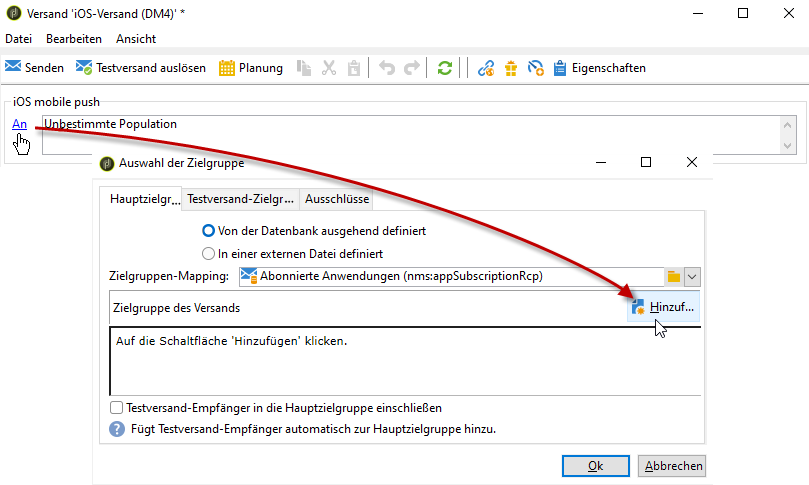
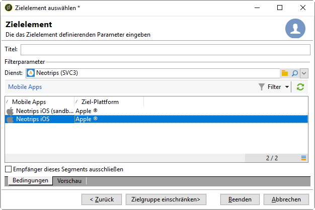
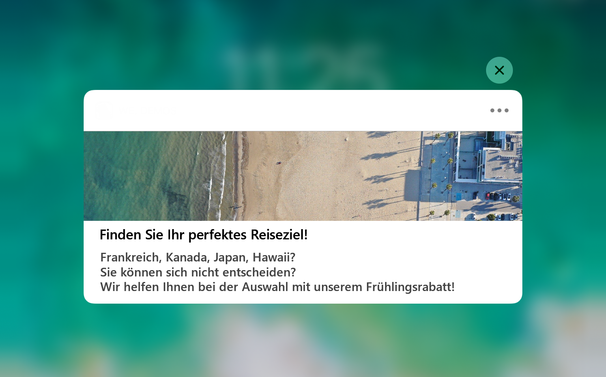

# Erstellen von Benachrichtigungen für iOS{#create-notifications-ios}

In diesem Abschnitt werden die Elemente beschrieben, die für den Versand von iOS-Benachrichtigungen erforderlich sind. Allgemeine Methoden zur Versanderstellung finden Sie in [diesem Abschnitt](steps-about-delivery-creation-steps.md).

Erstellen Sie zunächst einen neuen Versand:

Gehen Sie wie folgt vor, um eine Push-Benachrichtigung für iOS-Geräte zu erstellen:

1. Wählen Sie die Versandvorlage **[!UICONTROL iOS-Versand]**.

   

1. Klicken Sie zur Bestimmung der Zielgruppe der Benachrichtigung auf den Link **[!UICONTROL An]** und anschließend auf **[!UICONTROL Hinzufügen]**.

   

   >[!NOTE]
   >
   >Die detaillierten Schritte zur Auswahl der Zielpopulation eines Versands finden Sie in [diesem Abschnitt](steps-defining-the-target-population.md).
   >
   >Weitere Informationen zur Verwendung von Personalisierungsfeldern finden Sie in [diesem Abschnitt](about-personalization.md).
   >
   >Weitere Informationen zur Verwendung von Testadressen finden Sie unter [Über Testadressen](about-seed-addresses.md).

1. Wählen Sie **[!UICONTROL Abonnenten einer iOS-Mobile-App (iPhone, iPad)]**, dann den Ihrer Mobile App entsprechenden Dienst (hier Neotrips) und schließlich die iOS-Version der App.

   

1. Kreuzen Sie den gewünschten Benachrichtigungstyp (Hinweisstil) an: **[!UICONTROL Hinweis]**, **[!UICONTROL Kennzeichen]**, **[!UICONTROL Hinweis und Kennzeichen]** oder **[!UICONTROL Silent Push]**.

   

   >[!NOTE]
   >
   >Im Modus **Silent Push** kann eine &quot;stille&quot; Benachrichtigung an eine Mobile App gesendet werden. Dem Benutzer wird das Eintreffen der Benachrichtigung nicht mitgeteilt. Sie wird direkt an die Mobile App übertragen.

1. Geben Sie im Feld **[!UICONTROL Titel]** die Bezeichnung an, die auf der Benachrichtigung erscheinen soll. Dieser Titel wird nur in der im Benachrichtigungszentrum zur Verfügung stehenden Benachrichtigungsliste angezeigt. In diesem Feld können Sie den Wert des **title**-Parameters der iOS-Benachrichtigungs-Nutzdaten definieren.

1. Wenn Sie den HTTP/2-Connector verwenden, können Sie einen Untertitel hinzufügen (Wert des Parameters **subtitle** der iOS-Benachrichtigungs-Nutzdaten). Weitere Informationen finden Sie in [diesem Abschnitt](configuring-the-mobile-application.md).

1. Geben Sie nun, je nach gewähltem Benachrichtigungstyp (Hinweisstil), die **[!UICONTROL Nachricht]** und den **[!UICONTROL Kennzeichenwert]** ein.

   

   >[!NOTE]
   >
   >Bei Benachrichtigungen bzw. Hinweisen vom Typ **[!UICONTROL Kennzeichen]** und **[!UICONTROL Hinweis und Kennzeichen]** haben Sie die Möglichkeit, den Kennzeichenwert (Ziffer, die über dem Mobile-App-Logo angezeigt wird) zu ändern. Zur Zurücksetzung des Kennzeichens genügt es, 0 als Wert anzugeben. Wenn das Feld leer ist, wird der Wert des Kennzeichens nicht geändert.

1. Klicken Sie auf das Symbol **[!UICONTROL Emoticon einfügen]**, um Ihrer Push-Benachrichtigung Emoticons hinzuzufügen. Informationen zum Anpassen der Emoticon-Liste finden Sie in [diesem Abschnitt](customizing-emoticon-list.md).

1. Im Feld **[!UICONTROL Aktionsschaltfläche]** können Sie den Text der Aktionsschaltfläche angeben, die auf Benachrichtigungen vom Typ Warnung erscheint (Feld **action_loc_key** der Nutzdaten). Wenn Ihre iOS-Anwendung die Lokalisierung von Text unterstützt (**Localizable.strings**), ist in diesem Feld der entsprechende Schlüssel anzugeben. Wenn dies nicht der Fall ist, geben Sie direkt den Text an, der auf der Aktionsschaltfläche erscheinen soll. Lesen Sie für weiterführende Informationen hierzu die [Apple-Dokumentation](https://developer.apple.com/library/archive/documentation/NetworkingInternet/Conceptual/RemoteNotificationsPG/CreatingtheNotificationPayload.html#//apple_ref/doc/uid/TP40008194-CH10-SW1) .
1. Wählen Sie im Feld **[!UICONTROL Ton abspielen]** die Melodie aus, die bei Erhalt einer Nachricht abgespielt werden soll.

   >[!NOTE]
   >
   >Töne müssen in die App integriert und zum Zeitpunkt der Erstellung des entsprechenden Dienstes konfiguriert werden. Weitere Informationen finden Sie in [diesem Abschnitt](configuring-the-mobile-application.md#configuring-external-account-ios).

1. Geben Sie im Feld **[!UICONTROL Anwendungsvariablen]** für jede Variable den zugehörigen Wert an. Variablen dienen zur Konfiguration des Anwendungsverhaltens infolge des Erhalts einer Benachrichtigung. So können Sie einen speziellen Bildschirm anzeigen lassen, wenn der Nutzer auf die App tippt.

   >[!NOTE]
   >
   >Anwendungsvariablen müssen im Code der Mobile App definiert und bei der Diensterstellung eingegeben werden. Weiterführende Informationen hierzu finden Sie in [diesem Abschnitt](configuring-the-mobile-application.md).

1. Klicken Sie nach Angabe aller erforderlichen Benachrichtigungsparameter auf den **[!UICONTROL Vorschau]**-Tab, um das Rendering der Benachrichtigung zu prüfen.

   

   >[!NOTE]
   >
   >Der Hinweisstil (Banner oder Hinweis) ist in Adobe Campaign nicht im Vorhinein festgelegt. Er hängt von der vom Benutzer in den iOS-Einstellungen gewählten Konfiguration ab. Adobe Campaign ermöglicht es jedoch, eine Vorschau der Benachrichtigung in jedem Stil anzuzeigen. Verwenden Sie den unten rechts im Bildschirm gelegenen Pfeil, um von einem Stil zum anderen zu wechseln.
   >
   >In der Vorschau wird das Erscheinungsbild von iOS 10 verwendet.

Testsendungen und der endgültige Start des Versands werden analog zum E-Mail-Versand durchgeführt.

Nach dem Nachrichtenversand können Sie Ihre Sendungen überwachen und verfolgen. Lesen Sie diesbezüglich auch diese Abschnitte:

* [Quarantäne für Push-Benachrichtigungen](understanding-quarantine-management.md#push-notification-quarantines)
* [Sendungen überwachen](about-delivery-monitoring.md)
* [Ursachen von fehlgeschlagenen Sendungen](understanding-delivery-failures.md)

## Erstellen einer Rich-Benachrichtigung für iOS {#creating-ios-delivery}

iOS 10 oder höher ermöglicht die Erstellung von Rich-Benachrichtigungen. Adobe Campaign kann mithilfe von Variablen Benachrichtigungen versenden, durch die das Gerät eine Rich-Benachrichtigung anzeigen kann.

Erstellen Sie dann einen neuen Versand und verknüpfen Sie ihn mit der von Ihnen erstellten Mobile App.

1. Gehen Sie zu **[!UICONTROL Kampagnenverwaltung]** > **[!UICONTROL Sendungen]**.

1. Klicken Sie auf **[!UICONTROL Neu]**.

   

1. Wählen Sie **[!UICONTROL iOS-Versand (iOS)]** aus der Dropdown-Liste **[!UICONTROL Versandvorlage]**. Fügen Sie Ihrem Versand einen **[!UICONTROL Titel]** hinzu.

1. Klicken Sie auf **[!UICONTROL An]**, um die Zielpopulation zu definieren. Standardmäßig wird das Zielgruppen-Mapping **[!UICONTROL Abonnierte Anwendung]** angewendet. Klicken Sie auf **[!UICONTROL Hinzufügen]**, um den zuvor erstellten Dienst auszuwählen.

   

1. Wählen Sie im Fenster **[!UICONTROL Zieltyp]** die Option **[!UICONTROL Abonnenten einer iOS-Mobile-App (iPhone, iPad)]** und klicken Sie auf **[!UICONTROL Weiter]**.

1. Wählen Sie in der Dropdown-Liste **[!UICONTROL Dienst]** den zuvor erstellten Dienst und dann die gewünschte Zielgruppe aus und klicken Sie auf **[!UICONTROL Beenden]**.
Die **[!UICONTROL Anwendungsvariablen]** werden je nachdem, was bei den Konfigurationsschritten hinzugefügt wurde, automatisch hinzugefügt.

   

1. Bearbeiten Sie Ihre Rich-Benachrichtigung.

   

1. Aktivieren Sie im Fenster zur Benachrichtigungsbearbeitung die Option **[!UICONTROL Veränderlicher Inhalt]** an. Dadurch kann die Mobile App Medieninhalte herunterladen.

1. Klicken Sie auf **[!UICONTROL Speichern]** und führen Sie den Versand durch.

Auf iOS-Mobilgeräten der Abonnenten sollten das Bild und die Web-Seite in der Push-Benachrichtigung angezeigt werden.

