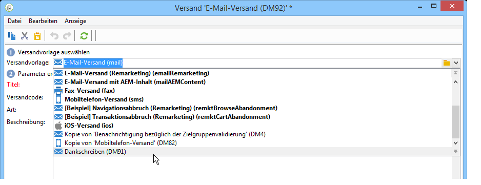
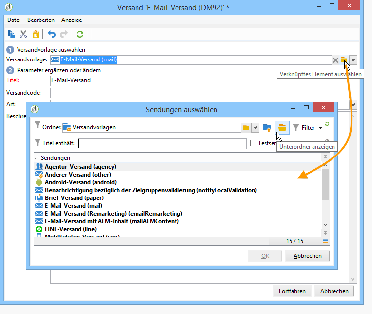
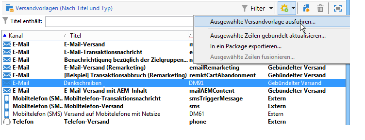

# Versand aus einer Vorlage erstellen{#creating-a-delivery-from-a-template}

## Vorlage einem Versand zuordnen {#linking-the-template-to-a-delivery}

Um einen Versand auf Basis einer existierenden Vorlage zu erstellen, wählen Sie diese aus der Liste der Versandvorlagen aus.

Es besteht außerdem die Möglichkeit, auf **[!UICONTROL Verknüpftes Element auswählen]** zu klicken, um den Navigationsbaum zu durchsuchen.

Wählen Sie im Feld **[!UICONTROL Ordner]** das gesuchte Verzeichnis aus oder klicken Sie auf das Symbol **[!UICONTROL Unterordner anzeigen]**.

Wählen Sie dann die zu verwendende Versandvorlage aus und klicken Sie auf **[!UICONTROL OK]**.

## Vorlage ausführen {#executing-the-template}

Sie haben die Möglichkeit, eine Vorlage direkt aus der Vorlagenliste heraus auszuführen, ohne zuvor einen Versand zu erstellen. Markieren Sie hierfür die auszuführende Vorlage und klicken Sie mit der rechten Maustaste. Wählen Sie die Option **[!UICONTROL Aktionen > Ausgewählte Versandvorlage ausführen...]**.

Sie können auch das Menü **[!UICONTROL Datei > Aktionen > Ausgewählte Versandvorlage ausführen...]** verwenden.

Geben Sie die Versandparameter an und klicken Sie auf **[!UICONTROL Senden]**.

Der Versand wird daraufhin in dem der Vorlage entsprechenden Ordner erstellt. Der Name des neuen Versands wird von der zugrundeliegenden Vorlage übernommen.

>[!NOTE]
>
>Weitere Informationen zum Konfigurieren eines Versands finden Sie unter [E-Mail-Inhalt erstellen](../../delivery/using/defining-the-email-content.md).
