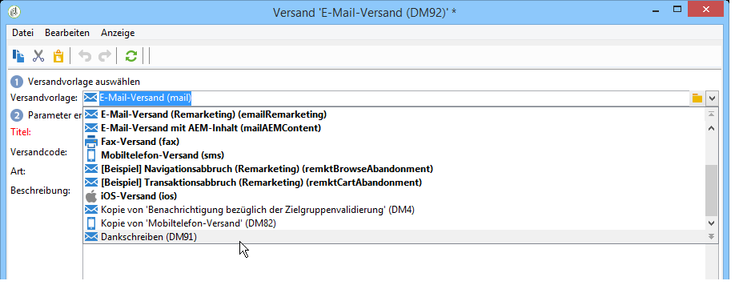
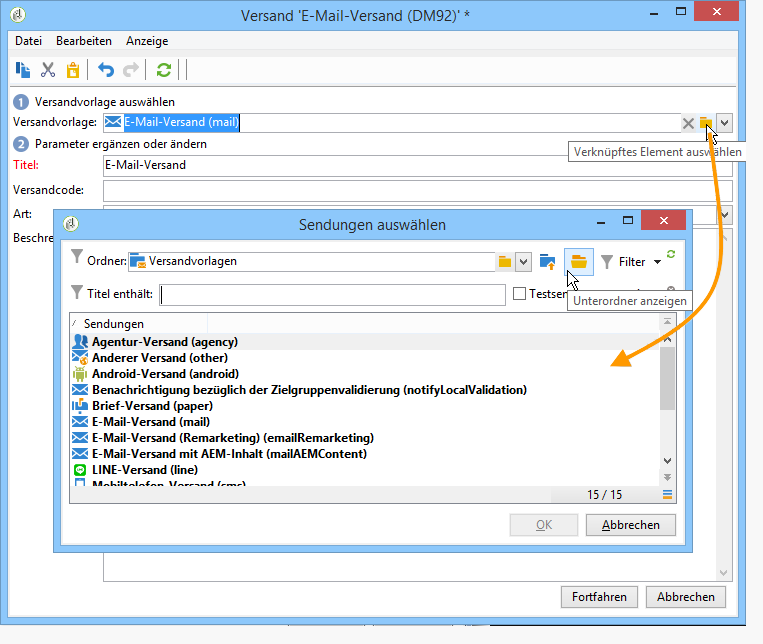
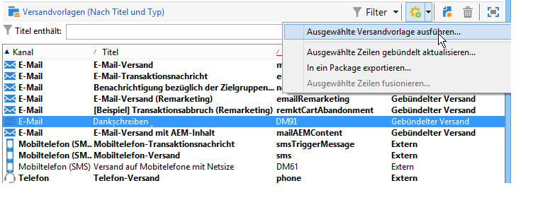

# Erstellen eines Versands aus einer Vorlage{#creating-a-delivery-from-a-template}

## Verknüpfen der Vorlage mit einem Versand {#linking-the-template-to-a-delivery}

Um einen Versand auf Basis einer existierenden Vorlage zu erstellen, wählen Sie diese aus der Liste der Versandvorlagen aus.

Es besteht außerdem die Möglichkeit, auf **[!UICONTROL Verknüpftes Element auswählen]** zu klicken, um den Navigationsbaum zu durchsuchen.

Wählen Sie im Feld **[!UICONTROL Ordner]** das gesuchte Verzeichnis aus oder klicken Sie auf das Symbol **[!UICONTROL Unterordner anzeigen]**.

Wählen Sie dann die zu verwendende Versandvorlage aus und klicken Sie auf **[!UICONTROL OK]**.

## Ausführen der Vorlage {#executing-the-template}

Sie können die Ausführung einer Vorlage direkt über die Vorlagenliste starten, ohne zuvor einen Versand zu erstellen. Wählen Sie dazu die auszuführende Vorlage aus und klicken Sie mit der rechten Maustaste darauf. Wählen Sie **[!UICONTROL Aktionen > Ausgewählte Versandvorlage ausführen...]** aus.

Sie können auch das Menü **[!UICONTROL Datei > Aktionen > Ausgewählte Versandvorlage ausführen...]** verwenden.

Geben Sie die Versandparameter an und klicken Sie auf **[!UICONTROL Senden]**.

Dadurch wird ein Versand in dem Ordner erzeugt, der an die Vorlage angehängt ist. Der Name dieses Versands ist der Name der Versandvorlage, aus der er erstellt wurde.

>[!NOTE]
>
>Weitere Informationen zum Konfigurieren eines Versands finden Sie unter [Definieren des E-Mail-Inhalts](defining-the-email-content.md).
