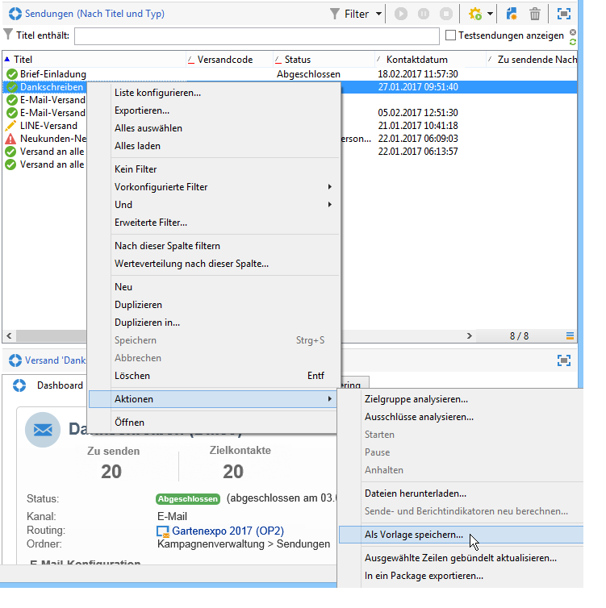
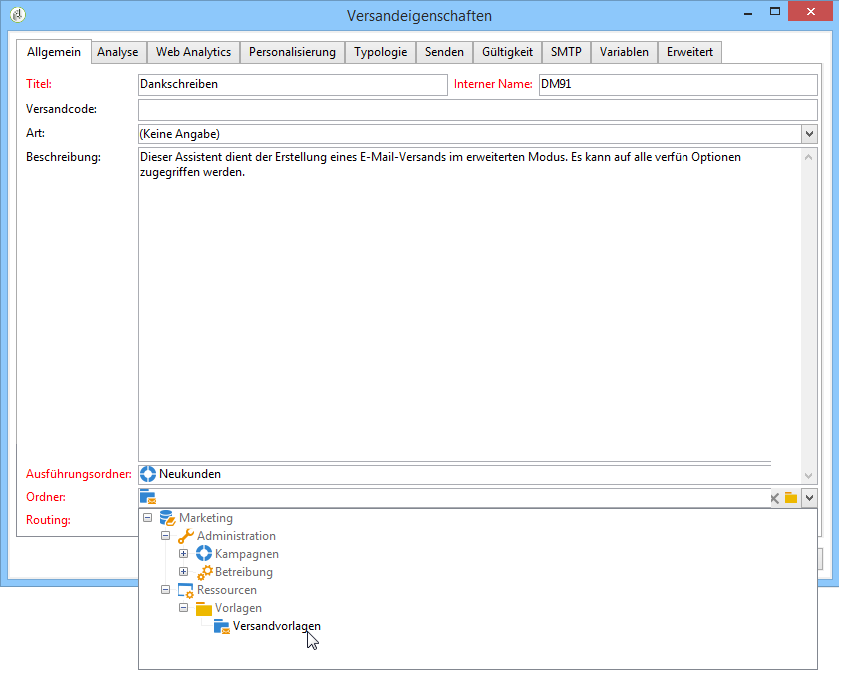
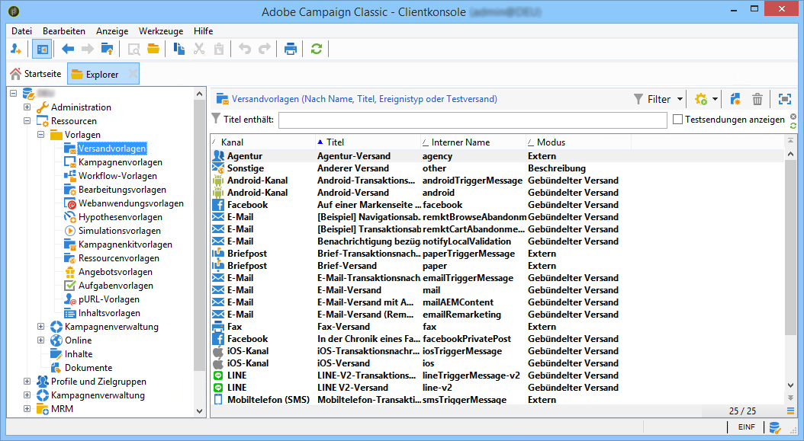
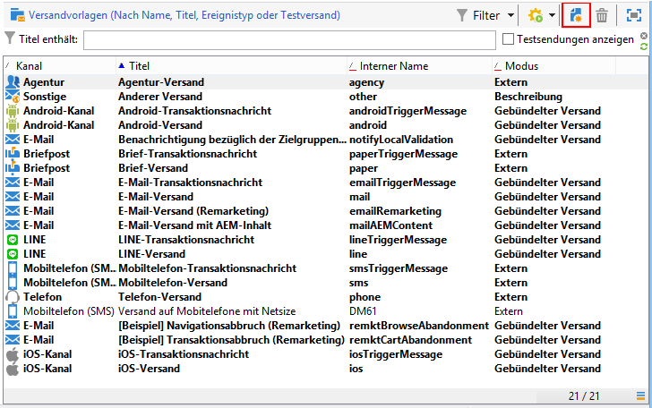
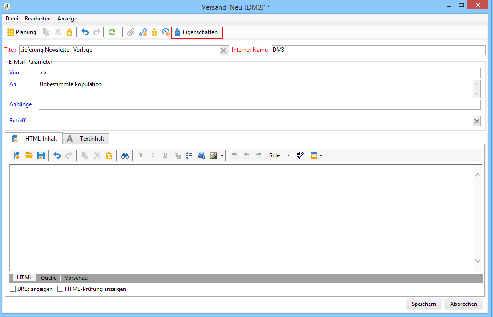
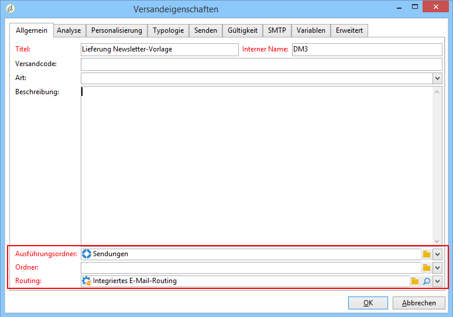
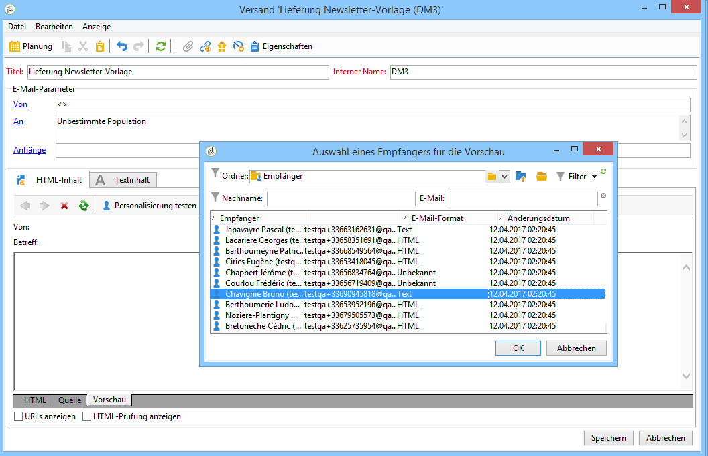

# Versandvorlage erstellen{#creating-a-delivery-template}

 [Mehr zu dieser Funktion erfahren Sie im Video.](#delivery-template-video).

## Einen bestehenden Versand in eine Vorlage konvertieren {#converting-an-existing-delivery-to-a-template}

Sie haben die Möglichkeit, einen existierenden Versand als Basis für wiederkehrende Versandaktionen zu verwenden. Markieren Sie hierfür in der über den Knoten **[!UICONTROL Kampagnenverwaltung > Sendungen]** zugänglichen Versandliste den gewünschten Versand.

Klicken Sie mit der rechten Maustaste und wählen Sie **[!UICONTROL Aktionen > Als Vorlage speichern...]**.

Geben Sie im Feld **[!UICONTROL Ordner]** an, wo die Vorlage gespeichert werden soll, und im Feld **[!UICONTROL Ausführungsordner]**, wo die auf dieser Vorlage beruhenden Sendungen zu speichern sind.

Weitere Informationen zum Konfigurationsmodus finden Sie unter [Vorlage einem Versand zuordnen](../../delivery/using/creating-a-delivery-from-a-template.md#linking-the-template-to-a-delivery).

## Neue Vorlage erstellen {#creating-a-new-template}

Führen Sie zur Konfiguration einer Versandvorlage die folgenden Schritte aus:

1. Öffnen Sie den Campaign-Explorer.
1. Wählen Sie im Ordner **Ressourcen** die Option **Vorlagen** und dann **Versandvorlagen** aus.

   

1. Klicken Sie in der Symbolleiste auf **Neu**, um eine neue Versandvorlage zu erstellen.

   

1. Ändern Sie den **Titel** und den Ordnernamen **Interner Name**.
1. Speichern Sie Ihre Vorlage und öffnen Sie sie erneut.
1. Klicken Sie auf die Schaltfläche **Eigenschaften** und ändern Sie dann die Werte entsprechend Ihren Anforderungen.

   

1. Bestätigen Sie im Tab **Allgemein** die in den Dropdown-Menüs **Ausführungsordner**, **Ordner** und **Routing** ausgewählten Speicherorte oder ändern Sie sie.

   

1. Tragen Sie der Kategorie **E-Mail-Parameter** den E-Mail-Betreff und die Zielgruppe ein.
1. Fügen Sie Ihren **HTML-Inhalt** ein, um Ihre Vorlage zu personalisieren. Sie können auch einen Mirrorseite-Link und einen Abmelde-Link angeben.
1. Wählen Sie den Tab **Vorschau**. Wählen Sie im Dropdown-Menü **Personalisierung testen** die Option **Empfänger** aus, um sich Ihre Vorlage in der Vorschau anzusehen.

   

1. Klicken Sie auf **Speicher**. Ihre Vorlage kann jetzt in einem Versand verwendet werden.

>[!NOTE]
>
>Zur Vermeidung von Konfigurationsfehlern wird empfohlen, keine neuen Vorlagen zu erstellen, sondern native Vorlagen zu duplizieren und die Eigenschaften je nach Bedarf anzupassen.

## Konfigurieren einer Versandvorlage {#delivery-template-video}

Das folgende Video zeigt, wie man eine Vorlage für einen Ad-hoc-Versand konfiguriert.

>[!VIDEO](https://video.tv.adobe.com/v/24066?quality=12&captions=ger)

## Einrichten der Eigenschaften von Versandvorlagen

Das folgende Video zeigt, wie die Eigenschaften der Versandvorlage festgelegt werden, und erklärt die einzelnen Eigenschaften im Detail.

>[!VIDEO](https://video.tv.adobe.com/v/24067?quality=12&captions=ger)

## Bereitstellen einer Ad-hoc-Versandvorlage

In diesem Video wird erläutert, wie man eine Ad-hoc-E-Mail-Versandvorlage bereitstellt. Außerdem wird der Unterschied zwischen einem E-Mail-Versand- und einem Versand-Workflow erläutert.

>[!VIDEO](https://video.tv.adobe.com/v/24065?quality=12&captions=ger)
