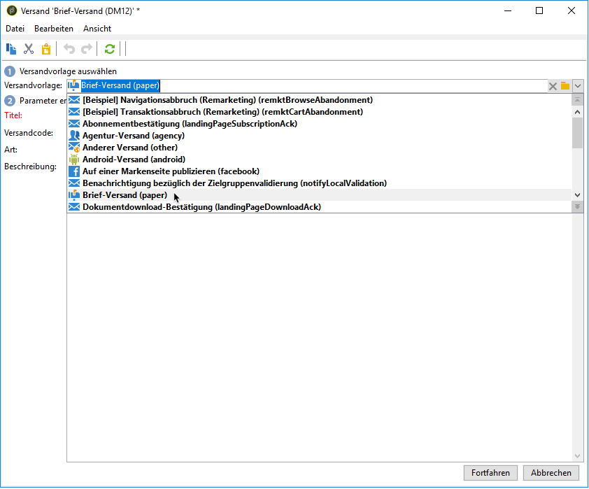

# Briefpost-Versand erstellen{#creating-a-direct-mail-delivery}

Gehen Sie wie folgt vor, um einen neuen Briefpost-Versand zu erstellen:

>[!NOTE]
>
>Allgemeine Methoden zur Versanderstellung finden Sie in [diesem Abschnitt](../../delivery/using/steps-about-delivery-creation-steps.md).

1. Erstellen Sie einen neuen Versand beispielsweise im Versand-Dashboard.
1. Wählen Sie die Versandvorlage **Brief-Versand (Papier)** aus.

   

1. Geben Sie für Ihren Versand einen Titel, einen Code und eine Beschreibung ein. Weiterführende Informationen dazu finden Sie in [diesem Abschnitt](../../delivery/using/steps-create-and-identify-the-delivery.md#identifying-the-delivery)
1. Klicken Sie auf **Fortfahren**, um die Eingaben zu bestätigen und in das Fenster der Nachrichtenkonfiguration zu gelangen.
