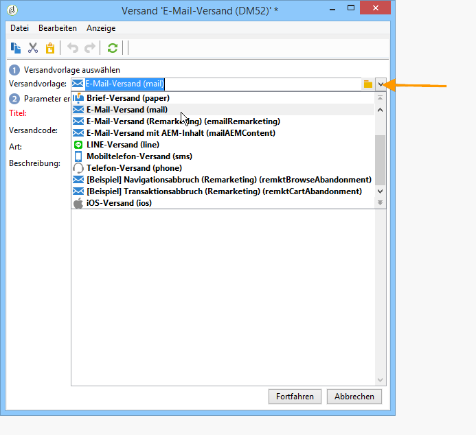

# E-Mail-Versand erstellen.{#creating-an-email-delivery}

Gehen Sie wie folgt vor, um einen neuen E-Mail-Versand zu erstellen:

>[!NOTE]
>
>Allgemeine Methoden zur Versanderstellung finden Sie in [diesem Abschnitt](../../delivery/using/steps-about-delivery-creation-steps.md).

1. Erstellen Sie einen neuen Versand beispielsweise im Versand-Dashboard.
1. Wählen Sie die Versandvorlage **E-Mail-Versand (Mail)** oder eine von Ihnen erstellte E-Mail-Versandvorlage aus. Weiterführende Informationen zu Versandvorlagen finden Sie in [diesem Abschnitt](../../delivery/using/about-templates.md).

   

1. Geben Sie für Ihren Versand einen Titel, einen Code und eine Beschreibung ein. Weiterführende Informationen dazu finden Sie in [diesem Abschnitt](../../delivery/using/steps-create-and-identify-the-delivery.md#identifying-the-delivery).
1. Klicken Sie auf **Fortfahren**, um die Eingaben zu bestätigen und in das Fenster der Nachrichtenkonfiguration zu gelangen.
