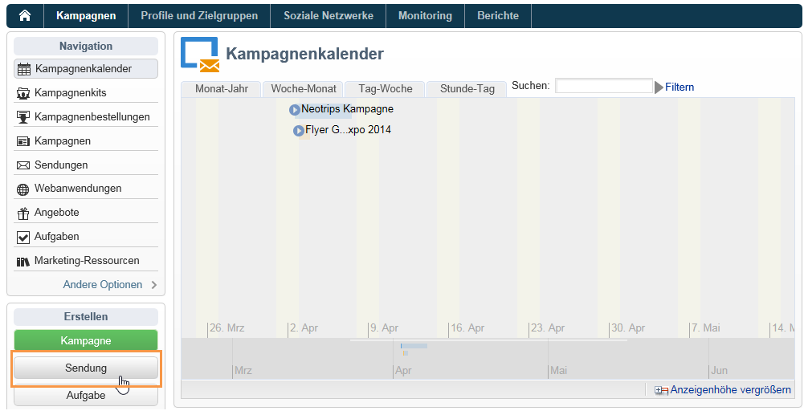
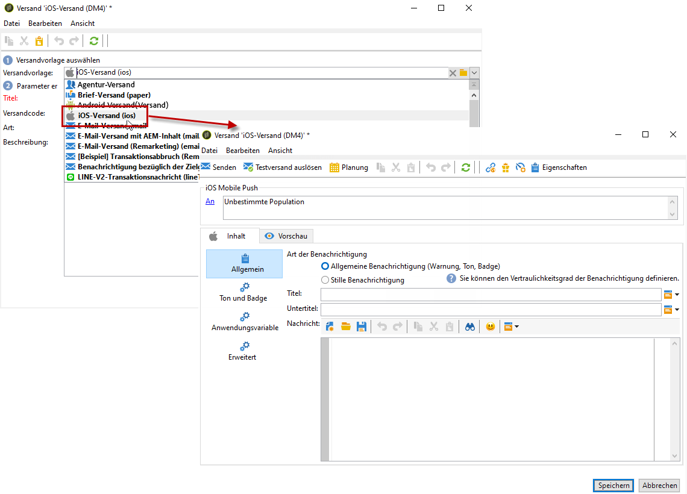
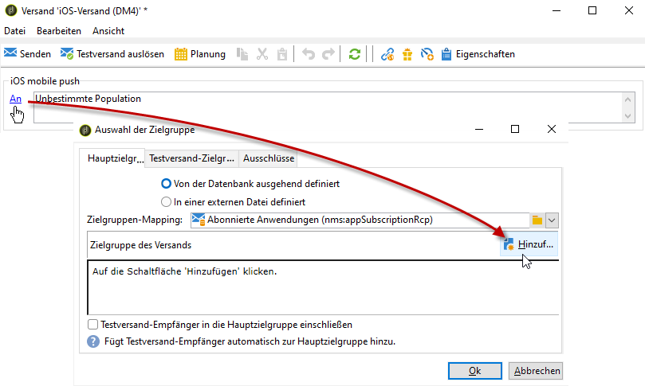
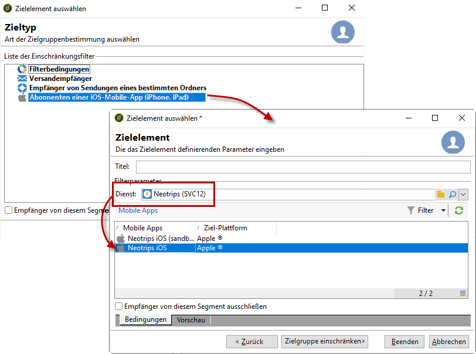
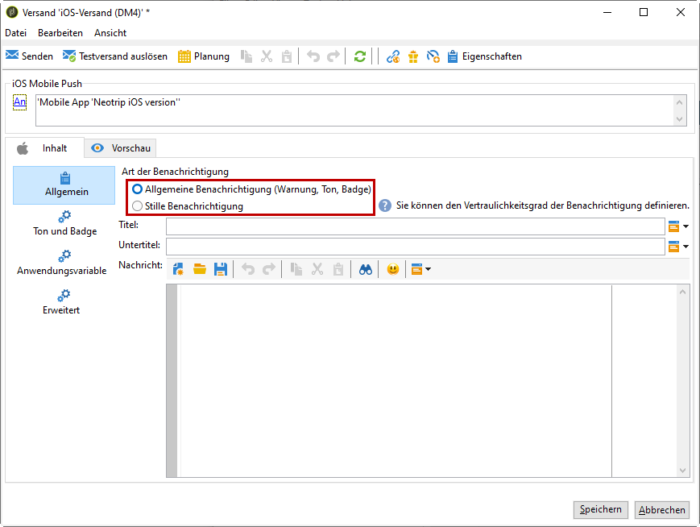
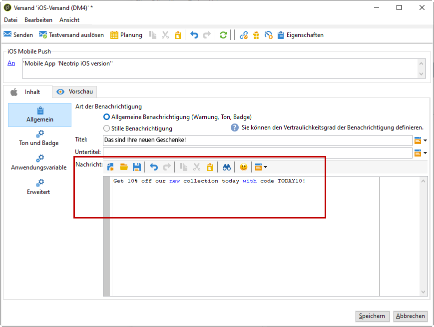
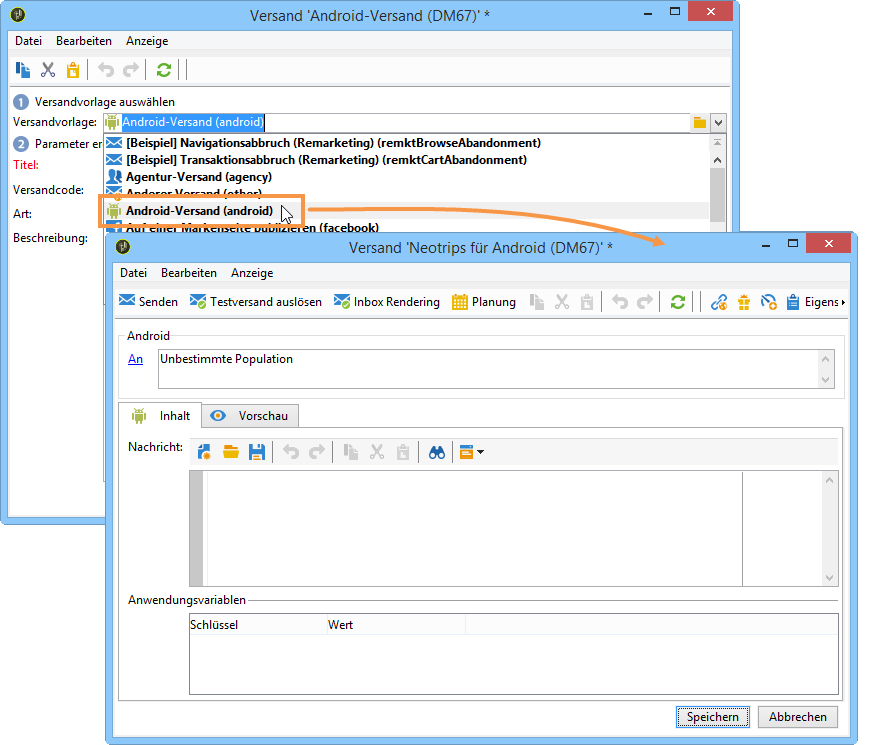
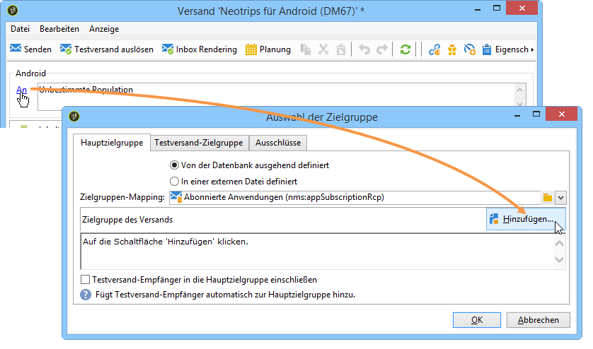
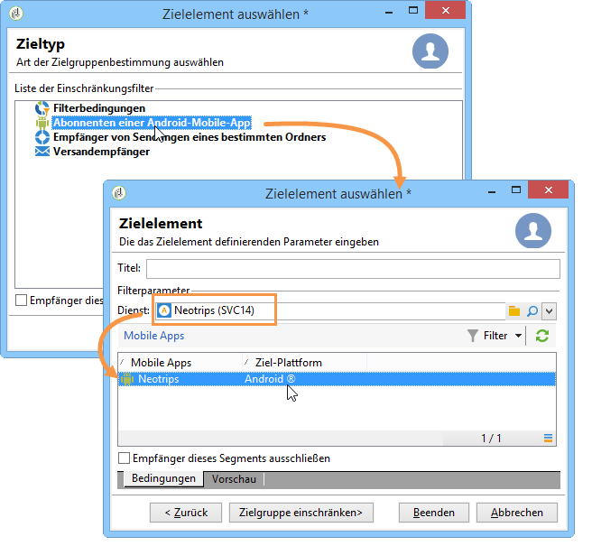
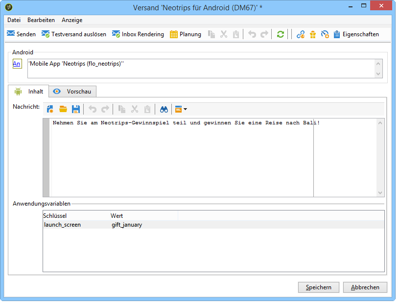

# Benachrichtigungen erstellen{#creating-notifications}

Dieser Abschnitt beschreibt die spezifischen Elemente eines Benachrichtigungsversands für iOS- oder Android-Geräte. Allgemeine Methoden zur Versanderstellung finden Sie in [diesem Abschnitt](../../delivery/using/steps-about-delivery-creation-steps.md).

Erstellen Sie zunächst einen neuen Versand:

## Versand von Benachrichtigungen auf iOS-Geräte {#sending-notifications-on-ios}

1. Wählen Sie die Versandvorlage **[!UICONTROL iOS-Versand]**.

   

1. Klicken Sie zur Bestimmung der Zielgruppe der Benachrichtigung auf den Link **[!UICONTROL An]** und anschließend auf **[!UICONTROL Hinzufügen]**.

   

   >[!NOTE]
   >
   >Die detaillierten Schritte zur Auswahl der Zielpopulation eines Versands finden Sie in [diesem Abschnitt](../../delivery/using/steps-defining-the-target-population.md).
   >
   >Weitere Informationen zur Verwendung von Personalisierungsfeldern finden Sie unter [Über die Personalisierung](../../delivery/using/about-personalization.md).
   >
   >Weitere Informationen zur Verwendung von Testadressen finden Sie unter [Über Testadressen](../../delivery/using/about-seed-addresses.md).

1. Wählen Sie **[!UICONTROL Abonnenten einer iOS-Mobile-App (iPhone, iPad)]**, dann den Ihrer Mobile App entsprechenden Dienst (hier Neotrips) und schließlich die iOS-Version der App.

   

1. Kreuzen Sie den gewünschten Benachrichtigungstyp (Hinweisstil) an: **[!UICONTROL Hinweis]**, **[!UICONTROL Kennzeichen]**, **[!UICONTROL Hinweis und Kennzeichen]** oder **[!UICONTROL Silent Push]**.

   

   >[!NOTE]
   >
   >Der **Silent Push**-Modus ist ab iOS-Version 7 verfügbar und ermöglicht den Versand einer &quot;stillen&quot; Benachrichtigung an eine Mobile App. Der Benutzer wird über die Ankunft der Benachrichtigung nicht in Kenntnis gesetzt, da diese direkt an die Anwendung übermittelt wird.

1. Geben Sie im Feld **[!UICONTROL Titel]** die Bezeichnung an, die auf der Benachrichtigung erscheinen soll. Dieser Titel wird nur in der im Benachrichtigungszentrum zur Verfügung stehenden Benachrichtigungsliste angezeigt. In diesem Feld können Sie den Wert des **title**-Parameters der iOS-Benachrichtigungs-Nutzdaten definieren.
1. Wenn Sie den HTTP/2-Connector verwenden, können Sie einen Untertitel hinzufügen (Wert des Parameters **subtitle** der iOS-Benachrichtigungs-Nutzdaten). Weitere Informationen finden Sie im Abschnitt [Konfiguration der Mobile App in Adobe Campaign](../../delivery/using/configuring-the-mobile-application.md).
1. Geben Sie nun, je nach gewähltem Benachrichtigungstyp (Hinweisstil), die **[!UICONTROL Nachricht]** und den **[!UICONTROL Kennzeichenwert]** ein.

   

   >[!NOTE]
   >
   >Sie können zum Inhalt Ihrer Benachrichtigung Emojis hinzufügen. Gehen Sie hierzu auf eine Website mit Emojis ([Beispiel](https://www.utf8-chartable.de/unicode-utf8-table.pl?start=9728)), kopieren Sie ein Emoji und fügen Sie es direkt in den Inhaltseditor ein. Unter Windows 7 werden einige Emojis im Editor möglicherweise nicht korrekt angezeigt (viereckiges Symbol), in der endgültigen E-Mail sollten sie aber korrekt erscheinen. Die Darstellungsmöglichkeit von Emojis hängt vom jeweiligen Betriebssystem des Geräts ab. Wir empfehlen eine Testsendung, um sicherzustellen, dass der Versand korrekt dargestellt wird.

   >[!NOTE]
   >
   >Bei Benachrichtigungen bzw. Hinweisen vom Typ **[!UICONTROL Kennzeichen]** und **[!UICONTROL Hinweis und Kennzeichen]** haben Sie die Möglichkeit, den Kennzeichenwert (Ziffer, die über dem Mobile-App-Logo angezeigt wird) zu ändern. Zur Zurücksetzung des Kennzeichens genügt es, 0 als Wert anzugeben. Wenn das Feld leer ist, wird der Wert des Kennzeichens nicht geändert.

1. Im Feld **[!UICONTROL Aktionsschaltfläche]** können Sie den Text der Aktionsschaltfläche angeben, die auf Benachrichtigungen vom Typ Warnung erscheint (Feld **action_loc_key** der Nutzdaten). Wenn Ihre iOS-Anwendung die Lokalisierung von Text unterstützt (**Localizable.strings**), ist in diesem Feld der entsprechende Schlüssel anzugeben. Wenn dies nicht der Fall ist, geben Sie direkt den Text an, der auf der Aktionsschaltfläche erscheinen soll. Lesen Sie für weiterführende Informationen hierzu die [Apple-Dokumentation](https://developer.apple.com/library/archive/documentation/NetworkingInternet/Conceptual/RemoteNotificationsPG/CreatingtheNotificationPayload.html#//apple_ref/doc/uid/TP40008194-CH10-SW1) .
1. Wählen Sie im Feld **[!UICONTROL Ton abspielen]** die Melodie aus, die bei Erhalt einer Nachricht abgespielt werden soll.

   >[!NOTE]
   >
   >Töne müssen in die App integriert und zum Zeitpunkt der Erstellung des entsprechenden Dienstes konfiguriert werden. Siehe [Konfiguration des externen iOS-Kontos](../../delivery/using/configuring-the-mobile-application.md#configuring-external-account-ios).

1. Geben Sie im Feld **[!UICONTROL Anwendungsvariablen]** für jede Variable den zugehörigen Wert an. Variablen dienen zur Konfiguration des Anwendungsverhaltens infolge des Erhalts einer Benachrichtigung. So können Sie einen speziellen Bildschirm anzeigen lassen, wenn der Nutzer auf die App tippt.

   >[!NOTE]
   >
   >Anwendungsvariablen müssen im Code der Mobile App definiert und bei der Diensterstellung eingegeben werden. Weiterführende Informationen dazu finden Sie unter [Konfiguration einer Mobile App in Adobe Campaign](../../delivery/using/configuring-the-mobile-application.md).

1. Klicken Sie nach Angabe aller erforderlichen Benachrichtigungsparameter auf den **[!UICONTROL Vorschau]**-Tab, um das Rendering der Benachrichtigung zu prüfen.

   

   >[!NOTE]
   >
   >Der Hinweisstil (Banner oder Hinweis) ist in Adobe Campaign nicht im Vorhinein festgelegt. Er hängt von der vom Benutzer in den iOS-Einstellungen gewählten Konfiguration ab. Adobe Campaign ermöglicht es jedoch, eine Vorschau der Benachrichtigung in jedem Stil anzuzeigen. Verwenden Sie den unten rechts im Bildschirm gelegenen Pfeil, um von einem Stil zum anderen zu wechseln.
   >
   >In der Vorschau wird das Erscheinungsbild von iOS 10 verwendet.

Testsendungen und der endgültige Start des Versands werden analog zum E-Mail-Versand durchgeführt.

Nach Absenden der Nachrichten können Sie den Versand beobachten und verfolgen, siehe diese Abschnitte:

* [Quarantäne für Push-Benachrichtigungen](../../delivery/using/understanding-quarantine-management.md#push-notification-quarantines)
* [Sendungen beobachten](../../delivery/using/monitoring-a-delivery.md)
* [Ursachen von fehlgeschlagenen Sendungen](../../delivery/using/understanding-delivery-failures.md)

## Versand von Benachrichtigungen auf Android-Geräte {#sending-notifications-on-android}

1. Wählen Sie die Versandvorlage **[!UICONTROL Android-Versand]**.

   

1. Klicken Sie zur Bestimmung der Zielgruppe der Benachrichtigung auf den Link **[!UICONTROL An]** und anschließend auf **[!UICONTROL Hinzufügen]**.

   

1. Wählen Sie **[!UICONTROL Abonnenten einer Android-Mobile-App]**, dann den Ihrer Mobile App entsprechenden Dienst (hier Neotrips) und schließlich die Android-Version der App.

   

1. Erfassen Sie den Inhalt der Benachrichtigung.

   

   >[!NOTE]
   >
   >Sie können zum Inhalt Ihrer Benachrichtigung Emojis hinzufügen. Gehen Sie hierzu auf eine Website mit Emojis ([Beispiel](https://www.utf8-chartable.de/unicode-utf8-table.pl?start=9728)), kopieren Sie ein Emoji und fügen Sie es direkt in den Inhaltseditor ein. Unter Windows 7 werden einige Emojis im Editor möglicherweise nicht korrekt angezeigt (viereckiges Symbol), in der endgültigen E-Mail sollten sie aber korrekt erscheinen. Die Darstellungsmöglichkeit von Emojis hängt vom jeweiligen Betriebssystem des Geräts ab. Wir empfehlen eine Testsendung, um sicherzustellen, dass der Versand korrekt dargestellt wird.

1. Geben Sie im Feld **[!UICONTROL Anwendungsvariablen]** für jede Variable den zugehörigen Wert an. Variablen dienen zur Konfiguration des Anwendungsverhaltens infolge des Erhalts einer Benachrichtigung. So können Sie einen speziellen Bildschirm anzeigen lassen, wenn der Nutzer auf die App tippt.

   >[!NOTE]
   >
   >Anwendungsvariablen müssen im Code der Mobile App definiert und bei der Diensterstellung eingegeben werden. Weiterführende Informationen dazu finden Sie unter [Konfiguration einer Mobile App in Adobe Campaign](../../delivery/using/configuring-the-mobile-application.md).

1. Klicken Sie nach Angabe aller erforderlichen Benachrichtigungsparameter auf den **[!UICONTROL Vorschau]**-Tab, um das Rendering der Benachrichtigung zu prüfen.

   

Testsendungen und der endgültige Start des Versands werden analog zum E-Mail-Versand durchgeführt.

Die detaillierten Schritte zur Validierung und zum Versand von Nachrichten finden Sie in den folgenden Abschnitten:

* [Versand validieren](../../delivery/using/steps-validating-the-delivery.md)
* [Versenden der Nachrichten](../../delivery/using/steps-sending-the-delivery.md)

Nach Absenden der Nachrichten können Sie den Versand beobachten und verfolgen, siehe diese Abschnitte:

* [Quarantäne für Push-Benachrichtigungen](../../delivery/using/understanding-quarantine-management.md#push-notification-quarantines)
* [Sendungen beobachten](../../delivery/using/monitoring-a-delivery.md)
* [Ursachen von fehlgeschlagenen Sendungen](../../delivery/using/understanding-delivery-failures.md)
