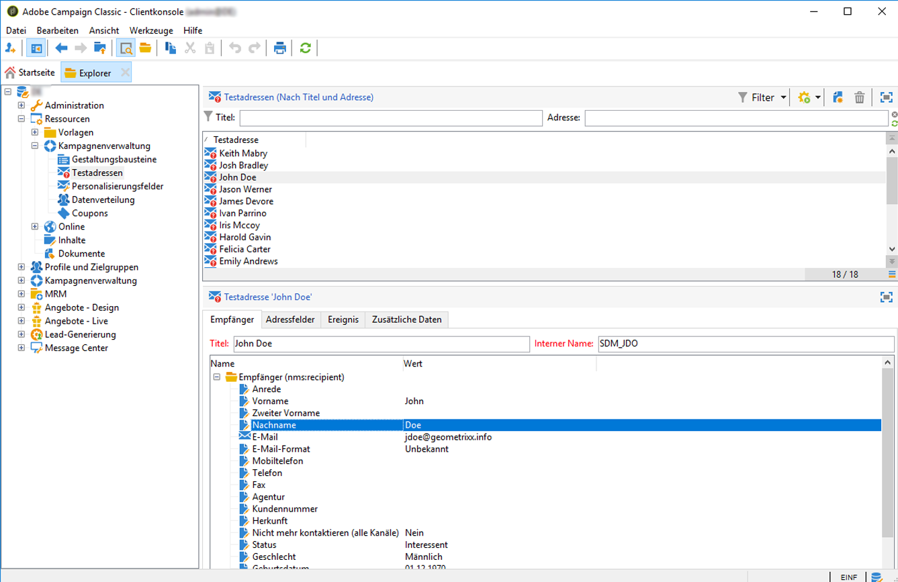
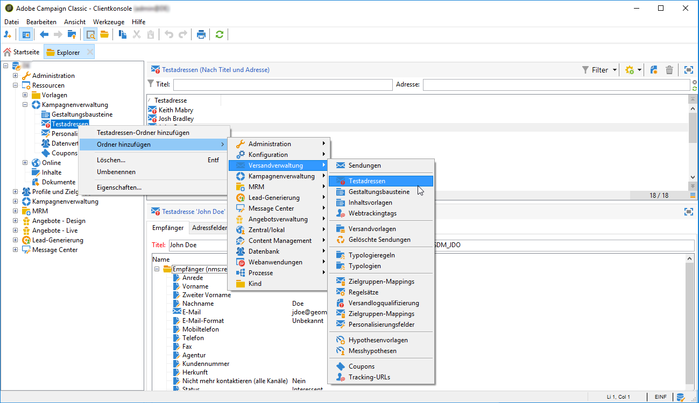
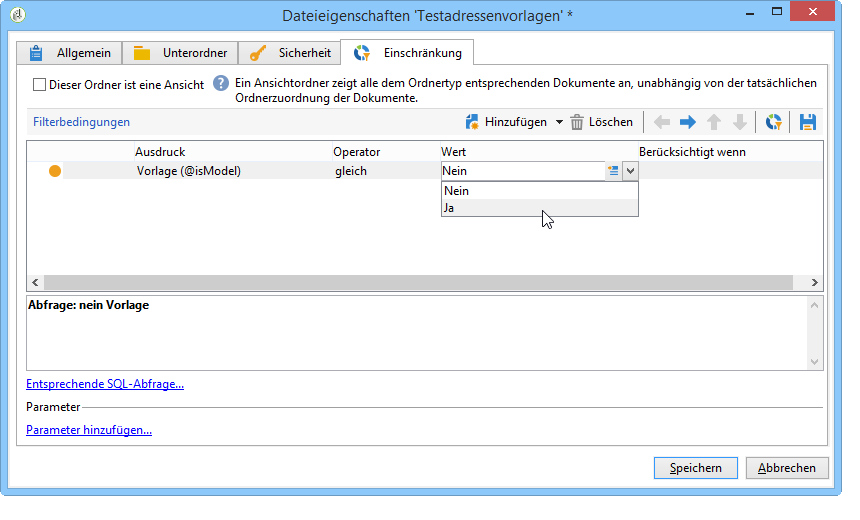

# Testadressen erstellen{#creating-seed-addresses}

Testadressen werden separat von Standard-Profilen und -Zielgruppen im Knoten **[!UICONTROL Ressourcen > Kampagnenverwaltung > Testadressen]** verwaltet.

Zur besseren Übersicht können Sie Unterordner anlegen. Klicken Sie hierfür mit der rechten Maustaste auf den **[!UICONTROL Testadressen]**-Knoten und wählen Sie die Option **[!UICONTROL Testadressen-Ordner hinzufügen]** aus. Benennen Sie den neuen Ordner und bestätigen Sie die Eingabe mit **[!UICONTROL Enter]**. Nun können Sie neue Testadressen erstellen oder existierende Adressen in diesen Unterordner kopieren. Weitere Informationen hierzu finden Sie im Abschnitt [Adressen konfigurieren](#defining-addresses).

Adobe Campaign bietet auch die Möglichkeit, Testadressenvorlagen zu erstellen, die in Sendungen oder Kampagnen importiert und deren spezifischen Bedürfnissen angepasst werden. Weitere Informationen finden Sie unter [Testadressenvorlagen erstellen](#creating-seed-address-templates).

## Adressen konfigurieren {#defining-addresses}

Gehen Sie zur Erstellung von Testadressen wie folgt vor:

1. Klicken Sie auf die Schaltfläche **[!UICONTROL Neu]** oberhalb der Testadressenliste.
1. Füllen Sie im Tab **[!UICONTROL Empfänger]** die jeweiligen Felder aus. Die verfügbaren Felder entsprechen den Standardfeldern in den Profilen der Versandempfänger (nms:recipient table): Name, Vorname, E-Mail etc.

   >[!NOTE]
   >
   >Für die Bezeichnung der Adresse werden automatisch die von Ihnen definierten Vor- und Nachnamen verwendet.
   >
   >Es ist bei Testadressen nicht erforderlich, alle Felder in allen Tabs auszufüllen. Fehlende Personalisierungselemente werden zum Zeitpunkt des Versands mit zufälligen Werten ergänzt.

   

1. Geben Sie im **[!UICONTROL Adressfelder]**-Tab die Werte an, die bei der Analysephase in die Versandlogs (Tabelle **[!UICONTROL nms:broadLog]**) geschrieben werden sollen.

1. Geben Sie im Tab **[!UICONTROL Zusätzliche Daten]** die Personalisierungsdaten an, die in mit Data Management-Workflows erstellten Sendungen verwendet werden und die durch einen spezifischen Wert ersetzt werden sollen.

   >[!NOTE]
   >
   >Stellen Sie sicher, dass in der Aktivität **[!UICONTROL Anreicherung]** zusätzliche Zielgruppendaten mit einem Alias definiert wurden, der mit &quot;@&quot; beginnt. Andernfalls können Sie sie nicht richtig mit Ihren Testadressen in Ihrer Versandaktivität verwenden.

## Testadressenvorlagen erstellen {#creating-seed-address-templates}

Die Erstellung von Adressenvorlagen, die importiert und für jeden Versand angepasst werden können, folgt dem der Definition einer neuen Testadresse. Der einzige Unterschied besteht darin, dass Vorlagen für Testadressen in einem Ordner vom Typ &quot;Vorlagen&quot; gespeichert werden.

Gehen Sie wie folgt vor, um einen Vorlagenordner zu konfigurieren:

1. Erstellen Sie einen neuen Ordner vom Typ **[!UICONTROL Testadressen]**, klicken Sie mit der rechten Maustaste darauf und wählen Sie **[!UICONTROL Eigenschaften...]** aus.

   

1. Fügen Sie im Tab **[!UICONTROL Einschränkungen]** folgende Filterbedingung hinzu: **@isModel = true**.

   

   Die in diesem Ordner gespeicherten Adressen können nun als Vorlage verwendet werden. Sie können sie in Sendungen oder Kampagnen importieren und an die jeweiligen Bedürfnisse Ihrer Sendungen und Kampagnen anpassen (siehe [Testadressen hinzufügen](../../delivery/using/adding-seed-addresses.md)).
