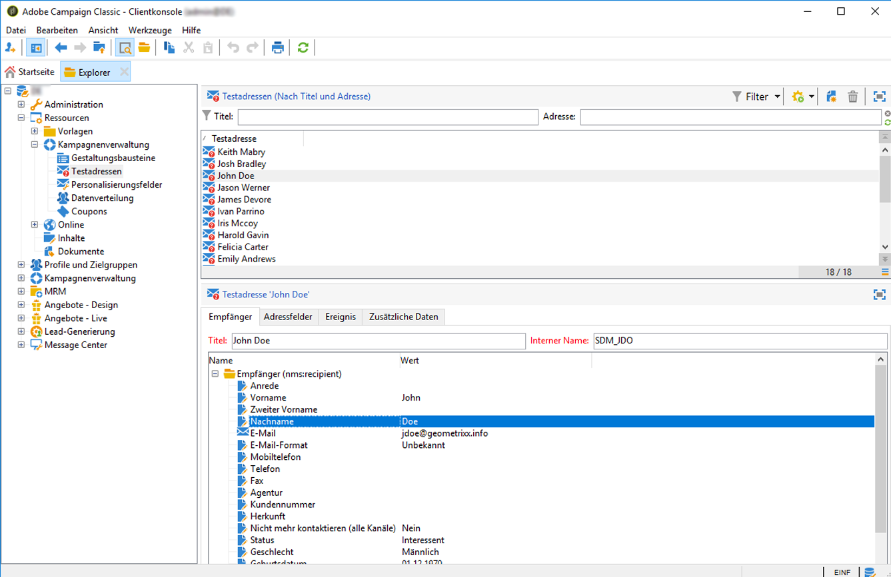
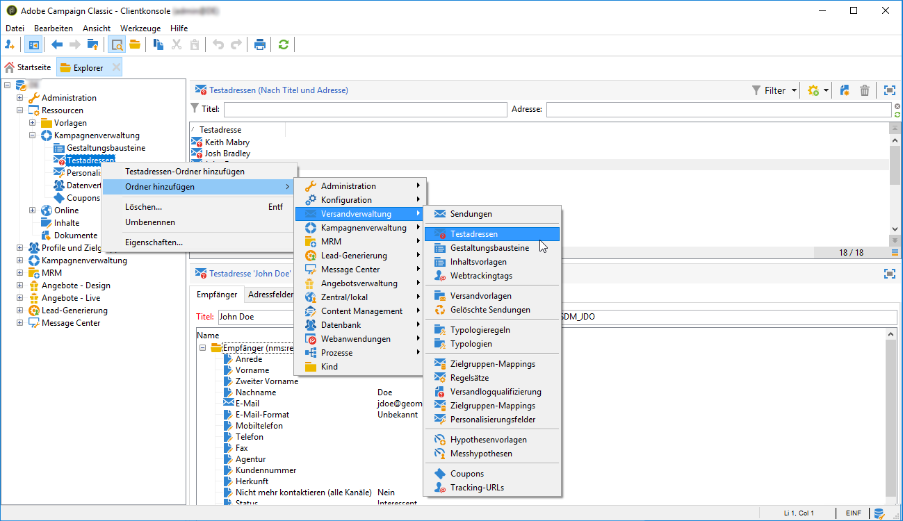
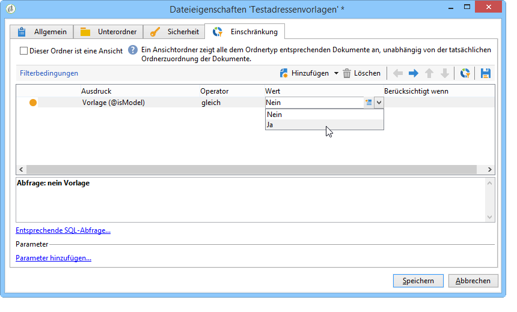

# Erstellen von Testadressen{#creating-seed-addresses}

Testadressen werden separat von Standard-Profilen und -Zielgruppen im Knoten **[!UICONTROL Ressourcen > Kampagnenverwaltung > Testadressen]** verwaltet.

Zur besseren Übersicht können Sie Unterordner anlegen. Klicken Sie hierfür mit der rechten Maustaste auf den **[!UICONTROL Testadressen]**-Knoten und wählen Sie die Option **[!UICONTROL Testadressen-Ordner hinzufügen]** aus. Benennen Sie den neuen Ordner und bestätigen Sie die Eingabe mit **[!UICONTROL Enter]**. Nun können Sie neue Testadressen erstellen oder existierende Adressen in diesen Unterordner kopieren. Weitere Informationen hierzu finden Sie im Abschnitt [Definieren von Adressen](#defining-addresses).

Adobe Campaign bietet auch die Möglichkeit, Testadressenvorlagen zu erstellen, die in Sendungen oder Kampagnen importiert und deren spezifischen Bedürfnissen angepasst werden. Weitere Informationen finden Sie unter [Erstellen von Testadressenvorlagen](#creating-seed-address-templates).

## Definieren von Adressen {#defining-addresses}

Gehen Sie zur Erstellung von Testadressen wie folgt vor:

1. Klicken Sie auf die Schaltfläche **[!UICONTROL Neu]** oberhalb der Testadressenliste.
1. Geben Sie die mit der Adresse verknüpften Daten in die entsprechenden Felder auf der Registerkarte **[!UICONTROL Empfänger]** ein. Die verfügbaren Felder entsprechen den Standardfeldern in den Profilen der Versandempfängerinnen bzw. -empfänger (Tabelle „nms:recipient“): Name, Vorname, E-Mail usw.

   >[!NOTE]
   >
   >Für die Bezeichnung der Adresse werden automatisch die von Ihnen definierten Vor- und Nachnamen verwendet.
   >
   >Bei der Erstellung einer Testadresse müssen nicht alle Felder einer jeden Registerkarte ausgefüllt werden. Fehlende Personalisierungselemente werden bei der Versandanalyse nach dem Zufallsprinzip eingetragen.

   

1. Geben Sie auf der Registerkarte **[!UICONTROL Adressfelder]** die Werte an, die während der Analysephase in die Versandlogs (Tabelle **[!UICONTROL nms:broadLog]**) geschrieben werden sollen.

1. Geben Sie im Tab **[!UICONTROL Zusätzliche Daten]** die Personalisierungsdaten an, die in mit Data Management-Workflows erstellten Sendungen verwendet werden und die durch einen spezifischen Wert ersetzt werden sollen.

   >[!NOTE]
   >
   >Stellen Sie sicher, dass in der Aktivität **[!UICONTROL Anreicherung]** zusätzliche Zielgruppendaten mit einem Alias definiert wurden, der mit &quot;@&quot; beginnt. Andernfalls können Sie sie nicht richtig mit Ihren Testadressen in Ihrer Versandaktivität verwenden.

## Testadressenvorlagen erstellen {#creating-seed-address-templates}

Die Erstellung von Adressenvorlagen, die importiert und für jeden Versand angepasst werden können, erfolgt wie die Definition einer neuen Testadresse. Der einzige Unterschied besteht darin, dass Adressen von Testadressenvorlagen in einem Ordner vom Typ „Vorlage“ gespeichert werden müssen.

Gehen Sie wie folgt vor, um einen Vorlagenordner zu konfigurieren:

1. Erstellen Sie einen neuen Ordner vom Typ **[!UICONTROL Testadressen]**, klicken Sie mit der rechten Maustaste darauf und wählen Sie **[!UICONTROL Eigenschaften...]** aus.

   

1. Fügen Sie im Tab **[!UICONTROL Einschränkungen]** folgende Filterbedingung hinzu: **@isModel = true**.

   

   Die in diesem Ordner gespeicherten Adressen können nun als Vorlage verwendet werden. Sie können sie in Sendungen oder Kampagnen importieren und entsprechend anpassen (siehe [Hinzufügen von Testadressen](adding-seed-addresses.md)).
