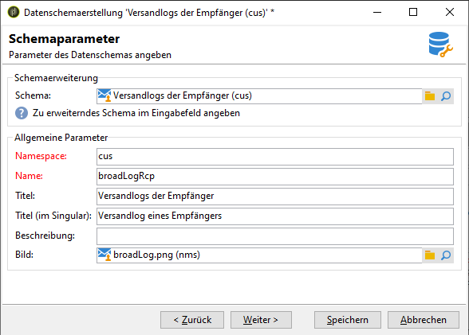
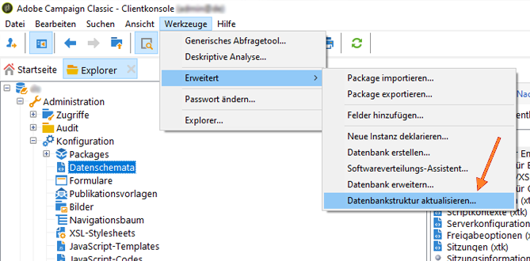
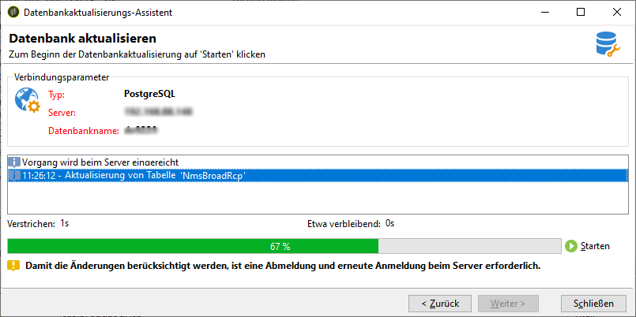
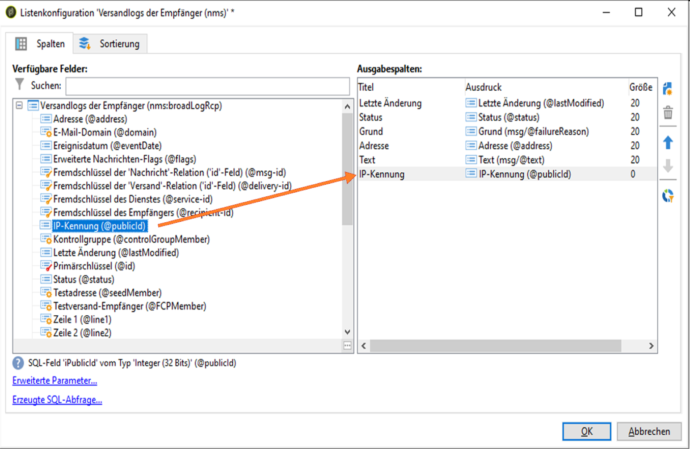

# Fortgeschritten: Anpassen von Versandlogs {#customize-delivery-logs}

>[!NOTE]
>
>Eine umfassende Anleitung zum Zugriff auf die Versandliste und zur Verwendung des Versand-Dashboards finden Sie in der [Dokumentation zu Campaign v8](https://experienceleague.adobe.com/de/docs/campaign/campaign-v8/send/monitor/delivery-dashboard). Diese Inhalte gelten für Benutzende von Campaign Classic v7 und Campaign v8.
>
>Auf dieser Seite werden **Campaign Classic v7-spezifische erweiterte Anpassungen** für Hybrid- und On-Premise-Bereitstellungen dokumentiert.

Informationen zum Monitoring von Sendungen in der Campaign-Benutzeroberfläche finden Sie in der [Dokumentation zum Monitoring von Sendungen in der Campaign-Benutzeroberfläche von Campaign v8](https://experienceleague.adobe.com/de/docs/campaign/campaign-v8/send/monitor/delivery-dashboard){target="_blank"}.

## Anpassen von Versandlogs {#use-case}

Bei **Hybrid-/On-Premise-Bereitstellungen von Campaign Classic v7** können Sie Versandlogs anpassen, indem Sie Schemata erweitern. In diesem Abschnitt wird beschrieben, wie Sie den Versandlogs die IP-Adressen der Absenderinnen und Absender hinzufügen.

>[!NOTE]
>
>Diese Anpassung erfordert Schemaerweiterungsfunktionen, die in On-Premise-Bereitstellungen verfügbar sind. Benutzende von Campaign v8 Managed Cloud Services sollten sich an die Adobe-Kundenunterstützung wenden, um Informationen zu Feldern für benutzerdefinierte Versandlogs zu erhalten.
>
>Diese Änderung wird unterschiedlich ausgeführt, je nachdem, ob Sie eine einzelne Instanz oder eine Mid-Sourcing-Instanz verwenden. Stellen Sie vor der Änderung sicher, dass Sie mit der E-Mail sendenden Instanz verbunden sind.

### Schritt 1: Schema erweitern

Um **publicID** zu Ihren Versandlogs hinzuzufügen, müssen Sie das Schema zuerst erweitern. Sie können wie folgt vorgehen.

1. Erstellen Sie eine Schemaerweiterung unter **[!UICONTROL Administration]** > **[!UICONTROL Konfiguration]** > **[!UICONTROL Datenschemata]** > **[!UICONTROL Neu]**.

   Weitere Informationen zu Schemaerweiterungen finden Sie auf [dieser Seite](../../configuration/using/extending-a-schema.md).

1. Wählen Sie **[!UICONTROL wideLogRcp]** aus, um die Versandlogs des Empfängers (nms) zu erweitern und einen benutzerdefinierten Namespace anzugeben. In diesem Fall ist es &quot;cus&quot;:

   

   >[!NOTE]
   >
   >Wenn sich Ihre Instanz im Mid-Sourcing befindet, müssen Sie mit dem wideLogMid-Schema arbeiten.

1. Fügen Sie das neue Feld in Ihre Erweiterung ein. In diesem Beispiel müssen Sie Folgendes ersetzen:

   ```
   <element img="nms:broadLog.png" label="Recipient delivery logs" labelSingular="Recipient delivery log" name="broadLogRcp"/>
   ```

   mit:

   ```
   <element img="nms:broadLog.png" label="Recipient delivery logs" labelSingular="Recipient delivery log" name="broadLogRcp">
   <attribute desc="Outbound IP identifier" label="IP identifier"
   name="publicId" type="long"/>
   </element>
   ```

   

### Schritt 2: Datenbankstruktur aktualisieren

Nachdem Sie die Änderungen vorgenommen haben, müssen Sie die Datenbankstruktur so aktualisieren, dass sie mit ihrer logischen Beschreibung übereinstimmt.

Gehen Sie dazu wie folgt vor:

1. Klicken Sie auf das Menü **[!UICONTROL Tools]** > **[!UICONTROL Erweitert]** > **[!UICONTROL Datenbankstruktur aktualisieren...]**.

   

1. Im Fenster **[!UICONTROL Tabellen bearbeiten]** wird die Tabelle **[!UICONTROL NmsBroadLogRcp]** (bzw. die Tabelle **[!UICONTROL wideLogMid]**, wenn Sie sich in einer Mid-Sourcing-Umgebung befinden) wie folgt aktiviert:

   

   >[!IMPORTANT]
   >
   >Vergewissern Sie sich stets, dass außer der Tabelle **[!UICONTROL NmsBroadLoGRcp]** (oder der Tabelle **[!UICONTROL wideLogMid]**, wenn Sie sich in einer Mid-Sourcing-Umgebung befinden) keine anderen Änderungen vorgenommen wurden. Wenn ja, heben Sie die Aktivierung der anderen Tabellen auf.

1. Klicken Sie auf **[!UICONTROL Weiter]**, um die Eingaben zu bestätigen. Der folgende Bildschirm wird angezeigt:

   

1. Klicken Sie auf **[!UICONTROL Weiter]** und dann auf **[!UICONTROL Starten]**, um die Datenbankstruktur zu aktualisieren. Die Indexerstellung beginnt. Dieser Schritt kann je nach der Anzahl der Zeilen in der Tabelle **[!UICONTROL NmsBroadLogRcp]** lange dauern.

   

>[!NOTE]
>
>Sobald die Aktualisierung der physischen Struktur der Datenbank erfolgreich abgeschlossen wurde, müssen Sie sich abmelden und wieder anmelden, damit die Änderungen berücksichtigt werden.

### Schritt 3: Änderung überprüfen

Um zu bestätigen, dass alles korrekt funktioniert hat, müssen Sie den Bildschirm &quot;Versandlogs&quot; aktualisieren.

Rufen Sie dazu die Versandlogs auf und fügen Sie die Spalte &quot;IP-Kennung&quot; hinzu.



>[!NOTE]
>
>Informationen zum Konfigurieren von Listen in der Campaign Classic-Oberfläche finden Sie auf [dieser Seite](../../platform/using/adobe-campaign-workspace.md).

Im Tab **[!UICONTROL Versand]** sollten Sie nach den Änderungen Folgendes sehen:


## Verwandte Themen

* [Monitoring von Sendungen in der Campaign-Benutzeroberfläche](https://experienceleague.adobe.com/de/docs/campaign/campaign-v8/send/monitor/delivery-dashboard){target="_blank"} (Dokumentation zu Campaign v8)
* [Versandstatus](https://experienceleague.adobe.com/de/docs/campaign/campaign-v8/send/monitor/delivery-statuses){target="_blank"} (Dokumentation zu Campaign v8)
* [Informationen zu Versandfehlern](https://experienceleague.adobe.com/de/docs/campaign/campaign-v8/send/monitor/delivery-failures){target="_blank"} (Dokumentation zu Campaign v8)
* [Quarantäneverwaltung](https://experienceleague.adobe.com/de/docs/campaign/campaign-v8/send/monitor/quarantines){target="_blank"} (Dokumentation zu Campaign v8)
* [Erweitern eines Schemas](../../configuration/using/extending-a-schema.md) (v7 Hybrid/On-Premise)

