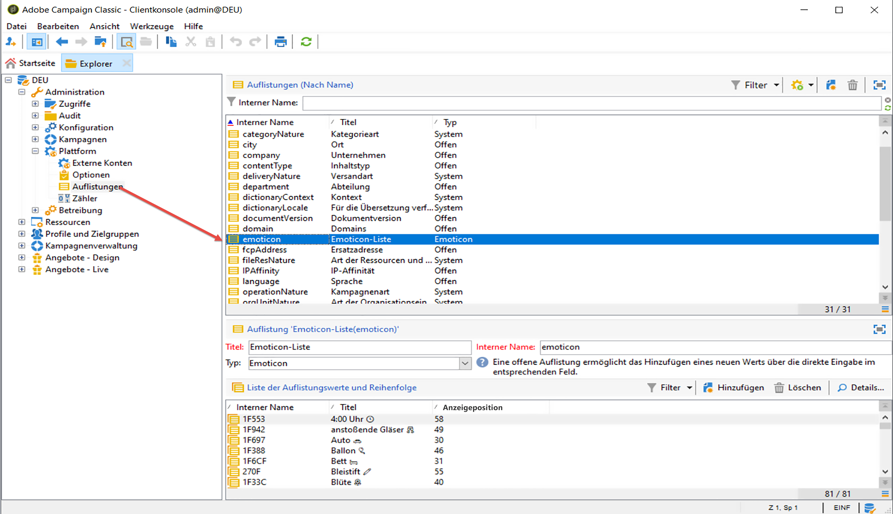
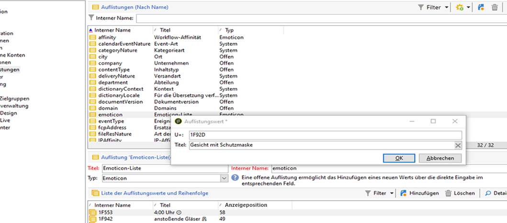
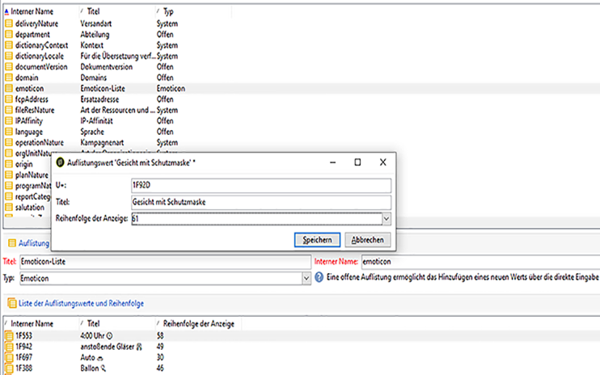
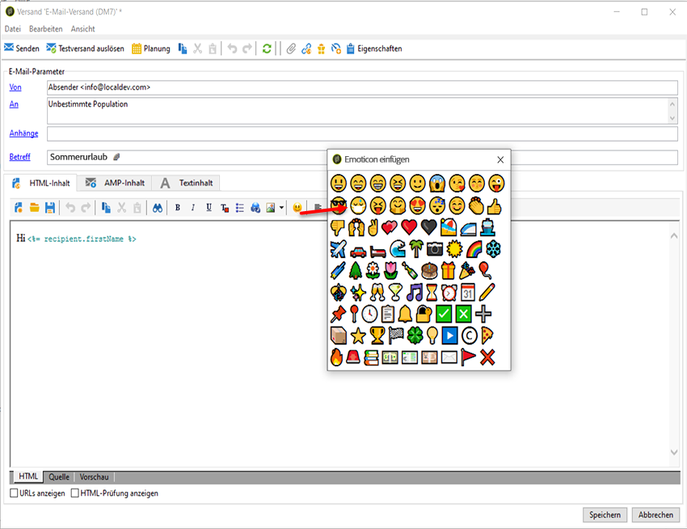
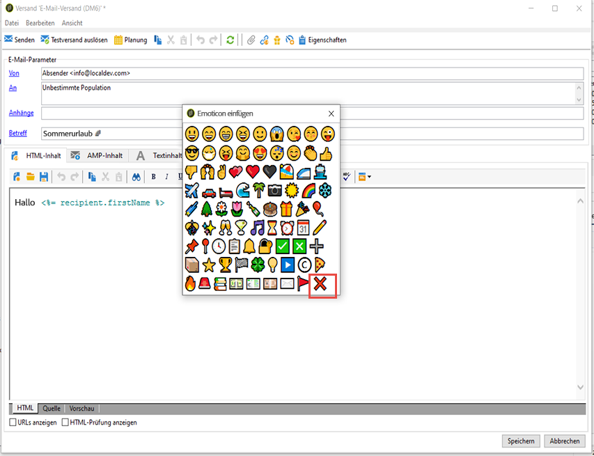

# Personalisieren der Emoticon-Liste {#customize-emoticons}

Die im Popup-Fenster angezeigte Emoticon-Liste wird von einer Auflistung gesteuert, mit der Sie Werte in einer Liste anzeigen können, um die Auswahl zu beschränken, die der Benutzer für ein bestimmtes Feld hat.
Die Reihenfolge der Emoticon-Listen kann angepasst werden. Sie können Ihrer Liste auch weitere Emoticons hinzufügen.

Beachten Sie, dass Emoticons nur für E-Mails und Push-Benachrichtigungen verfügbar sind. Weiterführende Informationen finden Sie in der [Dokumentation zu Campaign v8](https://experienceleague.adobe.com/docs/campaign/campaign-v8/send/emails/defining-the-email-content.html?lang=de#inserting-emoticons){target="_blank"}.

## Hinzufügen eines neuen Emoticons {#add-new-emoticon}

>[!CAUTION]
>
>Die Emoticon-Liste kann maximal 81 Einträge enthalten.

1. Wählen Sie ein neues Emoticon, das Sie hinzufügen möchten, von dieser [Seite](https://unicode.org/emoji/charts/full-emoji-list.html) aus. Beachten Sie, dass es mit den verschiedenen Plattformen wie Browser und Betriebssystem kompatibel sein muss.

1. Wählen Sie im **[!UICONTROL Explorer]****[!UICONTROL Administration]** > **[!UICONTROL Plattform]** > **[!UICONTROL Aufzählungen]** und klicken Sie auf die native Aufzählung **[!UICONTROL Emoticon-Liste]**.

   >[!NOTE]
   >
   >Native Aufzählungen können nur von einem Administrator Ihrer Adobe Campaign Classic Console verwaltet werden.

   

1. Wählen Sie **[!UICONTROL Hinzufügen]** aus.

1. Füllen Sie die Felder aus:

   * **[!UICONTROL U+]**: Code des neuen Emoticons. Die Liste der Codes von Emoticons finden Sie auf dieser [Seite](https://unicode.org/emoji/charts/full-emoji-list.html).
Um Kompatibilitätsprobleme zu vermeiden, empfehlen wir Ihnen, Emoticons auszuwählen, die auf Browsern und auf jedem Betriebssystem unterstützt werden.

   * **[!UICONTROL Titel]**: Bezeichnung für Ihr neues Emoticon.

   

1. Klicken Sie auf **[!UICONTROL OK]** und dann **[!UICONTROL Speichern]**, wenn Ihre Konfiguration abgeschlossen ist.
Ihr neues Emoticon wird automatisch im Shop platziert.

1. Um es im Fenster **[!UICONTROL Emoticon einfügen]** Ihrer Sendungen anzuzeigen, wählen Sie das neu erstellte Emoticon aus, indem Sie darauf doppelklicken.

1. Wählen Sie in der Dropdown-Liste **[!UICONTROL Anzeigeposition]** aus, an welchem Platz das neue Emoticon angezeigt werden soll. Beachten Sie, dass bei Auswahl einer bereits zugewiesenen Anzeigeposition das vorhandene Emoticon automatisch in den Speicher verschoben wird.

    In diesem Beispiel haben wir die Anzeigeposition Nr. 61 gewählt. Das bedeutet, dass ein vorhandener Eintrag an diesem Platz automatisch in den Speicher verschoben wird und unser neuer Eintrag dessen Position in der Aufzählung einnimmt.

   

1. Ihr neues Emoticon wurde der nativen Aufzählung **[!UICONTROL Emoticon einfügen]** hinzugefügt. Sie können seine **[!UICONTROL Anzeigeposition]** jederzeit ändern oder das Emoticon in den Speicher verschieben, wenn Sie es nicht mehr benötigen.

1. Damit Ihre Änderungen wirksam werden, trennen Sie die Verbindung mit Adobe Campaign Classic und stellen Sie sie erneut her. Wenn Ihr neues Emoticon im Popup-Fenster **[!UICONTROL Emoticon einfügen]** immer noch nicht angezeigt wird, müssen Sie möglicherweise Ihren Cache löschen. Weiterführende Informationen hierzu finden Sie in diesem [Abschnitt](../../platform/using/faq-campaign-classic-v7.md#how-do-i-clear-console-cache).

1. Ihr neues Emoticon finden Sie in Ihren Sendungen jetzt im Popup-Fenster **[!UICONTROL Emoticon einfügen]** an der 61. Position (wie in den vorherigen Schritten konfiguriert). Weiterführende Informationen zur Verwendung von Emoticons in Ihren Sendungen finden Sie in der [Dokumentation zu Campaign v8](https://experienceleague.adobe.com/docs/campaign/campaign-v8/send/emails/defining-the-email-content.html?lang=de#inserting-emoticons){target="_blank"}.

   

1. Wenn die folgenden Emoticons im Popup-Fenster **[!UICONTROL Emoticon einfügen]** angezeigt werden, heißt das, dass sie nicht richtig konfiguriert wurden. Überprüfen Sie, ob Ihr **[!UICONTROL U+]**-Code oder die **[!UICONTROL Anzeigeposition]** in der **[!UICONTROL Emoticon-Liste]** korrekt sind.

   
