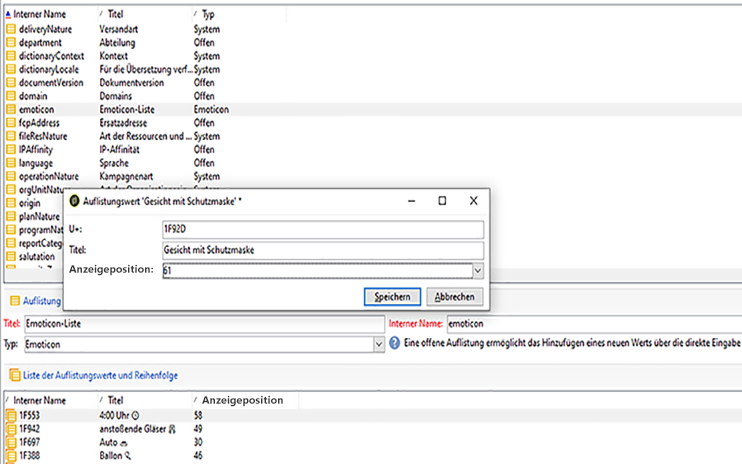

# Anpassen der Emoticon-Liste {#customize-emoticons}

Die im Popup angezeigte Emoticon-Liste wird von einer Auflistung gesteuert, mit der Sie Werte in einer Liste anzeigen können, um die Auswahl zu beschränken, die der Benutzer für ein bestimmtes Feld hat.
Die Emoticon Liste Reihenfolge kann angepasst werden, Sie können auch andere Emoticons zu Ihrer Liste hinzufügen.
Emoticons stehen für E-Mail und Push für weitere Informationen auf dieser [Seite](../../delivery/using/defining-the-email-content.md#inserting-emoticons)zur Verfügung.

## Hinzufügen eines neuen Emoticons {#add-new-emoticon}

>[!CAUTION]
>
>Die Emoticon-Liste kann nicht mehr als 81 Einträge anzeigen.

1. Wählen Sie Ihr neues Emoticon, das Sie von dieser [Seite](https://unicode.org/emoji/charts/full-emoji-list.html)hinzufügen möchten. Beachten Sie, dass es mit den verschiedenen Plattformen wie Browser und Betriebssystem kompatibel sein muss.

1. Wählen Sie im **[!UICONTROL Explorer]**&quot; **[!UICONTROL Administration]** &quot;> &quot; **[!UICONTROL Plattform]** &quot;> &quot; **[!UICONTROL Auflistungen]** &quot;und klicken Sie auf die vordefinierte **[!UICONTROL Emoticon-Liste]** -Auflistung.

   >[!NOTE]
   >
   >Vordefinierte Auflistungen können nur von einem Administrator Ihrer Adobe Campaign Classic-Konsole verwaltet werden.

   

1. Wählen Sie **[!UICONTROL Hinzufügen]** aus.

1. Füllen Sie die Felder aus:

   * **[!UICONTROL U+]**: Code Ihres neuen Emoticons. Die Liste der Emoticons finden Sie auf dieser [Seite](https://unicode.org/emoji/charts/full-emoji-list.html).
Um Kompatibilitätsprobleme zu vermeiden, empfehlen wir Ihnen, Emoticons auszuwählen, die in Browsern und in jedem Betriebssystem unterstützt werden.

   * **[!UICONTROL Beschriftung]**: Etikett Ihres neuen Emoticons.

   

1. Klicken Sie auf **[!UICONTROL OK]** und dann auf **[!UICONTROL Speichern]** , wenn Ihre Konfiguration abgeschlossen ist.
Ihr neues Emoticon wird automatisch in den Laden gelegt.

1. Um es im Fenster &quot;Emoticon **[!UICONTROL einfügen]** &quot;Ihrer Versand anzuzeigen, wählen Sie Ihr neu erstelltes Emoticon aus, indem Sie mit der Dublette darauf klicken.

1. Wählen Sie in der Dropdown-Liste **[!UICONTROL Anzeigereihenfolge]** aus, in welcher Reihenfolge das neue Emoticon angezeigt wird. Beachten Sie, dass durch Auswahl einer bereits zugewiesenen Anzeigereihenfolge das vorhandene Emoticon automatisch in den Store verschoben wird.

    In diesem Beispiel haben wir die Anzeigereihenfolge Nr. 61 gewählt, was bedeutet, dass ein Eintrag, der bereits diese Bestellung hatte, automatisch in den Shop verschoben wird und unser neuer Eintrag in der Liste Auflistung erfolgt.

   

1. Ihr neues Emoticon wurde nun zur vordefinierten Auflistung **[!UICONTROL Emoticon einfügen hinzugefügt]** . Sie können die **[!UICONTROL Anzeigereihenfolge]** jederzeit ändern oder in den Store verschieben, wenn Sie sie nicht mehr benötigen.

1. Damit Ihre Änderungen berücksichtigt werden, trennen Sie die Verbindung und stellen Sie dann die Verbindung von Adobe Campaign Classic wieder her. Wenn Ihr neues Emoticon immer noch nicht im Popup-Fenster &quot; **[!UICONTROL Emoticon]** einfügen&quot;angezeigt wird, müssen Sie möglicherweise Ihren Cache löschen. Weiterführende Informationen hierzu finden Sie in diesem [Abschnitt](../../platform/using/faq-campaign-config.md#perform-soft-cache-clear).

1. Ihr neues Emoticon finden Sie jetzt in Ihren Versänden im Popup-Fenster &quot; **[!UICONTROL Emoticon]** einfügen&quot;an der 61. Position, wie in den vorherigen Schritten konfiguriert. Weitere Informationen zur Verwendung von Emoticons in Ihren Versänden finden Sie auf dieser [Seite](../../delivery/using/defining-the-email-content.md#inserting-emoticons).

   

1. Wenn die folgenden Emoticons im Popup-Fenster &quot; **[!UICONTROL Emoticon]** einfügen&quot;angezeigt werden, bedeutet dies, dass sie nicht richtig konfiguriert wurden. Überprüfen Sie, ob Ihr **[!UICONTROL U+]** -Code oder Ihre **[!UICONTROL Anzeigereihenfolge]** in der **[!UICONTROL Emoticon-Liste]** korrekt ist.

   
