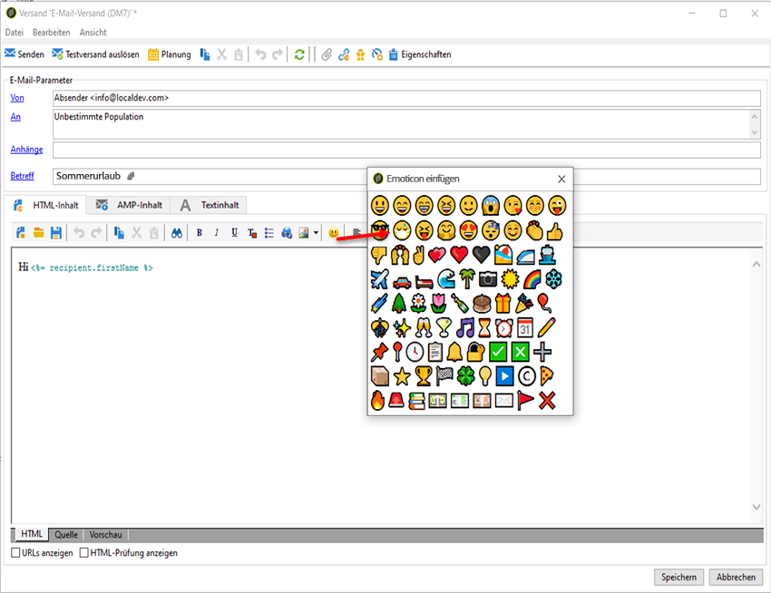

# Anpassen der Emoticon-Liste {#customize-emoticons}

Die im Popup angezeigte Emoticon-Liste wird von einer Auflistung gesteuert, mit der Sie Werte in einer Liste anzeigen können, um die Auswahl der Benutzer für ein bestimmtes Feld zu beschränken.
Die Reihenfolge der Emoticon-Liste kann angepasst werden; außerdem können Sie Ihrer Liste weitere Emoticons hinzufügen.
Emoticons sind bei E-Mail- und Push-Nachrichten verfügbar; weiterführende Informationen hierzu finden Sie auf dieser [Seite](../../delivery/using/defining-the-email-content.md#inserting-emoticons).

## Hinzufügen eines neuen Emoticons {#add-new-emoticon}

>[!CAUTION]
>
>Die Emoticon-Liste kann maximal 81 Einträge anzeigen.

1. Wählen Sie ein neues Emoticon, das Sie hinzufügen möchten, von dieser [Seite](https://unicode.org/emoji/charts/full-emoji-list.html). Beachten Sie, dass es mit den verschiedenen Plattformen wie Browser und Betriebssystem kompatibel sein muss.

1. Wählen Sie im **[!UICONTROL Explorer]** **[!UICONTROL Administration]** > **[!UICONTROL Plattform]** > **[!UICONTROL Auflistungen]** und klicken Sie auf die native Auflistung **[!UICONTROL Emoticon-Liste]**.

   >[!NOTE]
   >
   >Native Auflistungen können nur von einem Administrator Ihrer Adobe Campaign Classic Console verwaltet werden.

   

1. Wählen Sie **[!UICONTROL Hinzufügen]** aus.

1. Füllen Sie die Felder aus:

   * **[!UICONTROL U+]**: Code Ihres neuen Emoticons. Die Liste der Codes von Emoticons finden Sie auf dieser [Seite](https://unicode.org/emoji/charts/full-emoji-list.html).
Zur Vermeidung von Kompatibilitätsproblemen empfehlen wir Ihnen, Emoticons auszuwählen, die in Browsern und jedem Betriebssystem unterstützt werden.

   * **[!UICONTROL Titel]**: Bezeichnung für Ihr neues Emoticon.

   

1. Klicken Sie auf **[!UICONTROL OK]** und dann auf **[!UICONTROL Speichern]**, wenn Sie fertig mit der Konfiguration sind.
Ihr neues Emoticon wird automatisch im Speicher abgelegt.

1. Um es im Fenster **[!UICONTROL Emoticon einfügen]** Ihrer Sendungen anzuzeigen, wählen Sie das neu erstellte Emoticon aus, indem Sie darauf doppelklicken.

1. Wählen Sie in der Dropdown-Liste **[!UICONTROL Reihenfolge der Anzeige]** aus, in welcher Reihenfolge das neue Emoticon angezeigt werden soll. Beachten Sie, dass bei Auswahl einer bereits zugewiesenen Anzeigereihenfolge das vorhandene Emoticon automatisch in den Speicher verschoben wird.

    In diesem Beispiel haben wir die Anzeige Nr. 61 gewählt. Das bedeutet, dass ein vorhandener Eintrag an dieser Stelle automatisch in den Speicher verschoben wird und unser neuer Eintrag dessen Platz in der Auflistung einnimmt.

   

1. Ihr neues Emoticon wurde der nativen Auflistung **[!UICONTROL Emoticon einfügen]** hinzugefügt. Sie können seine **[!UICONTROL Reihenfolge der Anzeige]** jederzeit ändern oder das Emoticon in den Speicher verschieben, wenn Sie es nicht mehr benötigen.

1. Damit Ihre Änderungen wirksam werden, trennen Sie die Verbindung mit Adobe Campaign Classic und stellen Sie sie erneut her. Wenn Ihr neues Emoticon im Popup-Fenster **[!UICONTROL Emoticon einfügen]** immer noch nicht angezeigt wird, müssen Sie möglicherweise Ihren Cache löschen. Weiterführende Informationen hierzu finden Sie in diesem [Abschnitt](../../platform/using/faq-campaign-config.md#perform-soft-cache-clear).

1. Ihr neues Emoticon finden Sie in Ihren Sendungen jetzt im Popup-Fenster **[!UICONTROL Emoticon einfügen]** an der 61. Stelle (wie in den vorherigen Schritten konfiguriert). Weiterführende Informationen zur Verwendung von Emoticons in Ihren Sendungen finden Sie auf dieser [Seite](../../delivery/using/defining-the-email-content.md#inserting-emoticons).

   

1. Wenn die folgenden Emoticons im Popup-Fenster **[!UICONTROL Emoticon einfügen]** angezeigt werden, heißt das, dass sie nicht richtig konfiguriert wurden. Überprüfen Sie, ob Ihr **[!UICONTROL U+]**-Code oder die **[!UICONTROL Reihenfolge der Anzeige]** in der **[!UICONTROL Emoticon-Liste]** korrekt sind.

   
