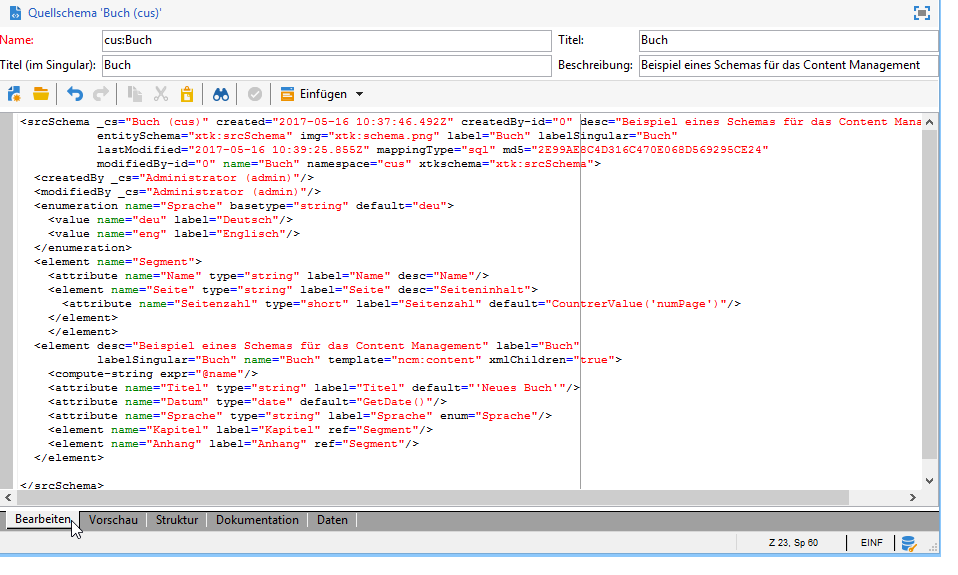

# Datenschemata{#data-schemas}

Im Folgenden werden einige Grundprinzipien bezüglich der Datenschemata in Adobe Campaign dargestellt.

Erstellung und Konfiguration von Datenschemata in Adobe Campaign werden in [diesem Abschnitt](../../configuration/using/about-schema-edition.md) beschrieben.

## Schemastruktur {#schema-structure}

Das XML-Dokument eines Datenschemas muss die Wurzel **`<srcschema>`** mit den Attributen **name** und **namespace** zur Angabe des Schemanamens und des Namensraums enthalten.

```
<srcSchema name="schema_name" namespace="namespace">
...
</srcSchema>
```

Der Startpunkt des Schemas ist sein Hauptelement. Es ist leicht identifizierbar, da sein Name mit dem des Schemas identisch ist. Außerdem handelt es sich um das direkte Kindelement der Wurzel. Ausgehend von diesem Element beginnt die Inhaltsbeschreibung.

In einem Content-Management-Schema entspricht das Hauptelement folgendem Muster:

```
<element name="book" template="ncm:content" xmlChildren="true">
```

Das Attribut **template** ermöglicht die Erweiterung des Schemas um die Eigenschaften, die in allen Inhaltsdefinitionen verwendet werden, wie z. B. Name, Erstellungsdatum, Autor, zugeordneter String usw.

Diese Eigenschaften werden im Schema **ncm:content** beschrieben.

>[!NOTE]
>
>Das Attribut **xmlChildren** zeigt, dass die ausgehend vom Hauptelement angegebene Datenstruktur in einem XML-Dokument der Inhaltsinstanz gespeichert ist.

>[!CAUTION]
>
>Beim Anlegen eines neuen Schemas oder bei einer Schema-Erweiterung müssen Sie für das gesamte Schema den gleichen Wert für die Primärschlüsselfolge (@pkSequence) beibehalten.

## Datentypen {#data-types}

Beispiel eines mit Datentypen komplettierten Content-Management-Schemas:

```
<srcSchema name="book" namespace="cus">
  <element name="book" template="ncm:content" xmlChildren="true">
    <attribute name="title" type="string"/>
    <attribute name="date" type="date"/>
    <attribute name="language" type="string"/>
    <element name="chapter">
      <attribute name="name" type="string"/>
      <element name="page" type="string>
        <attribute name="number" type="short"/>
      </element>
    </element>
  </element>
</element>
```

## Eigenschaften {#properties}

Verschiedene Eigenschaften können die Elemente (**`<element>`**) und (**`<attribute>`**) des Datenschemas ergänzen.

Im Content Management werden vor allem folgende Eigenschaften verwendet:

* **label**: kurze Beschreibung,
* **desc**: lange Beschreibung,
* **default**: Ausdruck, der bei der Inhaltserstellung einen Standardwert ausgibt,
* **userEnum**: freie Auflistung, die die im Feld eingegebenen Werte speichert und anzeigt,
* **enum**: Auflistung mit einer festgeschriebenen Werteliste.

Beispiel des um diese Eigenschaften ergänzten Schemas:

```
<srcSchema name="book" namespace="cus">
  <enumeration name="language" basetype="string" default="eng">    
    <value name="fra" label="French"/>    
    <value name="eng" label="English"/>   
  </enumeration>

  <element name="book" label="Book" desc="Example book" template="ncm:content" xmlChildren="true">
    <attribute name="title" type="string" label="Title" default="'New book'"/>
    <attribute name="date" type="date" default="GetDate()"/>
    <attribute name="language" type="string" label="Language" enum="language"/>
    <element name="chapter" label="Chapter">
      <attribute name="name" type="string" label="Name" desc="Name of chapter"/>
      <element name="page" type="string" label="Page" desc="Page content">
        <attribute name="number" type="short" label="Number" default="CounterValue('numPage')"/>
      </element>
    </element>
  </element>
</srcSchema>
```

## Kollektionselemente {#collection-elements}

Eine Kollektion ist eine Liste von Elementen mit gleichem Namen und auf gleicher Hierarchieebene.

In unserem Beispiel sind die Elemente **`<chapter>`** und **`<page>`** Kollektionselemente. Das Attribut **unbound** muss daher der Definition folgender Elemente hinzugefügt werden:

```
<element name="chapter" label="Chapter" unbound="true" ordered="true">
```

```
<element name="page" type="string" label="Page" desc="Content of page" unbound="true">
```

>[!NOTE]
>
>Das Attribut **ordered=&quot;true&quot;** ermöglicht die Sortierung der enthaltenen Kollektionselemente.

## Referenzierung von Elementen {#element-referencing}

Eine Referenzierung von Elementen wird in Inhaltsschemata häufig verwendet. Sie erlaubt es, die Definition eines **`<element>`**-Elements so zu aufzugliedern, dass andere Elemente mit derselben Struktur darauf verweisen können.

Das Attribut **ref** des zu referenzierenden Elements muss mit dem Pfad (XPath) des Referenz-Elements angegeben werden.

**Beispiel**: Hinzufügung eines Segments **Anhang**, welches die gleiche Struktur wie das Element **`<chapter>`** im Beispielschema aufweist.

```
<srcSchema name="book" namespace="cus">
  <element name="section">
    <attribute name="name" type="string" label="Name" desc="Name"/>
    <element name="page" type="string" label="Page" desc="Content of page">
      <attribute name="number" type="short" label="Number" default="CounterValue('numPage')"/>
    </element>

  <element name="book" label="Book" desc="Example book" template="ncm:content" xmlChildren="true">
    <attribute name="title" type="string" label="Title" default="'New book'"/>
    <attribute name="date" type="date" default="GetDate()"/>
    <attribute name="language" type="string" label="Language" enum="language"/>
    <element name="chapter" label="Chapter" ref="section"/>
    <element name="appendix" label="Appendix" ref="section"/>
  </element>
</srcSchema>
```

Die Struktur des Elements &quot;Kapitel&quot; wird in das Element mit Namen &quot;Segment&quot; ausgegliedert, welches außerhalb des Hauptelements liegt. Die Elemente &quot;Kapitel&quot; und &quot;Anhang&quot; referenzieren beide das Element &quot;Segment&quot;.

## Compute string {#compute-string}

Ein **Compute string** ist ein XPath-Ausdruck, der dazu verwendet wird, einen eine Inhaltsinstanz repräsentierenden String zu erzeugen.

Beispiel des zuvor verwendeten Schemas, ergänzt um einen **Compute string**:

```
<srcSchema name="book" namespace="cus">
  <element name="book" label="Book" desc="Example book" template="ncm:content" xmlChildren="true">
    <compute-string expr="@name"/>
    ...
  </element>
</srcSchema>
```

## Schemabearbeitung {#editing-schemas}

Der XML-Inhalt des Quellschemas wird im Editor erfasst:



Das Speichern des Quellschemas löst automatisch die Erzeugung des erweiterten Schemas aus.

>[!NOTE]
>
>Im Feld **Name** kann der Schemaschlüssel - bestehend aus Name und Namensraum - erfasst werden. Die Attribute **name** und **namespace** der Wurzel werden automatisch im XML-Editor des Schemas aktualisiert.
