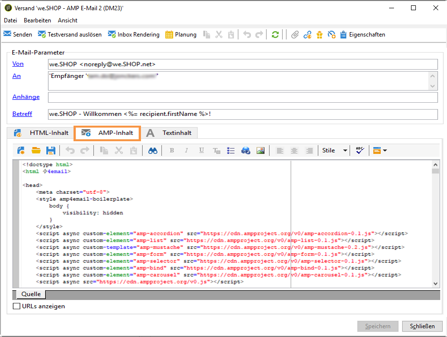
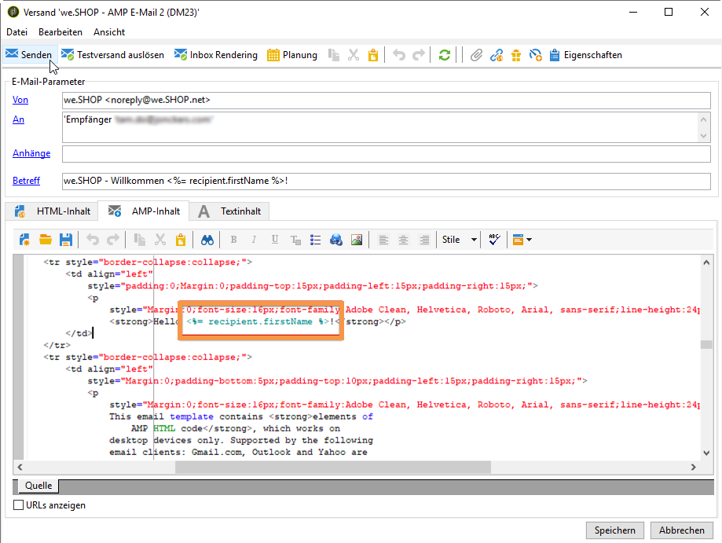
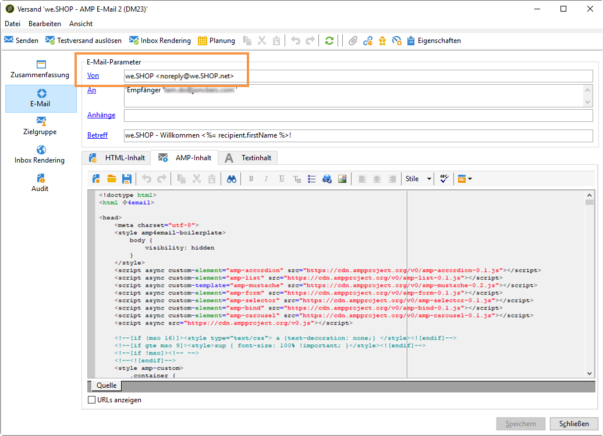

# Interaktive Inhalte definieren{#defining-interactive-content}

Mit Adobe Campaign können Sie das neue interaktive Format [AMP für E-Mail](https://amp.dev/about/email/) testen, das unter bestimmten Bedingungen das Senden dynamischer E-Mails ermöglicht.

Derzeit können Sie mit AMP für E-Mail Folgendes tun:
* den Versand von AMP-E-Mails nur an bestimmten, entsprechend konfigurierten Adressen testen.
* AMP-E-Mails an Adressen von Gmail, Outlook oder Mail.ru senden, nachdem Sie sich bei den entsprechenden Anbietern registriert haben.

Weiterführende Informationen zum Testen und Senden von AMP-E-Mails finden Sie unter [Zielgruppenbestimmung für eine AMP-E-Mail](#targeting-amp-email).

Diese Funktion ist über ein dediziertes Package in Adobe Campaign verfügbar. Damit Sie es verwenden können, muss dieses Package installiert sein. Starten Sie nach Abschluss des Vorgangs den Server neu, damit das Package berücksichtigt wird.

>[!NOTE]
>
> Bei hybriden und gehosteten Architekturen muss das Paket auf allen Servern installiert werden, einschließlich [Mid-Sourcing-Server](../../installation/using/mid-sourcing-server.md) und [Ausführungsinstanz](../../message-center/using/creating-a-shared-connection.md#execution-instance). Wenden Sie sich diesbezüglich an Ihren Kundenbetreuer.

## Informationen zu AMP for Email {#about-amp-for-email}

Das neue Format **AMP for Email** ermöglicht es, AMP-Komponenten in Nachrichten einzuschließen, um das E-Mail-Erlebnis mit komplexen und aktionsbezogenen Inhalten zu verbessern. Über moderne App-Funktionen, die direkt in E-Mails verfügbar sind, können Empfänger dynamisch mit Inhalten in der Nachricht selbst interagieren.

Beispiel:
* Mit AMP geschriebene E-Mails können interaktive Elemente wie Bilderkarussells enthalten.
* Der Inhalt in der Nachricht bleibt auf dem neuesten Stand.
* Die Empfänger können beispielsweise auf ein Formular reagieren, ohne den Posteingang verlassen zu müssen.

AMP for Email ist mit vorhandenen E-Mails kompatibel. Die AMP-Version der Nachricht wird als neuer MIME-Teil in die E-Mail eingebettet, zusätzlich zu HTML und/oder Nur-Text, sodass die Kompatibilität bei allen E-Mail-Clients gewährleistet ist.

Weitere Informationen zum AMP for Email-Format, Spezifikationen und Anforderungen finden Sie in der [AMP-Entwicklerdokumentation](https://amp.dev/documentation/guides-and-tutorials/learn/email-spec/amp-email-format/?format=email).

 [Entdecken Sie diese Funktion im Video](#amp-email-video).

## Wichtige Schritte bei der Verwendung von AMP for Email mit Adobe Campaign {#key-steps-to-use-amp}

Gehen Sie wie folgt vor, um mit Adobe Campaign erfolgreich eine AMP-E-Mail zu testen und zu senden:
1. Installieren Sie das Package **[!UICONTROL AMP-Support]**. Siehe [Installieren von Campaign Standard-Packages](../../installation/using/installing-campaign-standard-packages.md).
1. Erstellen Sie eine E-Mail und erzeugen Sie Ihren AMP-Inhalt in Adobe Campaign. Siehe [Erstellen von AMP-E-Mail-Inhalten mit Adobe Campaign](#build-amp-email-content).
1. Vergewissern Sie sich, dass Sie alle Versandanforderungen der E-Mail-Anbieter, die das AMP-Format unterstützen, befolgen. Siehe [AMP for Email-Versandanforderungen](#amp-for-email-delivery-requirements).
1. Stellen Sie beim Definieren Ihrer Zielgruppe sicher, dass Sie Empfänger auswählen, die das AMP-Format anzeigen können. Siehe [Zielgruppenbestimmung für eine AMP-E-Mail](#targeting-amp-email).

   >[!NOTE]
   >
   >Derzeit können Sie AMP-E-Mails nur an [bestimmte E-Mail-Adressen](#testing-amp-delivery-for-selected-addresses) (zu Testzwecken) oder nach der [Registrierung](#delivering-amp-emails-by-registering) mit den unterstützten E-Mail-Clients senden.

1. Senden Sie Ihre E-Mail wie gewohnt. Siehe [Senden einer AMP-E-Mail](#sending-amp-email).

## Erstellen von AMP-E-Mail-Inhalten in Adobe Campaign {#build-amp-email-content}

Gehen Sie wie unten beschrieben vor, um eine E-Mail im AMP-Format zu erstellen.

>[!IMPORTANT]
>
>Achten Sie darauf, dass Sie die in der [AMP-Entwicklerdokumentation](https://amp.dev/documentation/guides-and-tutorials/learn/email_fundamentals/?format=email) beschriebenen AMP-Anforderungen und -Spezifikationen befolgen. Sie können auch die [AMP for Email-Best Practices](https://amp.dev/documentation/guides-and-tutorials/develop/amp_email_best_practices/?format=email) konsultieren.

1. Wählen Sie beim Erstellen Ihres E-Mail-Versands eine beliebige Vorlage aus.

   >[!NOTE]
   >
   >Eine bestimmte AMP-Vorlage enthält ein Beispiel für die Hauptfunktionen, die Sie verwenden können: Produktliste, Karussell, doppelte Anmeldung, Umfrage und erweiterte Server-Anfrage.

1. Klicken Sie auf den Tab **[!UICONTROL AMP-Inhalt]**.

   

1. Bearbeiten Sie den AMP-Inhalt entsprechend Ihren Anforderungen.

   >[!NOTE]
   >
   >Weitere Informationen zum Erstellen Ihrer ersten AMP-E-Mail finden Sie in der [AMP-Entwicklerdokumentation](https://amp.dev/documentation/guides-and-tutorials/start/create_email/?format=email).

   Beispielsweise können Sie die Produktlistenkomponente aus der AMP-Vorlage verwenden und eine Liste der Produkte aus einem Drittanbietersystem oder auch innerhalb von Adobe Campaign verwalten. Wenn Sie einen Preis oder ein anderes Element anpassen, wird die Änderung automatisch angezeigt, wenn der Empfänger die E-Mail erneut über sein Postfach öffnet.

1. Personalisieren Sie Ihren AMP-Inhalt nach Bedarf, wie Sie es normalerweise mit dem HTML-Format in Adobe Campaign tun würden, mithilfe von Personalisierungsfeldern und Gestaltungsbausteinen.

   

1. Nachdem Sie die Bearbeitung abgeschlossen haben, wählen Sie den gesamten AMP-Inhalt aus und kopieren Sie ihn in den Web-basierten [AMP-Validator](https://validator.ampproject.org) oder eine ähnliche Website.

   >[!NOTE]
   >
   >Wählen Sie **AMP4 EMAIL** aus der Dropdown-Liste oben im Bildschirm.

   

   Alle Fehler werden inline gekennzeichnet.

   >[!NOTE]
   >
   >Der Adobe Campaign AMP-Editor ist nicht für die Inhaltsvalidierung vorgesehen. Verwenden Sie eine externe Website, z. B. den Web-basierten [AMP-Validator](https://validator.ampproject.org), um zu prüfen, ob Ihre Inhalte korrekt sind.

1. Nehmen Sie die erforderlichen Änderungen vor, bis der AMP-Inhalt die Validierung besteht.

   

1. Kopieren Sie Ihre validierten Inhalte in [AMP Playground](https://playground.amp.dev) oder eine ähnliche Website, um eine Vorschau Ihrer Inhalte anzuzeigen.

   >[!NOTE]
   >
   >Stellen Sie sicher, dass Sie in der Dropdown-Liste oben im Bildschirm **AMP for Email** auswählen.

   

   >[!NOTE]
   >
   >Sie können die Vorschau Ihrer AMP-Inhalte nicht direkt in Adobe Campaign anzeigen. Verwenden Sie eine externe Website wie [AMP Playground](https://playground.amp.dev).

1. Gehen Sie zurück zu Adobe Campaign und kopieren Sie den validierten Inhalt in den Tab **[!UICONTROL AMP-Inhalt]**.

1. Wechseln Sie zum Tab **[!UICONTROL HTML-Inhalt]** oder **[!UICONTROL Textinhalt]** und definieren Sie Inhalte für mindestens eines dieser beiden Formate.

   >[!IMPORTANT]
   >
   >Wenn Ihre E-Mail neben dem AMP-Inhalt keine HTML- oder Nur-Text-Version enthält, kann sie nicht gesendet werden.

## AMP for Email-Versandanforderungen {#amp-for-email-delivery-requirements}

Beim Erstellen Ihres AMP-Inhalts in Adobe Campaign müssen Sie die Bedingungen für den Versand einer dynamischen E-Mail erfüllen, die je nach E-Mail-Anbieter Ihrer Empfänger gelten.

Derzeit unterstützen drei E-Mail-Anbieter Tests in diesem Format: Gmail, Outlook und Mail.ru.

Alle Schritte und Spezifikationen, die zum Testen des Versands mit dem AMP-Format in Gmail-Konten erforderlich sind, werden in der entsprechenden [Gmail](https://developers.google.com/gmail/ampemail?), [Outlook](https://docs.microsoft.com/en-gb/outlook/amphtml/)- und [Mail.ru](https://postmaster.mail.ru/amp)-Entwicklerdokumentation beschrieben.

Insbesondere müssen folgende Anforderungen erfüllt sein:
* Befolgen Sie die jeweiligen AMP-Sicherheitsanforderungen für [Gmail](https://developers.google.com/gmail/ampemail/security-requirements), [Outlook](https://docs.microsoft.com/en-gb/outlook/amphtml/security-requirements) und [Mail.ru](https://postmaster.mail.ru/amp/?lang=en#howto).
* Der AMP-MIME-Teil muss ein [gültiges AMP-Dokument](https://amp.dev/documentation/guides-and-tutorials/learn/validation-workflow/validate_emails/?format=email) enthalten.
* Der AMP-MIME-Teil muss kleiner als 100 KB sein.

Sie können auch die [Tipps und bekannten Einschränkungen für Gmail](https://developers.google.com/gmail/ampemail/tips) und die [AMP-Best Practices für Outlook](https://docs.microsoft.com/en-gb/outlook/amphtml/best-practices) konsultieren.

## Zielgruppenbestimmung für eine AMP-E-Mail {#targeting-amp-email}

Derzeit können Sie das Senden einer AMP-E-Mail in zwei Schritten testen:

1. Mit Adobe Campaign können Sie den Versand einer dynamischen AMP-E-Mail an ausgewählte E-Mail-Adressen, die entsprechend konfiguriert wurden, testen, um deren Inhalt und Verhalten zu überprüfen. Siehe [Testen des AMP-E-Mail-Versands für ausgewählte Adressen](#testing-amp-delivery-for-selected-addresses).

1. Nach dem Test können Sie einen Versand oder eine Kampagne als Teil des AMP für E-Mail-Programms senden, indem Sie sich bei den entsprechenden E-Mail-Anbietern registrieren und Ihre Absender-Domain auf die Zulassungsliste setzen lassen. Siehe [Senden von AMP-E-Mails durch Registrierung bei einem E-Mail-Anbieter](#delivering-amp-emails-by-registering).

### Testen des AMP-E-Mail-Versands für ausgewählte Adressen {#testing-amp-delivery-for-selected-addresses}

Sie können das Senden dynamischer Nachrichten von Adobe Campaign an ausgewählte E-Mail-Adressen testen.

>[!NOTE]
>
>Zurzeit unterstützen nur Gmail, Outlook und Mail.ru ein Testen des AMP-Formats.

Für Gmail und Outlook müssen Sie zunächst die Absenderadressen auf die Zulassungsliste setzen, die Sie verwenden, um einen Versand über Adobe Campaign an die gewünschten Gmail- und Outlook-Zielkonten durchzuführen.

Gehen Sie dazu wie folgt vor:
1. Stellen Sie sicher, dass die Option zum Aktivieren dynamischer E-Mail bei den entsprechenden E-Mail-Anbietern aktiviert ist.
1. Kopieren Sie die im Feld **[!UICONTROL Von]** des Versands angezeigte Absenderadresse und fügen Sie sie in den entsprechenden Bereich der Kontoeinstellungen Ihres E-Mail-Anbieters ein.

Weiterführende Informationen finden Sie in der [Gmail](https://developers.google.com/gmail/ampemail/testing-dynamic-email)- und [Outlook](https://docs.microsoft.com/en-gb/outlook/amphtml/register-outlook#individual-mailbox-registration)-Entwicklerdokumentation.

Gehen Sie zum Testen des Versands einer AMP-E-Mail an eine Mail.ru-Adresse wie in der [Mail.ru](https://postmaster.mail.ru/amp/?lang=en#howto)-Entwicklerdokumentation beschrieben vor (Abschnitt **Wenn Sie ein Benutzer sind**).

### Versand von AMP-E-Mails durch Registrierung bei einem E-Mail-Anbieter {#delivering-amp-emails-by-registering}

Sie können mit dem Versand dynamischer E-Mails experimentieren, indem Sie sich bei den unterstützten E-Mail-Anbietern registrieren, um Ihre Absender-Domain der Zulassungsliste hinzufügen zu lassen.

>[!NOTE]
>
>Zurzeit unterstützen nur Gmail, Outlook und Mail.ru das AMP-Format.

Nach einem Test mit wenigen Adressen können Sie AMP-E-Mails an beliebige Gmail- oder Outlook-Adressen senden. Dazu müssen Sie sich bei Google oder Microsoft registrieren und auf deren Antwort warten. Befolgen Sie die Schritte, die in der [Gmail](https://developers.google.com/gmail/ampemail/register)- und [Outlook](https://docs.microsoft.com/en-gb/outlook/amphtml/register-outlook#global-registration)-Entwicklerdokumentation beschrieben werden. Nach erfolgreicher Registrierung werden Sie autorisierter Absender.

Um AMP-E-Mails an Mail.ru-Adressen zu senden, befolgen Sie die in der [Mail.ru-Entwicklerdokumentation](https://postmaster.mail.ru/amp/?lang=en#howto) aufgelisteten Anforderungen und Schritte (Abschnitt **Wenn Sie ein E-Mail-Absender sind**).

## Senden einer AMP-E-Mail {#sending-amp-email}

Sobald Ihr AMP-Inhalt und Fallback fertig sind und Sie ein kompatibles Ziel definiert haben, können Sie die E-Mail wie gewohnt senden.

Derzeit unterstützen nur Gmail, Outlook und Mail.ru das AMP-Format (unter bestimmten Bedingungen). Sie können Adressen von anderen E-Mail-Anbietern als Ziele auswählen; sie werden jedoch die HTML- oder Textversion Ihrer E-Mail erhalten.

>[!IMPORTANT]
>
>Wenn Ihre E-Mail neben dem AMP-Inhalt keine HTML- oder Nur-Text-Version enthält, kann sie nicht gesendet werden.

Bei passenden Empfängern wird die AMP-Version der E-Mail in ihrem Postfach angezeigt.

Wenn Sie beispielsweise eine Produktliste in Ihrer E-Mail eingefügt haben und die Preise in einem Drittanbietersystem bearbeiten, werden die Preise automatisch angepasst, sobald diese Empfänger die E-Mail in ihrem Postfach erneut öffnen.

>[!NOTE]
>
>Sie können eine E-Mail-Verarbeitungsregel erstellen, um zu verhindern, dass bestimmte Domains AMP-E-Mails empfangen. Siehe [Verwalten von E-Mail-Formaten](../../installation/using/email-deliverability.md#managing-email-formats).
>
>Standardmäßig ist die Option **[!UICONTROL AMP-Einbindung]** auf **[!UICONTROL Nein]** gesetzt.

## Aktivieren und Verwenden von AMP für E-Mails {#amp-email-video}

Im folgenden Video wird erläutert, wie Sie AMP in Adobe Campaign Classic aktivieren und nutzen können.

>[!VIDEO](https://video.tv.adobe.com/v/29940?quality=12&learn=on&captions=ger)
