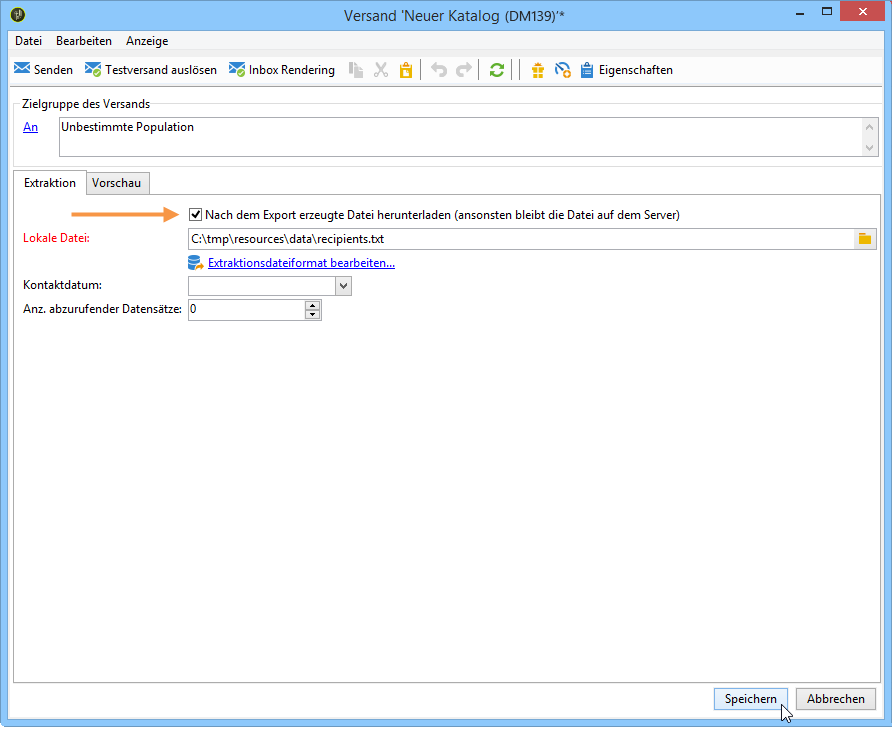
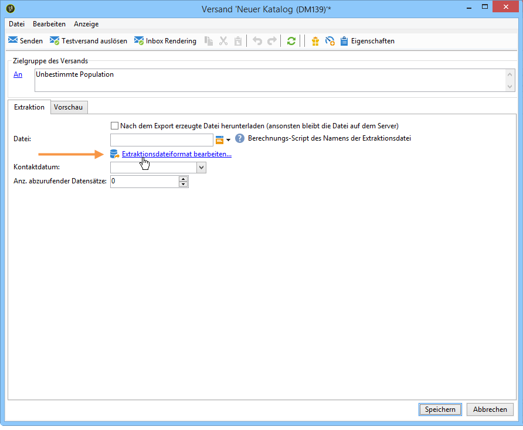
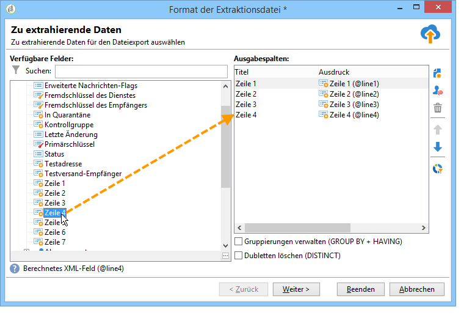

# Briefpost-Inhalt definieren{#defining-the-direct-mail-content}

## Extraktionsdatei {#extraction-file}

Im Feld **[!UICONTROL Datei]** ist der Name der die extrahierten Daten enthaltenden Datei anzugeben. Die Schaltfläche rechts ermöglicht die Verwendung von Personalisierungsfeldern, um den Namen zu erstellen.

Standardmäßig wird die Extraktionsdatei auf dem Server erstellt und gespeichert. Sie können sie jedoch auch lokal auf Ihrem Rechner speichern, indem Sie die Option **[!UICONTROL Nach dem Export erzeugte Datei herunterladen]** ankreuzen. In diesem Fall sind der Pfad zum lokalen Speicherverzeichnis und der Dateiname anzugeben.

Bei einem Briefversand wird der Extraktionsinhalt über den Link **[!UICONTROL Extraktionsdateiformat bearbeiten...]** konfiguriert.

Über diesen Link gelangen Sie in den Extraktions-Assistenten, mit dessen Hilfe die zu exportierenden Daten (Spalten) festgelegt werden.

Sie haben die Möglichkeit, eine personalisierte URL in die Extraktionsdatei einzufügen. Lesen Sie diesbezüglich das [Webfunktionen](../../web/using/publishing-a-web-form.md)-Handbuch.

>[!NOTE]
>
>Die Schritte des Assistenten entsprechen denen des im Abschnitt [Erste Schritte](../../platform/using/exporting-data.md#export-wizard) beschriebenen Export-Assistenten.
