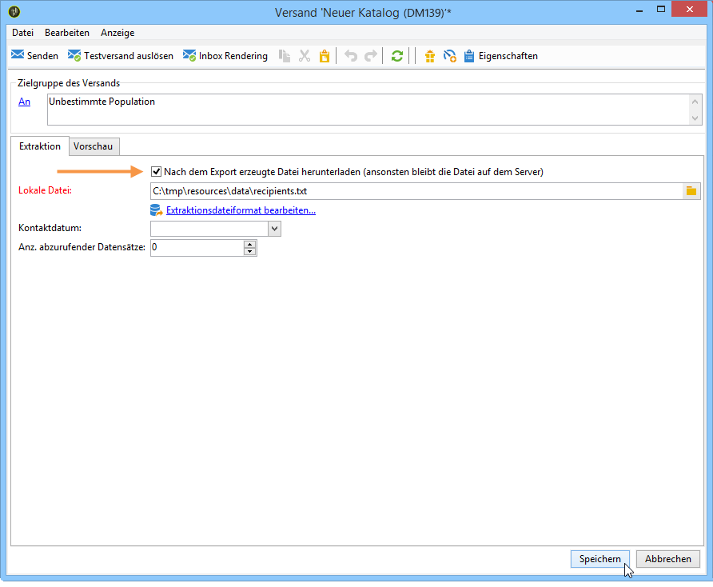
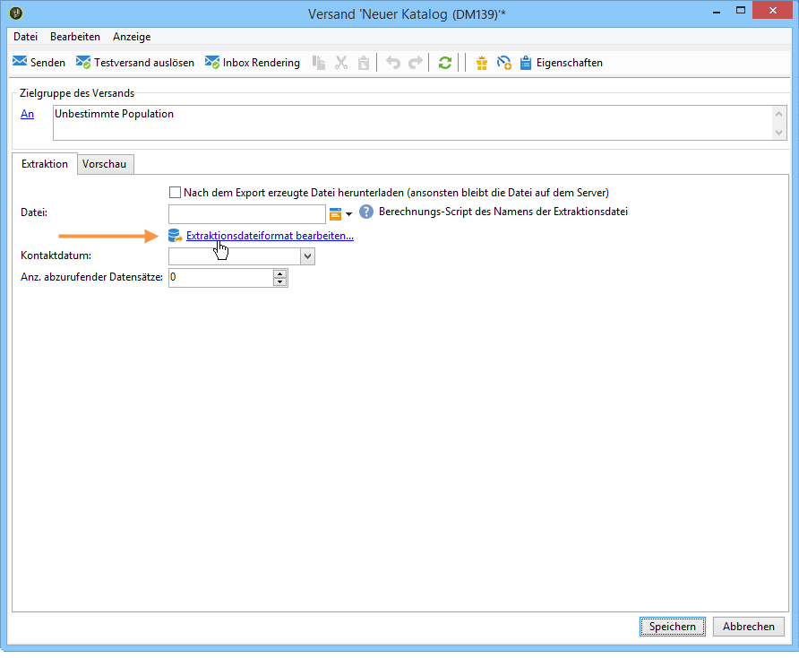
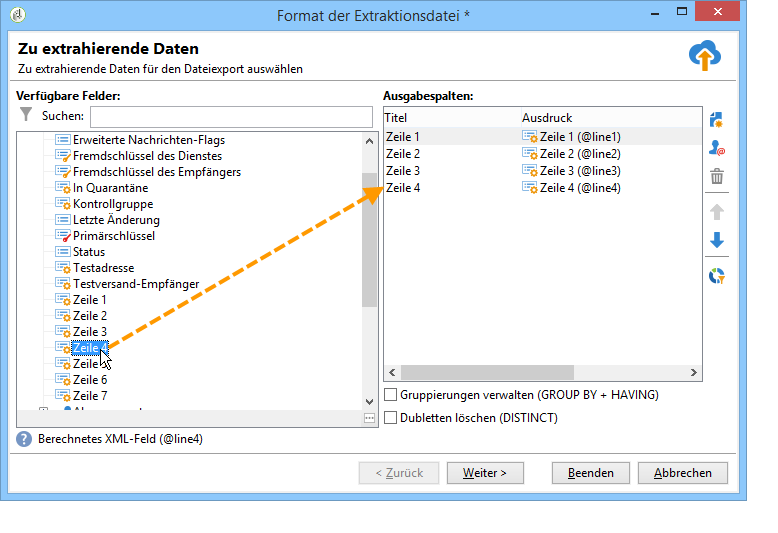

# Definieren des Direkt-Mail-Inhalts{#defining-the-direct-mail-content}

## Extraktionsdatei {#extraction-file}

Der Name der Datei, die die extrahierten Daten enthält, wird im Feld **[!UICONTROL Datei]** definiert. Über die Schaltfläche rechts neben dem Feld können Sie Personalisierungsfelder verwenden, um den Dateinamen zu erstellen.

Standardmäßig wird die Extraktionsdatei erstellt und auf dem Server gespeichert. Sie können es auf Ihrem Computer speichern. Um dies zu tun, aktivieren Sie die Option **[!UICONTROL Nach dem Export erzeugte Datei herunterladen]**. In diesem Fall sind der Pfad zum lokalen Speicherverzeichnis und der Dateiname anzugeben.

Bei einem Briefpost-Versand wird der Extraktionsinhalt über den Link **[!UICONTROL Extraktionsdateiformat bearbeiten...]** konfiguriert.

Über diesen Link gelangen Sie in den Extraktions-Assistenten, mit dessen Hilfe die zu exportierenden Daten (Spalten) festgelegt werden.

Sie können eine personalisierte URL in die Extraktionsdatei einfügen. Weiterführende Informationen hierzu finden Sie in [diesem Abschnitt](../../web/using/publishing-a-web-form.md).

>[!NOTE]
>
>Die Schritte des Assistenten entsprechen denen des im Abschnitt [Erste Schritte](../../platform/using/executing-export-jobs.md) beschriebenen Export-Assistenten.
