<?xml version="1.0" encoding="UTF-8"?>
<xliff xmlns="urn:oasis:names:tc:xliff:document:1.2" xmlns:okp="okapi-framework:xliff-extensions" xmlns:its="http://www.w3.org/2005/11/its" xmlns:itsxlf="http://www.w3.org/ns/its-xliff/" version="1.2" its:version="2.0">
<file original="help/delivery/using/defining-the-email-content.md.mdsc" source-language="en-US" target-language="en-XX" datatype="x-text/markdown">
<body>
<trans-unit id="tu33" xml:space="preserve">
<source xml:lang="en-US">https://experienceleague.adobe.com/de/docs/control-panel/using/instances-settings/url-permissions</source>
<target xml:lang="en-XX">https://experienceleague.adobe.com/de/docs/control-panel/using/instances-settings/url-permissions</target>
</trans-unit>
<trans-unit id="tu59" xml:space="preserve">
<source xml:lang="en-US">https://amp.dev/about/email/</source>
<target xml:lang="en-XX">https://amp.dev/de/about/email/</target>
</trans-unit>
<trans-unit id="tu61" xml:space="preserve">
<source xml:lang="en-US">https://experienceleague.adobe.com/docs/campaign/campaign-v8/send/emails/defining-interactive-content.html?lang=de</source>
<target xml:lang="en-XX">https://experienceleague.adobe.com/docs/campaign/campaign-v8/send/emails/defining-interactive-content.html?lang=de</target>
</trans-unit>
<trans-unit id="tu1" restype="x-YAML_METADATA_HEADER_VALUE" xml:space="preserve">
<source xml:lang="en-US">Define the email content in Adobe Campaign Classic</source>
<target xml:lang="en-XX">Definieren des E-Mail-Inhalts in Adobe Campaign Classic</target>
</trans-unit>
<trans-unit id="tu2" restype="x-YAML_METADATA_HEADER_VALUE" xml:space="preserve">
<source xml:lang="en-US">Learn how to define the email content when using Adobe Campaign</source>
<target xml:lang="en-XX">Hier erfahren Sie, wie Sie mit Adobe Campaign den E-Mail-Inhalt definieren können.</target>
</trans-unit>
<trans-unit id="tu3" xml:space="preserve">
<source xml:lang="en-US">Also applies to v8</source>
<target xml:lang="en-XX">Gilt auch für v8</target>
</trans-unit>
<trans-unit id="tu4" xml:space="preserve">
<source xml:lang="en-US">Also applies to Campaign v8</source>
<target xml:lang="en-XX">Gilt auch für Campaign v8</target>
</trans-unit>
<trans-unit id="tu5" xml:space="preserve">
<source xml:lang="en-US">Define the email content</source>
<target xml:lang="en-XX">Definieren des E-Mail-Inhalts</target>
</trans-unit>
<trans-unit id="tu6" xml:space="preserve">
<source xml:lang="en-US">Sender</source>
<target xml:lang="en-XX">Absender</target>
</trans-unit>
<trans-unit id="tu7" xml:space="preserve">
<source xml:lang="en-US">To define the name and address of the sender which will appear in the header of messages sent, click the <ph id="1" ctype="x-STRONG_EMPHASIS">**[!UICONTROL </ph>From<ph id="3" ctype="x-LINK_REF">]**</ph> link.</source>
<target xml:lang="en-XX">Klicken Sie auf <ph id="1" ctype="x-STRONG_EMPHASIS">**[!UICONTROL </ph>Von<ph id="3" ctype="x-LINK_REF">]**</ph>, um den Namen und die Adresse des Absenders zu konfigurieren.</target>
</trans-unit>
<trans-unit id="tu8" xml:space="preserve">
<source xml:lang="en-US"><ph id="1" ctype="x-IMAGE">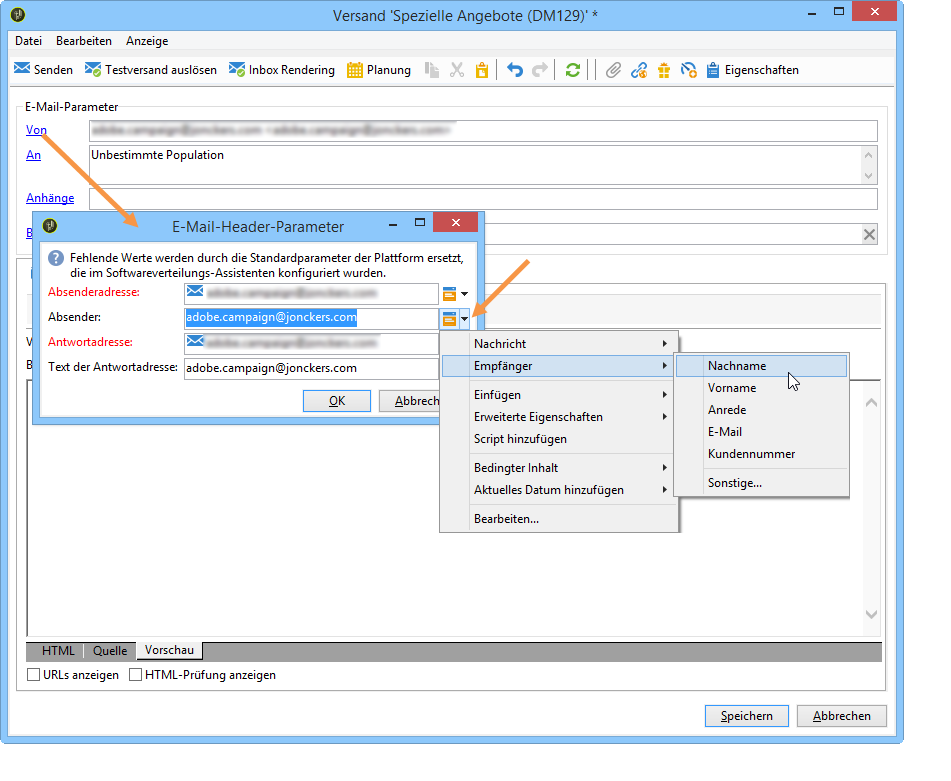</ph></source>
<target xml:lang="en-XX"><ph id="1" ctype="x-IMAGE"></ph></target>
</trans-unit>
<trans-unit id="tu9" xml:space="preserve">
<source xml:lang="en-US">This window lets you enter all the information required to create the email message headers. This information can be personalized. To do this, use the buttons to the right of the input fields to insert personalization fields.</source>
<target xml:lang="en-XX">In diesem Fenster können Sie alle Informationen eingeben, die für das Erstellen von E-Mail-Nachrichten-Headern erforderlich sind. Diese Informationen können personalisiert werden. Verwenden Sie dazu die Schaltflächen rechts neben den Eingabefeldern, um Personalisierungsfelder einzufügen.</target>
</trans-unit>
<trans-unit id="tu10" xml:space="preserve">
<source xml:lang="en-US">To find out how to insert and use personalization fields, refer to <ph id="1" ctype="x-LINK">[</ph>About personalization<ph id="2" ctype="x-LINK">](about-personalization.md)</ph> section.</source>
<target xml:lang="en-XX">Informationen zum Einfügen und Verwenden von Personalisierungsfeldern finden Sie im Abschnitt <ph id="1" ctype="x-LINK">[</ph>Über die Personalisierung<ph id="2" ctype="x-LINK">](about-personalization.md)</ph>.</target>
</trans-unit>
<trans-unit id="tu11" xml:space="preserve">
<source xml:lang="en-US"><ph id="1" ctype="x-regxph" equiv-text="&lbrack;!NOTE">[!NOTE]</ph></source>
<target xml:lang="en-XX"><ph id="1" ctype="x-regxph" equiv-text="&lbrack;!NOTE">[!NOTE]</ph></target>
</trans-unit>
<trans-unit id="tu12" xml:space="preserve">
<source xml:lang="en-US">The sender's address is used for replies by default.</source>
<target xml:lang="en-XX">Die Absenderadresse wird standardmäßig auch als Antwortadresse verwendet.</target>
</trans-unit>
<trans-unit id="tu13" xml:space="preserve">
<source xml:lang="en-US">The header parameters must not be empty. By default, they contain the values input when configuring the deployment wizard. Learn more in <ph id="1" ctype="x-LINK">[</ph>this section<ph id="2" ctype="x-LINK">](../../installation/using/deploying-an-instance.md)</ph>.</source>
<target xml:lang="en-XX">Header-Parameter dürfen nicht leer sein. Standardmäßig enthalten Sie die Werte, die beim Konfigurieren des Bereitstellungsassistenten eingegeben werden. Weiterführende Informationen finden Sie in <ph id="1" ctype="x-LINK">[</ph>diesem Abschnitt<ph id="2" ctype="x-LINK">](../../installation/using/deploying-an-instance.md)</ph>.</target>
</trans-unit>
<trans-unit id="tu14" xml:space="preserve">
<source xml:lang="en-US">The sender's address is mandatory to allow an email to be sent (RFC standard).</source>
<target xml:lang="en-XX">Die Angabe der Absenderadresse ist für den E-Mail-Versand zwingend erforderlich (gemäß RFC-Standard).</target>
</trans-unit>
<trans-unit id="tu15" xml:space="preserve">
<source xml:lang="en-US">Adobe Campaign checks the syntax of email addresses entered.</source>
<target xml:lang="en-XX">Adobe Campaign führt eine Syntax-Prüfung der angegebenen E-Mail-Adressen durch.</target>
</trans-unit>
<trans-unit id="tu16" xml:space="preserve">
<source xml:lang="en-US"><ph id="1" ctype="x-regxph" equiv-text="&lbrack;!CAUTION">[!CAUTION]</ph></source>
<target xml:lang="en-XX"><ph id="1" ctype="x-regxph" equiv-text="&lbrack;!CAUTION">[!CAUTION]</ph></target>
</trans-unit>
<trans-unit id="tu17" xml:space="preserve">
<source xml:lang="en-US">To avoid deliverability issues, the email accounts that correspond to the addresses specified for deliveries and replies must exist and must be monitored. Check with your system administrator.</source>
<target xml:lang="en-XX">Um Probleme mit der Zustellbarkeit zu vermeiden, müssen die E-Mail-Konten vorhanden sein und überwacht werden, die den für Sendungen und Antworten angegebenen Adressen entsprechen. Wenden Sie sich an Ihre Systemadministratorin bzw. Ihren Systemadministrator.</target>
</trans-unit>
<trans-unit id="tu18" xml:space="preserve">
<source xml:lang="en-US">Message subject</source>
<target xml:lang="en-XX">Nachrichtenbetreff</target>
</trans-unit>
<trans-unit id="tu19" xml:space="preserve">
<source xml:lang="en-US">The subject of the message is configured in the corresponding field. You can enter it directly in the field or click the <ph id="1" ctype="x-STRONG_EMPHASIS">**[!UICONTROL </ph>Subject<ph id="3" ctype="x-LINK_REF">]**</ph> link to enter a script. The personalization link lets you insert database fields in the subject.</source>
<target xml:lang="en-XX">Der Betreff der Nachricht wird im gleichnamigen Feld konfiguriert. Sie können ihn direkt im Feld eingeben oder auf den Link <ph id="1" ctype="x-STRONG_EMPHASIS">**[!UICONTROL </ph>Betreff<ph id="3" ctype="x-LINK_REF">]**</ph> klicken, um ein Script zu erfassen. Die Personalisierungsschaltfläche ermöglicht die Einfügung eines Datenbankfeldes.</target>
</trans-unit>
<trans-unit id="tu20" xml:space="preserve">
<source xml:lang="en-US"><ph id="1" ctype="x-regxph" equiv-text="&lbrack;!IMPORTANT">[!IMPORTANT]</ph></source>
<target xml:lang="en-XX"><ph id="1" ctype="x-regxph" equiv-text="&lbrack;!IMPORTANT">[!IMPORTANT]</ph></target>
</trans-unit>
<trans-unit id="tu21" xml:space="preserve">
<source xml:lang="en-US">The message subject is mandatory.</source>
<target xml:lang="en-XX">Die Angabe des Betreffs der Nachricht ist zwingend erforderlich.</target>
</trans-unit>
<trans-unit id="tu22" xml:space="preserve">
<source xml:lang="en-US"><ph id="1" ctype="x-IMAGE">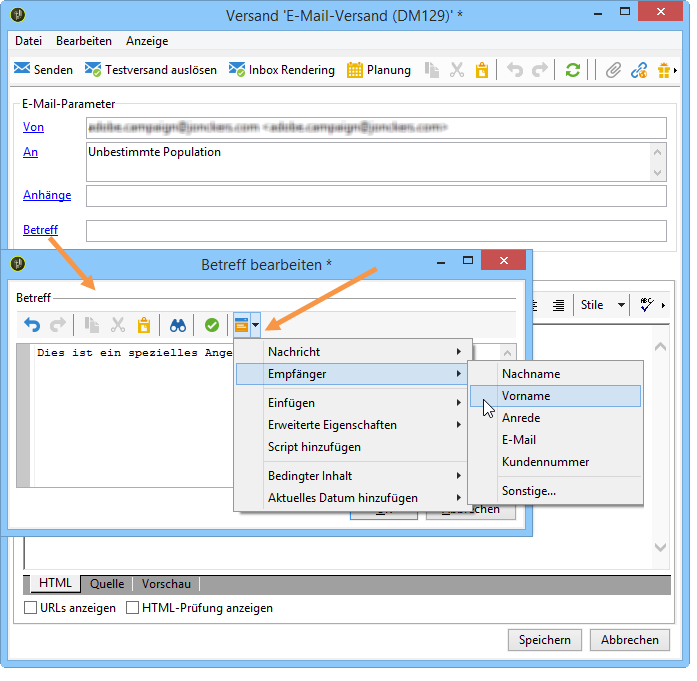</ph></source>
<target xml:lang="en-XX"><ph id="1" ctype="x-IMAGE"></ph></target>
</trans-unit>
<trans-unit id="tu23" xml:space="preserve">
<source xml:lang="en-US">The field content will be replaced by the value in the recipient profile when the message is sent.</source>
<target xml:lang="en-XX">Der Inhalt von Personalisierungsfeldern wird beim Versand der Nachrichten durch die im Empfängerprofil gespeicherten Werte ersetzt.</target>
</trans-unit>
<trans-unit id="tu24" xml:space="preserve">
<source xml:lang="en-US">For example, in the message above, the subject of the message is personalized for each recipient with data from their profile.</source>
<target xml:lang="en-XX">In oben stehender Nachricht wurde beispielsweise der Betreff der Nachricht für jeden Empfänger entsprechend seiner Profildaten personalisiert.</target>
</trans-unit>
<trans-unit id="tu25" xml:space="preserve">
<source xml:lang="en-US"><ph id="1" ctype="x-regxph" equiv-text="&lbrack;!NOTE">[!NOTE]</ph></source>
<target xml:lang="en-XX"><ph id="1" ctype="x-regxph" equiv-text="&lbrack;!NOTE">[!NOTE]</ph></target>
</trans-unit>
<trans-unit id="tu26" xml:space="preserve">
<source xml:lang="en-US">The use of personalization fields is presented in <ph id="1" ctype="x-LINK">[</ph>About personalization<ph id="2" ctype="x-LINK">](about-personalization.md)</ph>.</source>
<target xml:lang="en-XX">Die Verwendung von Personalisierungsfeldern wird im Abschnitt <ph id="1" ctype="x-LINK">[</ph>Über die Personalisierung<ph id="2" ctype="x-LINK">](about-personalization.md)</ph> beschrieben.</target>
</trans-unit>
<trans-unit id="tu27" xml:space="preserve">
<source xml:lang="en-US">You can also insert emoticons to your subject line with the <ph id="1" ctype="x-STRONG_EMPHASIS">**[!UICONTROL </ph>Insert emoticon<ph id="3" ctype="x-LINK_REF">]**</ph> pop-up window.</source>
<target xml:lang="en-XX">Mit dem Popup-Fenster <ph id="1" ctype="x-STRONG_EMPHASIS">**[!UICONTROL </ph>Emoticon einfügen<ph id="3" ctype="x-LINK_REF">]**</ph> können Sie auch Emoticons zu Ihrer Betreffzeile hinzufügen.</target>
</trans-unit>
<trans-unit id="tu28" xml:space="preserve">
<source xml:lang="en-US">Message content</source>
<target xml:lang="en-XX">Nachrichteninhalt</target>
</trans-unit>
<trans-unit id="tu29" xml:space="preserve">
<source xml:lang="en-US"><ph id="1" ctype="x-regxph" equiv-text="&lbrack;!IMPORTANT">[!IMPORTANT]</ph></source>
<target xml:lang="en-XX"><ph id="1" ctype="x-regxph" equiv-text="&lbrack;!IMPORTANT">[!IMPORTANT]</ph></target>
</trans-unit>
<trans-unit id="tu30" xml:space="preserve">
<source xml:lang="en-US">For privacy reasons, we recommend using HTTPS for all external resources.</source>
<target xml:lang="en-XX">Aus Datenschutzgründen empfehlen wir die Verwendung von HTTPS für alle externen Ressourcen.</target>
</trans-unit>
<trans-unit id="tu31" xml:space="preserve">
<source xml:lang="en-US"><ph id="1" ctype="x-regxph" equiv-text="&lbrack;!IMPORTANT">[!IMPORTANT]</ph></source>
<target xml:lang="en-XX"><ph id="1" ctype="x-regxph" equiv-text="&lbrack;!IMPORTANT">[!IMPORTANT]</ph></target>
</trans-unit>
<trans-unit id="tu32" xml:space="preserve">
<source xml:lang="en-US">Release 7.4.4 (build 9401) includes an update to the external URL allow list. Make sure the domains used in your message content are added to your instance's approved allow list so that resources continue to load without interruption. As a Campaign Administrator, use the Control Panel to add and manage allow-listed URLs. See <ph id="1" ctype="x-LINK">&lbrack;</ph>Add URL permissions<ph id="2" ctype="x-LINK">[#$tu33]{target="_blank"}</ph> for steps.</source>
<target xml:lang="en-XX">Version 7.4.4 (Build 9401) umfasst eine Aktualisierung der Zulassungsliste für externe URLs. Stellen Sie sicher, dass die im Nachrichteninhalt verwendeten Domains der genehmigten Zulassungsliste Ihrer Instanz hinzugefügt werden, damit Ressourcen weiterhin ohne Unterbrechung geladen werden. Verwenden Sie als Campaign-Admin das Control Panel, um der Zulassungsliste URLs hinzuzufügen und diese zu verwalten. Entsprechende Schritte finden Sie unter <ph id="1" ctype="x-LINK">&lbrack;</ph>Hinzufügen von URL-Berechtigungen<ph id="2" ctype="x-LINK">[#$tu33]{target="_blank"}</ph>.</target>
</trans-unit>
<trans-unit id="tu34" xml:space="preserve">
<source xml:lang="en-US">The content of the message is defined in the lower section of the delivery configuration window.</source>
<target xml:lang="en-XX">Der eigentliche Nachrichteninhalt wird im unteren Bereich des Versandkonfigurationsfensters erfasst.</target>
</trans-unit>
<trans-unit id="tu35" xml:space="preserve">
<source xml:lang="en-US">Messages are sent in HTML or text format by default, according to recipient preference. We recommend creating content in both formats to ensure that messages can be correctly displayed in any mail system. For more on this, refer to <ph id="1" ctype="x-LINK">[</ph>Selecting message formats<ph id="2" ctype="x-LINK">](email-parameters.md#selecting-message-formats)</ph>.</source>
<target xml:lang="en-XX">Nachrichten werden standardmäßig im HTML- oder Textformat gesendet, je nach Voreinstellung der Empfängerin bzw. des Empfängers. Wir empfehlen Inhalte in beiden Formaten zu erstellen, damit Nachrichten in jedem E-Mail-System korrekt angezeigt werden können. Weitere Informationen hierzu finden Sie unter <ph id="1" ctype="x-LINK">[</ph>Wahl des Nachrichtenformats<ph id="2" ctype="x-LINK">](email-parameters.md#selecting-message-formats)</ph>.</target>
</trans-unit>
<trans-unit id="tu36" xml:space="preserve">
<source xml:lang="en-US">To import an HTML content, use the <ph id="1" ctype="x-STRONG_EMPHASIS">**[!UICONTROL </ph>Open<ph id="3" ctype="x-LINK_REF">]**</ph> button. You can also paste the source code directly into the <ph id="5" ctype="x-STRONG_EMPHASIS">**[!UICONTROL </ph>Source<ph id="7" ctype="x-LINK_REF">]**</ph> sub-tab.</source>
<target xml:lang="en-XX">Verwenden Sie die Schaltfläche <ph id="1" ctype="x-STRONG_EMPHASIS">**[!UICONTROL </ph>Öffnen<ph id="3" ctype="x-LINK_REF">]**</ph>, um HTML-Inhalt zu importieren. Sie haben auch die Möglichkeit, den Quell-Code direkt in die Unterregisterkarte <ph id="5" ctype="x-STRONG_EMPHASIS">**[!UICONTROL </ph>Quelle<ph id="7" ctype="x-LINK_REF">]**</ph> einzufügen.</target>
</trans-unit>
<trans-unit id="tu37" xml:space="preserve">
<source xml:lang="en-US">If you are using the <ph id="1" ctype="x-LINK">[</ph>Digital Content Editor<ph id="2" ctype="x-LINK">](../../web/using/about-campaign-html-editor.md)</ph> (DCE), refer to <ph id="3" ctype="x-LINK">[</ph>Selecting a content template<ph id="4" ctype="x-LINK">](../../web/using/use-case-creating-an-email-delivery.md#step-3---selecting-a-content)</ph>.</source>
<target xml:lang="en-XX">Wenn Sie den <ph id="1" ctype="x-LINK">[</ph>Digital Content Editor<ph id="2" ctype="x-LINK">](../../web/using/about-campaign-html-editor.md)</ph> (DCE) verwenden, lesen Sie den Abschnitt zur <ph id="3" ctype="x-LINK">[</ph>Auswahl einer Inhaltsvorlage<ph id="4" ctype="x-LINK">](../../web/using/use-case-creating-an-email-delivery.md#step-3---selecting-a-content)</ph>.</target>
</trans-unit>
<trans-unit id="tu38" xml:space="preserve">
<source xml:lang="en-US"><ph id="1" ctype="x-regxph" equiv-text="&lbrack;!IMPORTANT">[!IMPORTANT]</ph></source>
<target xml:lang="en-XX"><ph id="1" ctype="x-regxph" equiv-text="&lbrack;!IMPORTANT">[!IMPORTANT]</ph></target>
</trans-unit>
<trans-unit id="tu39" xml:space="preserve">
<source xml:lang="en-US">The HTML content must be created beforehand, then imported into Adobe Campaign. The HTML editor is not designed for content creation.</source>
<target xml:lang="en-XX">Der HTML-Inhalt muss vorab erstellt und anschließend in Adobe Campaign importiert werden. Der HTML-Editor ist nicht für die Inhaltserstellung vorgesehen.</target>
</trans-unit>
<trans-unit id="tu40" xml:space="preserve">
<source xml:lang="en-US">The <ph id="1" ctype="x-STRONG_EMPHASIS">**[!UICONTROL </ph>Preview<ph id="3" ctype="x-LINK_REF">]**</ph> sub-tab lets you view the rendering of each content for a recipient. The personalization fields and the conditional elements of content are replaced with the corresponding information for the selected profile.</source>
<target xml:lang="en-XX">In der Unterregisterkarte <ph id="1" ctype="x-STRONG_EMPHASIS">**[!UICONTROL </ph>Vorschau<ph id="3" ctype="x-LINK_REF">]**</ph> können Sie das Rendering der einzelnen Inhalte für eine Empfängerin bzw. einen Empfänger anzeigen. Die Personalisierungsfelder und bedingten Inhaltselemente werden durch die entsprechenden Informationen für das ausgewählte Profil ersetzt.</target>
</trans-unit>
<trans-unit id="tu41" xml:space="preserve">
<source xml:lang="en-US">The toolbar buttons provide access to the standard actions and formatting parameters for the HTML page.</source>
<target xml:lang="en-XX">Über die verschiedenen Schaltflächen der Symbolleiste haben Sie Zugriff auf die Standard-Parameter für die Seitenaufmachung im HTML-Format.</target>
</trans-unit>
<trans-unit id="tu42" xml:space="preserve">
<source xml:lang="en-US"><ph id="1" ctype="x-IMAGE">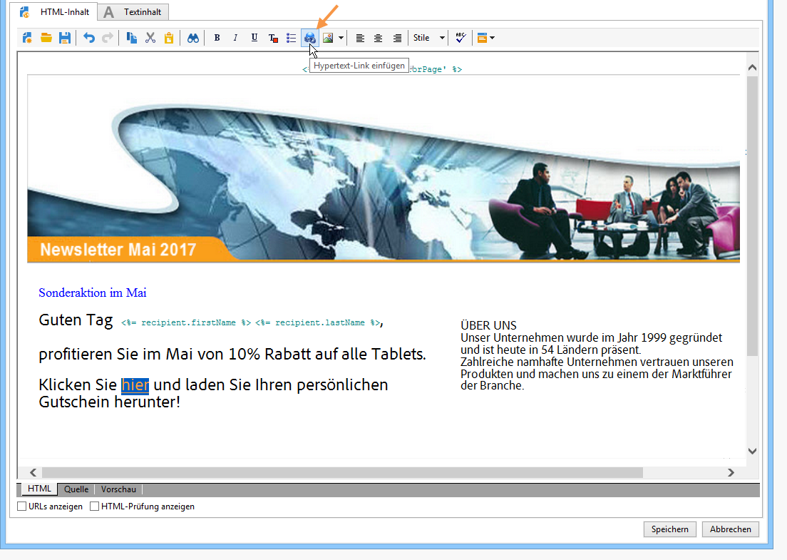</ph></source>
<target xml:lang="en-XX"><ph id="1" ctype="x-IMAGE"></ph></target>
</trans-unit>
<trans-unit id="tu43" xml:space="preserve">
<source xml:lang="en-US">You can insert images in messages from a local file or from an image library in Adobe Campaign. To do this, click the <ph id="1" ctype="x-STRONG_EMPHASIS">**[!UICONTROL </ph>Image<ph id="3" ctype="x-LINK_REF">]**</ph> icon and select the appropriate option.</source>
<target xml:lang="en-XX">Sie können Bilder aus einer lokalen Datei oder aus einer Bildbibliothek in Adobe Campaign in Nachrichten einfügen. Klicken Sie dazu auf das Symbol <ph id="1" ctype="x-STRONG_EMPHASIS">**[!UICONTROL </ph>Bild<ph id="3" ctype="x-LINK_REF">]**</ph> und wählen Sie die entsprechende Option aus.</target>
</trans-unit>
<trans-unit id="tu44" xml:space="preserve">
<source xml:lang="en-US"><ph id="1" ctype="x-IMAGE">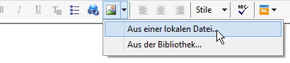</ph></source>
<target xml:lang="en-XX"><ph id="1" ctype="x-IMAGE"></ph></target>
</trans-unit>
<trans-unit id="tu45" xml:space="preserve">
<source xml:lang="en-US">Library images can be accessed via the <ph id="1" ctype="x-STRONG_EMPHASIS">**[!UICONTROL </ph>Resources>Online>Public resources<ph id="3" ctype="x-LINK_REF">]**</ph> folder in the folder tree. Also refer to <ph id="5" ctype="x-LINK">[</ph>Adding images<ph id="6" ctype="x-LINK">](#adding-images)</ph>.</source>
<target xml:lang="en-XX">Zugriff auf die Bilder aus der Bibliothek besteht über den Ordner <ph id="1" ctype="x-STRONG_EMPHASIS">**[!UICONTROL </ph>Ressourcen > Online > Öffentliche Ressourcen<ph id="3" ctype="x-LINK_REF">]**</ph> des Ordnerbaums. Siehe auch <ph id="5" ctype="x-LINK">[</ph>Bilder hinzufügen<ph id="6" ctype="x-LINK">](#adding-images)</ph>.</target>
</trans-unit>
<trans-unit id="tu46" xml:space="preserve">
<source xml:lang="en-US">The last button in the toolbar lets you insert personalization fields.</source>
<target xml:lang="en-XX">Die letzte Schaltfläche in der Symbolleiste dient der Einfügung von Personalisierungsfeldern.</target>
</trans-unit>
<trans-unit id="tu47" xml:space="preserve">
<source xml:lang="en-US"><ph id="1" ctype="x-regxph" equiv-text="&lbrack;!NOTE">[!NOTE]</ph></source>
<target xml:lang="en-XX"><ph id="1" ctype="x-regxph" equiv-text="&lbrack;!NOTE">[!NOTE]</ph></target>
</trans-unit>
<trans-unit id="tu48" xml:space="preserve">
<source xml:lang="en-US">The use of personalization fields is presented in <ph id="1" ctype="x-LINK">[</ph>About personalization<ph id="2" ctype="x-LINK">](about-personalization.md)</ph>.</source>
<target xml:lang="en-XX">Die Verwendung von Personalisierungsfeldern wird im Abschnitt <ph id="1" ctype="x-LINK">[</ph>Über die Personalisierung<ph id="2" ctype="x-LINK">](about-personalization.md)</ph> beschrieben.</target>
</trans-unit>
<trans-unit id="tu49" xml:space="preserve">
<source xml:lang="en-US">The tabs at the bottom of the page let you display the HTML code of the page being created and view the rendering of the message with its personalization. To launch this display, click <ph id="1" ctype="x-STRONG_EMPHASIS">**[!UICONTROL </ph>Preview<ph id="3" ctype="x-LINK_REF">]**</ph> and select a recipient using the <ph id="5" ctype="x-STRONG_EMPHASIS">**[!UICONTROL </ph>Test personalization<ph id="7" ctype="x-LINK_REF">]**</ph> button in the toolbar. You can select a recipient from the defined target(s) or choose another recipient.</source>
<target xml:lang="en-XX">In den Registerkarten am unteren Seitenrand können Sie den HTML-Code der zu erstellenden Seite anzeigen und das Rendering der Nachricht mit ihrer Personalisierung anzeigen. Klicken Sie hierfür auf die Registerkarte <ph id="1" ctype="x-STRONG_EMPHASIS">**[!UICONTROL </ph>Vorschau<ph id="3" ctype="x-LINK_REF">]**</ph> und wählen Sie über die Symbolleisten-Schaltfläche <ph id="5" ctype="x-STRONG_EMPHASIS">**[!UICONTROL </ph>Personalisierung testen...<ph id="7" ctype="x-LINK_REF">]**</ph> eine Empfängerin bzw. einen Empfänger aus. Sie können eine Empfängerin bzw. einen Empfänger aus der/den definierten Zielgruppe(n) auswählen oder eine andere Empfängerin bzw. einen anderen Empfänger auswählen.</target>
</trans-unit>
<trans-unit id="tu50" xml:space="preserve">
<source xml:lang="en-US"><ph id="1" ctype="x-IMAGE">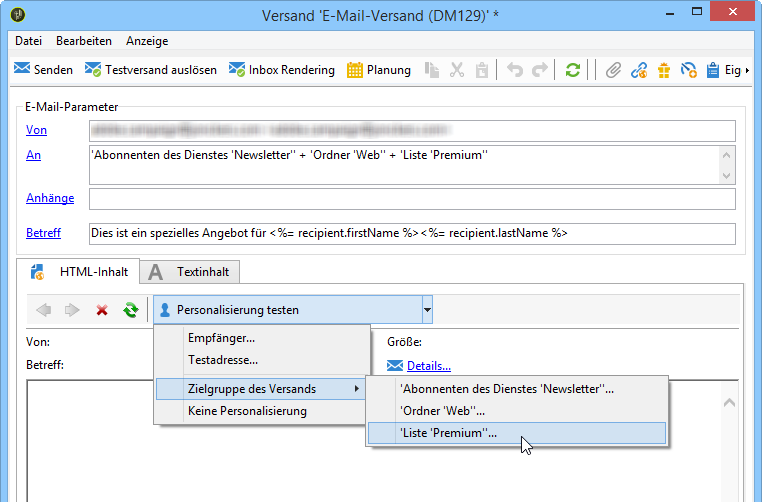</ph></source>
<target xml:lang="en-XX"><ph id="1" ctype="x-IMAGE"></ph></target>
</trans-unit>
<trans-unit id="tu51" xml:space="preserve">
<source xml:lang="en-US">You can validate the HTML message. You can also view the content of the email header.</source>
<target xml:lang="en-XX">Sie können die HTML-Nachricht valdieren. Sie können auch den Inhalt des E-Mail-Headers anzeigen.</target>
</trans-unit>
<trans-unit id="tu52" xml:space="preserve">
<source xml:lang="en-US"><ph id="1" ctype="x-IMAGE">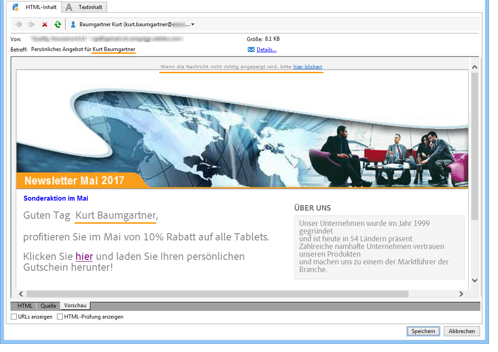</ph></source>
<target xml:lang="en-XX"><ph id="1" ctype="x-IMAGE"></ph></target>
</trans-unit>
<trans-unit id="tu53" xml:space="preserve">
<source xml:lang="en-US">To import a text content, use the <ph id="1" ctype="x-STRONG_EMPHASIS">**[!UICONTROL </ph>Open<ph id="3" ctype="x-LINK_REF">]**</ph> button, or the <ph id="5" ctype="x-STRONG_EMPHASIS">**[!UICONTROL </ph>Text Content<ph id="7" ctype="x-LINK_REF">]**</ph> tab to enter the content of the message when displayed in text format. Use the toolbar buttons to access actions on the contents. The last button lets you insert personalization fields.</source>
<target xml:lang="en-XX">Verwenden Sie zum Importieren von Textinhalten die Schaltfläche <ph id="1" ctype="x-STRONG_EMPHASIS">**[!UICONTROL </ph>Öffnen<ph id="3" ctype="x-LINK_REF">]**</ph> oder die Registerkarte <ph id="5" ctype="x-STRONG_EMPHASIS">**[!UICONTROL </ph>Textinhalt<ph id="7" ctype="x-LINK_REF">]**</ph>, um den Inhalt einer im Textformat angezeigten Nachricht einzugeben. Verwenden Sie die Schaltflächen der Symbolleiste, um auf Aktionen im Inhalt zuzugreifen. Mit der letzten Schaltfläche können Sie Personalisierungsfelder einfügen.</target>
</trans-unit>
<trans-unit id="tu54" xml:space="preserve">
<source xml:lang="en-US"><ph id="1" ctype="x-IMAGE">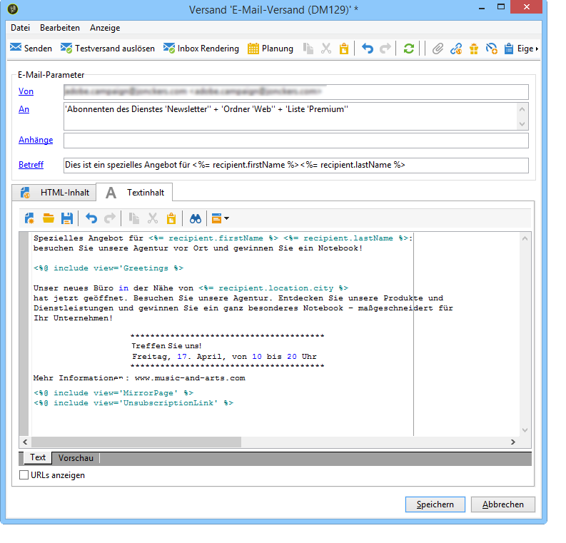</ph></source>
<target xml:lang="en-XX"><ph id="1" ctype="x-IMAGE"></ph></target>
</trans-unit>
<trans-unit id="tu55" xml:space="preserve">
<source xml:lang="en-US">As for the HTML format click the <ph id="1" ctype="x-STRONG_EMPHASIS">**[!UICONTROL </ph>Preview<ph id="3" ctype="x-LINK_REF">]**</ph> tab at the bottom of the page to view the rendering of the message with its personalization.</source>
<target xml:lang="en-XX">Der Tab <ph id="1" ctype="x-STRONG_EMPHASIS">**[!UICONTROL </ph>Vorschau<ph id="3" ctype="x-LINK_REF">]**</ph> am unteren Seitenrand ermöglicht die Anzeige des Renderings der Nachricht beim Empfänger inklusive Personalisierung.</target>
</trans-unit>
<trans-unit id="tu56" xml:space="preserve">
<source xml:lang="en-US"><ph id="1" ctype="x-IMAGE">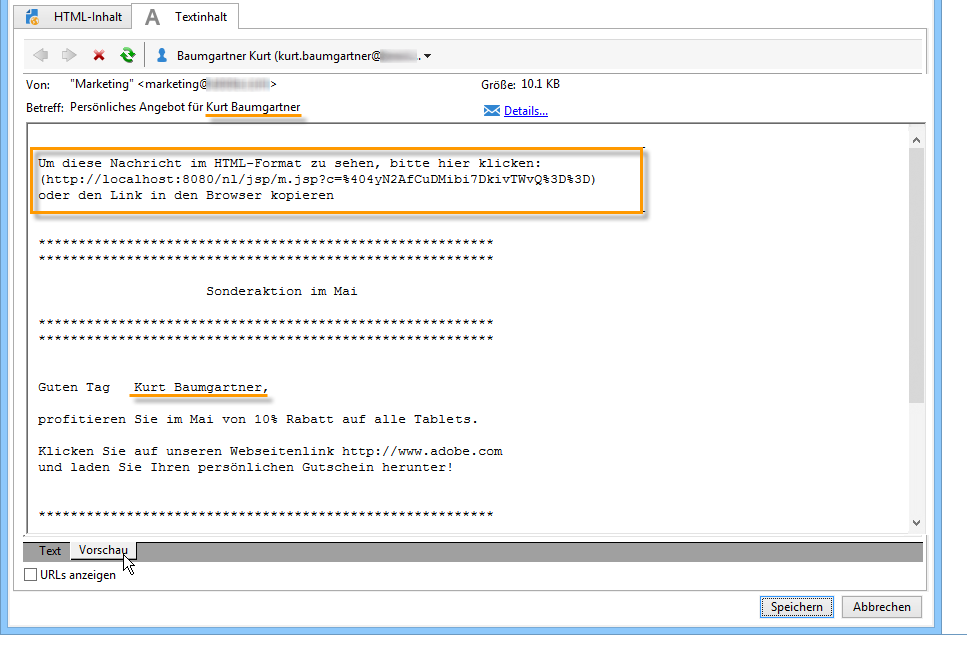</ph></source>
<target xml:lang="en-XX"><ph id="1" ctype="x-IMAGE"></ph></target>
</trans-unit>
<trans-unit id="tu57" xml:space="preserve">
<source xml:lang="en-US">Define interactive content</source>
<target xml:lang="en-XX">Definieren interaktiver Inhalte</target>
</trans-unit>
<trans-unit id="tu58" xml:space="preserve">
<source xml:lang="en-US">Adobe Campaign enables you to try the new interactive <ph id="1" ctype="x-LINK">&lbrack;</ph>AMP for Email<ph id="2" ctype="x-LINK">[#$tu59]</ph> format, which enables to send dynamic emails, under certain conditions.</source>
<target xml:lang="en-XX">Mit Adobe Campaign können Sie das neue interaktive Format <ph id="1" ctype="x-LINK">&lbrack;</ph>AMP für E-Mail<ph id="2" ctype="x-LINK">[#$tu59]</ph> testen, das unter bestimmten Bedingungen das Senden dynamischer E-Mails ermöglicht.</target>
</trans-unit>
<trans-unit id="tu60" xml:space="preserve">
<source xml:lang="en-US">For more on this, see the <ph id="1" ctype="x-LINK">&lbrack;</ph>Campaign v8 documentation<ph id="2" ctype="x-LINK">[#$tu61]{target="_blank"}</ph>.</source>
<target xml:lang="en-XX">Weitere Informationen hierzu finden Sie in der <ph id="1" ctype="x-LINK">&lbrack;</ph> Dokumentation zu Campaign v8<ph id="2" ctype="x-LINK">[#$tu61]{target="_blank"}</ph>.</target>
</trans-unit>
<trans-unit id="tu62" xml:space="preserve">
<source xml:lang="en-US">Use content management</source>
<target xml:lang="en-XX">Verwenden von Content-Management</target>
</trans-unit>
<trans-unit id="tu63" xml:space="preserve">
<source xml:lang="en-US">You can define the content of the delivery using the content management forms, directly in the delivery assistant. To do this, you must reference the publication template of the content management to be used, in the <ph id="1" ctype="x-STRONG_EMPHASIS">**[!UICONTROL </ph>Advanced<ph id="3" ctype="x-LINK_REF">]**</ph> tab of the delivery properties.</source>
<target xml:lang="en-XX">Sie können den Inhalt des Versands mithilfe der Content-Management-Formulare direkt im Versandassistenten definieren. Die zu verwendende Veröffentlichungsvorlage für den Inhalt muss in den Versandeigenschaften auf der Registerkarte <ph id="1" ctype="x-STRONG_EMPHASIS">**[!UICONTROL </ph>Erweitert<ph id="3" ctype="x-LINK_REF">]**</ph> angegeben werden.</target>
</trans-unit>
<trans-unit id="tu64" xml:space="preserve">
<source xml:lang="en-US"><ph id="1" ctype="x-IMAGE"></ph></source>
<target xml:lang="en-XX"><ph id="1" ctype="x-IMAGE"></ph></target>
</trans-unit>
<trans-unit id="tu65" xml:space="preserve">
<source xml:lang="en-US">An additional tab lets you enter content that will automatically be integrated and formatted according to the content management rules.</source>
<target xml:lang="en-XX">Eine zusätzliche Registerkarte erlaubt nun die Erstellung von Inhalten, die automatisch entsprechend den Regeln des Content-Managements formatiert und integriert werden.</target>
</trans-unit>
<trans-unit id="tu66" xml:space="preserve">
<source xml:lang="en-US"><ph id="1" ctype="x-IMAGE"></ph></source>
<target xml:lang="en-XX"><ph id="1" ctype="x-IMAGE"></ph></target>
</trans-unit>
<trans-unit id="tu67" xml:space="preserve">
<source xml:lang="en-US"><ph id="1" ctype="x-regxph" equiv-text="&lbrack;!NOTE">[!NOTE]</ph></source>
<target xml:lang="en-XX"><ph id="1" ctype="x-regxph" equiv-text="&lbrack;!NOTE">[!NOTE]</ph></target>
</trans-unit>
<trans-unit id="tu68" xml:space="preserve">
<source xml:lang="en-US">For further information about content management in Adobe Campaign, refer to <ph id="1" ctype="x-LINK">[</ph>this section<ph id="2" ctype="x-LINK">](about-content-management.md)</ph>.</source>
<target xml:lang="en-XX">Weitere Informationen zum Content-Management in Adobe Campaign finden Sie in <ph id="1" ctype="x-LINK">[</ph>diesem Abschnitt<ph id="2" ctype="x-LINK">](about-content-management.md)</ph>.</target>
</trans-unit>
<trans-unit id="tu69" xml:space="preserve">
<source xml:lang="en-US">Insert emoticons</source>
<target xml:lang="en-XX">Einfügen von Emoticons</target>
</trans-unit>
<trans-unit id="tu70" xml:space="preserve">
<source xml:lang="en-US">You can insert emoticons to your email content.</source>
<target xml:lang="en-XX">Sie können Emoticons in Ihren E-Mail-Inhalt einfügen.</target>
</trans-unit>
<trans-unit id="tu71" xml:space="preserve">
<source xml:lang="en-US">Click the <ph id="1" ctype="x-STRONG_EMPHASIS">**[!UICONTROL </ph>Insert emoticon<ph id="3" ctype="x-LINK_REF">]**</ph> icon.</source>
<target xml:lang="en-XX">Klicken Sie auf das Symbol <ph id="1" ctype="x-STRONG_EMPHASIS">**[!UICONTROL </ph>Emoticon einfügen<ph id="3" ctype="x-LINK_REF">]**</ph>.</target>
</trans-unit>
<trans-unit id="tu72" xml:space="preserve">
<source xml:lang="en-US">Select an emoticon from the pop-up window.</source>
<target xml:lang="en-XX">Wählen Sie im Popup-Fenster ein Emoticon aus.</target>
</trans-unit>
<trans-unit id="tu73" xml:space="preserve">
<source xml:lang="en-US"><ph id="1" ctype="x-IMAGE"></ph></source>
<target xml:lang="en-XX"><ph id="1" ctype="x-IMAGE"></ph></target>
</trans-unit>
<trans-unit id="tu74" xml:space="preserve">
<source xml:lang="en-US">Click the <ph id="1" ctype="x-STRONG_EMPHASIS">**[!UICONTROL </ph>Close<ph id="3" ctype="x-LINK_REF">]**</ph> button when done.</source>
<target xml:lang="en-XX">Klicken Sie danach auf die Schaltfläche <ph id="1" ctype="x-STRONG_EMPHASIS">**[!UICONTROL </ph>Schließen<ph id="3" ctype="x-LINK_REF">]**</ph>.</target>
</trans-unit>
<trans-unit id="tu75" xml:space="preserve">
<source xml:lang="en-US">To customize the emoticon list, refer to this <ph id="1" ctype="x-LINK">[</ph>page<ph id="2" ctype="x-LINK">](customizing-emoticon-list.md)</ph>.</source>
<target xml:lang="en-XX">Informationen zum Anpassen der Emoticon-Liste finden Sie auf dieser <ph id="1" ctype="x-LINK">[</ph>Seite<ph id="2" ctype="x-LINK">](customizing-emoticon-list.md)</ph>.</target>
</trans-unit>
<trans-unit id="tu76" xml:space="preserve">
<source xml:lang="en-US">Add images</source>
<target xml:lang="en-XX">Hinzufügen von Bildern</target>
</trans-unit>
<trans-unit id="tu77" xml:space="preserve">
<source xml:lang="en-US">HTML format email deliveries can contain images. From the delivery assistant, you can import an HTML page containing images or insert images directly using the HTML editor via the <ph id="1" ctype="x-STRONG_EMPHASIS">**[!UICONTROL </ph>Image<ph id="3" ctype="x-LINK_REF">]**</ph> icon.</source>
<target xml:lang="en-XX">E-Mail-Sendungen im HTML-Format können Bilder enthalten. Sie können eine HTML-Seite mit Bildern über den Versandassistenten importieren oder Bilder direkt mithilfe des HTML-Editors über das <ph id="1" ctype="x-STRONG_EMPHASIS">**[!UICONTROL </ph>Bildsymbol<ph id="3" ctype="x-LINK_REF">]**</ph> einfügen.</target>
</trans-unit>
<trans-unit id="tu78" xml:space="preserve">
<source xml:lang="en-US">Guardrails</source>
<target xml:lang="en-XX">Schutzmechanismen</target>
</trans-unit>
<trans-unit id="tu79" xml:space="preserve">
<source xml:lang="en-US">To avoid performance issues, images included in emails cannot exceed 100 KB. This limit, set by default, can be changed from the <ph id="1" ctype="x-CODE">`NmsDelivery_MaxDownloadedImageSize`</ph> option. However, Adobe strongly recommends to avoid large images in your email deliveries.</source>
<target xml:lang="en-XX">Um Performance-Probleme zu vermeiden, dürfen die in den E-Mails enthaltenen Bilder nicht größer als 100 KB sein. Diese standardmäßig festgelegte Beschränkung kann in der Option <ph id="1" ctype="x-CODE">`NmsDelivery_MaxDownloadedImageSize`</ph> geändert werden. Adobe empfiehlt jedoch dringend, große Bilder in E-Mail-Sendungen zu vermeiden.</target>
</trans-unit>
<trans-unit id="tu80" xml:space="preserve">
<source xml:lang="en-US">Learn more in <ph id="1" ctype="x-LINK">[</ph>the list of Campaign Classic options<ph id="2" ctype="x-LINK">](../../installation/using/configuring-campaign-options.md#delivery)</ph>.</source>
<target xml:lang="en-XX">Weitere Informationen finden Sie in der <ph id="1" ctype="x-LINK">[</ph>Liste der Campaign Classic-Optionen<ph id="2" ctype="x-LINK">](../../installation/using/configuring-campaign-options.md#delivery)</ph>.</target>
</trans-unit>
<trans-unit id="tu81" xml:space="preserve">
<source xml:lang="en-US">Types of images</source>
<target xml:lang="en-XX">Bildtypen</target>
</trans-unit>
<trans-unit id="tu82" xml:space="preserve">
<source xml:lang="en-US">Images can be:</source>
<target xml:lang="en-XX">Diese Bilder können:</target>
</trans-unit>
<trans-unit id="tu83" xml:space="preserve">
<source xml:lang="en-US">A local image, or an image called from a server</source>
<target xml:lang="en-XX">lokal gespeichert sein oder von einem Server abgerufen werden;</target>
</trans-unit>
<trans-unit id="tu84" xml:space="preserve">
<source xml:lang="en-US">An image stored in the Adobe Campaign public resources library</source>
<target xml:lang="en-XX">aus der Bibliothek der öffentlichen Ressourcen in Adobe Campaign stammen;</target>
</trans-unit>
<trans-unit id="tu85" xml:space="preserve">
<source xml:lang="en-US">Public resources are accessible via the <ph id="1" ctype="x-STRONG_EMPHASIS">**[!UICONTROL </ph>Resources > Online<ph id="3" ctype="x-LINK_REF">]**</ph> node of the Adobe Campaign hierarchy. They are grouped in a library and can be included in email messages, but can also be used for campaigns or tasks, or for content management.</source>
<target xml:lang="en-XX">Auf öffentliche Ressourcen kann über den Knoten <ph id="1" ctype="x-STRONG_EMPHASIS">**[!UICONTROL </ph>Ressourcen > Online<ph id="3" ctype="x-LINK_REF">]**</ph> der Adobe Campaign-Hierarchie zugegriffen werden. Sie sind in einer Bibliothek zusammengefasst und können in E-Mail-Nachrichten eingefügt und auch für Kampagnen oder Aufgaben bzw. für das Content-Management verwendet werden.</target>
</trans-unit>
<trans-unit id="tu86" xml:space="preserve">
<source xml:lang="en-US">An asset shared with Adobe Experience Cloud. Refer to <ph id="1" ctype="x-LINK">[</ph>this section<ph id="2" ctype="x-LINK">](../../integrations/using/sharing-assets-with-adobe-experience-cloud.md)</ph>.</source>
<target xml:lang="en-XX">Ein für Adobe Experience Cloud freigegebenes Asset. Weitere Informationen finden Sie in <ph id="1" ctype="x-LINK">[</ph>diesem Abschnitt<ph id="2" ctype="x-LINK">](../../integrations/using/sharing-assets-with-adobe-experience-cloud.md)</ph>.</target>
</trans-unit>
<trans-unit id="tu87" xml:space="preserve">
<source xml:lang="en-US">Insert and manage images</source>
<target xml:lang="en-XX">Einfügen und Verwalten von Bildern</target>
</trans-unit>
<trans-unit id="tu88" xml:space="preserve">
<source xml:lang="en-US">The delivery assistant lets you add local images, or images stored in the library, to the content of messages. To do this, click the <ph id="1" ctype="x-STRONG_EMPHASIS">**[!UICONTROL </ph>Image<ph id="3" ctype="x-LINK_REF">]**</ph> button in the HTML content toolbar.</source>
<target xml:lang="en-XX">Der Versandassistent bietet die Möglichkeit, lokale oder in der Bibliothek enthaltene Bilder in den Inhalt der Nachrichten einzuschließen. Wählen Sie hierfür die Schaltfläche <ph id="1" ctype="x-STRONG_EMPHASIS">**[!UICONTROL </ph>Bild<ph id="3" ctype="x-LINK_REF">]**</ph> in der Symbolleiste des HTML-Inhalts aus.</target>
</trans-unit>
<trans-unit id="tu89" xml:space="preserve">
<source xml:lang="en-US"><ph id="1" ctype="x-IMAGE">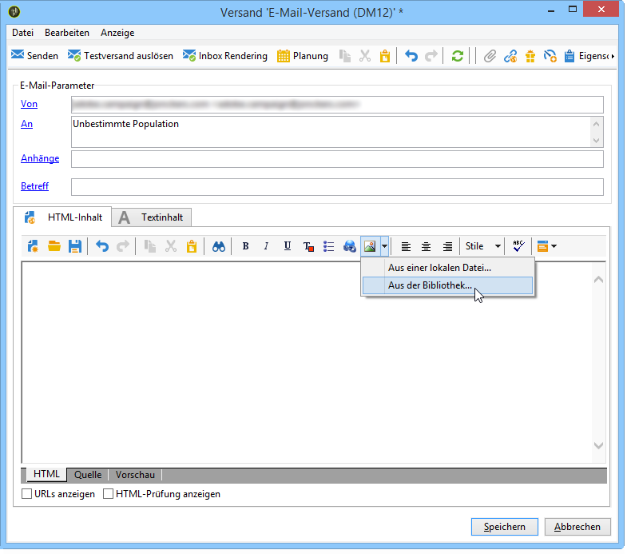</ph></source>
<target xml:lang="en-XX"><ph id="1" ctype="x-IMAGE"></ph></target>
</trans-unit>
<trans-unit id="tu90" xml:space="preserve">
<source xml:lang="en-US"><ph id="1" ctype="x-regxph" equiv-text="&lbrack;!IMPORTANT">[!IMPORTANT]</ph></source>
<target xml:lang="en-XX"><ph id="1" ctype="x-regxph" equiv-text="&lbrack;!IMPORTANT">[!IMPORTANT]</ph></target>
</trans-unit>
<trans-unit id="tu91" xml:space="preserve">
<source xml:lang="en-US">In order for the recipients to be able to view the images included in the messages that they receive, these messages must be available on a server accessible from the outside.</source>
<target xml:lang="en-XX">Um von den Empfängern gesehen werden zu können, müssen die Bilder auf einem extern zugänglichen Server gespeichert werden.</target>
</trans-unit>
<trans-unit id="tu92" xml:space="preserve">
<source xml:lang="en-US">To manage images via the delivery assistant:</source>
<target xml:lang="en-XX">So verwalten Sie Bilder über den Versandassistenten:</target>
</trans-unit>
<trans-unit id="tu93" xml:space="preserve">
<source xml:lang="en-US">Click the <ph id="1" ctype="x-STRONG_EMPHASIS">**[!UICONTROL </ph>Tracking &amp; Images<ph id="3" ctype="x-LINK_REF">]**</ph> icon in the toolbar.
</source>
<target xml:lang="en-XX">Klicken Sie in der Symbolleiste auf das Symbol <ph id="1" ctype="x-STRONG_EMPHASIS">**[!UICONTROL </ph>Tracking &amp; Bilder<ph id="3" ctype="x-LINK_REF">]**</ph>.
</target>
</trans-unit>
<trans-unit id="tu94" xml:space="preserve">
<source xml:lang="en-US"><ph id="1" ctype="x-IMAGE">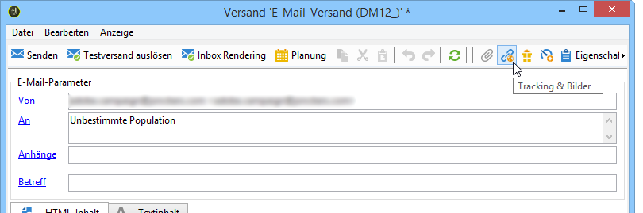</ph></source>
<target xml:lang="en-XX"><ph id="1" ctype="x-IMAGE"></ph></target>
</trans-unit>
<trans-unit id="tu95" xml:space="preserve">
<source xml:lang="en-US">Select <ph id="1" ctype="x-STRONG_EMPHASIS">**[!UICONTROL </ph>Upload images<ph id="3" ctype="x-LINK_REF">]**</ph> in the <ph id="5" ctype="x-STRONG_EMPHASIS">**[!UICONTROL </ph>Images<ph id="7" ctype="x-LINK_REF">]**</ph> tab.</source>
<target xml:lang="en-XX">Wählen Sie die Option <ph id="1" ctype="x-STRONG_EMPHASIS">**[!UICONTROL </ph>Bilder hochladen<ph id="3" ctype="x-LINK_REF">]**</ph> auf dem Tab <ph id="5" ctype="x-STRONG_EMPHASIS">**[!UICONTROL </ph>Bilder<ph id="7" ctype="x-LINK_REF">]**</ph>.</target>
</trans-unit>
<trans-unit id="tu96" xml:space="preserve">
<source xml:lang="en-US">You can then choose whether you wish to include the images in the email message.
</source>
<target xml:lang="en-XX">Dann können Sie festlegen, ob die Bilder in die E-Mail-Nachricht eingeschlossen werden sollen.
</target>
</trans-unit>
<trans-unit id="tu97" xml:space="preserve">
<source xml:lang="en-US"><ph id="1" ctype="x-IMAGE">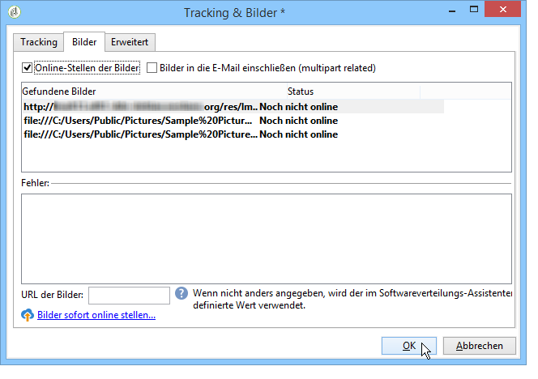</ph></source>
<target xml:lang="en-XX"><ph id="1" ctype="x-IMAGE"></ph></target>
</trans-unit>
<trans-unit id="tu98" xml:space="preserve">
<source xml:lang="en-US">You can upload images manually without waiting for the delivery analysis phase. To do this, click the <ph id="1" ctype="x-STRONG_EMPHASIS">**[!UICONTROL </ph>Upload the images straightaway...<ph id="3" ctype="x-LINK_REF">]**</ph> link.</source>
<target xml:lang="en-XX">Sie können Bilder manuell hochladen, ohne die Versandanalyse abwarten zu müssen. Klicken Sie dazu auf den Link <ph id="1" ctype="x-STRONG_EMPHASIS">**[!UICONTROL </ph>Bilder sofort online stellen...<ph id="3" ctype="x-LINK_REF">]**</ph>.</target>
</trans-unit>
<trans-unit id="tu99" xml:space="preserve">
<source xml:lang="en-US">You can specify another path for access to the images on the tracking server. To do this, enter it in the <ph id="1" ctype="x-STRONG_EMPHASIS">**[!UICONTROL </ph>Images URL<ph id="3" ctype="x-LINK_REF">]**</ph> field. This value overrides the value defined in the parameters of the installation assistant.</source>
<target xml:lang="en-XX">Sie können einen anderen Pfad für Zugriff auf die Bilder auf dem Tracking-Server angeben. Geben Sie dazu einen Pfad in das Feld <ph id="1" ctype="x-STRONG_EMPHASIS">**[!UICONTROL </ph>URL der Bilder<ph id="3" ctype="x-LINK_REF">]**</ph> ein. Dieser Wert setzt den in den Parametern des Installationsassistenten definierten Wert außer Kraft.</target>
</trans-unit>
<trans-unit id="tu100" xml:space="preserve">
<source xml:lang="en-US">When you open HTML content with included images in the delivery assistant, a message gives you the option of uploading the images immediately, according to the delivery parameters.</source>
<target xml:lang="en-XX">Wenn Sie im Versandassistenten HTML-Inhalte mit eingebundenen Bildern öffnen, erhalten Sie eine Nachricht, die Ihnen die Möglichkeit gibt, die Bilder gemäß den Versandparametern sofort hochzuladen.</target>
</trans-unit>
<trans-unit id="tu101" xml:space="preserve">
<source xml:lang="en-US"><ph id="1" ctype="x-IMAGE">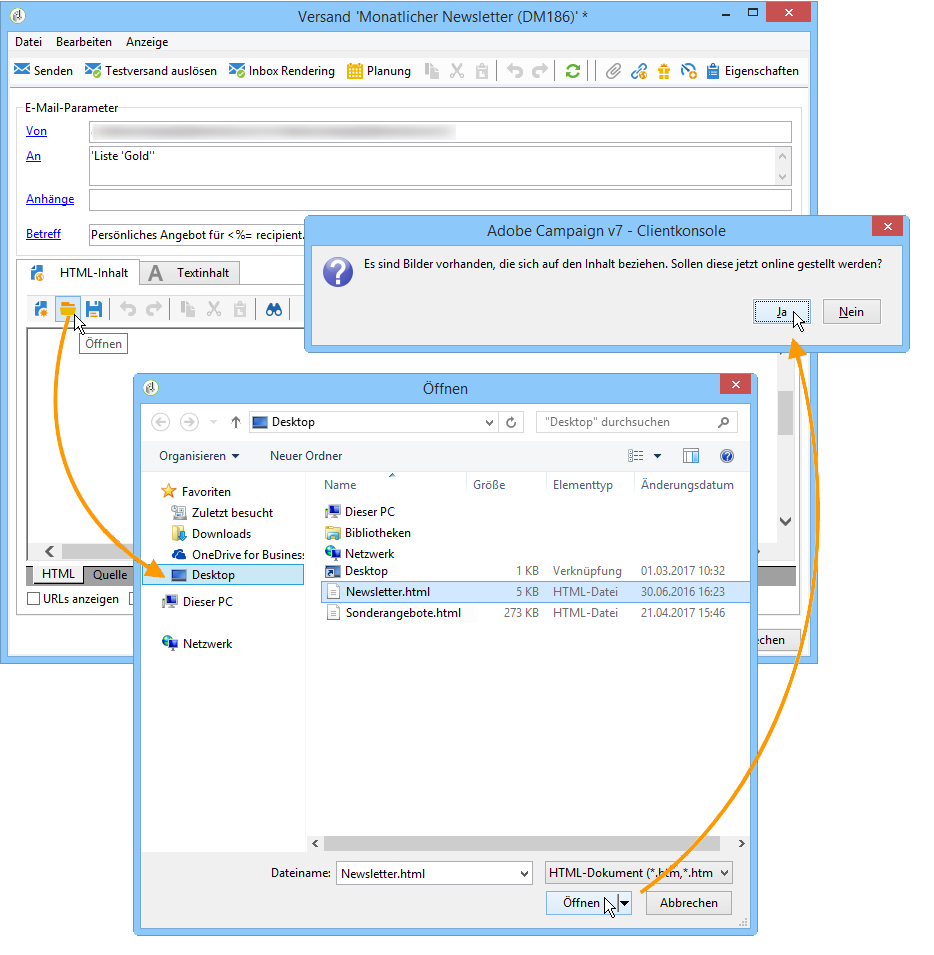</ph></source>
<target xml:lang="en-XX"><ph id="1" ctype="x-IMAGE"></ph></target>
</trans-unit>
<trans-unit id="tu102" xml:space="preserve">
<source xml:lang="en-US"><ph id="1" ctype="x-regxph" equiv-text="&lbrack;!IMPORTANT">[!IMPORTANT]</ph></source>
<target xml:lang="en-XX"><ph id="1" ctype="x-regxph" equiv-text="&lbrack;!IMPORTANT">[!IMPORTANT]</ph></target>
</trans-unit>
<trans-unit id="tu103" xml:space="preserve">
<source xml:lang="en-US">The image URLs are modified during manual uploading or when sending messages.</source>
<target xml:lang="en-XX">Die Bild-URLs werden beim manuellen Hochladen oder beim Senden von Nachrichten geändert.</target>
</trans-unit>
<trans-unit id="tu104" xml:space="preserve">
<source xml:lang="en-US">Use case: send a message with images</source>
<target xml:lang="en-XX">Anwendungsfall: Versand einer Nachricht mit Bildern</target>
</trans-unit>
<trans-unit id="tu105" xml:space="preserve">
<source xml:lang="en-US">Below is a sample of a delivery with four images:</source>
<target xml:lang="en-XX">Hier ist ein Beispiel für einen Versand mit vier Bildern zu sehen:</target>
</trans-unit>
<trans-unit id="tu106" xml:space="preserve">
<source xml:lang="en-US"><ph id="1" ctype="x-IMAGE">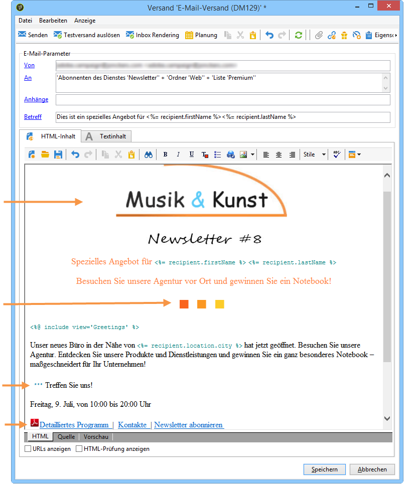</ph></source>
<target xml:lang="en-XX"><ph id="1" ctype="x-IMAGE"></ph></target>
</trans-unit>
<trans-unit id="tu107" xml:space="preserve">
<source xml:lang="en-US">These images come from a local directory or Web site as you can verify from the <ph id="1" ctype="x-STRONG_EMPHASIS">**[!UICONTROL </ph>Source<ph id="3" ctype="x-LINK_REF">]**</ph> tab.</source>
<target xml:lang="en-XX">Die Bilder stammen aus einem lokalen Verzeichnis oder von einer Website, wie Sie im <ph id="1" ctype="x-STRONG_EMPHASIS">**[!UICONTROL </ph>Quelle<ph id="3" ctype="x-LINK_REF">]**</ph>-Tab feststellen können.</target>
</trans-unit>
<trans-unit id="tu108" xml:space="preserve">
<source xml:lang="en-US"><ph id="1" ctype="x-IMAGE">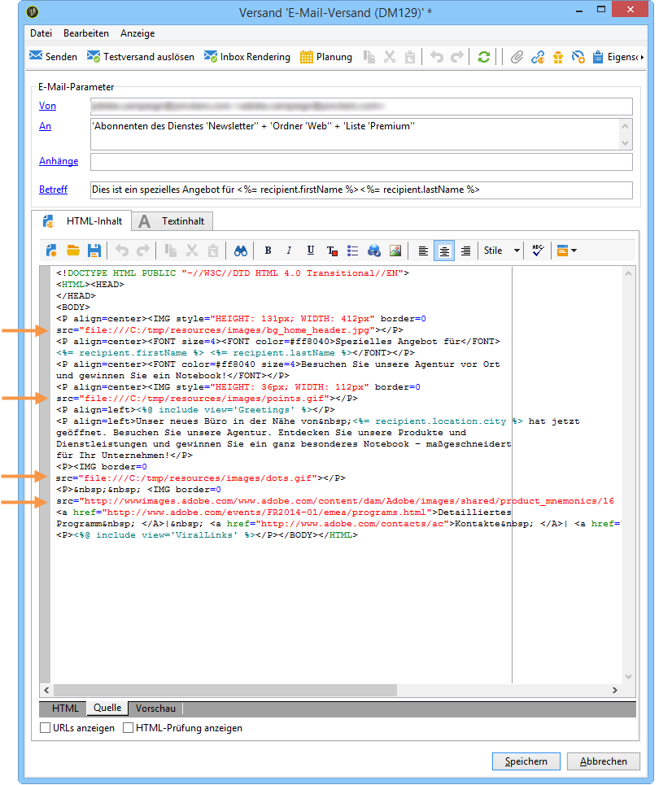</ph></source>
<target xml:lang="en-XX"><ph id="1" ctype="x-IMAGE"></ph></target>
</trans-unit>
<trans-unit id="tu109" xml:space="preserve">
<source xml:lang="en-US">Click the <ph id="1" ctype="x-STRONG_EMPHASIS">**[!UICONTROL </ph>Tracking &amp; Images<ph id="3" ctype="x-LINK_REF">]**</ph> icon and then the <ph id="5" ctype="x-STRONG_EMPHASIS">**[!UICONTROL </ph>Images<ph id="7" ctype="x-LINK_REF">]**</ph> tab to start detecting images in the message.</source>
<target xml:lang="en-XX">Wählen Sie das Symbol <ph id="1" ctype="x-STRONG_EMPHASIS">**[!UICONTROL </ph>Tracking &amp; Bilder<ph id="3" ctype="x-LINK_REF">]**</ph> und dann den Tab <ph id="5" ctype="x-STRONG_EMPHASIS">**[!UICONTROL </ph>Bilder<ph id="7" ctype="x-LINK_REF">]**</ph> aus, um die Erkennung der in der Nachricht enthaltenen Bilder zu starten.</target>
</trans-unit>
<trans-unit id="tu110" xml:space="preserve">
<source xml:lang="en-US">For each image detected, you can view its status:</source>
<target xml:lang="en-XX">Für jedes erkannte Bild können Sie den Status prüfen:</target>
</trans-unit>
<trans-unit id="tu111" xml:space="preserve">
<source xml:lang="en-US">If an image is stored locally or located on another server, even if this server is visible from the outside (on an internet site, for example), it will be detected as <ph id="1" ctype="x-STRONG_EMPHASIS">**[!UICONTROL </ph>Not yet online<ph id="3" ctype="x-LINK_REF">]**</ph>.</source>
<target xml:lang="en-XX">Lokale oder auf anderen Servern gespeicherte Bilder werden als <ph id="1" ctype="x-STRONG_EMPHASIS">**[!UICONTROL </ph>Noch nicht online<ph id="3" ctype="x-LINK_REF">]**</ph> gekennzeichnet, auch wenn der Server von außerhalb zugänglich ist (beispielsweise bei Bildern einer Webseite).</target>
</trans-unit>
<trans-unit id="tu112" xml:space="preserve">
<source xml:lang="en-US">The images are detected as <ph id="1" ctype="x-STRONG_EMPHASIS">**[!UICONTROL </ph>Already online<ph id="3" ctype="x-LINK_REF">]**</ph> if they were uploaded earlier while creating another delivery.</source>
<target xml:lang="en-XX">Bilder werden als <ph id="1" ctype="x-STRONG_EMPHASIS">**[!UICONTROL </ph>Bereits online<ph id="3" ctype="x-LINK_REF">]**</ph> gekennzeichnet, wenn Sie zuvor, z. B. bei Erstellung eines anderen Versands, online gestellt wurden.</target>
</trans-unit>
<trans-unit id="tu113" xml:space="preserve">
<source xml:lang="en-US">In the deployment wizard, you can define URLs for which image detection is not enabled: uploading these images will be <ph id="1" ctype="x-STRONG_EMPHASIS">**[!UICONTROL </ph>Skipped<ph id="3" ctype="x-LINK_REF">]**</ph>.</source>
<target xml:lang="en-XX">Im Bereitstellungassistenten können Sie URLs angeben, die bei der Bilderkennung nicht berücksichtigt werden sollen. Das Online-Stellen dieser Bilder wird demnach <ph id="1" ctype="x-STRONG_EMPHASIS">**[!UICONTROL </ph>Ignoriert<ph id="3" ctype="x-LINK_REF">]**</ph>.</target>
</trans-unit>
<trans-unit id="tu114" xml:space="preserve">
<source xml:lang="en-US"><ph id="1" ctype="x-regxph" equiv-text="&lbrack;!NOTE">[!NOTE]</ph></source>
<target xml:lang="en-XX"><ph id="1" ctype="x-regxph" equiv-text="&lbrack;!NOTE">[!NOTE]</ph></target>
</trans-unit>
<trans-unit id="tu115" xml:space="preserve">
<source xml:lang="en-US">Images are identified by their content and not by their access paths. This means that an image uploaded previously under a different name or in a different directory will be detected as <ph id="1" ctype="x-STRONG_EMPHASIS">**[!UICONTROL </ph>Already online<ph id="3" ctype="x-LINK_REF">]**</ph>.</source>
<target xml:lang="en-XX">Ein Bild wird über seinen Inhalt und nicht seinen Namen oder Pfad identifiziert. Daher wird auch ein Bild, das zuvor bereits unter einem anderen Namen oder aus einem anderen Verzeichnis online gestellt wurde, als <ph id="1" ctype="x-STRONG_EMPHASIS">**[!UICONTROL </ph>Bereits online<ph id="3" ctype="x-LINK_REF">]**</ph> erkannt.</target>
</trans-unit>
<trans-unit id="tu116" xml:space="preserve">
<source xml:lang="en-US">During the analysis phase, the images are automatically uploaded to the server so that they are accessible from the exterior, except for the local images which must be uploaded beforehand.</source>
<target xml:lang="en-XX">Bilder werden im Zuge der Nachrichtenanalyse auf den Server geladen, um von außerhalb zugänglich zu sein. Dies gilt nicht für lokal gespeicherte Bilder, die im Vorfeld hochzuladen sind.</target>
</trans-unit>
<trans-unit id="tu117" xml:space="preserve">
<source xml:lang="en-US">You can work ahead and upload images so that they can be viewed by other Adobe Campaign operators. You may find this useful if working collaboratively. To do this, click <ph id="1" ctype="x-STRONG_EMPHASIS">**[!UICONTROL </ph>Upload the images straightaway...<ph id="3" ctype="x-LINK_REF">]**</ph> to upload the images onto the server.</source>
<target xml:lang="en-XX">Sie können Arbeit im Voraus erledigen und Bilder hochladen, sodass sie von anderen Adobe Campaign-Benutzenden angezeigt werden können. Dies kann bei der Zusammenarbeit nützlich sein. Wählen Sie hierfür die Option <ph id="1" ctype="x-STRONG_EMPHASIS">**[!UICONTROL </ph>Bilder sofort online stellen…<ph id="3" ctype="x-LINK_REF">]**</ph> und klicken Sie auf den Link, um den Upload der Bilder auf den Server zu starten.</target>
</trans-unit>
<trans-unit id="tu118" xml:space="preserve">
<source xml:lang="en-US"><ph id="1" ctype="x-IMAGE">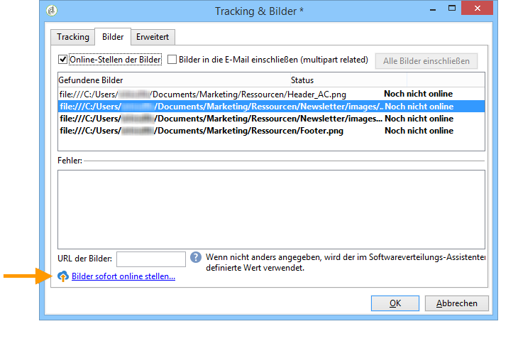</ph></source>
<target xml:lang="en-XX"><ph id="1" ctype="x-IMAGE"></ph></target>
</trans-unit>
<trans-unit id="tu119" xml:space="preserve">
<source xml:lang="en-US"><ph id="1" ctype="x-regxph" equiv-text="&lbrack;!NOTE">[!NOTE]</ph></source>
<target xml:lang="en-XX"><ph id="1" ctype="x-regxph" equiv-text="&lbrack;!NOTE">[!NOTE]</ph></target>
</trans-unit>
<trans-unit id="tu120" xml:space="preserve">
<source xml:lang="en-US">The URLs of the images in the email, and their names in particular, are then modified.</source>
<target xml:lang="en-XX">Dies löst die Änderung der Bild-URLs und insbesondere der Namen der Bilder aus.</target>
</trans-unit>
<trans-unit id="tu121" xml:space="preserve">
<source xml:lang="en-US">Once the images are online, you can view changes to their names and paths from the <ph id="1" ctype="x-STRONG_EMPHASIS">**[!UICONTROL </ph>Source<ph id="3" ctype="x-LINK_REF">]**</ph> tab of the message.</source>
<target xml:lang="en-XX">Sobald die Bilder online sind, können Sie die Namens- und Pfadänderungen im <ph id="1" ctype="x-STRONG_EMPHASIS">**[!UICONTROL </ph>Quelle<ph id="3" ctype="x-LINK_REF">]**</ph>-Tab der Nachricht prüfen.</target>
</trans-unit>
<trans-unit id="tu122" xml:space="preserve">
<source xml:lang="en-US"><ph id="1" ctype="x-IMAGE">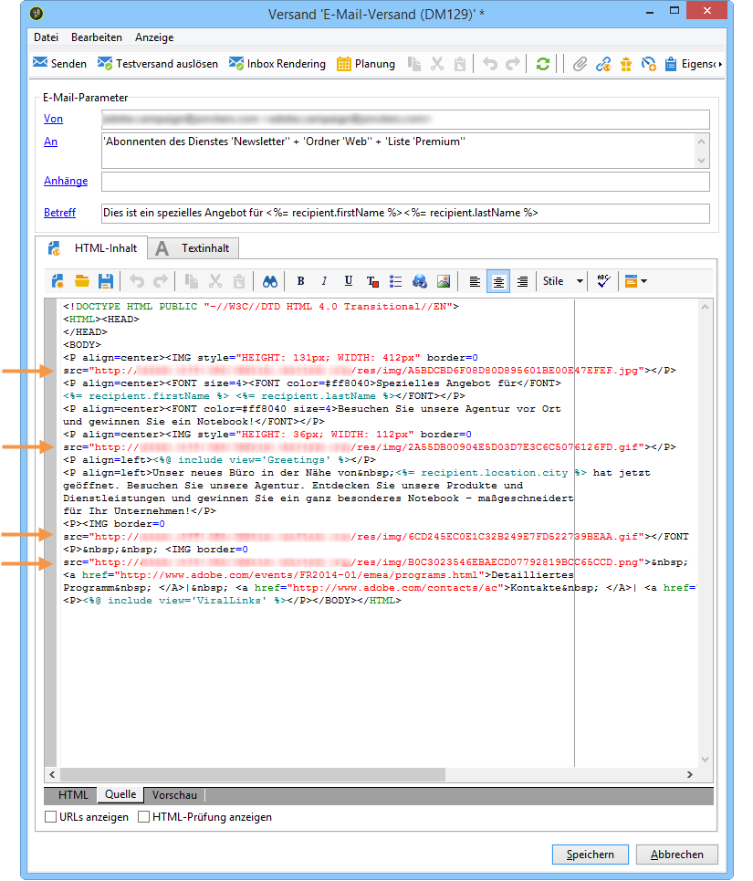</ph></source>
<target xml:lang="en-XX"><ph id="1" ctype="x-IMAGE"></ph></target>
</trans-unit>
<trans-unit id="tu123" xml:space="preserve">
<source xml:lang="en-US">If you select <ph id="1" ctype="x-STRONG_EMPHASIS">**[!UICONTROL </ph>Include the images in the email<ph id="3" ctype="x-LINK_REF">]**</ph>, you can choose which images to include in the corresponding column.</source>
<target xml:lang="en-XX">Durch Ankreuzen der Option <ph id="1" ctype="x-STRONG_EMPHASIS">**[!UICONTROL </ph>Bilder in die E-Mail einschließen (multipart related)<ph id="3" ctype="x-LINK_REF">]**</ph> haben Sie die Möglichkeit, in der entsprechenden Spalte für jedes Bild anzugeben, ob es in die E-Mail eingeschlossen werden soll oder nicht.</target>
</trans-unit>
<trans-unit id="tu124" xml:space="preserve">
<source xml:lang="en-US"><ph id="1" ctype="x-IMAGE">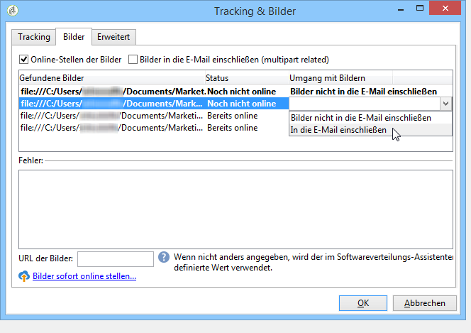</ph></source>
<target xml:lang="en-XX"><ph id="1" ctype="x-IMAGE"></ph></target>
</trans-unit>
<trans-unit id="tu125" xml:space="preserve">
<source xml:lang="en-US"><ph id="1" ctype="x-regxph" equiv-text="&lbrack;!NOTE">[!NOTE]</ph></source>
<target xml:lang="en-XX"><ph id="1" ctype="x-regxph" equiv-text="&lbrack;!NOTE">[!NOTE]</ph></target>
</trans-unit>
<trans-unit id="tu126" xml:space="preserve">
<source xml:lang="en-US">If local images are included in the message, you must confirm changes to the message source code.</source>
<target xml:lang="en-XX">Wenn in der Nachricht lokale Bilder enthalten sind, ist die Änderung des Quellcodes der Nachricht zu bestätigen.</target>
</trans-unit>
<trans-unit id="tu127" xml:space="preserve">
<source xml:lang="en-US">Insert a personalized barcode</source>
<target xml:lang="en-XX">Einfügen eines personalisierten Barcodes</target>
</trans-unit>
<trans-unit id="tu128" xml:space="preserve">
<source xml:lang="en-US">The barcode generation module lets you create several types of barcodes that comply with many common standards, including 2D barcodes.</source>
<target xml:lang="en-XX">Die Barcode-Lösung bietet die Möglichkeit, verschiedene ein- oder zweidimensionale Code-Typen in den gängigsten Normen zu erstellen.</target>
</trans-unit>
<trans-unit id="tu129" xml:space="preserve">
<source xml:lang="en-US">It is possible to dynamically generate a barcode as a bitmap using a value defined using customer criteria. Personalized barcodes can be included in email campaigns. The recipient can print the message and show it to the issuing company for scanning (when checking out for example).</source>
<target xml:lang="en-XX">Es ist möglich, einen Barcode dynamisch als Bitmap unter Verwendung eines Werts zu generieren, der mithilfe von Kundenkriterien definiert wurde. Personalisierte Barcodes können in E-Mail-Kampagnen aufgenommen werden. Die Empfängerin bzw. der Empfänger kann die Nachricht drucken und sie dem ausstellenden Unternehmen zum Scannen vorlegen (z. B. beim Auschecken).</target>
</trans-unit>
<trans-unit id="tu130" xml:space="preserve">
<source xml:lang="en-US">To insert a barcode into an email, place the cursor in the content where you want to display it, then click the personalization button. Select <ph id="1" ctype="x-STRONG_EMPHASIS">**[!UICONTROL </ph>Include > Barcode...<ph id="3" ctype="x-LINK_REF">]**</ph>.</source>
<target xml:lang="en-XX">Positionieren Sie den Cursor im Inhalt an der Stelle, an der der Barcode eingefügt werden soll, und klicken Sie auf die Personalisierungsschaltfläche. Wählen Sie <ph id="1" ctype="x-STRONG_EMPHASIS">**[!UICONTROL </ph>Einfügen > Barcode...<ph id="3" ctype="x-LINK_REF">]**</ph>.</target>
</trans-unit>
<trans-unit id="tu131" xml:space="preserve">
<source xml:lang="en-US"><ph id="1" ctype="x-IMAGE"></ph></source>
<target xml:lang="en-XX"><ph id="1" ctype="x-IMAGE"></ph></target>
</trans-unit>
<trans-unit id="tu132" xml:space="preserve">
<source xml:lang="en-US">Then configure the following elements to suit your needs:</source>
<target xml:lang="en-XX">Konfigurieren Sie dann die verschiedenen Elemente je nach Bedarf:</target>
</trans-unit>
<trans-unit id="tu133" xml:space="preserve">
<source xml:lang="en-US">Select the type of barcode.</source>
<target xml:lang="en-XX">Wählen Sie den Barcode-Typ aus.</target>
</trans-unit>
<trans-unit id="tu134" xml:space="preserve">
<source xml:lang="en-US">For 1D format, the following types are available in Adobe Campaign: Codabar, Code 128, GS1-128 (formerly EAN-128), UPC-A, UPC-E, ISBN, EAN-8, Code39, Interleaved 2 of 5, POSTNET and Royal Mail (RM4SCC).</source>
<target xml:lang="en-XX">Für das 1D-Format stehen in Adobe Campaign folgende Typen zur Verfügung: Codabar, Code 128, GS1-128 (vormals EAN-128), UPC-A, UPC-E, ISBN, EAN-8, Code39, Interleaved 2 of 5, POSTNET und Royal Mail (RM4SCC).</target>
</trans-unit>
<trans-unit id="tu135" xml:space="preserve">
<source xml:lang="en-US">Example of a 1D barcode:</source>
<target xml:lang="en-XX">Beispiel eines 1D-Barcodes:</target>
</trans-unit>
<trans-unit id="tu136" xml:space="preserve">
<source xml:lang="en-US"><ph id="1" ctype="x-IMAGE"></ph></source>
<target xml:lang="en-XX"><ph id="1" ctype="x-IMAGE"></ph></target>
</trans-unit>
<trans-unit id="tu137" xml:space="preserve">
<source xml:lang="en-US">The DataMatrix and PDF417 types concern the 2D format.</source>
<target xml:lang="en-XX">Die Typen DataMatrix und PDF417 betreffen das 2D-Format.</target>
</trans-unit>
<trans-unit id="tu138" xml:space="preserve">
<source xml:lang="en-US">Example of a 2D barcode:</source>
<target xml:lang="en-XX">Beispiel eines 2D-Barcodes:</target>
</trans-unit>
<trans-unit id="tu139" xml:space="preserve">
<source xml:lang="en-US"><ph id="1" ctype="x-IMAGE"></ph></source>
<target xml:lang="en-XX"><ph id="1" ctype="x-IMAGE"></ph></target>
</trans-unit>
<trans-unit id="tu140" xml:space="preserve">
<source xml:lang="en-US">To insert a QR code, select this type and enter the error correction rate to apply. This rate defines the quantity of information repeated and the tolerance to deterioration.</source>
<target xml:lang="en-XX">Wählen Sie zum Einfügen eines QR-Codes seinen Typ aus und geben Sie die anzuwendende Fehlerkorrekturrate an. Diese Rate definiert die Menge der wiederholten Informationen und die Toleranz bei Verschlechterung.</target>
</trans-unit>
<trans-unit id="tu141" xml:space="preserve">
<source xml:lang="en-US"><ph id="1" ctype="x-IMAGE"></ph></source>
<target xml:lang="en-XX"><ph id="1" ctype="x-IMAGE"></ph></target>
</trans-unit>
<trans-unit id="tu142" xml:space="preserve">
<source xml:lang="en-US">Example of a QR code:</source>
<target xml:lang="en-XX">Beispiel eines QR-Codes:</target>
</trans-unit>
<trans-unit id="tu143" xml:space="preserve">
<source xml:lang="en-US"><ph id="1" ctype="x-IMAGE"></ph></source>
<target xml:lang="en-XX"><ph id="1" ctype="x-IMAGE"></ph></target>
</trans-unit>
<trans-unit id="tu144" xml:space="preserve">
<source xml:lang="en-US">Enter the size of the barcode that you want to insert into the email: configuring the scale lets you increase or reduce the size of the barcode, from x1 to x10.</source>
<target xml:lang="en-XX">Geben Sie die gewünschte Größe des Barcodes an. Durch Angabe eines Faktors von x1 bis x10 kann die Größe angepasst werden.</target>
</trans-unit>
<trans-unit id="tu145" xml:space="preserve">
<source xml:lang="en-US">The <ph id="1" ctype="x-STRONG_EMPHASIS">**[!UICONTROL </ph>Value<ph id="3" ctype="x-LINK_REF">]**</ph> field enables you to define the value of the barcode. A value can match a special offer and can be the function of a criteria, it can be the value of a database field linked to the customers.</source>
<target xml:lang="en-XX">Im Feld <ph id="1" ctype="x-STRONG_EMPHASIS">**[!UICONTROL </ph>Wert<ph id="3" ctype="x-LINK_REF">]**</ph> können Sie den Wert des Barcodes definieren. Dieser kann einem Sonderangebot entsprechen und die Funktion von Kriterien übernehmen. Es kann sich um einen Wert eines mit den Kundinnen und Kunden verknüpften Datenbankfelds handeln.</target>
</trans-unit>
<trans-unit id="tu146" xml:space="preserve">
<source xml:lang="en-US">This example shows an EAN-8 type barcode, to which was added the account number of a recipient. To add this account number, click the personalization button to the right of the <ph id="1" ctype="x-STRONG_EMPHASIS">**[!UICONTROL </ph>Value<ph id="3" ctype="x-LINK_REF">]**</ph> field and select <ph id="5" ctype="x-STRONG_EMPHASIS">**[!UICONTROL </ph>Recipient > Account number<ph id="7" ctype="x-LINK_REF">]**</ph>.</source>
<target xml:lang="en-XX">Unten stehendes Beispiel zeigt einen EAN-8-Barcode, in dem die Kundennummer eines Empfängers enthalten ist. Klicken Sie auf die Personalisierungsschaltfläche rechts vom Feld <ph id="1" ctype="x-STRONG_EMPHASIS">**[!UICONTROL </ph>Wert<ph id="3" ctype="x-LINK_REF">]**</ph> und wählen Sie die Option <ph id="5" ctype="x-STRONG_EMPHASIS">**[!UICONTROL </ph>Empfänger > Kundennummer<ph id="7" ctype="x-LINK_REF">]**</ph>.</target>
</trans-unit>
<trans-unit id="tu147" xml:space="preserve">
<source xml:lang="en-US"><ph id="1" ctype="x-IMAGE"></ph></source>
<target xml:lang="en-XX"><ph id="1" ctype="x-IMAGE"></ph></target>
</trans-unit>
<trans-unit id="tu148" xml:space="preserve">
<source xml:lang="en-US">The <ph id="1" ctype="x-STRONG_EMPHASIS">**[!UICONTROL </ph>Height<ph id="3" ctype="x-LINK_REF">]**</ph> field lets you configure the height of the barcode without changing its width, by altering the amount of space between each bar.</source>
<target xml:lang="en-XX">Im Feld <ph id="1" ctype="x-STRONG_EMPHASIS">**[!UICONTROL </ph>Höhe<ph id="3" ctype="x-LINK_REF">]**</ph> können Sie die Höhe des Barcodes anpassen, ohne die Breite und somit die Abstände zwischen den Balken zu verändern.</target>
</trans-unit>
<trans-unit id="tu149" xml:space="preserve">
<source xml:lang="en-US">There is no restrictive entry control depending on the type of barcode. If a barcode value is incorrect, it will only be visible in <ph id="1" ctype="x-STRONG_EMPHASIS">**</ph>Preview<ph id="2" ctype="x-STRONG_EMPHASIS">**</ph> mode where the barcode will be crossed out in red.</source>
<target xml:lang="en-XX">Es erfolgt keine einschränkende Kontrolle Ihrer Eingaben in Bezug auf den Barcode-Typ. Sollte ein falscher oder nicht kompatibler Wert eingegeben werden, sehen Sie dies erst in der <ph id="1" ctype="x-STRONG_EMPHASIS">**</ph>Vorschau<ph id="2" ctype="x-STRONG_EMPHASIS">**</ph>. In diesem Fall ist der Barcode rot durchkreuzt.</target>
</trans-unit>
<trans-unit id="tu150" xml:space="preserve">
<source xml:lang="en-US"><ph id="1" ctype="x-regxph" equiv-text="&lbrack;!NOTE">[!NOTE]</ph></source>
<target xml:lang="en-XX"><ph id="1" ctype="x-regxph" equiv-text="&lbrack;!NOTE">[!NOTE]</ph></target>
</trans-unit>
<trans-unit id="tu151" xml:space="preserve">
<source xml:lang="en-US">The value assigned to a barcode depends on its type. For example, an EAN-8 type shall have exactly 8 numbers.</source>
<target xml:lang="en-XX">Der einem Barcode zugewiesene Wert hängt von seinem Typ ab. Beispielsweise muss ein EAN-8-Typ genau 8 Ziffern haben.</target>
</trans-unit>
<trans-unit id="tu152" xml:space="preserve">
<source xml:lang="en-US">The personalization button to the right of the <ph id="1" ctype="x-STRONG_EMPHASIS">**[!UICONTROL </ph>Value<ph id="3" ctype="x-LINK_REF">]**</ph> field lets you add data in addition to the value itself. This enriches the barcode, provided that the barcode standard accepts it.</source>
<target xml:lang="en-XX">Die Personalisierungsschaltfläche rechts vom Feld <ph id="1" ctype="x-STRONG_EMPHASIS">**[!UICONTROL </ph>Wert<ph id="3" ctype="x-LINK_REF">]**</ph> ermöglicht das Hinzufügen von Daten zusätzlich zum Wert selbst. Dadurch wird der Barcode angereichert, sofern dies vom Barcode-Standard akzeptiert wird.</target>
</trans-unit>
<trans-unit id="tu153" xml:space="preserve">
<source xml:lang="en-US">For example, if you are using a GS1-128 type barcode and want to enter the account number of a recipient in addition to the value, click the personalization button and select <ph id="1" ctype="x-STRONG_EMPHASIS">**[!UICONTROL </ph>Recipient > Account number<ph id="3" ctype="x-LINK_REF">]**</ph>. If the account number of the selected recipient is entered correctly, the barcode takes it into account.</source>
<target xml:lang="en-XX">Wenn Sie beispielsweise einen GS1-128-Barcode verwenden und zusätzlich zum Wert die Kontonummer einer Empfängerin bzw. eines Empfängers angeben möchten, klicken Sie auf die Personalisierungsschaltfläche und wählen Sie die Option <ph id="1" ctype="x-STRONG_EMPHASIS">**[!UICONTROL </ph>Empfänger > Kundennummer<ph id="3" ctype="x-LINK_REF">]**</ph>. Wenn die Kontonummer der ausgewählten Empfängerin bzw. des ausgewählten Empfängers korrekt eingegeben wird, wird sie vom Barcode berücksichtigt.</target>
</trans-unit>
<trans-unit id="tu154" xml:space="preserve">
<source xml:lang="en-US">Once these elements have been configured, you can finalize your email and send it. To avoid errors, always make sure your content is displayed correctly before performing a delivery by clicking the <ph id="1" ctype="x-STRONG_EMPHASIS">**[!UICONTROL </ph>Preview<ph id="3" ctype="x-LINK_REF">]**</ph> tab.</source>
<target xml:lang="en-XX">Nachdem diese Elemente konfiguriert wurden, können Sie Ihre E-Mail abschließen und senden. Um Fehler zu vermeiden, sollten Sie vor dem Versand stets sicherstellen, dass Ihr Inhalt korrekt angezeigt wird. Klicken Sie hierzu auf die Registerkarte <ph id="1" ctype="x-STRONG_EMPHASIS">**[!UICONTROL </ph>Vorschau<ph id="3" ctype="x-LINK_REF">]**</ph>.</target>
</trans-unit>
<trans-unit id="tu155" xml:space="preserve">
<source xml:lang="en-US"><ph id="1" ctype="x-IMAGE"></ph></source>
<target xml:lang="en-XX"><ph id="1" ctype="x-IMAGE"></ph></target>
</trans-unit>
<trans-unit id="tu156" xml:space="preserve">
<source xml:lang="en-US"><ph id="1" ctype="x-regxph" equiv-text="&lbrack;!NOTE">[!NOTE]</ph></source>
<target xml:lang="en-XX"><ph id="1" ctype="x-regxph" equiv-text="&lbrack;!NOTE">[!NOTE]</ph></target>
</trans-unit>
<trans-unit id="tu157" xml:space="preserve">
<source xml:lang="en-US">If the value of a barcode is incorrect, its bitmap is shown crossed out in red.</source>
<target xml:lang="en-XX">Sollte ein Barcode-Wert sich als ungültig erweisen, erscheint das entsprechende Bild in der Vorschau rot durchkreuzt.</target>
</trans-unit>
<trans-unit id="tu158" xml:space="preserve">
<source xml:lang="en-US"><ph id="1" ctype="x-IMAGE"></ph></source>
<target xml:lang="en-XX"><ph id="1" ctype="x-IMAGE"></ph></target>
</trans-unit>
</body>
</file>
</xliff>