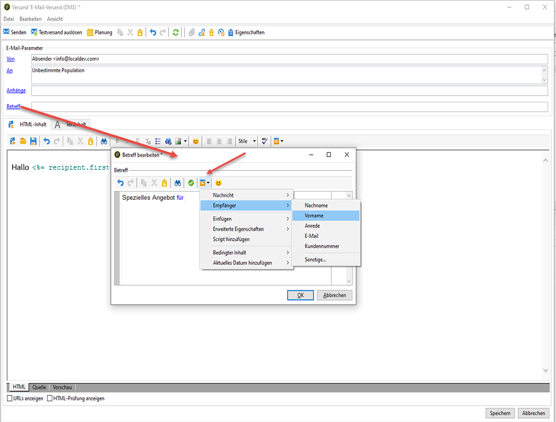
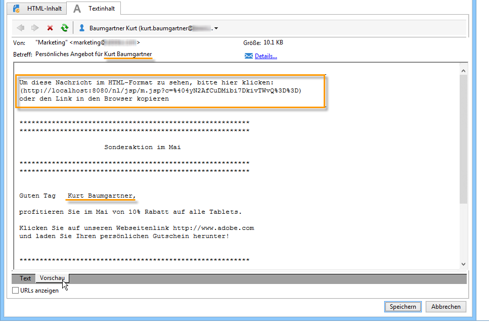

# E-Mail-Inhalt erstellen{#defining-the-email-content}

## Absender {#sender}

Klicken Sie auf **[!UICONTROL Von]**, um den Namen und die Adresse des Absenders zu konfigurieren.

In dem sich öffnenden Fenster werden alle im E-Mail-Header angezeigten Informationen erfasst. Diese können vom Benutzer individuell gestaltet werden. Nutzen Sie hierfür die Personalisierungsfelder, die über die Schaltflächen rechts der Eingabefelder eingefügt werden.

Informationen zum Einfügen und Verwenden von Personalisierungsfeldern finden Sie im Abschnitt [Über die Personalisierung](../../delivery/using/about-personalization.md).

>[!NOTE]
>
>* Die Absenderadresse wird standardmäßig auch als Antwortadresse verwendet.
>* Die E-Mail-Header-Parameter müssen zwingend angegeben werden. Standardmäßig sind die Werte, die bei der Konfiguration des Softwareverteilungs-Assistenten angegeben wurden, vorausgefüllt. Weiterführende Informationen finden Sie im [Installationshandbuch](../../installation/using/deploying-an-instance.md).
>* Die Angabe der Absenderadresse ist für den E-Mail-Versand zwingend erforderlich (gemäß RFC-Standard).
>* Adobe Campaign führt eine Syntax-Prüfung der angegebenen E-Mail-Adressen durch.

>[!IMPORTANT]
>
>Im Rahmen der durch Internet-Serviceanbieter (ISP) zur Eindämmung unerwünschter E-Mails (SPAM) durchgeführten Kontrollen empfiehlt Adobe Campaign, dass die als Absender- und Antwortadresse angegebenen E-Mail-Konten tatsächlich existieren. Wenden Sie sich diesbezüglich bitte an den Administrator Ihres E-Mail-Programms.

## Nachrichtenbetreff {#message-subject}

Der Betreff der Nachricht wird im gleichnamigen Feld konfiguriert. Sie können ihn direkt im Feld eingeben oder auf den Link **[!UICONTROL Betreff]** klicken, um ein Script zu erfassen. Die Personalisierungsschaltfläche ermöglicht die Einfügung eines Datenbankfeldes.

>[!IMPORTANT]
>
>Die Angabe des Betreffs der Nachricht ist zwingend erforderlich.

Der Inhalt von Personalisierungsfeldern wird beim Versand der Nachrichten durch die im Empfängerprofil gespeicherten Werte ersetzt.

In oben stehender Nachricht wurde beispielsweise der Betreff der Nachricht für jeden Empfänger entsprechend seiner Profildaten personalisiert.

>[!NOTE]
>
>Die Verwendung von Personalisierungsfeldern wird im Abschnitt [Über die Personalisierung](../../delivery/using/about-personalization.md) beschrieben.

Mit dem Popup-Fenster **[!UICONTROL Emoticon einfügen]** können Sie auch Emoticons zu Ihrer Betreffzeile hinzufügen.

## Nachrichteninhalt {#message-content}

>[!IMPORTANT]
>
>Aus Datenschutzgründen empfehlen wir die Verwendung von HTTPS für alle externen Ressourcen.

Der eigentliche Nachrichteninhalt wird im unteren Bereich des Versandkonfigurationsfensters erfasst.

Standardmäßig werden die Nachrichten den Angaben des Empfängers entsprechend im HTML- oder Textformat versandt. Um die korrekte Anzeige in allen E-Mail-Systemen zu gewährleisten, wird empfohlen, jeweils sowohl HTML- als auch Textinhalte zu erstellen. Weitere Informationen hierzu finden Sie unter [Wahl des Nachrichtenformats](#selecting-message-formats).

* Verwenden Sie die Schaltfläche **[!UICONTROL Öffnen]**, um HTML-Inhalt zu importieren. Sie haben auch die Möglichkeit, den Quellcode direkt in den Tab **[!UICONTROL Quelle]** einzufügen.

   Wenn Sie den [Digital Content Editor](../../web/using/about-campaign-html-editor.md) (DCE) verwenden, lesen Sie den Abschnitt zur [Auswahl einer Inhaltsvorlage](../../web/using/use-case--creating-an-email-delivery.md#step-3---selecting-a-content).

   >[!IMPORTANT]
   >
   >Der HTML-Inhalt muss vorab erstellt und anschließend in Adobe Campaign importiert werden. Der HTML-Editor ist nicht für die Inhaltserstellung vorgesehen.

   Der Tab **[!UICONTROL Vorschau]** ermöglicht es, das Rendering für einen Empfänger zu simulieren. Die Personalisierungsfelder und die bedingten Elemente des Inhalts werden durch die im ausgewählten Profil gespeicherten Informationen ersetzt.

   Über die verschiedenen Schaltflächen der Symbolleiste haben Sie Zugriff auf die Standard-Parameter für die Seitenaufmachung im HTML-Format.

   

   Durch Klick auf die Schaltfläche **[!UICONTROL Bild]** können Sie beispielsweise Bilder aus einer lokalen Datei oder aus der in Adobe Campaign enthaltenen Bibliothek einfügen.

   

   Zugriff auf die Bilder aus der Bibliothek besteht über den Ordner **[!UICONTROL Ressourcen > Online > Öffentliche Ressourcen]** des Ordnerbaums. Siehe auch [Bilder hinzufügen](#adding-images).

   Die letzte Schaltfläche in der Symbolleiste dient der Einfügung von Personalisierungsfeldern.

   >[!NOTE]
   >
   >Die Verwendung von Personalisierungsfeldern wird im Abschnitt [Über die Personalisierung](../../delivery/using/about-personalization.md) beschrieben.

   Die Tabs am unteren Seitenrand ermöglichen die Anzeige des HTML-Quellcodes der in Erstellung begriffenen Seite und des Renderings der Nachricht beim Empfänger inklusive Personalisierung. Klicken Sie hierfür auf den Tab **[!UICONTROL Vorschau]** und wählen Sie über die Symbolleisten-Schaltfläche **[!UICONTROL Personalisierung testen...]** einen Empfänger aus. Sie können dabei einen beliebigen oder einen in der Zielgruppe enthaltenen Empfänger wählen.

   

   Sie haben die Möglichkeit, die HTML-Nachricht zu validieren und den Inhalt des E-Mail-Headers zu prüfen.

   

* Verwenden Sie die Schaltfläche **[!UICONTROL Öffnen]**, um Textinhalt zu importieren. Sie haben auch die Möglichkeit, den Inhalt im Tab **[!UICONTROL Textinhalt]** direkt zu erfassen. Über die verschiedenen Schaltflächen der Symbolleiste können Sie die Textaufmachung ändern. Die letzte Schaltfläche in der Symbolleiste dient der Einfügung von Personalisierungsfeldern.

   

   Der Tab **[!UICONTROL Vorschau]** am unteren Seitenrand ermöglicht die Anzeige des Renderings der Nachricht beim Empfänger inklusive Personalisierung.

   

### Einfügen von Emoticons in eine E-Mail {#inserting-emoticons}

Sie können Emoticons in Ihren E-Mail-Inhalt einfügen.

1. Klicken Sie auf das Symbol **[!UICONTROL Emoticon einfügen]**.
1. Wählen Sie im Popup-Fenster ein Emoticon aus.

   

1. Klicken Sie danach auf die Schaltfläche **[!UICONTROL Schließen]**.

Informationen zum Anpassen der Emoticon-Liste finden Sie auf dieser [Seite](../../delivery/using/customizing-emoticon-list.md).

## Wahl des Nachrichtenformats {#selecting-message-formats}

Sie können das Format der zu versendenden E-Mails konfigurieren. Klicken Sie hierzu auf die Schaltfläche **[!UICONTROL Eigenschaften]** und begeben Sie sich in den Tab .

Im unteren Bereich des Fensters haben Sie die Wahl zwischen:

* **[!UICONTROL Empfängerangaben berücksichtigen]** (Standardmodus)

   Das Nachrichtenformat wird anhand der im Empfängerprofil im Feld **[!UICONTROL E-Mail-Format]** gespeicherten Informationen bestimmt. Wenn ein Empfänger ein bestimmtes Format angegeben hat, wird ihm die Nachricht in diesem Format zugestellt. Wenn das Feld leer ist, wird die Nachricht im Multipart-Alternative-Format versandt (siehe unten).

* **[!UICONTROL E-Mail-Programm des Empfängers das beste Format wählen lassen]**

   Die Nachricht enthält beide Formate: Text und HTML. Das beim Empfänger angezeigte Format hängt von der Konfiguration des E-Mail-Programms ab (Multipart-Alternative).

   >[!IMPORTANT]
   >
   >Bei dieser Option werden beide Versionen des Dokuments gesendet. Der hierdurch erhöhte Kapazitätsverbrauch kann den Versanddurchsatz beeinträchtigen.

* **[!UICONTROL Alle Nachrichten im Textformat senden]**

   Die Nachricht wird im Textformat gesendet. Das HTML-Format wird nicht gesendet, sondern nur für die Mirrorseite verwendet, auf die ein Empfänger gelangt, wenn er auf den entsprechenden Link in der Nachricht klickt.

## Interaktive Inhalte definieren {#amp-for-email-format}

Mit Adobe Campaign können Sie das neue interaktive Format [AMP für E-Mail](https://amp.dev/about/email/) testen, das unter bestimmten Bedingungen das Senden dynamischer E-Mails ermöglicht.

Weiterführende Informationen hierzu finden Sie in [diesem Abschnitt](../../delivery/using/defining-interactive-content.md).

## Inhaltsverwaltung (Content Management){#using-content-management}

Wenn Sie den Inhalt Ihres Versands mithilfe des Content Managements erstellen, ist es erforderlich, die zu verwendende Inhaltsvorlage in den Versandeigenschaften im **[!UICONTROL Erweitert]**-Tab des Versand-Assistenten anzugeben.

Ein zusätzlicher Tab erlaubt nun die Erstellung eines Inhalts, der automatisch den Regeln des Content Managements entsprechend formatiert und integriert wird.

>[!NOTE]
>
>Weitere Informationen zum Content Management in Adobe Campaign finden Sie in [diesem Abschnitt](../../delivery/using/about-content-management.md).

## Bilder hinzufügen {#adding-images}

E-Mail-Sendungen im HTML-Format können Bilder enthalten. Sie können im Versand-Assistenten entweder eine fertige HTML-Seite mit Bildern importieren oder Bilder im HTML-Editor über das **[!UICONTROL Bild]**-Symbol einfügen.

Diese Bilder können:

* lokal gespeichert sein oder von einem Server abgerufen werden;
* aus der Bibliothek der öffentlichen Ressourcen in Adobe Campaign stammen;

   Auf öffentliche Ressourcen kann im Knoten **[!UICONTROL Ressourcen > Online > Öffentliche Ressourcen]** des Navigationsbaums zugegriffen werden. Sie sind in einer Bibliothek zusammengefasst und können in E-Mails, Kampagnen, Aufgaben und dem Content Management verwendet werden.

* Weiterführende Informationen zu freigegebenen Assets in Adobe Experience Cloud finden Sie in [diesem Abschnitt](../../integrations/using/sharing-assets-with-adobe-experience-cloud.md).

>[!IMPORTANT]
>
>Um E-Mails über den Versand-Assistenten mit Bildern zu versehen, muss die Konfiguration der Adobe-Campaign-Instanz die Verwaltung öffentlicher Ressourcen zulassen. Dies wird im Softwareverteilungs-Assistenten festgelegt. In [diesem Abschnitt](../../installation/using/deploying-an-instance.md) finden Sie weiterführende Hinweise zur Konfiguration.

Der Versand-Assistent bietet die Möglichkeit, lokale oder in der Bibliothek enthaltene Bilder in den Inhalt der Nachrichten einzuschließen. Wählen Sie hierfür die Schaltfläche **[!UICONTROL Bild]** in der Symbolleiste des HTML-Inhalts aus.

>[!IMPORTANT]
>
>Um von den Empfängern gesehen werden zu können, müssen die Bilder auf einem extern zugänglichen Server gespeichert werden.

So verwalten Sie Bilder über den Versand-Assistenten:

1. Klicken Sie in der Symbolleiste auf das Symbol **[!UICONTROL Tracking &amp; Bilder]**.
   

1. Wählen Sie die Option **[!UICONTROL Bilder hochladen]** auf dem Tab **[!UICONTROL Bilder]**.
1. Dann können Sie festlegen, ob die Bilder in die E-Mail-Nachricht eingeschlossen werden sollen.
   

* Sie können Bilder manuell hochladen, ohne die Versandanalyse abwarten zu müssen. Klicken Sie dazu auf den Link **[!UICONTROL Bilder sofort online stellen...]**.
* Sie können einen anderen Pfad für Zugriff auf die Bilder auf dem Tracking-Server angeben. Geben Sie dazu einen Pfad in das Feld **[!UICONTROL URL der Bilder]** ein. Dieser Wert setzt den in den Parametern des Installationsassistenten definierten Wert außer Kraft.

Wenn Sie im Versand-Assistenten einen HTML-Inhalt öffnen, der Bilder mit relativen Pfadnamen enthält, wird Ihnen je nach Versandparametern vorgeschlagen, die Bilder sofort online zu stellen.

>[!IMPORTANT]
>
>Die Bildpfade werden entweder durch manuelles Online-Stellen der Bilder oder beim Senden der Nachrichten geändert.

### Versand einer Nachricht mit Bildern {#sending-a-message-with-images}

>[!NOTE]
>
>Wenn Sie Bilder, die Sie von einer personalisierten URL heruntergeladen haben, direkt als [Anhang](../../delivery/using/attaching-files.md) hinzufügen möchten, darf die Bildgröße standardmäßig nicht mehr als 100.000 Byte betragen. So lassen sich Leistungsprobleme verhindern. Dieser empfohlene Schwellenwert kann über [die Liste der Campaign Classic-Optionen](../../installation/using/configuring-campaign-options.md#delivery) konfiguriert werden.

Es soll folgende Versandnachricht mit vier Bildern erstellt werden:

Die Bilder stammen aus einem lokalen Verzeichnis oder von einer Webseite, wie Sie im **[!UICONTROL Quelle]**-Tab feststellen können.

Wählen Sie das Symbol **[!UICONTROL Tracking &amp; Bilder]** und dann den Tab **[!UICONTROL Bilder]** aus, um die Erkennung der in der Nachricht enthaltenen Bilder zu starten.

Für jedes erkannte Bild können Sie den Status prüfen:

* Lokale oder auf anderen Servern gespeicherte Bilder werden als **[!UICONTROL Noch nicht online]** gekennzeichnet, auch wenn der Server von außerhalb zugänglich ist (beispielsweise bei Bildern einer Webseite).
* Bilder werden als **[!UICONTROL Bereits online]** gekennzeichnet, wenn Sie zuvor, z. B. bei Erstellung eines anderen Versands, online gestellt wurden.
* Im Softwareverteilungs-Assistenten können Sie URLs angeben, die bei der Bilderkennung nicht berücksichtigt werden sollen. Das Online-Stellen dieser Bilder wird demnach **[!UICONTROL Ignoriert]**.

>[!NOTE]
>
>Ein Bild wird über seinen Inhalt und nicht seinen Namen oder Pfad identifiziert. Daher wird auch ein Bild, das zuvor bereits unter einem anderen Namen oder aus einem anderen Verzeichnis online gestellt wurde, als **[!UICONTROL Bereits online]** erkannt.

Bilder werden im Zuge der Nachrichtenanalyse auf den Server geladen, um von außerhalb zugänglich zu sein. Dies gilt nicht für lokal gespeicherte Bilder, die im Vorfeld hochzuladen sind.

Es besteht die Möglichkeit, das Online-Stellen der Bilder vorzuziehen, damit beispielsweise andere Adobe-Campaign-Benutzer im Rahmen gemeinsamer Versandprojekte darauf zugreifen können. Wählen Sie hierfür die Option **[!UICONTROL Online-Stellen der Bilder]** und klicken Sie auf den Link , um den Upload der Bilder auf den Server zu starten.

>[!NOTE]
>
>Dies löst die Änderung der Bild-URLs und insbesondere der Namen der Bilder aus.

Sobald die Bilder online sind, können Sie die Namens- und Pfadänderungen im **[!UICONTROL Quelle]**-Tab der Nachricht prüfen.

Durch Ankreuzen der Option **[!UICONTROL Bilder in die E-Mail einschließen (multipart related)]** haben Sie die Möglichkeit, in der entsprechenden Spalte für jedes Bild anzugeben, ob es in die E-Mail eingeschlossen werden soll oder nicht.

>[!NOTE]
>
>Wenn in der Nachricht lokale Bilder enthalten sind, ist die Änderung des Quellcodes der Nachricht zu bestätigen.

## Barcode in eine E-Mail einfügen{#inserting-a-barcode-in-an-email}

Die Barcode-Lösung bietet die Möglichkeit, verschiedene ein- oder zweidimensionale Code-Typen in den gängigsten Normen zu erstellen.

Barcodes können in Form eines Bitmaps dynamisch mithilfe eines durch Kundenkriterien definierten Werts erzeugt werden. Personalisierte Barcodes lassen sich dann über E-Mails in Marketingkampagnen integrieren. Der Empfänger kann die Nachricht ausdrucken und sie dem Unternehmen (z. B. bei einem Zahlvorgang) zum Scannen vorlegen.

Positionieren Sie den Cursor im Inhalt an der Stelle, an der der Barcode eingefügt werden soll, und klicken Sie auf die Personalisierungsschaltfläche. Wählen Sie **[!UICONTROL Einfügen > Barcode...]**.

Konfigurieren Sie dann die verschiedenen Elemente je nach Bedarf:

1. Wählen Sie den Barcode-Typ aus.

   * Für das 1D-Format stehen in Adobe Campaign folgende Typen zur Verfügung: Codabar, Code 128, GS1-128 (vormals EAN-128), UPC-A, UPC-E, ISBN, EAN-8, Code39, Interleaved 2 of 5, POSTNET und Royal Mail (RM4SCC).

      Beispiel eines 1D-Barcodes:

      

   * Die Typen DataMatrix und PDF417 betreffen das 2D-Format.

      Beispiel eines 2D-Barcodes:

      

   * Bei der Wahl eines QR-Codes ist die anzuwendende Fehlerkorrektur anzugeben. Die Quote bezeichnet den zu wiederholenden Informationsanteil und damit eine mehr oder weniger ausgeprägte Toleranz bei partieller Unlesbarkeit.

      

      Beispiel eines QR-Codes:

      

1. Geben Sie die gewünschte Größe des Barcodes an. Durch Angabe eines Faktors von x1 bis x10 kann die Größe angepasst werden.
1. Das Feld **[!UICONTROL Wert]** dient der Bestimmung des Barcode-Werts. Dieser kann einem Sonderangebot entsprechen oder durch eine Bedingungsfunktion definiert werden, beispielsweise den Wert eines kundenbezogenen Datenbankfelds.

   Unten stehendes Beispiel zeigt einen EAN-8-Barcode, in dem die Kundennummer eines Empfängers enthalten ist. Klicken Sie auf die Personalisierungsschaltfläche rechts vom Feld **[!UICONTROL Wert]** und wählen Sie die Option **[!UICONTROL Empfänger > Kundennummer]**.

   

1. Im Feld **[!UICONTROL Höhe]** können Sie die Höhe des Barcodes anpassen, ohne die Breite und somit die Abstände zwischen den Balken zu verändern.

   Bitte beachten Sie, dass keine einschränkende Kontrolle Ihrer Eingaben in Bezug auf den Barcode-Typ erfolgt. Sollte ein falscher oder nicht kompatibler Wert eingegeben werden, sehen Sie dies erst in der **Vorschau**. In diesem Fall ist der Barcode rot durchkreuzt.

   >[!NOTE]
   >
   >Der einem Barcode zugeteilte Wert ist vom Typ abhängig. So muss beispielsweise ein EAN-8-Barcode genau acht Ziffern enthalten.
   >
   >Die Personalisierungsschaltfläche rechts vom **[!UICONTROL Wert]**-Feld ermöglicht das Hinzufügen von den Wert ergänzenden Daten. Diese reichern den Barcode an, sofern der Barcode-Typ dies zulässt.
   >
   >Wenn Sie beispielsweise einen GS1-128-Barcode verwenden und zusätzlich zum Wert die Kundennummer des Empfängers angeben möchten, klicken Sie auf die Personalisierungsschaltfläche und wählen Sie die Option **[!UICONTROL Empfänger > Kundennummer]**. Wenn die Kundennummer des Empfängers korrekt in der Datenbank gespeichert ist, wird sie im Barcode berücksichtigt.

Bevor Sie den Versand starten, prüfen Sie im **[!UICONTROL Vorschau]**-Tab, dass der Inhalt wie gewünscht angezeigt wird.

>[!NOTE]
>
>Sollte ein Barcode-Wert sich als ungültig erweisen, erscheint das entsprechende Bild in der Vorschau rot durchkreuzt.

## E-Mail-Versand auf japanische Mobiltelefone {#sending-emails-on-japanese-mobiles}

### E-Mail-Formate für japanische Mobiltelefone {#email-formats-for-japanese-mobiles}

Adobe Campaign unterstützt drei spezifische Formate für E-Mails auf japanischen Mobiltelefonen für den japanischen Markt: **Deco-mail** (DoCoMo Mobiltelefone), **Decore Mail** (Softbank Mobiltelefone) und **Decoration Mail** (KDDI AU Mobiltelefone). Diese Formate unterliegen verschiedenen Einschränkungen hinsichtlich Kodierung, Struktur und Größe. Weiterführende Informationen zu Einschränkungen und Empfehlungen finden Sie in [diesem Abschnitt](#limitations-and-recommendations).

Damit ein Empfänger, der eines dieser Formate verwendet, Nachrichten korrekt angezeigt bekommt, wird empfohlen, das entsprechende Format **[!UICONTROL Deco-mail (DoCoMo)]**, **[!UICONTROL Decore Mail (Softbank)]** oder **[!UICONTROL Decoration Mail (KDDI AU)]** im Empfängerprofil auszuwählen:

Wenn Sie hingegen im Feld **[!UICONTROL E-Mail-Format]** eine der Optionen **[!UICONTROL Unbekannt]**, **[!UICONTROL HTML]** oder **[!UICONTROL Text]** auswählen, erkennt Adobe Campaign bei Versand der E-Mail das japanische Format, das zu verwenden ist, um eine korrekte Anzeige zu gewährleisten.

Dieses automatische Erkennungssystem beruht auf der in den E-Mail-Regeln **[!UICONTROL E-Mail-Formatverwaltung]** gespeicherten Domainliste. Weiterführende Informationen zur Verwaltung von E-Mail-Formaten finden Sie auf [dieser Seite](../../installation/using/email-deliverability.md#managing-email-formats).

### Einschränkungen und Empfehlungen {#limitations-and-recommendations}

Der E-Mail-Versand an Mobiltelefone unter Vertrag mit japanischen Anbietern (Softbank, DoCoMo, KDDI AU) unterliegt gewissen Einschränkungen.

Aus diesem Grund müssen Sie:

* ausschließlich Bilder im JPEG- oder GIF-Format verwenden;
* einen Versand erstellen, bei dem die Summe aus Text und HTML in keinem Fall 10.000 Bytes übersteigt (für KDDI AU und DoCoMo);
* Bilder verwenden, deren Gesamtgröße vor der Kodierung weniger als 100 KB beträgt;
* in einer Nachricht nicht mehr als 20 Bilder verwenden;
* ein reduziertes HTML-Format verwenden (für jeden Anbieter steht eine begrenzte Anzahl an Tags zur Verfügung).

>[!NOTE]
>
>Bei der Erstellung von Nachrichten sind die für die jeweiligen Anbieter spezifischen Einschränkungen zu berücksichtigen. Weiterführende Informationen dazu finden Sie hier:
>
>* Weiterführende Informationen zu DoCoMo finden Sie auf [dieser Seite](https://www.nttdocomo.co.jp/service/developer/make/content/deco_mail/index.html).
>* Weiterführende Informationen zu KDDI AU finden Sie auf [dieser Seite](https://www.au.com/ezfactory/tec/spec/decorations/template.html).
>* Weiterführende Informationen zu Softbank finden Sie auf [dieser Seite](https://www.support.softbankmobile.co.jp/partner/home_tech3/index.cfm).

### E-Mail-Inhalt testen {#testing-the-email-content}

#### Nachricht in der Vorschau betrachten {#previewing-the-message}

In Adobe Campaign haben Sie die Möglichkeit zu prüfen, ob das Format Ihrer Nachricht dem Versand an japanische Mobiltelefone angepasst ist.

Sobald Sie Ihren Inhalt erstellt und den Betreff der E-Mail angegeben haben, können Sie Anzeige und Formatierung der Nachricht kontrollieren.

Verwenden Sie hierzu im **[!UICONTROL Vorschau]**-Tab des Fensters zur Inhaltsbearbeitung den Link **[!UICONTROL Details...> Deco-Mail-Prüfung]**. Hier können Sie:

* prüfen, ob die Tags des HTML-Inhalts den mit dem japanischen Format einhergehenden Einschränkungen entsprechen;
* prüfen, ob die Anzahl an Bildern in der Nachricht nicht die durch das Format vorgegebene Höchstgrenze von maximal 20 Bildern überschreitet;
* prüfen, ob die Gesamtgröße nicht den Grenzwert von 100 KB übersteigt.

   

#### Typologieregel ausführen {#running-typology-rule}

Zusätzlich zur Vorschauprüfung wird eine zweite Prüfung durchgeführt, die an einen Testversand oder einen normalen Versand gekoppelt ist: Eine spezifische Typologieregel, die **[!UICONTROL Deco-mail-Analyse]**, kommt im Zuge der Analyse zur Anwendung.

>[!IMPORTANT]
>
>Diese Typologieregel wird nur dann ausgeführt, wenn mindestens ein Empfängerprofil für den Empfang von E-Mails im Format **[!UICONTROL Deco-mail (DoCoMo)]**, **[!UICONTROL Decore Mail (Softbank)]** oder **[!UICONTROL Decoration Mail (KDDI AU)]** konfiguriert wurde.

Mithilfe dieser Regel können Sie sich vergewissern, ob bei der Sendung die von den japanischen Anbietern vorgegebenen [Formateinschränkungen](#limitations-and-recommendations) respektiert werden, insbesondere im Hinblick auf die Gesamtgröße der E-Mail, die jeweilige Größe ihrer HTML- und Textanteile, die Anzahl an Bildern in der Nachricht sowie die Tags des HTML-Inhalts.

#### Testversand durchführen {#sending-proofs}

Sie können Testsendungen durchführen, um Ihren Versand zu testen. Wenn Sie dabei Ersatzadressen verwenden, geben Sie bitte die Adressen ein, die dem E-Mail-Format des verwendeten Profils entsprechen.

Beispielsweise können Sie die Adresse eines Profils durch test@softbank.ne.jp ersetzen, wenn das E-Mail-Format für dieses Profil zuvor in **[!UICONTROL Decore Mail (Softbank)]** definiert wurde.

### Nachrichten senden {#sending-messages}

Für den Versand einer E-Mail an Empfänger mit japanischen E-Mail-Formaten mit Campaign haben Sie zwei Möglichkeiten:

* Erstellen Sie zwei Sendungen, eine nur für japanische Empfänger und die andere für alle anderen Empfänger. Weitere Informationen dazu finden Sie in [diesem Abschnitt](#designing-a-specific-delivery-for-japanese-formats).
* Erstellen Sie einen einzigen Versand und Adobe Campaign erkennt das Format automatisch. Weitere Informationen dazu finden Sie in [diesem Abschnitt](#designing-a-delivery-for-all-formats).

#### Spezifischen Versand für japanische Formate erstellen {#designing-a-specific-delivery-for-japanese-formats}

Erstellen Sie einen Workflow mit zwei Sendungen: einen Versand, der für japanische Mobiltelefone bestimmt ist, und einen zweiten für Empfänger mit einem Standard-E-Mail-Format.

Verwenden Sie hierfür eine **[!UICONTROL Aufspaltung]**-Aktivität in Ihrem Workflow und definieren Sie die japanischen E-Mail-Formate (Deco-mail, Decoration Mail und Decore Mail) als Filterbedingungen.

#### Versand für alle Formate erstellen {#designing-a-delivery-for-all-formats}

Wenn Adobe Campaign die Formate dynamisch in Abhängigkeit von der Domain verwaltet (Profile mit E-Mail-Format **[!UICONTROL Unbekannt]**, **[!UICONTROL HTML]** oder **[!UICONTROL Text]**), können Sie für alle Empfänger denselben Versand verwenden.

Der Nachrichteninhalt wird sowohl für Empfänger mit japanischen Mobiltelefonen als auch für Standardempfänger korrekt angezeigt.

>[!IMPORTANT]
>
>Beachten Sie die Einschränkungen, denen die verschiedenen japanischen Formate (Deco-mail, Decoration Mail und Decore Mail) unterliegen. Weiterführende Informationen zu Einschränkungen finden Sie in [diesem Abschnitt](#limitations-and-recommendations).
