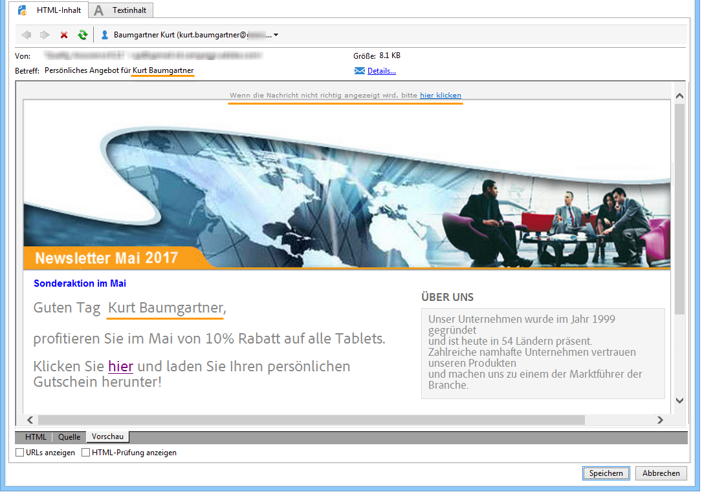
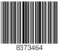

# Definieren des E-Mail-Inhalts {#defining-the-email-content}

## Absender {#sender}

Klicken Sie auf **[!UICONTROL Von]**, um den Namen und die Adresse des Absenders zu konfigurieren.

In dem sich öffnenden Fenster werden alle im E-Mail-Header angezeigten Informationen erfasst. Diese können vom Benutzer individuell gestaltet werden. Nutzen Sie hierfür die Personalisierungsfelder, die über die Schaltflächen rechts der Eingabefelder eingefügt werden.

Informationen zum Einfügen und Verwenden von Personalisierungsfeldern finden Sie im Abschnitt [Über die Personalisierung](about-personalization.md).

>[!NOTE]
>
>* Die Absenderadresse wird standardmäßig auch als Antwortadresse verwendet.
>* Die Header-Parameter dürfen nicht leer sein. Standardmäßig enthalten sie die Werte, die beim Konfigurieren des Bereitstellungsassistenten eingegeben werden. Weiterführende Informationen finden Sie in [diesem Abschnitt](../../installation/using/deploying-an-instance.md).
>* Die Angabe der Absenderadresse ist für den E-Mail-Versand zwingend erforderlich (gemäß RFC-Standard).
>* Adobe Campaign führt eine Syntax-Prüfung der angegebenen E-Mail-Adressen durch.

>[!CAUTION]
>
>Um Probleme mit der Zustellbarkeit zu vermeiden, müssen die E-Mail-Konten vorhanden sein und überwacht werden, die den für Sendungen und Antworten angegebenen Adressen entsprechen. Wenden Sie sich an Ihre Systemadministratorin bzw. Ihren Systemadministrator.

## Nachrichtenbetreff {#message-subject}

Der Betreff der Nachricht wird im entsprechenden Feld konfiguriert. Sie können sie direkt in das Feld eingeben oder auf die Schaltfläche **[!UICONTROL Betreff]** -Link, um ein Skript einzugeben. Über den Personalisierungslink können Sie Datenbankfelder in den Betreff einfügen.

>[!IMPORTANT]
>
>Die Angabe des Betreffs der Nachricht ist zwingend erforderlich.

Der Inhalt von Personalisierungsfeldern wird beim Versand der Nachrichten durch die im Empfängerprofil gespeicherten Werte ersetzt.

In oben stehender Nachricht wurde beispielsweise der Betreff der Nachricht für jeden Empfänger entsprechend seiner Profildaten personalisiert.

>[!NOTE]
>
>Die Verwendung von Personalisierungsfeldern wird im Abschnitt [Über die Personalisierung](about-personalization.md) beschrieben.

Mit dem Popup-Fenster **[!UICONTROL Emoticon einfügen]** können Sie auch Emoticons zu Ihrer Betreffzeile hinzufügen.

## Nachrichteninhalt {#message-content}

>[!IMPORTANT]
>
>Aus Datenschutzgründen empfehlen wir die Verwendung von HTTPS für alle externen Ressourcen.

Der eigentliche Nachrichteninhalt wird im unteren Bereich des Versandkonfigurationsfensters erfasst.

Standardmäßig werden die Nachrichten den Angaben des Empfängers entsprechend im HTML- oder Textformat versandt. Um die korrekte Anzeige in allen E-Mail-Systemen zu gewährleisten, wird empfohlen, jeweils sowohl HTML- als auch Textinhalte zu erstellen. Weitere Informationen hierzu finden Sie unter [Wahl des Nachrichtenformats](email-parameters.md#selecting-message-formats).

* Verwenden Sie zum Importieren eines HTML-Inhalts die **[!UICONTROL Öffnen]** Schaltfläche. Sie können den Quellcode auch direkt in die **[!UICONTROL Quelle]** Unterregisterkarte.

  Wenn Sie den [Digital Content Editor](../../web/using/about-campaign-html-editor.md) (DCE) verwenden, lesen Sie den Abschnitt zur [Auswahl einer Inhaltsvorlage](../../web/using/use-case-creating-an-email-delivery.md#step-3---selecting-a-content).

  >[!IMPORTANT]
  >
  >Der HTML-Inhalt muss vorab erstellt und anschließend in Adobe Campaign importiert werden. Der HTML-Editor ist nicht für die Inhaltserstellung vorgesehen.

  Der Tab **[!UICONTROL Vorschau]** ermöglicht es, das Rendering für einen Empfänger zu simulieren. Die Personalisierungsfelder und die bedingten Elemente des Inhalts werden durch die im ausgewählten Profil gespeicherten Informationen ersetzt.

  Über die verschiedenen Schaltflächen der Symbolleiste haben Sie Zugriff auf die Standard-Parameter für die Seitenaufmachung im HTML-Format.

  

  Sie können Bilder aus einer lokalen Datei oder aus einer Bildbibliothek in Adobe Campaign in Nachrichten einfügen. Klicken Sie dazu auf die Schaltfläche **[!UICONTROL Bild]** und wählen Sie die entsprechende Option aus.

  

  Zugriff auf die Bilder aus der Bibliothek besteht über den Ordner **[!UICONTROL Ressourcen > Online > Öffentliche Ressourcen]** des Ordnerbaums. Siehe auch [Bilder hinzufügen](#adding-images).

  Die letzte Schaltfläche in der Symbolleiste dient der Einfügung von Personalisierungsfeldern.

  >[!NOTE]
  >
  >Die Verwendung von Personalisierungsfeldern wird im Abschnitt [Über die Personalisierung](about-personalization.md) beschrieben.

  In den Tabs am unteren Seitenrand können Sie den HTML-Code der zu erstellenden Seite anzeigen und das Rendering der Nachricht mit ihrer Personalisierung anzeigen. Um diese Anzeige zu starten, klicken Sie auf **[!UICONTROL Vorschau]** und wählen Sie einen Empfänger mithilfe der **[!UICONTROL Personalisierung testen]** in der Symbolleiste. Sie können einen Empfänger aus der/den definierten Zielgruppe(n) auswählen oder einen anderen Empfänger auswählen.

  

  Sie haben die Möglichkeit, die HTML-Nachricht zu validieren und den Inhalt des E-Mail-Headers zu prüfen.

  

* Verwenden Sie die Schaltfläche **[!UICONTROL Öffnen]**, um Textinhalt zu importieren. Sie haben auch die Möglichkeit, den Inhalt im Tab **[!UICONTROL Textinhalt]** direkt zu erfassen. Über die verschiedenen Schaltflächen der Symbolleiste können Sie die Textaufmachung ändern. Die letzte Schaltfläche in der Symbolleiste dient der Einfügung von Personalisierungsfeldern.

  

  Der Tab **[!UICONTROL Vorschau]** am unteren Seitenrand ermöglicht die Anzeige des Renderings der Nachricht beim Empfänger inklusive Personalisierung.

  

## Definieren interaktiver Inhalte {#amp-for-email-format}

Mit Adobe Campaign können Sie das neue interaktive Format [AMP für E-Mail](https://amp.dev/de/about/email/) testen, das unter bestimmten Bedingungen das Senden dynamischer E-Mails ermöglicht.

Weiterführende Informationen hierzu finden Sie in [diesem Abschnitt](defining-interactive-content.md).

## Verwenden von Content-Management {#using-content-management}

Sie können den Inhalt des Versands mithilfe der Inhaltsverwaltungsformulare direkt im Versand-Assistenten definieren. Referenzieren Sie hierzu die Veröffentlichungsvorlage des zu verwendenden Content Managements im **[!UICONTROL Erweitert]** in den Versandeigenschaften.

Ein zusätzlicher Tab erlaubt nun die Erstellung eines Inhalts, der automatisch den Regeln des Content Managements entsprechend formatiert und integriert wird.

>[!NOTE]
>
>Weitere Informationen zum Content Management in Adobe Campaign finden Sie in [diesem Abschnitt](about-content-management.md).

## Einfügen von Emoticons {#inserting-emoticons}

Sie können Emoticons in Ihren E-Mail-Inhalt einfügen.

1. Klicken Sie auf das Symbol **[!UICONTROL Emoticon einfügen]**.
1. Wählen Sie im Popup-Fenster ein Emoticon aus.

   

1. Klicken Sie danach auf die Schaltfläche **[!UICONTROL Schließen]**.

Informationen zum Anpassen der Emoticon-Liste finden Sie auf dieser [Seite](customizing-emoticon-list.md).

## Hinzufügen von Bildern {#adding-images}

E-Mail-Sendungen im HTML-Format können Bilder enthalten. Im Versand-Assistenten können Sie eine HTML-Seite mit Bildern importieren oder Bilder direkt mithilfe des HTML-Editors über die **[!UICONTROL Bild]** Symbol.

### Schutzmechanismen {#img-guardrails}

Um Performance-Probleme zu vermeiden, dürfen die in den E-Mails enthaltenen Bilder nicht größer als 100 KB sein. Diese standardmäßig festgelegte Beschränkung kann in der Option `NmsDelivery_MaxDownloadedImageSize` geändert werden. Adobe empfiehlt jedoch dringend, große Bilder in E-Mail-Sendungen zu vermeiden.

Weitere Informationen finden Sie in der [Liste der Campaign Classic-Optionen](../../installation/using/configuring-campaign-options.md#delivery).

### Bildtypen {#img-types}

Diese Bilder können:

* lokal gespeichert sein oder von einem Server abgerufen werden;
* aus der Bibliothek der öffentlichen Ressourcen in Adobe Campaign stammen;

  Auf öffentliche Ressourcen kann im Knoten **[!UICONTROL Ressourcen > Online > Öffentliche Ressourcen]** des Navigationsbaums zugegriffen werden. Sie sind in einer Bibliothek zusammengefasst und können in E-Mails, Kampagnen, Aufgaben und dem Content Management verwendet werden.

* Ein für Adobe Experience Cloud freigegebenes Asset. Weitere Informationen finden Sie in [diesem Abschnitt](../../integrations/using/sharing-assets-with-adobe-experience-cloud.md).

### Einfügen und Verwalten von Bildern {#manage-images}

Mit dem Versand-Assistenten können Sie lokale oder in der Bibliothek gespeicherte Bilder zum Nachrichteninhalt hinzufügen. Klicken Sie dazu auf die Schaltfläche **[!UICONTROL Bild]** in der Symbolleiste für HTML-Inhalt.

>[!IMPORTANT]
>
>Um von den Empfängern gesehen werden zu können, müssen die Bilder auf einem extern zugänglichen Server gespeichert werden.

So verwalten Sie Bilder über den Versand-Assistenten:

1. Klicken Sie in der Symbolleiste auf das Symbol **[!UICONTROL Tracking &amp; Bilder]**.
   

1. Wählen Sie die Option **[!UICONTROL Bilder hochladen]** auf dem Tab **[!UICONTROL Bilder]**.
1. Dann können Sie festlegen, ob die Bilder in die E-Mail-Nachricht eingeschlossen werden sollen.
   

* Sie können Bilder manuell hochladen, ohne die Versandanalyse abwarten zu müssen. Klicken Sie dazu auf den Link **[!UICONTROL Bilder sofort online stellen...]**.
* Sie können einen anderen Pfad für Zugriff auf die Bilder auf dem Tracking-Server angeben. Geben Sie dazu einen Pfad in das Feld **[!UICONTROL URL der Bilder]** ein. Dieser Wert setzt den in den Parametern des Installationsassistenten definierten Wert außer Kraft.

Wenn Sie im Versandassistenten HTML-Inhalte mit eingebundenen Bildern öffnen, erhalten Sie eine Nachricht, die Ihnen die Möglichkeit gibt, die Bilder gemäß den Versandparametern sofort hochzuladen.

>[!IMPORTANT]
>
> Die Bild-URLs werden beim manuellen Hochladen oder beim Senden von Nachrichten geändert.
> 

### Anwendungsfall: Versand einer Nachricht mit Bildern {#uc-images}

Hier ist ein Beispiel für einen Versand mit vier Bildern zu sehen:

Die Bilder stammen aus einem lokalen Verzeichnis oder von einer Webseite, wie Sie im **[!UICONTROL Quelle]**-Tab feststellen können.

Wählen Sie das Symbol **[!UICONTROL Tracking &amp; Bilder]** und dann den Tab **[!UICONTROL Bilder]** aus, um die Erkennung der in der Nachricht enthaltenen Bilder zu starten.

Für jedes erkannte Bild können Sie den Status prüfen:

* Lokale oder auf anderen Servern gespeicherte Bilder werden als **[!UICONTROL Noch nicht online]** gekennzeichnet, auch wenn der Server von außerhalb zugänglich ist (beispielsweise bei Bildern einer Webseite).
* Bilder werden als **[!UICONTROL Bereits online]** gekennzeichnet, wenn Sie zuvor, z. B. bei Erstellung eines anderen Versands, online gestellt wurden.
* Im Bereitstellungassistenten können Sie URLs angeben, die bei der Bilderkennung nicht berücksichtigt werden sollen. Das Online-Stellen dieser Bilder wird demnach **[!UICONTROL Ignoriert]**.

>[!NOTE]
>
>Bilder werden anhand ihres Inhalts und nicht anhand ihrer Zugriffspfade identifiziert. Das bedeutet, dass ein zuvor unter einem anderen Namen oder in einem anderen Verzeichnis hochgeladenes Bild als **[!UICONTROL Bereits online]**.

Bilder werden im Zuge der Nachrichtenanalyse auf den Server geladen, um von außerhalb zugänglich zu sein. Dies gilt nicht für lokal gespeicherte Bilder, die im Vorfeld hochzuladen sind.

Sie können die Arbeit vorantreiben und Bilder hochladen, damit sie von anderen Adobe Campaign-Benutzern angezeigt werden können. Dies kann bei der Zusammenarbeit nützlich sein. Klicken Sie dazu auf **[!UICONTROL Laden Sie die Bilder sofort hoch ...]** , um die Bilder auf den Server hochzuladen.

>[!NOTE]
>
>Dies löst die Änderung der Bild-URLs und insbesondere der Namen der Bilder aus.

Sobald die Bilder online sind, können Sie die Namens- und Pfadänderungen im **[!UICONTROL Quelle]**-Tab der Nachricht prüfen.

Durch Ankreuzen der Option **[!UICONTROL Bilder in die E-Mail einschließen (multipart related)]** haben Sie die Möglichkeit, in der entsprechenden Spalte für jedes Bild anzugeben, ob es in die E-Mail eingeschlossen werden soll oder nicht.

>[!NOTE]
>
>Wenn in der Nachricht lokale Bilder enthalten sind, ist die Änderung des Quellcodes der Nachricht zu bestätigen.

## Einfügen eines personalisierten Barcodes{#insert-a-barcode}

Die Barcode-Lösung bietet die Möglichkeit, verschiedene ein- oder zweidimensionale Code-Typen in den gängigsten Normen zu erstellen.

Barcodes können in Form eines Bitmaps dynamisch mithilfe eines durch Kundenkriterien definierten Werts erzeugt werden. Personalisierte Barcodes lassen sich dann über E-Mails in Marketingkampagnen integrieren. Der Empfänger kann die Nachricht ausdrucken und sie dem Unternehmen (z. B. bei einem Zahlvorgang) zum Scannen vorlegen.

Um einen Barcode in eine E-Mail einzufügen, platzieren Sie den Cursor an der Stelle im Inhalt, an der er angezeigt werden soll, und klicken Sie dann auf die Personalisierungsschaltfläche . Auswählen **[!UICONTROL Include > Barcode..]**.

Konfigurieren Sie dann die verschiedenen Elemente je nach Bedarf:

1. Wählen Sie den Barcode-Typ aus.

   * Für das 1D-Format stehen in Adobe Campaign folgende Typen zur Verfügung: Codabar, Code 128, GS1-128 (vormals EAN-128), UPC-A, UPC-E, ISBN, EAN-8, Code39, Interleaved 2 of 5, POSTNET und Royal Mail (RM4SCC).

     Beispiel eines 1D-Barcodes:

     

   * Die Typen DataMatrix und PDF417 betreffen das 2D-Format.

     Beispiel eines 2D-Barcodes:

     

   * Bei der Wahl eines QR-Codes ist die anzuwendende Fehlerkorrektur anzugeben. Die Quote bezeichnet den zu wiederholenden Informationsanteil und damit eine mehr oder weniger ausgeprägte Toleranz bei partieller Unlesbarkeit.

     

     Beispiel eines QR-Codes:

     

1. Geben Sie die gewünschte Größe des Barcodes an. Durch Angabe eines Faktors von x1 bis x10 kann die Größe angepasst werden.
1. Das Feld **[!UICONTROL Wert]** dient der Bestimmung des Barcode-Werts. Dieser kann einem Sonderangebot entsprechen oder durch eine Bedingungsfunktion definiert werden, beispielsweise den Wert eines kundenbezogenen Datenbankfelds.

   Dieses Beispiel zeigt einen EAN-8-Barcode, dem die Kundennummer eines Empfängers hinzugefügt wurde. Klicken Sie auf die Personalisierungsschaltfläche rechts vom **[!UICONTROL Wert]** Feld und wählen Sie **[!UICONTROL Empfänger > Kontonummer]**.

   

1. Im Feld **[!UICONTROL Höhe]** können Sie die Höhe des Barcodes anpassen, ohne die Breite und somit die Abstände zwischen den Balken zu verändern.

   Je nach Barcode-Typ gibt es keine einschränkende Eingabekontrolle. Wenn ein Barcode-Wert falsch ist, wird er nur in **Vorschau** -Modus, in dem der Barcode rot durchkreuzt wird.

   >[!NOTE]
   >
   >Der einem Barcode zugeteilte Wert ist vom Typ abhängig. So muss beispielsweise ein EAN-8-Barcode genau acht Ziffern enthalten.
   >
   >Die Personalisierungsschaltfläche rechts vom **[!UICONTROL Wert]**-Feld ermöglicht das Hinzufügen von den Wert ergänzenden Daten. Diese reichern den Barcode an, sofern der Barcode-Typ dies zulässt.
   >
   >Wenn Sie beispielsweise einen GS1-128-Barcode verwenden und zusätzlich zum Wert die Kundennummer des Empfängers angeben möchten, klicken Sie auf die Personalisierungsschaltfläche und wählen Sie die Option **[!UICONTROL Empfänger > Kundennummer]**. Wenn die Kundennummer des Empfängers korrekt in der Datenbank gespeichert ist, wird sie im Barcode berücksichtigt.

Nachdem diese Elemente konfiguriert wurden, können Sie Ihre E-Mail abschließen und senden. Um Fehler zu vermeiden, sollten Sie vor dem Versand stets sicherstellen, dass Ihr Inhalt korrekt angezeigt wird. Klicken Sie hierzu auf die Schaltfläche **[!UICONTROL Vorschau]** Registerkarte.

>[!NOTE]
>
>Sollte ein Barcode-Wert sich als ungültig erweisen, erscheint das entsprechende Bild in der Vorschau rot durchkreuzt.

