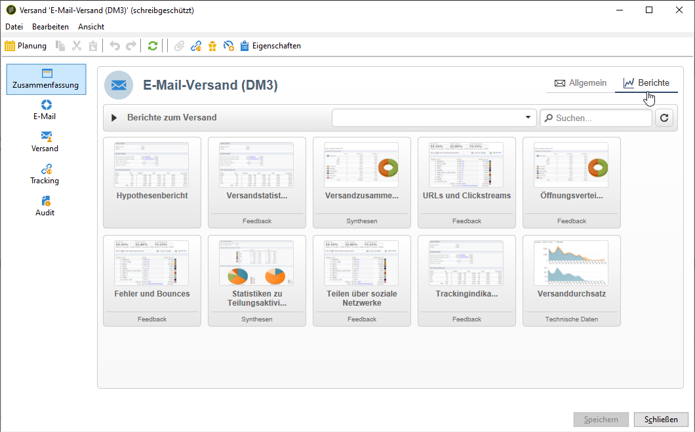
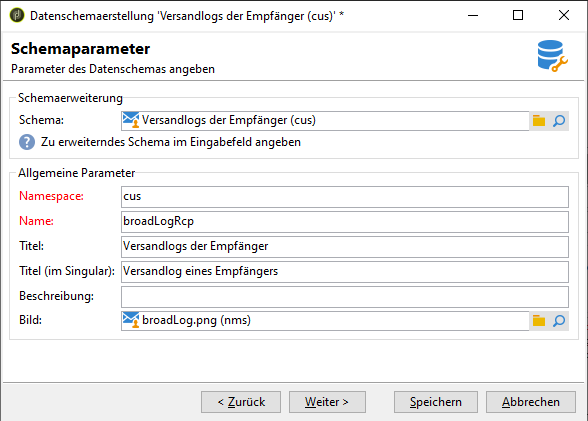
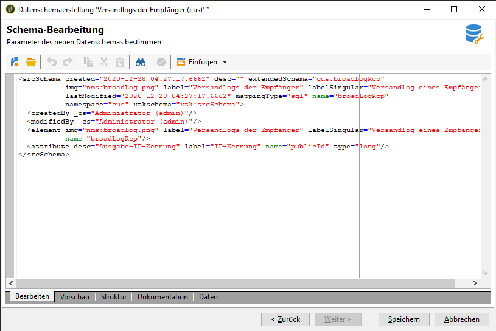
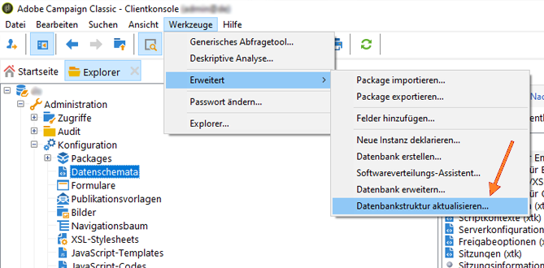
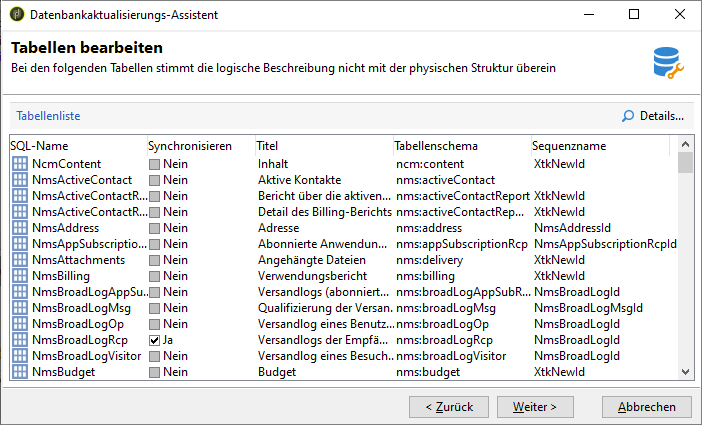
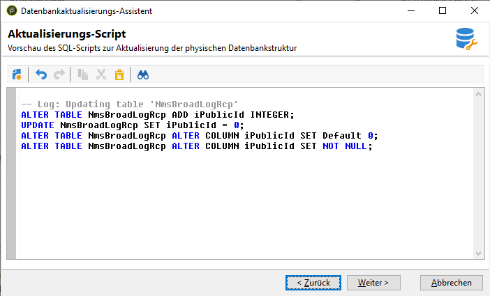
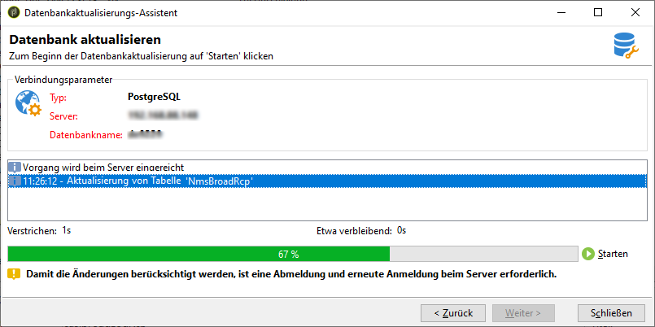
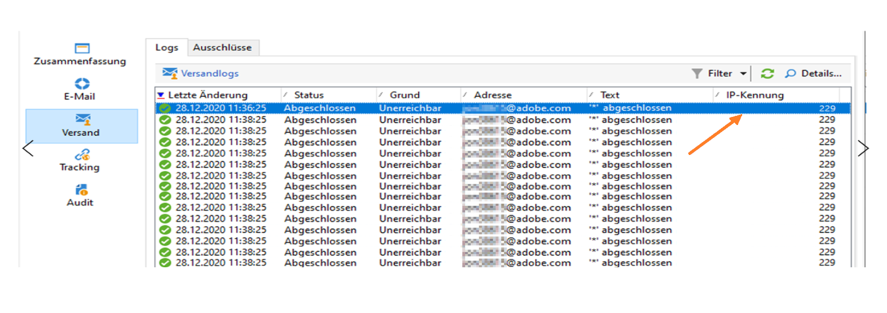

# Versand-Dashboard {#delivery-dashboard}

Im **Versand-Dashboard** können Sie Sendungen beobachten und etwaige Probleme beim Nachrichtenversand erkennen.

Sie können Informationen zu einem Versand abrufen und bei Bedarf bearbeiten. Beachten Sie, dass nach Abschluss des Versands der Inhalt der einzelnen Tabs nicht mehr verändert werden kann und nur zur Ansicht zur Verfügung steht.

Die folgenden Informationen können Sie mit den verschiedenen Tabs im Dashboard überwachen:

* [Versandzusammenfassung](#delivery-summary)
* [Versandberichte](#delivery-reports)
* [Versandlogs, Mirrorseiten, Ausschlüsse](#delivery-logs-and-history)
* [Versandverfolgungslogs und -verlauf](#tracking-logs)
* [Versand-Rendering](#delivery-rendering)
* [Versandverfolgung](#delivery-audit-)


**Verwandte Themen:**

* [Ursachen von fehlgeschlagenen Sendungen](../../delivery/using/understanding-delivery-failures.md)
* [Funktionsweise der Quarantäneverwaltung](../../delivery/using/understanding-quarantine-management.md)
* [Best Practices beim Versand](../../delivery/using/delivery-best-practices.md)
* [Verwalten der Zustellbarkeit](../../delivery/using/about-deliverability.md)

## Versandzusammenfassung {#delivery-summary}

Der Tab **[!UICONTROL Zusammenfassung]** enthält die Merkmale des Versands: Versandstatus, verwendeter Kanal, Absenderinformationen, Betreff, Informationen zur Ausführung.

## Versandberichte {#delivery-reports}

Über den Link **[!UICONTROL Berichte]**, auf den Sie über den Tab **[!UICONTROL Zusammenfassung]** zugreifen können, können Sie eine Berichtserie zur Versandaktion anzeigen: allgemeiner Versandbericht, detaillierter Bericht, Versandbericht, Verteilung von fehlgeschlagenen Nachrichten, Öffnungsrate, Klicks und Transaktionen usw.

Der Inhalt dieses Tabs kann entsprechend Ihren Anforderungen konfiguriert werden. Weitere Informationen zu Versandberichten finden Sie in [diesem Abschnitt](../../reporting/using/delivery-reports.md).



## Versandlogs, -verlauf und -ausschlüsse {#delivery-logs-and-history}

Der **[!UICONTROL Versand]**-Tab zeigt die Versandlogs, d. h. die Liste der Zustellversuche, und zeigt für jeden Empfänger den Status des Versands sowie die entsprechenden Nachrichten an.

Sie haben die Möglichkeit, beispielsweise nur fehlgeschlagene Zustellversuche anzuzeigen oder die Empfänger, die in Quarantäne gekommen sind. Klicken Sie hierfür auf die Schaltfläche **[!UICONTROL Filter]** und wählen Sie **[!UICONTROL Nach Status]**. Wählen Sie nun den gewünschten Status aus der Dropdown-Liste aus. Auf [dieser Seite](../../delivery/using/delivery-statuses.md) werden die unterschiedlichen Status beschrieben.

>[!NOTE]
>
>Die Liste mit den Versandlogs kann wie jede beliebige Liste im Campaign Classic angepasst werden. Sie können beispielsweise eine Spalte hinzufügen, um zu erfahren, welche IP-Adresse die einzelnen E-Mails in einem Versand gesendet hat. Weitere Informationen hierzu finden Sie im Anwendungsfall in [diesem Abschnitt](#use-case).


Mit dem Link **[!UICONTROL Mirrorseite für diese Nachricht anzeigen...]** können Sie die Mirrorseite für den Inhalt des aus der Liste ausgewählten Versands in einem neuen Fenster anzeigen.

Die Mirrorseite steht nur für Sendungen zur Verfügung, für die HTML-Inhalte definiert wurden. Weitere Informationen finden Sie unter [Mirrorseite erstellen](../../delivery/using/sending-messages.md#generating-the-mirror-page).


## Versandverfolgungslogs und -verlauf {#tracking-logs}

Im **[!UICONTROL Tracking]**-Tab wird der Tracking-Verlauf des Versands angezeigt. Hier werden die Tracking-Informationen bezüglich aller von Adobe Campaign gesendeten Nachrichten, d. h. alle getrackten URLs gelistet. Tracking-Informationen werden stündlich aktualisiert.

>[!NOTE]
>
>Sollte das Tracking für einen Versand nicht aktiviert worden sein, wird dieser Tab nicht angezeigt.

Die Tracking-Konfiguration erfolgt im Versand-Assistenten. Siehe [Getrackte Links konfigurieren](../../delivery/using/how-to-configure-tracked-links.md).

Interpretationen der **[!UICONTROL Trackingdaten]** finden Sie in den Versandberichten. Weiterführende Informationen dazu finden Sie in [diesem Abschnitt](../../reporting/using/delivery-reports.md).


## Inbox Rendering {#delivery-rendering}

Der Tab **[!UICONTROL Inbox Rendering]** ermöglicht es Ihnen, eine Vorschau der Nachricht in den verschiedenen Kontexten anzuzeigen, in denen sie empfangen werden kann, und die Kompatibilität mit gängigen Desktops und Anwendungen zu überprüfen.

So können Sie sicherstellen, dass Ihre Nachricht den Empfängern in unterschiedlichen Webclients, Webmails und Geräten optimal dargestellt wird.

Weitere Informationen zum Inbox Rendering finden Sie auf [dieser Seite](../../delivery/using/inbox-rendering.md).


## Versandverfolgung {#delivery-audit-}

Der Tab **[!UICONTROL Audit]** enthält das Versandlog und alle Meldungen zu den Testsendungen.

Mit der Schaltfläche **[!UICONTROL Aktualisieren]** können Sie die Daten aktualisieren. Verwenden Sie die Schaltfläche **[!UICONTROL Filter]**, um einen Filter für die Daten zu definieren.

Eventuelle Fehler oder Warnmeldungen werden durch spezifische Symbole hervorgehoben. Siehe [Versand analysieren](../../delivery/using/steps-validating-the-delivery.md#analyzing-the-delivery).

Ein Untertab listet die durchgeführten **[!UICONTROL Testsendungen]** auf.


Sie können die Anzeige in diesem Fenster (wie auch in den Tabs **[!UICONTROL Versand]** bzw. **[!UICONTROL Tracking]**) anpassen und die Spalten auswählen, die angezeigt werden sollen. Klicken Sie hierfür auf das Symbol **[!UICONTROL Liste konfigurieren]** in der rechten unteren Ecke des Bildschirms. Weiterführende Informationen zur Listenanzeige finden Sie in [diesem Abschnitt](../../platform/using/adobe-campaign-workspace.md#configuring-lists).

## Synchronisation des Versand-Dashboards {#delivery-dashboard-synchronization}

Im Versand-Dashboard können Sie anhand der verarbeiteten Nachrichten und der Versandlogs überprüfen, ob Ihr Versand erfolgreich durchgeführt wurde.

Manche Indikatoren oder Status können falsch oder nicht aktuell sein. Gehen Sie zur Behebung dieses Problems wie folgt vor:

* Wenn der Versandstatus falsch angezeigt wird, vergewissern Sie sich, dass alle nötigen Validierungen für diesen Versand durchgeführt wurden und die Workflows **[!UICONTROL operationMgt]** und **[!UICONTROL deliveryMgt]** problemlos ablaufen. Dieses Problem kann auch auftreten, wenn vom Versand eine Affinität verwendet wird, die in der Sendeinstanz nicht konfiguriert wurde.

* Wenn Ihre Versandindikatoren noch null anzeigen und eine Mid-Sourcing-Konfiguration verwendet wird, überprüfen Sie den technischen Workflow **[!UICONTROL Mid-Sourcing (Versandzähler)]**. Starten Sie ihn, wenn sein Status nicht **[!UICONTROL Gestartet]** lautet. Sie können dann die Indikatoren neu berechnen lassen, indem Sie mit der rechten Maustaste den entsprechenden Versand im Adobe Campaign-Explorer und danach **[!UICONTROL Aktionen]** > **[!UICONTROL Sende- und Berichtindikatoren neu berechnen...]** auswählen. Weiterführende Informationen zu Trackingindikatoren finden Sie in diesem [Abschnitt](../../reporting/using/delivery-reports.md#tracking-indicators).

* Wenn Ihr Versandzähler nicht die Anzahl Ihrer Sendungen anzeigt, lassen Sie die Indikatoren neu berechnen, indem Sie mit der rechten Maustaste im Adobe Campaign-Explorer den entsprechenden Versand und danach **[!UICONTROL Aktionen]** > **[!UICONTROL Sende- und Berichtindikatoren neu berechnen...]** auswählen, um eine neue Synchronisation durchzuführen. Weiterführende Informationen zu Trackingindikatoren finden Sie in diesem [Abschnitt](../../reporting/using/delivery-reports.md#tracking-indicators).

* Wenn Ihr Versandzähler nicht auf dem aktuellen Stand für Mid-Sourcing-Bereitstellungen ist, vergewissern Sie sich, dass der technische Workflow **[!UICONTROL Mid-Sourcing (Versandzähler)]** läuft. Weiterführende Informationen dazu finden Sie auf dieser [Seite](../../installation/using/mid-sourcing-deployment.md).

Sie können Ihre Sendungen auch mithilfe unterschiedlicher Berichte über das Versand-Dashboard nachverfolgen. Weiterführende Informationen dazu finden Sie in [diesem Abschnitt](../../reporting/using/delivery-reports.md).

## Anwendungsfall: Hinzufügen der IP-Adressen der Absender zu den Logs {#use-case}

In diesem Abschnitt erfahren Sie, wie Sie den Versandlogs Informationen über die IP-Adresse hinzufügen, die die entsprechende E-Mail in einem Versand gesendet hat.

>[!NOTE]
>
>Diese Änderung wird unterschiedlich ausgeführt, je nachdem, ob Sie eine einzelne Instanz oder eine Mid-Sourcing-Instanz verwenden. Stellen Sie vor der Änderung sicher, dass Sie mit der E-Mail sendenden Instanz verbunden sind.

### Schritt 1: Schema erweitern

Um **publicID** zu Ihren Versandlogs hinzuzufügen, müssen Sie das Schema zuerst erweitern. Sie können wie folgt vorgehen.

1. Erstellen Sie eine Schemaerweiterung unter **[!UICONTROL Administration]** > **[!UICONTROL Konfiguration]** > **[!UICONTROL Datenschemata]** > **[!UICONTROL Neu]**.

   Weitere Informationen zu Schemaerweiterungen finden Sie auf [dieser Seite](../../configuration/using/extending-a-schema.md).

1. Wählen Sie **[!UICONTROL wideLogRcp]** aus, um die Versandlogs des Empfängers (nms) zu erweitern und einen benutzerdefinierten Namespace anzugeben. In diesem Fall ist es &quot;cus&quot;:

   

   >[!NOTE]
   >
   >Wenn sich Ihre Instanz im Mid-Sourcing befindet, müssen Sie mit dem wideLogMid-Schema arbeiten.

1. Fügen Sie das neue Feld in Ihre Erweiterung ein. In diesem Beispiel müssen Sie Folgendes ersetzen:

   ```
   <element img="nms:broadLog.png" label="Recipient delivery logs" labelSingular="Recipient delivery log" name="broadLogRcp"/>
   ```

   mit:

   ```
   <element img="nms:broadLog.png" label="Recipient delivery logs" labelSingular="Recipient delivery log" name="broadLogRcp">
   <attribute desc="Outbound IP identifier" label="IP identifier"
   name="publicId" type="long"/>
   </element>
   ```

   

### Schritt 2: Datenbankstruktur aktualisieren

Nachdem Sie die Änderungen vorgenommen haben, müssen Sie die Datenbankstruktur so aktualisieren, dass sie mit ihrer logischen Beschreibung übereinstimmt.

Gehen Sie dazu wie folgt vor:

1. Klicken Sie auf das Menü **[!UICONTROL Tools]** > **[!UICONTROL Erweitert]** > **[!UICONTROL Datenbankstruktur aktualisieren...]**.

   

1. Im Fenster **[!UICONTROL Tabellen bearbeiten]** wird die Tabelle **[!UICONTROL NmsBroadLogRcp]** (bzw. die Tabelle **[!UICONTROL wideLogMid]**, wenn Sie sich in einer Mid-Sourcing-Umgebung befinden) wie folgt aktiviert:

   

   >[!IMPORTANT]
   >
   >Vergewissern Sie sich stets, dass außer der Tabelle **[!UICONTROL NmsBroadLoGRcp]** (oder der Tabelle **[!UICONTROL wideLogMid]**, wenn Sie sich in einer Mid-Sourcing-Umgebung befinden) keine anderen Änderungen vorgenommen wurden. Wenn ja, heben Sie die Aktivierung der anderen Tabellen auf.

1. Klicken Sie auf **[!UICONTROL Weiter]**, um die Eingaben zu bestätigen. Der folgende Bildschirm wird angezeigt:

   

1. Klicken Sie auf **[!UICONTROL Weiter]** und dann auf **[!UICONTROL Starten]**, um die Datenbankstruktur zu aktualisieren. Die Indexerstellung beginnt. Dieser Schritt kann je nach der Anzahl der Zeilen in der Tabelle **[!UICONTROL NmsBroadLogRcp]** lange dauern.

   

>[!NOTE]
>
>Sobald die Aktualisierung der physischen Struktur der Datenbank erfolgreich abgeschlossen wurde, müssen Sie sich vom Server abmelden und wieder anmelden, damit die Änderungen berücksichtigt werden.

### Schritt 3: Änderung überprüfen

Um zu bestätigen, dass alles korrekt funktioniert hat, müssen Sie den Bildschirm &quot;Versandlogs&quot; aktualisieren.

Rufen Sie dazu die Versandlogs auf und fügen Sie die Spalte &quot;IP-Kennung&quot; hinzu.


>[!NOTE]
>
>Informationen zum Konfigurieren von Listen in der Campaign Classic-Oberfläche finden Sie auf [dieser Seite](../../platform/using/adobe-campaign-workspace.md).

Im Tab **[!UICONTROL Versand]** sollten Sie nach den Änderungen Folgendes sehen:


