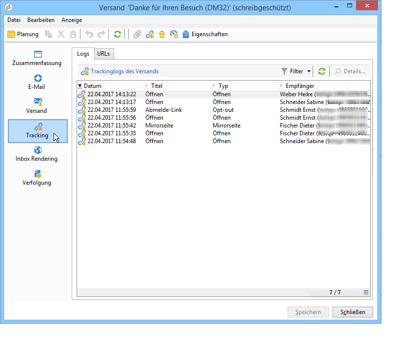
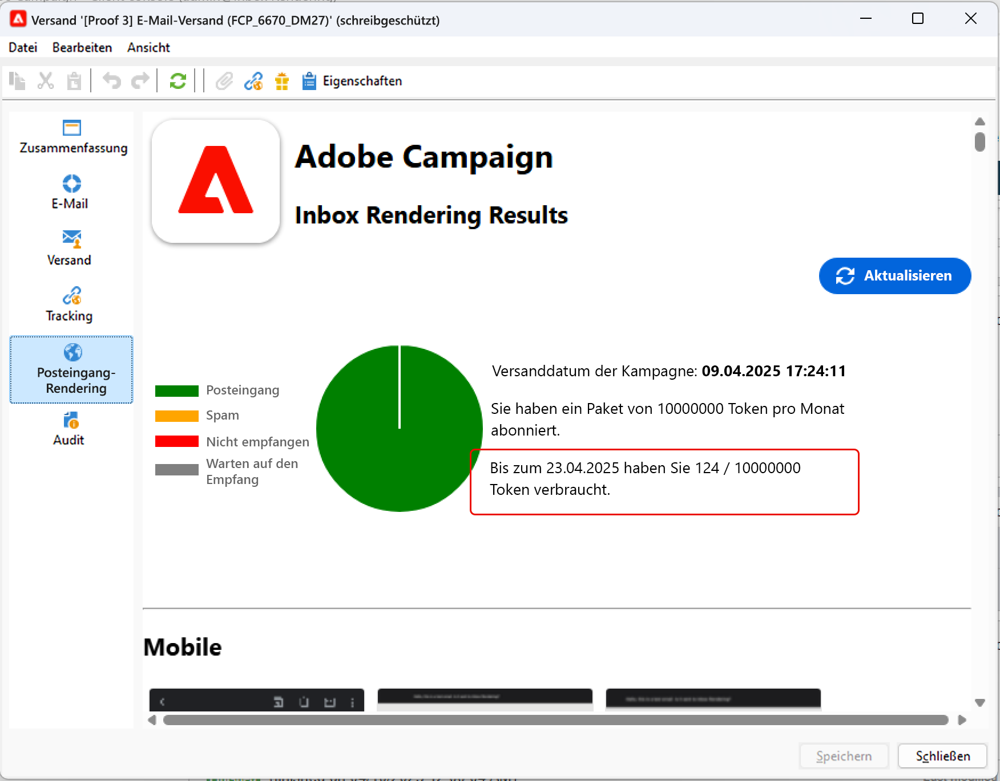

# Versand-Dashboard {#delivery-dashboard}

Im **Versand-Dashboard** können Sie Sendungen beobachten und etwaige Probleme beim Nachrichtenversand erkennen.

Sie können Informationen zu einem Versand abrufen und bei Bedarf bearbeiten. Beachten Sie, dass Tabulatorinhalte nach dem Senden des Versands möglicherweise nicht mehr geändert werden.

Hier sind die Informationen, die Sie mit den verschiedenen Registerkarten im Dashboard überwachen können:

* [Versandzusammenfassung](#delivery-summary)
* [Versandberichte](#delivery-reports)
* [Versandlogs, Mirrorseiten, Ausnahmen](#delivery-logs-and-history)
* [Versand-Trackinglogs und Geschichte](#tracking-logs)
* [Versand-Rendering](#delivery-rendering)
* [Versandverfolgung](#delivery-audit-)


**Verwandte Themen:**

* [Ursachen von fehlgeschlagenen Sendungen](../../delivery/using/understanding-delivery-failures.md)
* [Funktionsweise der Quarantäneverwaltung](../../delivery/using/understanding-quarantine-management.md)
* [Best Practices beim Versand](../../delivery/using/delivery-best-practices.md)
* [Verwalten der Zustellbarkeit](../../delivery/using/about-deliverability.md)

## Versandzusammenfassung {#delivery-summary}

Der Tab **[!UICONTROL Zusammenfassung]** enthält die Merkmale des Versands: Versandstatus, verwendeter Kanal, Absenderinformationen, Betreff, Informationen zur Ausführung.

## Versandberichte {#delivery-reports}

Über den Link **[!UICONTROL Berichte]**, auf den Sie über die Registerkarte **[!UICONTROL Zusammenfassung]** zugreifen können, können Sie eine Reihe von Berichten zu der Aktion &quot;Versand&quot;anzeigen: Bericht des Versands, detaillierter Bericht, Bericht des Versands, Verteilung von Meldungen mit Fehlern, Öffnungsrate, Klicks und Transaktionen usw.

Der Inhalt dieser Registerkarte kann entsprechend Ihren Anforderungen konfiguriert werden. Weitere Informationen zu Versandberichten finden Sie in [diesem Abschnitt](../../reporting/using/delivery-reports.md).


## Versandlogs, Verlauf und Ausschlüsse {#delivery-logs-and-history}

Der **[!UICONTROL Versand]**-Tab zeigt die Versandlogs, d. h. die Liste der Zustellversuche, und zeigt für jeden Empfänger den Status des Versands an.

Sie haben die Möglichkeit, beispielsweise nur fehlgeschlagene Zustellversuche anzuzeigen oder die Empfänger, die in Quarantäne gekommen sind. Klicken Sie hierfür auf die Schaltfläche **[!UICONTROL Filter]** und wählen Sie **[!UICONTROL Nach Status]**. Wählen Sie nun den gewünschten Status aus der Dropdown-Liste aus. Unterschiedliche Status werden auf [dieser Seite](../../delivery/using/delivery-statuses.md) beschrieben.

>[!NOTE]
>
>Die Liste mit den Versandlogs kann wie jede beliebige Liste im Campaign Classic angepasst werden. Sie können beispielsweise eine Spalte hinzufügen, um zu ermitteln, welche IP-Adresse in einem Versand an jede E-Mail gesendet wurde. Weitere Informationen hierzu finden Sie im Verwendungsfall, der in [diesem Abschnitt](#use-case) beschrieben ist.


Die **[!UICONTROL Mirrorseite für diese Meldung anzeigen...Über den]**-Link können Sie die Mirrorseite für den Inhalt des aus der Liste ausgewählten Versands in einem neuen Fenster Ansicht haben.

Die Mirrorseite steht nur für Versand zur Verfügung, für die HTML-Inhalte definiert wurden. Weitere Informationen finden Sie unter [Mirrorseite erstellen](../../delivery/using/sending-messages.md#generating-the-mirror-page).


## Versand-Trackinglogs und -Verlauf {#tracking-logs}

Im **[!UICONTROL Tracking]**-Tab wird der Tracking-Verlauf des Versands angezeigt. Hier werden die Tracking-Informationen bezüglich aller von Adobe Campaign gesendeten Nachrichten, d. h. alle getrackten URLs gelistet. Tracking-Informationen werden stündlich aktualisiert.

>[!NOTE]
>
>Sollte das Tracking für einen Versand nicht aktiviert worden sein, wird dieser Tab nicht angezeigt.

Die Tracking-Konfiguration erfolgt im Versand-Assistenten. Siehe [Getrackte Links konfigurieren](../../delivery/using/how-to-configure-tracked-links.md).

Interpretationen der **[!UICONTROL Trackingdaten]** finden Sie in den Versandberichten. Weiterführende Informationen dazu finden Sie in [diesem Abschnitt](../../reporting/using/delivery-reports.md).



## Inbox Rendering {#delivery-rendering}

Die Registerkarte **[!UICONTROL Inbox-Rendering]** ermöglicht es Ihnen, die Meldung in den verschiedenen Kontexten, in denen sie empfangen werden kann, Vorschau und die Kompatibilität in wichtigen Desktops und Anwendungen zu überprüfen.

Auf diese Weise können Sie sicherstellen, dass Ihre Nachricht den Empfängern auf einer Vielzahl von Web-Clients, Web-Mails und Geräten optimal angezeigt wird.

Weitere Informationen zum Rendering im Posteingang finden Sie auf [dieser Seite](../../delivery/using/inbox-rendering.md)



## Versandverfolgung {#delivery-audit-}

Die Registerkarte **[!UICONTROL Audit]** enthält das Versand-Protokoll und alle Meldungen zu den Testversänden.

Mit der Schaltfläche **[!UICONTROL Aktualisieren]** können Sie die Daten aktualisieren. Verwenden Sie die Schaltfläche **[!UICONTROL Filter]**, um einen Filter für die Daten zu definieren.

Eventuelle Fehler oder Warnmeldungen werden durch spezifische Symbole hervorgehoben. Siehe [Versand analysieren](../../delivery/using/steps-validating-the-delivery.md#analyzing-the-delivery).

Ein Untertab listet die durchgeführten **[!UICONTROL Testsendungen]** auf.


Sie können die Anzeige in diesem Fenster (wie auch in den Tabs **[!UICONTROL Versand]** bzw. **[!UICONTROL Tracking]**) anpassen und die Spalten auswählen, die angezeigt werden sollen. Klicken Sie hierfür auf das Symbol **[!UICONTROL Liste konfigurieren]** in der rechten unteren Ecke des Bildschirms. Weiterführende Informationen zur Listenanzeige finden Sie in [diesem Abschnitt](../../platform/using/adobe-campaign-workspace.md#configuring-lists).

## Synchronisation des Versand-Dashboards {#delivery-dashboard-synchronization}

Im Versand-Dashboard können Sie anhand der verarbeiteten Nachrichten und der Versandlogs überprüfen, ob Ihr Versand erfolgreich durchgeführt wurde.

Manche Indikatoren oder Status können falsch oder nicht aktuell sein. Gehen Sie zur Behebung dieses Problems wie folgt vor:

* Wenn der Versandstatus falsch angezeigt wird, vergewissern Sie sich, dass alle nötigen Validierungen für diesen Versand durchgeführt wurden und die Workflows **[!UICONTROL operationMgt]** und **[!UICONTROL deliveryMgt]** problemlos ablaufen. Dieses Problem kann auch auftreten, wenn vom Versand eine Affinität verwendet wird, die in der Sendeinstanz nicht konfiguriert wurde.

* Wenn Ihre Versandindikatoren noch null anzeigen und eine Mid-Sourcing-Konfiguration verwendet wird, überprüfen Sie den technischen Workflow **[!UICONTROL Mid-Sourcing (Versandzähler)]**. Starten Sie ihn, wenn sein Status nicht **[!UICONTROL Gestartet]** lautet. Sie können dann die Indikatoren neu berechnen lassen, indem Sie mit der rechten Maustaste den entsprechenden Versand im Adobe Campaign-Explorer und danach **[!UICONTROL Aktionen]** > **[!UICONTROL Sende- und Berichtindikatoren neu berechnen...]** auswählen. Weiterführende Informationen zu Trackingindikatoren finden Sie in diesem [Abschnitt](../../reporting/using/delivery-reports.md#tracking-indicators).

* Wenn Ihr Versandzähler nicht die Anzahl Ihrer Sendungen anzeigt, lassen Sie die Indikatoren neu berechnen, indem Sie mit der rechten Maustaste im Adobe Campaign-Explorer den entsprechenden Versand und danach **[!UICONTROL Aktionen]** > **[!UICONTROL Sende- und Berichtindikatoren neu berechnen...]** auswählen, um eine neue Synchronisation durchzuführen. Weiterführende Informationen zu Trackingindikatoren finden Sie in diesem [Abschnitt](../../reporting/using/delivery-reports.md#tracking-indicators).

* Wenn Ihr Versandzähler nicht auf dem aktuellen Stand für Mid-Sourcing-Bereitstellungen ist, vergewissern Sie sich, dass der technische Workflow **[!UICONTROL Mid-Sourcing (Versandzähler)]** läuft. Weiterführende Informationen dazu finden Sie auf dieser [Seite](../../installation/using/mid-sourcing-deployment.md).

Sie können Ihre Sendungen auch mithilfe unterschiedlicher Berichte über das Versand-Dashboard nachverfolgen. Weiterführende Informationen dazu finden Sie in [diesem Abschnitt](../../reporting/using/delivery-reports.md).

## Verwendungsfall: Hinzufügen der IP-Adressen von Absendern zu den Protokollen {#use-case}

In diesem Abschnitt erfahren Sie, wie Sie den Versandlogs Informationen über die IP-Adresse hinzufügen, die jede E-Mail in einem Versand gesendet hat.

>[!NOTE]
>
>Diese Änderung unterscheidet sich, wenn Sie eine Instanz oder eine Mid-Sourcing-Instanz verwenden. Stellen Sie vor der Änderung sicher, dass Sie mit der E-Mail-Sendeinstanz verbunden sind.

### Schritt 1: Schema erweitern

Um **publicID** zu Ihren Versandlogs hinzuzufügen, müssen Sie das Schema zuerst erweitern. Sie können wie folgt fortfahren.

1. Erstellen Sie eine Schema-Erweiterung unter **[!UICONTROL Administration]** > **[!UICONTROL Configuration]** > **[!UICONTROL Data Schemas]** > **[!UICONTROL New]**.

   Weitere Informationen zu Schema-Erweiterungen finden Sie auf [dieser Seite](../../configuration/using/extending-a-schema.md).

1. Wählen Sie **[!UICONTROL wideLogRcp]** aus, um die Empfänger-Versandlogs (nms) zu erweitern und einen benutzerdefinierten Namensraum zu definieren. In diesem Fall ist es &quot;cus&quot;:

   

   >[!NOTE]
   >
   >Wenn sich Ihre Instanz im Mid-Sourcing befindet, müssen Sie mit dem Schema wideLogMid arbeiten.

1. hinzufügen Sie das neue Feld in Ihrer Erweiterung. In diesem Beispiel müssen Sie Folgendes ersetzen:

   ```
   <element img="nms:broadLog.png" label="Recipient delivery logs" labelSingular="Recipient delivery log" name="broadLogRcp"/>
   ```

   von:

   ```
   <element img="nms:broadLog.png" label="Recipient delivery logs" labelSingular="Recipient delivery log" name="broadLogRcp">
   <attribute desc="Outbound IP identifier" label="IP identifier"
   name="publicId" type="long"/>
   </element>
   ```

   

### Schritt 2: Datenbankstruktur aktualisieren

Nachdem Sie die Änderungen vorgenommen haben, müssen Sie die Datenbankstruktur so aktualisieren, dass sie der logischen Beschreibung entspricht.

Gehen Sie dazu wie folgt vor:

1. Klicken Sie auf **[!UICONTROL Tools]** > **[!UICONTROL Erweitert]** > **[!UICONTROL Datenbankstruktur aktualisieren...]**-Menü.

   

1. Im Fenster **[!UICONTROL Tabellen bearbeiten]** wird die Tabelle **[!UICONTROL NmsBroadLogRcp]** (bzw. die Tabelle **[!UICONTROL wideLogMid]**, wenn Sie sich in einer Mid-Sourcing-Umgebung befinden) wie folgt markiert:

   

   >[!IMPORTANT]
   >
   >Vergewissern Sie sich stets, dass keine andere Änderung erfolgt, außer der Tabelle **[!UICONTROL NmsBroadLoGRcp]** (oder der Tabelle **[!UICONTROL wideLogMid]**, wenn Sie sich in einer Mid-Sourcing-Umgebung befinden). Wenn ja, heben Sie die Markierung für andere Tabellen auf.

1. Klicken Sie auf **[!UICONTROL Weiter]**, um die Eingaben zu bestätigen. Der folgende Bildschirm wird angezeigt:

   

1. Klicken Sie auf **[!UICONTROL Weiter]** und dann auf **[!UICONTROL Beginn]**, um die Datenbankstruktur zu aktualisieren. Die Indexerstellung beginnt. Dieser Schritt kann lang sein, je nach der Anzahl der Zeilen in der Tabelle **[!UICONTROL NmsBroadLogRcp]**.

   

>[!NOTE]
>
>Sobald die Aktualisierung der physischen Struktur der Datenbank erfolgreich abgeschlossen ist, müssen Sie die Verbindung trennen und neu verbinden, damit Ihre Änderungen berücksichtigt werden.

### Schritt 3: Änderung überprüfen

Um zu bestätigen, dass alles korrekt funktioniert hat, müssen Sie den Bildschirm &quot;Versandlogs&quot;aktualisieren.

Greifen Sie dazu auf die Versandlogs zu und fügen Sie die Spalte &quot;IP-ID&quot;hinzu.


>[!NOTE]
>
>Informationen zum Konfigurieren von Listen in der Campaign Classic-Oberfläche finden Sie auf [dieser Seite](../../platform/using/adobe-campaign-workspace.md).

Auf der Registerkarte **[!UICONTROL Versand]** sollten Sie nach Änderungen Folgendes sehen:


