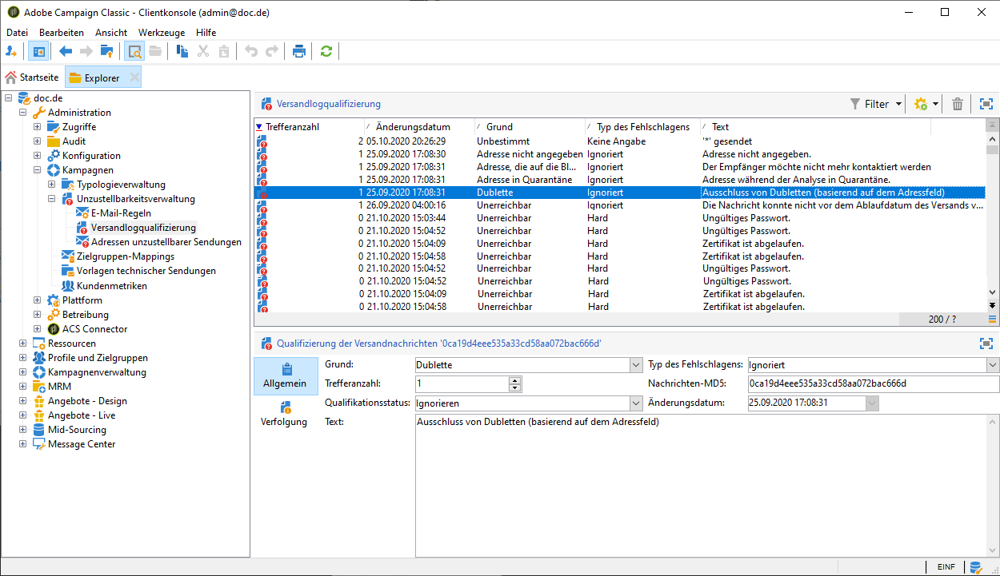
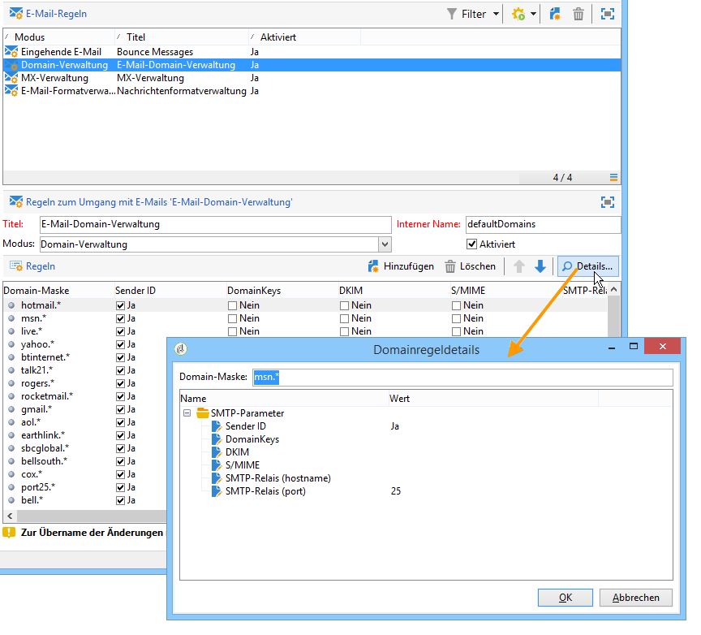

# Versandfehler und Quarantäneverwaltung {#delivery-failures-quarantine}

>[!NOTE]
>
>Eine umfassende Anleitung zu fehlgeschlagenen Sendungen und zur Quarantäneverwaltung finden Sie in der Dokumentation zu Campaign v8 . Dieser Inhalt gilt für Benutzende von Campaign Classic v7 und Campaign v8:
>
>* [Fehlgeschlagene Sendungen verstehen](https://experienceleague.adobe.com/en/docs/campaign/campaign-v8/send/monitor/delivery-failures){target="_blank"} - Behandelt Fehlertypen, Fehlerursachen, synchrone/asynchrone Fehler, Verwaltung von Wiederholungsversuchen und Fehlerbehebung
>* [Quarantäneverwaltung](https://experienceleague.adobe.com/en/docs/campaign/campaign-v8/send/monitor/quarantines){target="_blank"} - Behandelt Quarantäne vs. Blockierungsliste, weiche Fehlerschwellen, Quarantäneberichte und Adressenentfernung
>
>Auf dieser Seite wird die **Campaign Classic v7-spezifische Konfiguration** für die Bounce-Message- und Quarantäneverwaltung in Hybrid- und On-Premise-Bereitstellungen dokumentiert.

## Ursachen von fehlgeschlagenen Sendungen

Informationen zu häufigen Konzepten bei fehlgeschlagenen Sendungen, Fehlertypen und Anleitungen zur Fehlerbehebung finden Sie in der [Dokumentation zu Campaign v8 - Grundlagen zu fehlgeschlagenen Sendungen](https://experienceleague.adobe.com/en/docs/campaign/campaign-v8/send/monitor/delivery-failures){target="_blank"}.

## Bounce-Message-Konfiguration {#bounce-mail-config}

Die folgenden Konfigurationsoptionen sind für **Hybrid-/On-Premise-Bereitstellungen von Campaign Classic v7 verfügbar** um die Bounce-Message-Verarbeitung zu verwalten.

### Bounce-Postfachkonfiguration {#bounce-mailbox-configuration}

Bei On-Premise-Installationen wird die Konfiguration des Bounce-Postfachs in [diesem Abschnitt](../../installation/using/deploying-an-instance.md#managing-bounced-emails) beschrieben.

Asynchrone Fehlermeldungen werden von der Adobe Campaign-Plattform über das Bounce-Postfach erfasst und vom InMail-Prozess qualifiziert, um die Liste der E-Mail-Verwaltungsregeln anzureichern.

>[!NOTE]
>
>Für Campaign v8 Managed Cloud Services-Benutzer wird die Konfiguration der Bounce-Mailboxen von Adobe durchgeführt und verwaltet. Es ist keine Konfiguration erforderlich.

### Bounce-Message-Qualifizierungsverwaltung {#bounce-mail-qualification-management}

Bei On-Premise-Installationen und gehosteten/hybriden Installationen, die den bestehenden Campaign-MTA verwenden, erhält der Adobe Campaign-Versand-Server eine Fehlermeldung vom Messaging-Server oder dem Remote-DNS-Server, wenn der Versand einer E-Mail fehlschlägt. Die Liste der Fehler besteht aus Zeichenfolgen, die in der vom Remote-Server zurückgegebenen Nachricht enthalten sind. Jeder Fehlermeldung sind Fehlertypen und Gründe zugeordnet.

Auf die entsprechende Liste kann im Knoten **[!UICONTROL Administration > Kampagnenverwaltung > Unzustellbarkeitsverwaltung > Versandlogqualifizierung]** zugegriffen werden. Sie enthält alle von Adobe Campaign für die Qualifizierung von fehlgeschlagenen Sendungen verwendeten Regeln. Die Liste erhebt keinen Anspruch auf Vollständigkeit. Sie wird jedoch regelmäßig von Adobe Campaign angereichert und kann auch vom Benutzer ergänzt werden.

Die vom Remote-Server beim ersten Auftreten dieses Fehlertyps zurückgegebene Nachricht wird in der Spalte **[!UICONTROL Erster Text]** der Tabelle **[!UICONTROL Versandlogqualifizierung]** angezeigt. Wird diese Spalte nicht angezeigt, wählen Sie in der Liste rechts unten die Schaltfläche **[!UICONTROL Liste konfigurieren]**, um die Spalte auszuwählen.

Adobe Campaign filtert diese Nachricht, um den variablen Inhalt (wie IDs, Daten, E-Mail-Adressen, Telefonnummern usw.) zu löschen, und zeigt das gefilterte Ergebnis in der Spalte **[!UICONTROL Text]** an. Die Variablen werden durch **`#xxx#`** ersetzt, mit Ausnahme der Adressen, die durch ersetzt **`*`** werden.

Dadurch können alle Fehlschläge desselben Typs zusammengefasst werden und mehrfache Einträge für ähnliche Fehler in die Versandlogqualifizierungs-Tabelle werden vermieden.

>[!NOTE]
>
>Im Feld **[!UICONTROL Trefferanzahl]** wird die Anzahl der Vorkommnisse der Nachricht in der Liste angezeigt. Die maximale Anzahl ist 100 000. Sie können das Feld bearbeiten, wenn Sie es beispielsweise zurücksetzen möchten.

Folgende Qualifizierungsstatus von Bounce Messages treten auf:

* **[!UICONTROL Zu qualifizieren]**: Die Bounce Message konnte nicht automatisch qualifiziert werden und muss dem Zustellbarkeitsteam vorgelegt werden, um die korrekte Steuerung der Zustellbarkeit der Plattform zu gewährleisten. Nicht qualifizierte Bounce Messages werden nicht zur Anreicherung der E-Mail-Regeln herangezogen.
* **[!UICONTROL Beibehalten]**: Die Bounce Message wurde qualifiziert und wird vom Workflow **Zustellbarkeit** verwendet, um mit den existierenden E-Mail-Regeln verglichen zu werden und eventuell die Liste zu ergänzen.
* **[!UICONTROL Ignorieren]**: Die Bounce Message wird vom Campaign MTA ignoriert, was bedeutet, dass diese Bounce Message nie dazu führt, dass die Adresse des Empfängers unter Quarantäne gestellt wird. Sie wird vom Workflow **Zustellbarkeit** nicht verwendet und auch nicht an Client-Instanzen gesendet.

>[!NOTE]
>
>Bei Ausfall eines ISP werden über Campaign gesendete E-Mails fälschlicherweise als Bounces gekennzeichnet. Um dies zu korrigieren, müssen Sie die Bounce-Qualifizierung aktualisieren. Weitere Informationen hierzu finden Sie auf [dieser Seite](update-bounce-qualification.md).

### Konfiguration von E-Mail-Verwaltungsregeln {#email-management-rules}

Auf E-Mail-Regeln kann im Knoten **[!UICONTROL Administration > Kampagnen > Unzustellbarkeitsverwaltung]** zugegriffen werden. Im unteren Teil des Fensters können Sie die Details der Regeln sehen.

>[!NOTE]
>
>Die Standardparameter der Plattform werden im Bereitstellungsassistenten konfiguriert. Weiterführende Informationen erhalten Sie in [diesem Abschnitt](../../installation/using/deploying-an-instance.md).

Folgende Regeln sind in der Standardkonfiguration vorgesehen:

>[!IMPORTANT]
>
>* Der Versand-Server (MTA) muss neu gestartet werden, wenn die Parameter geändert wurden.
>* Neuerstellung und Änderungen von Verwaltungsregeln sollten erfahrenen Benutzern vorbehalten bleiben.

#### Eingehende E-Mails {#inbound-email}

Diese Regeln enthalten die Zeichenfolgen, die von Remote-Servern zurückgegeben werden können und die es Ihnen ermöglichen, den Fehler zu qualifizieren (**Hard**, **Soft** oder **Ignoriert**).

Wenn die Zustellung einer E-Mail fehlschlägt, gibt der Remote-Server eine Bounce-Nachricht an die in der Plattformkonfiguration angegebene Adresse zurück. Adobe Campaign vergleicht den Inhalt jeder Bounce-Nachricht mit den Zeichenfolgen in der Regelliste und weist ihr dann einen der drei Fehlertypen zu.

>[!NOTE]
>
>Der Benutzer kann eigene Regeln erstellen. Beim Import eines Packages und bei der Aktualisierung von Daten durch den Workflow **Zustellbarkeit** werden benutzerdefinierte E-Mail-Regeln überschrieben.

Weiterführende Informationen zur Bounce-Message-Qualifizierung finden Sie [diesem Abschnitt](#bounce-mail-qualification-management).

#### Domain-Verwaltung {#domain-management}

Bei On-Premise-Installationen wendet der MTA eine einzelne Regel **Domain-Verwaltung** auf alle Domains an.

<!---->

* Sie haben die Möglichkeit, gewisse Authentifizierungsnormen und Verschlüsselungsschlüssel zu aktivieren, um den Domain-Namen zu prüfen: **Sender ID**, **DomainKeys**, **DKIM**, **S/MIME**.
* Mit **SMTP-** können Sie die IP-Adresse und den Port eines Relay-Servers für eine bestimmte Domain konfigurieren. Weiterführende Informationen hierzu finden Sie in [diesem Abschnitt](../../installation/using/configuring-campaign-server.md#smtp-relay).

Wenn Ihre Nachrichten **[!UICONTROL im Namen von]** in der Absenderadresse angezeigt werden, stellen Sie sicher, dass Sie E-Mails nicht mit **Absender-ID** signieren, dem veralteten proprietären E-Mail-Authentifizierungsstandard von Microsoft. Wenn die Option **[!UICONTROL Sender ID]** aktiviert ist, deaktivieren Sie das entsprechende Feld und wenden Sie sich an die [Adobe-Kundenunterstützung](https://helpx.adobe.com/de/enterprise/admin-guide.html/enterprise/using/support-for-experience-cloud.ug.html). Ihre Zustellbarkeit wird nicht beeinträchtigt.

#### MX-Verwaltung {#mx-management}

Bei On-Premise-Installationen werden MX-Verwaltungsregeln verwendet, um den Fluss der ausgehenden E-Mails für eine bestimmte Domain zu regulieren.

<!---->

Diese Regeln stehen im Bereitstellungsassistenten zur Verfügung und können angepasst werden:

* **[!UICONTROL MX-]**: Diese Regel wird verwendet, um den Fluss ausgehender E-Mails für eine Domain zu steuern. Er nimmt Bounce-Nachrichten auf und blockiert gegebenenfalls den Versand.

* **[!UICONTROL Zeitraum]**: Der Zeitrahmen, in dem Nachrichten gedrosselt oder blockiert werden.

* **[!UICONTROL Limit]**: die maximal zulässige Anzahl von Nachrichten pro Zeitraum.

* **[!UICONTROL Type]**: Der Fehlertyp (Hard, Soft oder Ignoriert), der zum Bestimmen des Versandverhaltens verwendet wird. Definitionen zu Fehlertypen finden [&#x200B; in der &#x200B;](https://experienceleague.adobe.com/en/docs/campaign/campaign-v8/send/monitor/delivery-failures){target="_blank"} zu Campaign v8 .

Weiterführende Informationen zur MX-Verwaltung erhalten Sie in [diesem Abschnitt](../../installation/using/email-deliverability.md#about-mx-rules).

>[!NOTE]
>
>Für Benutzende von Campaign v8 Managed Cloud Services werden MX-Regeln und die E-Mail-Flussverwaltung von Adobe als Teil der verwalteten Infrastruktur verwaltet. Wenden Sie sich an die Adobe-Kundenunterstützung, wenn Sie MX-Einstellungen für bestimmte Anwendungsfälle anpassen müssen.

## Quarantäneverwaltung {#quarantine-management}

Eine umfassende Anleitung zur Quarantäneverwaltung finden Sie in der [Dokumentation zur Quarantäneverwaltung in Campaign v8](https://experienceleague.adobe.com/en/docs/campaign/campaign-v8/send/monitor/quarantines){target="_blank"}.

## Quarantäne-Konfiguration {#quarantine-config}

Die folgenden Konfigurationsoptionen sind für **Hybrid-/On-Premise-Bereitstellungen von Campaign Classic v7 verfügbar** um das Quarantäneverhalten anzupassen.

### Konfiguration der Fehlerschwellenwerte {#soft-error-threshold}

Bei On-Premise-Installationen mit dem alten Campaign MTA können Sie die Anzahl der Fehler und den Zeitraum zwischen zwei Fehlern ändern, bevor eine Adresse unter Quarantäne gestellt wird.

So konfigurieren Sie diese Einstellungen:

1. Greifen Sie über **[!UICONTROL Tools]** > **[!UICONTROL Erweitert]** > **[!UICONTROL Bereitstellungsassistent auf den Bereitstellungsassistenten zu]**
2. Navigieren Sie zu **[!UICONTROL E-Mail]** > **[!UICONTROL Erweiterte Parameter]**
3. Konfigurieren:
   * **Fehleranzahl**: Die maximale Anzahl von Softbounces, bevor eine Adresse unter Quarantäne gestellt wird (Standard: 5)
   * **Zeitraum zwischen zwei signifikanten**: Das Zeitfenster (in Sekunden) für die Fehlerzählung (Standard: 86.400 Sekunden = 1 Tag)

Wenn der Fehlerzähler den Schwellenwert erreicht, wird die Adresse unter Quarantäne gestellt. Wenn der letzte schwerwiegende Fehler vor mehr als 10 Tagen aufgetreten ist, wird der Fehlerzähler neu initialisiert.

Weitere Informationen finden Sie auf [&#x200B; Seite &#x200B;](communication-channels.md) unter **Versand** > **Weitere Zustellversuche konfigurieren**.

>[!NOTE]
>
>Für Benutzende von Campaign v8 Managed Cloud Services werden Wiederholungseinstellungen und Fehlerschwellenwerte von Adobe basierend auf der IP-Leistung und der Domain-Reputation verwaltet. Es ist keine Konfiguration erforderlich.

### Datenbankbereinigungs-Workflow {#database-cleanup-workflow}

Bei On-Premise-Installationen entfernt der technische Workflow **[!UICONTROL Datenbankbereinigung]** automatisch die Quarantäneadressen, die bestimmten Bedingungen entsprechen.

Greifen Sie auf diesen Workflow über **[!UICONTROL Administration]** > **&#x200B;**&#x200B;> **[!UICONTROL Technische Workflows]** > **[!UICONTROL Datenbankbereinigung]** zu.

Der Workflow entfernt Adressen in den folgenden Fällen aus der Quarantäne:

* Adressen im Status **[!UICONTROL Mit Fehlern]** nach einem erfolgreichen Versand
* Adressen im Status **[!UICONTROL Mit Fehlern]** , wenn der letzte Softbounce mehr als 10 Tage zurückliegt
* Adressen im Status **[!UICONTROL Mit Fehlern]** mit dem Fehler **[!UICONTROL Postfach voll]** nach 30 Tagen

Stellen Sie sicher, dass dieser Workflow regelmäßig ausgeführt wird (empfohlen: täglich), um die Hygiene der Quarantäneliste aufrechtzuerhalten.

Weiterführende Informationen zur Datenbankbereinigung finden Sie in [diesem Abschnitt](../../production/using/database-cleanup-workflow.md).

>[!NOTE]
>
>Benutzende von Campaign v8 Managed Cloud Services überwachen und verwalten den Datenbankbereinigungs-Workflow von Adobe.

### Besonderheiten der Quarantäne bei Push-Benachrichtigungen {#push-quarantine-specifics}

Für Campaign Classic v7 folgen Quarantänen für Push-Benachrichtigungen dem allgemeinen Quarantänemechanismus mit einigen kanalspezifischen Verhaltensweisen.

Für **iOS**- und **Android**-Push-Benachrichtigungen verwendet der Quarantänemechanismus Geräte-Token anstelle von E-Mail-Adressen. Wenn eine Mobile App deinstalliert oder neu installiert wird, wird das zugehörige Token unter Quarantäne gestellt.

Detaillierte Informationen zu Quarantäneszenarien für Push-Benachrichtigungen (Fehlertypen in iOS und Android, Verhalten bei erneuten Zustellversuchen usw.) finden Sie in der [Übersicht zu Versandfehlern](https://experienceleague.adobe.com/en/docs/campaign/campaign-v8/send/monitor/delivery-failures){target="_blank"} die umfassende Fehlertyptabellen für Push-Benachrichtigungen enthält.

### Besonderheiten der SMS-Quarantäne {#sms-quarantine-specifics}

Für Campaign Classic v7 erfolgt die Quarantäne von SMS nach dem allgemeinen Quarantänemechanismus, wobei sich einige kanalspezifische Verhaltensweisen auf Telefonnummern statt auf E-Mail-Adressen beziehen.

Der SMS-Quarantänemechanismus hängt vom verwendeten Connector ab:

* **Standard-SMPP-Connectoren**: Die in **[!UICONTROL Administration > Kampagnen-Management > Unzustellbarkeitsverwaltung > Versandlogqualifizierung“ definierten Regeln für die Fehlerqualifizierung]** SMS-Sendungen.

* **Erweiterter allgemeiner SMPP-Connector**: Das Fehlermanagement wird mithilfe regulärer Ausdrücke (Regexe) anders gehandhabt, um Statusbericht(SR)-Nachrichten zu analysieren, die vom SMSC-Provider zurückgegeben werden.

Ausführliche Informationen zu SMS-Quarantäneszenarien und Fehlertypen finden Sie in der [Informationen zu Versandfehlern](https://experienceleague.adobe.com/en/docs/campaign/campaign-v8/send/monitor/delivery-failures){target="_blank"} , die umfassende Tabellen zu SMS-Fehlertypen enthält.

## Verwandte Themen

* [Fehlgeschlagene Sendungen analysieren](https://experienceleague.adobe.com/en/docs/campaign/campaign-v8/send/monitor/delivery-failures){target="_blank"} (Dokumentation zu Campaign v8)
* [Quarantäneverwaltung](https://experienceleague.adobe.com/en/docs/campaign/campaign-v8/send/monitor/quarantines){target="_blank"} (Dokumentation zu Campaign v8)
* [Best Practices für den Versand](https://experienceleague.adobe.com/en/docs/campaign/campaign-v8/start/delivery-best-practices){target="_blank"} (Dokumentation zu Campaign v8)
* [Versandstatus](https://experienceleague.adobe.com/en/docs/campaign/campaign-v8/send/monitor/delivery-statuses){target="_blank"} (Dokumentation zu Campaign v8)
* [Datenbankbereinigungs-Workflow](../../production/using/database-cleanup-workflow.md) (v7 Hybrid/On-Premise)
* [Konfigurieren von weiteren Versandversuchen](communication-channels.md) (v7 Hybrid/On-Premise)
* [Bounce-Qualifizierung aktualisieren](update-bounce-qualification.md) (v7 Hybrid/On-Premise)
* [Konfiguration der E-Mail-Zustellbarkeit](../../installation/using/email-deliverability.md) (Hybrid/On-Premise von v7)
* [Instanz bereitstellen](../../installation/using/deploying-an-instance.md#managing-bounced-emails) (v7 Hybrid/On-Premise)

