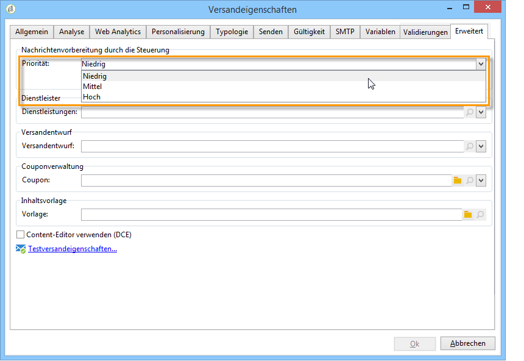

# Versandeinstellungen {#about-delivery-settings}

Die folgenden Einstellungen sind spezifisch für Campaign Classic. Weitere Informationen zu anderen Versandeinstellungen finden Sie in der [Dokumentation zu Campaign v8](https://experienceleague.adobe.com/de/docs/campaign/campaign-v8/send/gs-message){target="_blank"}.

## Versandanalyse {#delivery-analysis}

### Performance bei Versandanalysen verbessern {#improving-delivery-analysis}

Um die Sendungsvorbereitung zu beschleunigen, können Sie vor dem Starten der Analyse die Option **[!UICONTROL Versandteile in der Datenbank vorbereiten]** aktivieren.

Wenn diese Option aktiviert ist, wird die Sendungsvorbereitung direkt in der Datenbank vorgenommen, was die Analyse erheblich beschleunigen kann.

Diese Option ist derzeit nur verfügbar, wenn folgende Bedingungen erfüllt sind:

* Der Versand muss per E-Mail ausgeführt werden. Die anderen Kanäle werden derzeit nicht unterstützt.
* Sie dürfen kein Mid-Sourcing oder externes Routing nutzen, sondern nur den Routing-Typ &quot;Gebündelter Versand&quot;. Sie können das verwendete Routing auf dem Tab **[!UICONTROL Allgemein]** der **[!UICONTROL Versandeigenschaften]** überprüfen.
* Eine Population, die aus einer externen Datei stammt, kann nicht Zielgruppe sein. Klicken Sie für einen einzelnen Versand in den **[!UICONTROL E-Mail-Parametern]** auf den Link **[!UICONTROL An]** und stellen Sie sicher, dass die Option **[!UICONTROL Von der Datenbank ausgehend definiert]** aktiviert ist. Achten Sie bei einem Versand, der in einem Workflow verwendet wird, darauf, dass bei den Empfängern **[!UICONTROL Werden durch die Eingangsereignisse angegeben]** auf dem Tab **[!UICONTROL Versand]** markiert ist.
* Sie müssen eine PostgreSQL-Datenbank verwenden.

### Analysepriorität konfigurieren {#analysis-priority-}

Wenn der Versand Teil einer Kampagne ist, bietet die Registerkarte **[!UICONTROL Erweitert]** eine zusätzliche Option. Auf diese Weise können Sie die Verarbeitungsreihenfolge für Sendungen in derselben Kampagne organisieren.

Vor dem Versand wird jeder Versand analysiert. Die Analysedauer hängt von der Versandextraktionsdatei ab. Je größer die Datei ist, desto länger dauert die Analyse, sodass die folgenden Sendungen warten.

Die Optionen im Bereich **[!UICONTROL Nachrichtenvorbereitung durch die Steuerung]** erlauben die Priorisierung der Versandanalysen eines Kampagnen-Workflows.

Einem großen Versand sollte also vorzugsweise eine niedrige Priorität zugewiesen werden, um die Analyse der anderen Sendungen des Workflows nicht zu verlangsamen.

>[!NOTE]
>
>Um sicherzustellen, dass die Analyse umfangreicher Sendungen die Durchführung Ihrer Workflows nicht bremst, haben Sie die Möglichkeit, die Option **[!UICONTROL Ausführung auf einen Zeitpunkt mit geringer Auslastung verschieben]** anzukreuzen.

## Durchführen eines Versands {#delivery-sending}

### Konfigurieren der weiteren Zustellversuche {#configuring-retries}

Vorübergehend nicht zustellbare Nachrichten aufgrund eines **Softbounce** oder eines **ignorierten Fehlers** werden automatisch für einen erneuten Versuch vorgesehen. Die Typen und Ursachen für fehlgeschlagene Sendungen finden Sie in diesem [Abschnitt](delivery-failures-quarantine.md#delivery-failure-types-and-reasons).

>[!IMPORTANT]
>
>Bei gehosteten oder hybriden Installationen werden die Einstellungen für den erneuten Versuch im Versand nicht mehr von Campaign verwendet, wenn Sie auf den [Enhanced MTA](sending-with-enhanced-mta.md) aktualisiert haben. Weitere Zustellversuche aufgrund von Softbounces sowie die Zeitdauer zwischen ihnen werden durch den Enhanced MTA bestimmt, basierend auf Typ und Prioritätsstufe der Bounce-Antworten, die von der E-Mail-Domain der Nachricht zurückgegeben werden.

Bei On-Premise-Installationen und gehosteten/hybriden Installationen, die den bestehenden Campaign-MTA verwenden, gibt der zentrale Abschnitt der Registerkarte **[!UICONTROL Versand]** für die Versandparameter an, wie viele weitere Versuche am Tag nach dem Versand durchgeführt werden sollen, und den Mindestzeitabstand zwischen den Versuchen.

Standardmäßig sind innerhalb der ersten 24 Stunden des Versands fünf erneute Versuche im Abstand von mindestens einer Stunde vorgesehen. An den folgenden Tagen wird bis zum Ablauf der Versandgültigkeit, die auf der Registerkarte **[!UICONTROL Gültigkeit]** festgelegt wird, jeweils ein Zustellversuch unternommen. Siehe [Definieren des Gültigkeitszeitraums](#defining-validity-period).

### Definieren des Gültigkeitszeitraums {#defining-validity-period}

Nach dem Start des Versands können die Nachrichten (und alle weiteren Zustellversuche) bis zum Ablauf der Versandgültigkeit gesendet werden. Dies wird auf der Registerkarte **[!UICONTROL Gültigkeit]** der Versandeigenschaften festgelegt.

* Im Feld **[!UICONTROL Versandlaufzeit]** kann die Zeitspanne angegeben werden, in der weitere globale Zustellversuche unternommen werden. Dies bedeutet, dass Adobe Campaign die Nachrichten ab dem Startdatum versendet und dann nur für Nachrichten, die einen Fehler zurückgeben, regelmäßige, konfigurierbare weitere Zustellversuche durchführt, bis die Gültigkeitsgrenze erreicht ist.

  Sie können alternativ auch ein genaues Datum angeben. Markieren Sie dazu die Option **[!UICONTROL Gültigkeit explizit festlegen]**. In diesem Fall kann mit den Versand- und Gültigkeitsdaten auch eine bestimmte Uhrzeit konfiguriert werden. Standardmäßig wird die aktuelle Uhrzeit eingesetzt, sie kann jedoch direkt im Eingabefeld angepasst werden.

  >[!IMPORTANT]
  >
  >Wenn Sie auf den [Enhanced MTA](sending-with-enhanced-mta.md) aktualisiert haben, wird bei gehosteten oder hybriden Installationen die Einstellung **[!UICONTROL Versandlaufzeit]** in Ihren Campaign-E-Mail-Sendungen nur verwendet, wenn sie auf **3,5 Tage oder weniger** festgelegt ist. Wenn Sie einen Wert von mehr als 3,5 Tagen definieren, wird dieser nicht berücksichtigt.

* **Gültigkeit von Ressourcen**: Das Feld **[!UICONTROL Gültigkeit]** wird für hochgeladene Ressourcen verwendet, hauptsächlich für die Mirrorseite und Bilder. Die Gültigkeitsdauer der Ressourcen auf dieser Seite ist begrenzt, um Speicherkapazität zu sparen.

  Die Werte in diesem Feld können in den folgenden Einheiten ausgedrückt werden: **s** für Sekunden, **m** für Minuten, **h** für Stunden, **d** für Tage (Standard), **y** für Jahre.
