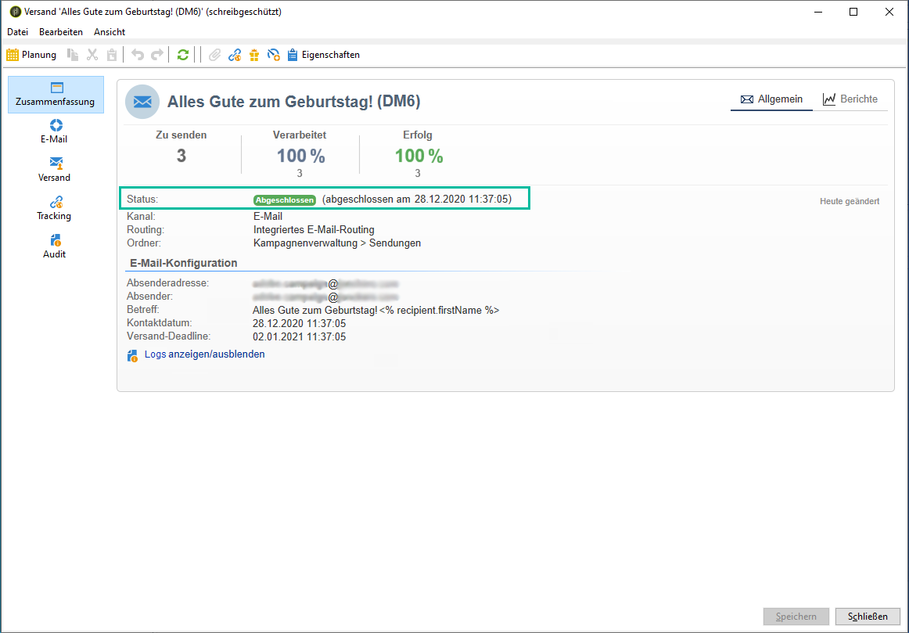

# Versandstatus {#delivery-statuses}

<!--ajouter intro 

ajouter screenshot -->

Nachdem ein Versand ausgeführt wurde, zeigt das Versand-Dashboard einen Status an, mit dem Sie überwachen können, ob der Versand erfolgreich war. Die möglichen Status werden im folgenden Abschnitt beschrieben.



Weitere Informationen zu den verschiedenen fehlgeschlagenen Sendungen und deren Behebung finden Sie auf [dieser Seite](../../delivery/using/understanding-delivery-failures.md).

**Verwandte Themen:**

* [Versand-Dashboard](../../delivery/using/delivery-dashboard.md)
* [Fehlerbehebung beim Versand](../../delivery/using/delivery-troubleshooting.md)
* [Über die Zustellbarkeit](../../delivery/using/about-deliverability.md)

## Liste der Versandstatus {#list-delivery-statuses}

<table> 
 <thead> 
  <tr> 
   <th> Status<br /> </th> 
   <th> Definitionen und Lösungen<br /> </th> 
  </tr> 
 </thead> 
 <tbody> 
  <tr> 
   <td> Gesendet<br /> </td> 
   <td> Gesendet: Der Versand wurde korrekt an den E-Mail-Provider durchgeführt (aber der Empfänger hat sie nicht unbedingt erhalten).<br /> </td> 
  </tr> 
  <tr> 
   <td> Ignoriert<br /> </td> 
   <td> Der Versand wurde aufgrund eines Fehlers in der Adresse des Empfängers nicht an diesen geschickt. Sie war entweder in einer Blockierungsliste, unter Quarantäne gestellt, nicht angegeben oder ein Duplikat. <br /> </td> 
  </tr> 
  <tr> 
   <td> Fehlgeschlagen<br /> </td> 
   <td> Der Versand hat den Empfänger nicht erreicht, weil die Adresse ungültig oder der Posteingang voll war. Die Ursache kann auch ein Problem mit Gestaltungsbausteinen sein, da diese Fehler hervorrufen können, wenn die Schemata nicht mit dem Versand-Mapping übereinstimmen. Weitere Informationen finden Sie unter <a href="../../delivery/using/understanding-delivery-failures.md" target="_blank">Ursachen von fehlgeschlagenen Sendungen</a><br /> </td> 
  </tr>
  <tr> 
   <td> Ausstehend<br /> </td> 
   <td> Die Nachrichten sind versandbereit und werden vom Versand-Server (MTA) verarbeitet. Siehe <a href="#pending-status" target="_blank">Status „Ausstehend“</a>.<br /> </td> 
  </tr> 
  <tr> 
   <td> Nicht anwendbar<br /> </td> 
   <td> Der Versandserver (MTA) hat den Versand zwar berücksichtigt, aber nicht verarbeitet.<br /> </td> 
  </tr>  
  <tr> 
   <td> Versand abgebrochen<br /> </td> 
   <td> Ein Benutzer hat den Vorgang abgebrochen.<br /> </td> 
  </tr> 
  <tr> 
   <td> Vom Dienstleister berücksichtigt<br /> </td> 
   <td> Der SMS-Dienstleister hat den Versand erhalten.<br /> Wenn Sie bei gehosteten oder hybriden Installationen ein Upgrade auf den <a href="../../delivery/using/sending-with-enhanced-mta.md" target="_blank">Enhanced MTA</a> durchgeführt haben, wurde die Nachricht erfolgreich von Campaign an den Enhanced MTA weitergeleitet.</td> 
  </tr> 
  <tr> 
   <td> Auf Mobiltelefon erhalten<br /> </td> 
   <td> Der Empfänger hat die SMS auf seinem Mobilgerät erhalten.<br /> </td> 
  </tr>
  <tr> 
   <td> Dem Dienstleister übermittelt<br /> </td> 
   <td> Der Versand wurde dem SMS-Dienstleister übermittelt, aber noch nicht von ihm empfangen.<br />
   </td> 
  </tr> 
  <tr> 
   <td> Vorbereitet<br /> </td> 
   <td> Hierbei handelt es sich um einen Zwischenstatus, der ausschließlich für externe Connectoren (z. B. Mobile-Kanal) verwendet wird. Er folgt auf den 'Ausstehend'-Status, wobei der Folgestatus vom externen Connector bestimmt wird.<br /> </td> 
  </tr> 
 </tbody> 
</table>

Informationen zur Optimierung der Auslieferbarkeit Ihrer Adobe Campaign-E-Mails finden Sie in [diesem Abschnitt](../../delivery/using/about-deliverability.md). Einen tieferen Einstieg in die Lieferbarkeit finden Sie im Leitfaden [Best Practice Guide](https://experienceleague.adobe.com/docs/deliverability-learn/deliverability-best-practice-guide/introduction.html?lang=de) zur Adobe-Lieferbarkeit.

## Status Ausstehend {#pending-status}

Nach der Bestätigung des Versands ist dessen Status **[!UICONTROL Ausstehend]**. Das bedeutet, dass im Ausführungsprozess auf die Verfügbarkeit von Ressourcen gewartet wird.

Der Status **[!UICONTROL Ausstehend]** kann bedeuten, dass der Versand terminiert wurde und bis zum entsprechenden Datum in der Warteschlange bleibt. Weitere Informationen hierzu finden Sie im Abschnitt [Versandauslösung](../../delivery/using/steps-sending-the-delivery.md#scheduling-the-delivery-sending).

Wenn der Versand nicht durchgeführt wird und sein Status **[!UICONTROL Ausstehend]** bleibt, kann dies folgende Gründe haben:

* Der MTA (Message Transfer Agent), der für die Durchführung von Modulen und Prozessen am Versand-Server und die Verwaltung des E-Mail-Versands verantwortlich ist, wurde möglicherweise noch nicht gestartet oder muss neu gestartet werden.

   Um dies zu überprüfen und bei Bedarf das Modul zu starten, gehen Sie wie folgt vor:

   >[!NOTE]
   >
   >Dieser Vorgang kann mit einem **On-Premise**- oder **Hybrid**-Hosting-Modell mit Zugriff auf den Campaign-Server ausgeführt werden (siehe [Hosting-Modelle](../../installation/using/hosting-models.md)).

   1. Überprüfen Sie, ob Ihre `mta@<instance>`-Module auf den MTA-Servern ausgeführt werden.

      ```
      nlserver pdump
      HH:MM:SS > Application server for Adobe Campaign Classic (X.Y.Z YY.R build nnnn@SHA1) of DD/MM/YYYY
      [...]
      mta@<INSTANCENAME> (9268) - 23.0 Mb
      [...]
      ```

   1. Wenn der MTA nicht aufgelistet ist, starten Sie ihn mit folgendem Befehl:

      ```
      nlserver start mta@<INSTANCENAME>
      ```

      >[!NOTE]
      >
      >Ersetzen Sie `<INSTANCENAME>` durch den Namen Ihrer Instanz (Produktion, Entwicklung usw.). Der Instanzname wird über die Konfigurationsdateien identifiziert: `[path of application]nl6/conf/config-<INSTANCENAME>.xml`

* Möglicherweise wird für den Versand eine Affinität verwendet, die auf dem sendenden Server nicht konfiguriert wurde.

   Überprüfen Sie in diesem Fall die Konfiguration des Traffic-Managements (IP-Affinität) und verwenden Sie das Feld **[!UICONTROL Verwaltung der IP-Adressen-Affinitäten]**, um die Sendungen mit dem MTA zu verknüpfen, der die Affinität verwaltet. Weiterführende Informationen zu Affinitäten finden Sie in [diesem Abschnitt](../../installation/using/configure-delivery-settings.md).

* Wenn zu viele Kampagnen ausgeführt werden, bleibt der Versandstatus im Status &quot;Ausstehend&quot;.

   Die Begrenzung für gleichzeitige Kampagnen wird in der Option **[!UICONTROL NmsOperation_LimitConcurrency]** definiert. Der Standardwert ist 10.

   Weitere Informationen zu den Optionen finden Sie auf [dieser Seite](../../installation/using/configuring-campaign-options.md).


**Verwandte Themen:**

* [Protokolle und Versandverlauf](#delivery-logs-and-history)
* [Ursachen von fehlgeschlagenen Sendungen](../../delivery/using/understanding-delivery-failures.md)
* [Typen und Ursachen für fehlgeschlagene Sendungen](../../delivery/using/understanding-delivery-failures.md#delivery-failure-types-and-reasons)
