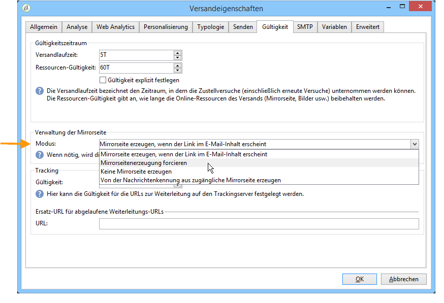

# E-Mail-Parameter {#email-parameters}

In diesem Abschnitt finden Sie die Optionen und Parameter, die spezifisch für den E-Mail-Versand sind.

## E-Mail-BCC {#email-bcc}

In Adobe Campaign können Sie mit der BCC-Option E-Mails in einem externen System speichern, indem Sie einfach eine BCC-E-Mail-Adresse zu Ihrer Versandzielgruppe hinzufügen.

Sobald die Option aktiviert ist, wird eine exakte Kopie aller gesendeten Nachrichten für diesen Versand aufbewahrt.

Weiterführende Informationen zur E-Mail-BCC-Konfiguration und zu Best Practices finden Sie in [diesem Abschnitt](../../installation/using/email-archiving.md).

>[!NOTE]
>
>E-Mail-BCC ist eine optionale Funktion. Bitte prüfen Sie Ihren Lizenzvertrag und kontaktieren Sie den Ansprechpartner für Ihr Konto, um diese Funktion zu aktivieren.

Beim Erstellen eines neuen Versands oder einer neuen Versandvorlage ist E-Mail-BCC nicht standardmäßig aktiviert. Sie müssen die Funktion auf der E-Mail-Versand- oder Versandvorlagenebene manuell aktivieren.

>[!NOTE]
>
>Wenn Sie E-Mail-BCC mit [Enhanced MTA](sending-with-enhanced-mta.md) verwenden, ist diese Option automatisch für alle Sendungen aktiviert.

Gehen Sie wie folgt vor, um E-Mail-BCC für eine E-Mail-Versandvorlage zu aktivieren:

1. Gehen Sie zu **[!UICONTROL Kampagnenverwaltung]** > **[!UICONTROL Sendungen]** oder **[!UICONTROL Ressourcen]** > **[!UICONTROL Vorlagen]** > **[!UICONTROL Versandvorlagen]**.
1. Wählen Sie den gewünschten Versand aus oder duplizieren Sie die Standardvorlage **E-Mail-Versand**, und wählen Sie dann die duplizierte Vorlage aus.
1. Wählen Sie die **Eigenschaften**-Schaltfläche aus.
1. Gehen Sie in den **[!UICONTROL Versand]**-Tab.
1. Aktivieren Sie die Option **E-Mail-BCC**. Eine Kopie aller gesendeten Nachrichten für jede Sendung, die auf dieser Vorlage basiert, wird an die dafür konfigurierte E-Mail-BCC-Adresse gesendet.

   

>[!NOTE]
>
>Wenn die an eine BCC-Adresse gesendeten E-Mails geöffnet und angeklickt werden, wird dies in der Versandanalyse in **[!UICONTROL Gesamtöffnungen]** und **[!UICONTROL Klicks]** berücksichtigt, was zu falschen Berechnungen führen könnte.

## Wahl des Nachrichtenformats {#selecting-message-formats}

Sie können das Format der gesendeten E-Mail-Nachrichten ändern. Bearbeiten Sie hierzu die Versandeigenschaften und klicken Sie auf die Registerkarte **[!UICONTROL Versand]**.

Im unteren Bereich des Fensters haben Sie die Wahl zwischen:

* **[!UICONTROL Empfängerangaben berücksichtigen]** (Standardmodus)

  Das Nachrichtenformat wird anhand der im Empfängerprofil im Feld **[!UICONTROL E-Mail-Format]** gespeicherten Informationen bestimmt. Wenn ein Empfänger ein bestimmtes Format angegeben hat, wird ihm die Nachricht in diesem Format zugestellt. Wenn das Feld leer ist, wird die Nachricht im Multipart-Alternative-Format versandt (siehe unten).

* **[!UICONTROL E-Mail-Programm des Empfängers das beste Format wählen lassen]**

  Die Nachricht enthält beide Formate: Text und HTML. Das beim Empfänger angezeigte Format hängt von der Konfiguration des E-Mail-Programms ab (Multipart-Alternative).

  >[!IMPORTANT]
  >
  >Bei dieser Option werden beide Versionen des Dokuments gesendet. Der hierdurch erhöhte Kapazitätsverbrauch kann den Versanddurchsatz beeinträchtigen.

* **[!UICONTROL Alle Nachrichten im Textformat senden]**

  Die Nachricht wird im Textformat gesendet. Das HTML-Format wird nicht gesendet, sondern nur für die Mirrorseite verwendet, auf die ein Empfänger gelangt, wenn er auf den entsprechenden Link in der Nachricht klickt.

>[!NOTE]
>
>Weitere Informationen zum Definieren des E-Mail-Inhalts finden Sie in [diesem Abschnitt](defining-the-email-content.md).

## Erzeugen der Mirrorseite {#generating-mirror-page}

Eine Mirrorseite ist eine HTML-Seite, die über einen Webbrowser online abgerufen werden kann und deren Inhalt mit dem der E-Mail identisch ist.

Standardmäßig wird die Mirrorseite automatisch generiert, wenn der entsprechende Link in den Inhalt der E-Mail eingefügt wurde. Weitere Informationen zum Einfügen von Gestaltungsbausteinen finden Sie unter [Gestaltungsbausteine](personalization-blocks.md).

In den Versandeigenschaften kann die Erzeugung der Seite über das Feld **[!UICONTROL Modus]** im Tab **[!UICONTROL Gültigkeit]** konfiguriert werden.

>[!IMPORTANT]
>
>Zur Erzeugung einer Mirrorseite muss zuvor ein HTML-Versandinhalt erstellt worden sein.

Zusätzlich zum Standardmodus stehen die folgenden Optionen zur Verfügung:

* **[!UICONTROL Mirrorseitenerzeugung forcieren]**: Erstellt eine Mirror-Seite, selbst wenn im Versandinhalt kein entsprechender Link enthalten ist.
* **[!UICONTROL Keine Mirrorseite erzeugen]**: Erstellt keine Mirror-Seite, selbst wenn im Versandinhalt der entsprechende Link enthalten ist.
* **[!UICONTROL Von der Nachrichtenkennung aus zugängliche Mirrorseite erzeugen]**: Diese Option ermöglicht den Zugriff auf den Inhalt der Mirror-Seite einschließlich aller Personalisierungsinformationen von den Versandlogs aus. Klicken Sie hierfür nach Durchführung des Versands auf die Registerkarte **[!UICONTROL Versand]** und wählen Sie die Zeile des Empfängers aus, dessen Mirrorseite Sie ansehen möchten. Klicken Sie dann auf den Link **[!UICONTROL Mirrorseite dieser Nachricht anzeigen...]**.

  

## Zeichenkodierung {#character-encoding}

Auf dem Tab **[!UICONTROL SMTP]** der Versandparameter können Sie im Abschnitt **[!UICONTROL Zeichenkodierung]** eine bestimmte Kodierung festlegen.

Die Standardkodierung ist UTF-8. Wenn einige E-Mail-Anbieter Ihrer Empfänger keine UTF-8-Standardkodierung unterstützen, sollten Sie eine bestimmte Kodierung einrichten, sodass Sonderzeichen den Empfängern Ihrer E-Mails korrekt angezeigt werden.

Gehen wir davon aus, dass Sie eine E-Mail mit japanischen Zeichen versenden möchten. Um sicherzustellen, dass Ihren Empfängern in Japan alle Zeichen korrekt dargestellt werden, sollten Sie eine Kodierung verwenden, die anstelle der standardmäßigen UTF-8-Kodierung japanische Zeichen unterstützt.

Wählen Sie dazu die Option **[!UICONTROL Nachrichtenkodierung erzwingen (Codepage)]** im Abschnitt **[!UICONTROL Zeichenkodierung]** und wählen Sie eine Kodierung aus der angezeigten Dropdown-Liste.

## Bounce Messages verwalten {#managing-bounce-emails}

Auf der Registerkarte **[!UICONTROL SMTP]** der Versandeigenschaften lässt sich der Umgang mit Bounce Messages konfigurieren.

Standardmäßig gehen Bounce Messages im [Standard-Fehlerpostfach der Plattform](../../installation/using/deploying-an-instance.md#parameters-for-delivered-emails-parameters-for-delivered-emails) ein. Es besteht jedoch die Möglichkeit, für einen Versand durch Abwählen der Standardoption eine spezifische Fehleradresse anzugeben.

Sie können eine weitere Adresse angeben, die es ermöglicht, die Unzustellbarkeitsursache derjenigen E-Mails zu untersuchen, bei denen das Programm sie nicht automatisch erkannt hat. Bei beiden Feldern können Sie durch Klick auf das entsprechende Symbol **Personalisierungsfelder hinzufügen**.

Weitere Informationen zur Bounce-Message-Verwaltung finden Sie in [diesem Abschnitt](understanding-delivery-failures.md#bounce-mail-management).

## SMTP-Header hinzufügen {#adding-smtp-headers}

Sie können Ihren Sendungen auch SMTP-Header hinzufügen. Verwenden Sie dazu den entsprechenden Abschnitt der Registerkarte **[!UICONTROL SMTP]** im Versand.

Das in diesem Fenster erfasste Script muss pro Zeile einen Header im Format **Name: Wert** enthalten.

Werte werden bei Bedarf automatisch verschlüsselt.

>[!IMPORTANT]
>
>Das Hinzufügen eines Skripts zum Einfügen zusätzlicher SMTP-Header ist fortgeschrittenen Benutzern vorbehalten.
>
>Die Syntax des Scripts muss die Anforderungen für diesen Inhaltstyp (keine überflüssigen Leerzeichen, keine Leerzeilen usw.) erfüllen.
