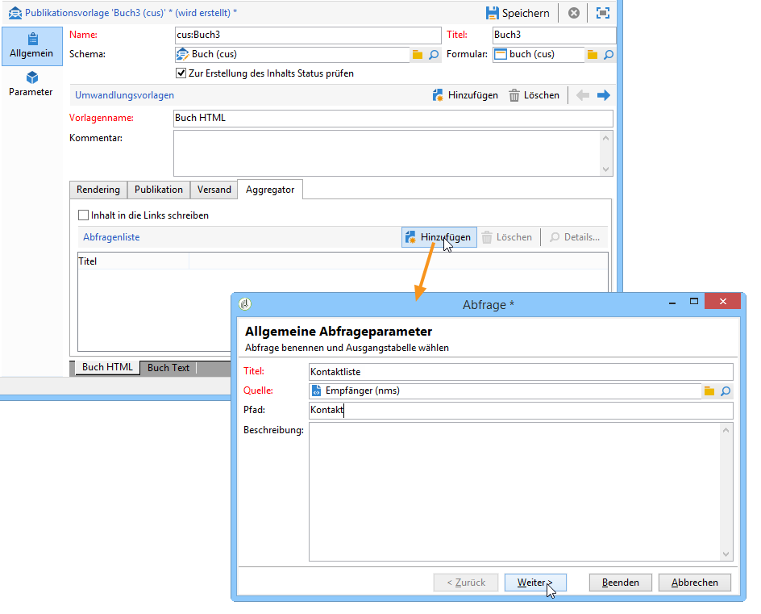
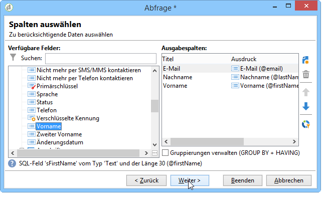
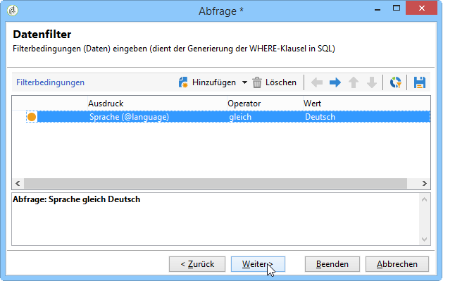
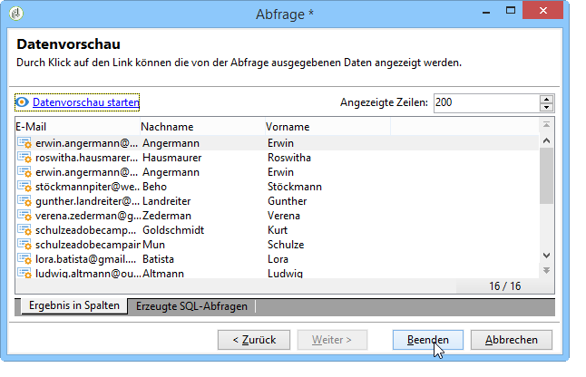
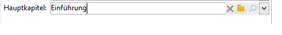

# Anreicherung von Inhalten{#enriching-content}

Aggregatoren ermöglichen die Anreicherung von Inhalten mit externen Daten. Letztere können entweder aus generischen Abfragen oder aus verknüpften Tabellen stammen.

## Generische Abfragen {#generic-queries}

Die Abfragen werden im **[!UICONTROL Aggregator]**-Tab der Publikationsvorlagen konfiguriert.

Die auf diese Weise abgerufenen Daten ergänzen das XML-Ausgabedokument in seinem Hauptelement.

Beispiel eines Abfrageergebnisses zum Empfängerschema (**nms:recipient**):

```
<book name="Content Management">
  ...
  <collection-recipient>
    <recipient lastName="Doe" firstName="John" email="john.doe@aolf.com">
    ...
  </collection-recipient>
</book>
```

Das **`<collection-recipient>`**-Element stellt das Eingabeelement des Dokuments dar, das aus einer Abfrage resultiert. Die abgerufenen Daten werden unter diesem Element zurückgegeben; in unserem Beispiel ist das eine Empfängerliste.

### Abfrage hinzufügen {#adding-a-query}

Ein Assistent führt Sie durch die einzelnen Schritte zur Konfiguration Ihrer Abfrage.

1. Geben Sie im ersten Schritt den Titel und das die gesuchten Daten enthaltene Schema an.

   

   >[!NOTE]
   >
   >Das Eingabefeld **Pfad** ermöglicht es, das Ausgabeelement der Abfrage umzubenennen.

1. Im nächsten Schritt werden die abzurufenden Daten ausgewählt.

   

1. Anschließend werden die Filterbedingungen konfiguriert.

   

1. Im letzten Schritt wird eine Vorschau auf das Abfrageergebnis angezeigt.

   

## Verknüpfte Tabellen {#linked-tables}

Relationen ermöglichen den Abruf von externen, mit dem Inhalt verknüpften Daten.

Man unterscheidet zwischen zwei Typen verknüpfter Daten:

* Inhaltsrelationen: Es handelt sich hier um den nativen Modus des Content Managements. Der Inhalt der Relation wird automatisch in das XML-Ausgabedokument integriert.
* Relationen zu externen Tabellen: Sie ermöglichen den Zugriff auf alle anderen Tabellen der Datenbank, erfordern jedoch die Verwendung eines Aggregators, um die Daten abzurufen.

### Relation zu einem Inhaltsschema {#link-to-a-content-schema}

Eine Inhaltsrelation wird auf folgende Weise im Datenschema deklariert:

```
<element expandSchemaTarget="cus:chapter" label="Main chapter" name="mainChapter" type="string"/>
```

Die Relationsdefinition wird in einem **String**- **`<element>`** notiert; das Attribut **expandSchemaTarget** verweist auf das Zielschema (im vorliegenden Beispiel ist dies „nms:chapter“). Das referenzierte Schema muss ein Inhaltsschema sein.

Der Inhalt des betroffenen Elements ergänzt das Relationselement, im vorliegenden Beispiel also das Element **`<chapter>`**:

```
<mainChapter computeString="Introduction" id="7011" title="Introduction" xtkschema="cus:chapter">    
  <page>Introduction to input <STRONG>forms</STRONG>.</page>
</mainChapter>
```

>[!NOTE]
>
>Der **Compute string** der Relation wird über das Attribut **computeString** definiert.

Im Formular wird das Eingabefeld der Relation wie folgt deklariert:

```
<input type="articleEdit" xpath="mainChapter"/>
```



Durch Klick auf die **[!UICONTROL Lupe]** öffnet sich das Bearbeitungsformular des verknüpften Elements.

#### Relationskollektion {#link-collection}

Um eine Kollektion von Relationen anzugeben, muss im Datenschema zur Definition des Relationselements das Attribut **unbound=&quot;true&quot;** hinzugefügt werden.

```
<element expandSchemaTarget="cus:chapter" label="List of chapters" name="chapter"  ordered="true" unbound="true"/>
```

Der Inhalt des betroffenen Elements ergänzt alle Kollektionselemente:

```
<chapter computeString="Introduction" id="7011" title="Introduction" xtkschema="cus:chapter">    
  <page>Introduction to input <STRONG>forms</STRONG>.</page>
</chapter>
```

Im Formular wird das Listenfeld wie folgt deklariert:

```
<input editable="false" nolabel="true" toolbarCaption="List of chapters" type="articleList" xpath="chapter" zoom="true"/>
```


Um den **Compute string** der betroffenen Elemente wiederzugeben, wird standardmäßig eine Spalte angezeigt.

### Relationen zu externen Tabellen {#links-to-external-tables}

Im Datenschema wird eine Relation zu einer externen Tabelle wie folgt deklariert:

```
<element label="Main contact" name="mainContact" target="nms:recipient" type="link"/>
```

Die Relationsdefinition wird in einem **Link**-**`<element>`** notiert; das Attribut **target** verweist auf das Zielschema (im vorliegenden Beispiel ist dies „nms:recipient“).

Es ist gebräuchlich, die Relationen im Hauptelement des Datenschemas zu deklarieren.

Der **Compute string** und der Schlüssel des betroffenen Elements ergänzen die Attribute **`<name>-id`** und **`<name>-cs`** des Hauptelements.

Im vorliegenden Beispiel wurden die Relation im Schema &quot;cus:Buch&quot; und der Inhalt der Relationsdaten in den Attributen &quot;mainContact-id&quot; sowie &quot;mainContact-cs&quot; notiert:

```
<book computeString="Content management" date="2006/06/08" id="6106" language="en" mainContact-cs="John Doe (john.doe@adobe.com)" mainContact-id="3012" name="Content management" xtkschema="cus:book">
```

Das Eingabefeld der Relation wird wie folgt deklariert:

```
<input xpath="mainContact"/>
```


Es besteht außerdem die Möglichkeit, die Zielgruppe mit dem Element **`<sysfilter>`** einzuschränken:

```
<input xpath="mainContact">
  <!-- Filter the selection of the link on the Adobe domain -->
  <sysFilter>
    <condition expr="@domain =  'adobe.com '"/>
  </sysFilter>
</input>
```

>[!NOTE]
>
>Die Einschränkung ist auch für Inhaltsrelationen möglich.

#### Relationskollektion {#link-collection-1}

Kollektionen werden auf die gleiche Weise wie Listen in Kollektionselementen notiert:

```
<element label="List of contacts" name="contact" unbound="true">
  <element label="Recipient" name="recipient" target="nms:recipient" type="link"/>
</element>
```

Im Formular wird das Listenfeld wie folgt deklariert:

```
<input nolabel="true" toolbarCaption="List of contacts" type="list" xpath="contact">
  <input xpath="recipient"/>
</input>
```


>[!NOTE]
>
>Die Liste ist editierbar und ermöglicht die Auswahl der Relation über ein Steuerelement vom Typ &quot;link&quot; (siehe oben).

Der Inhalt des betroffenen Elements ergänzt alle Kollektionselemente im Ausgabedokument:

```
<contact id="11504978621" recipient-cs="Doe John (john.doe@adobe.com)" recipient-id="3012"/>
<contact id="11504982510" recipient-cs="Martinez Peter (peter.martinez@adobe.com)" recipient-id="3013"/>
```

#### Relationsaggregate {#link-aggregation}

Der Inhalt referenzierter Relationen ist auf den internen Schlüssel und den **Compute string** des betroffenen Elements beschränkt.

Für die Ergänzung der Relationsinhalte mit SOAP-Abfragen ist die Verwendung von JavaScripts erforderlich.

**Beispiel**: Ergänzung der Relation &quot;mainContact&quot; und der Kollektionsrelationen &quot;contact&quot; um den Empfängernamen:

```
// Update <mainContact> link
var mainContactId = content.@['mainContact-id']
var query = xtk.queryDef.create(
    <queryDef schema="nms:recipient" operation="get">
      <select>
        <node expr="@lastName"/>
      </select>
      <where>
        <condition expr={"@id="+mainContactId}/>
      </where>
    </queryDef>)

var recipient = query.ExecuteQuery()
content.mainContact.@lastName = recipient.@lastName

// Update <contact> link collection
for each(var contact in content.contact)
{
  var contactId = contact.@['recipient-id']
  var query = xtk.queryDef.create(
    <queryDef schema="nms:recipient" operation="get">
      <select>
        <node expr="@lastName"/>
      </select>
      <where>
        <condition expr={"@id="+contactId}/>
      </where>
    </queryDef>
  )
  
  var recipient = query.ExecuteQuery()
  contact.@lastName = recipient.@lastName
}
```

Nach Ausführung des Scripts erhalten Sie folgendes Ergebnis:

```
<mainContact lastName="Doe"/>

<contact id="11504978621" lastName="Doe" recipient-cs="Doe John (john.doe@adobe.com)" recipient-id="3012"/>  
<contact id="11504982510" lastName="Martinez" recipient-cs="Martinez Peter (peter.martinez@adobe.com)" recipient-id="3013"/> 
```

Der Inhalt des JavaScript-Codes wird im Ordner **[!UICONTROL Administration > Konfiguration > Content Management > JavaScript-Codes]** gespeichert und muss in der Publikationsvorlage für jede Umwandlung angegeben werden.


