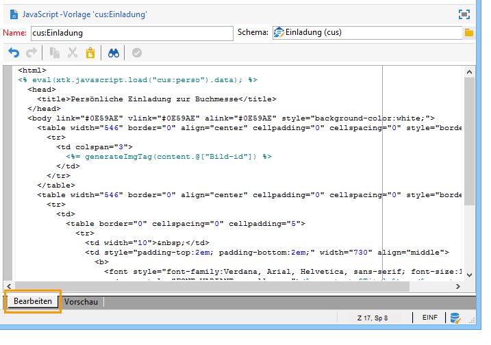
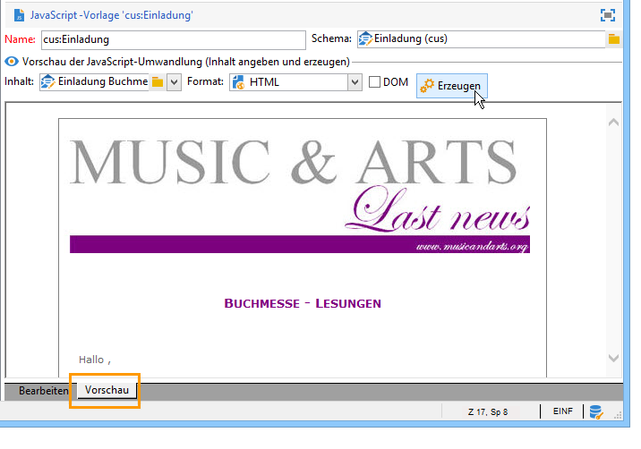
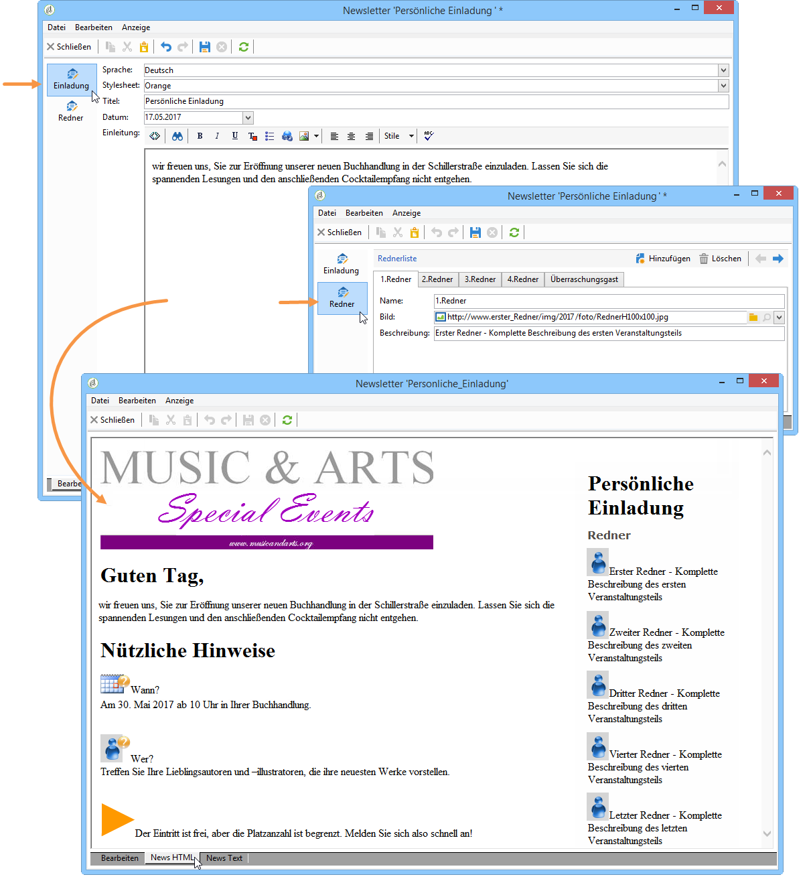
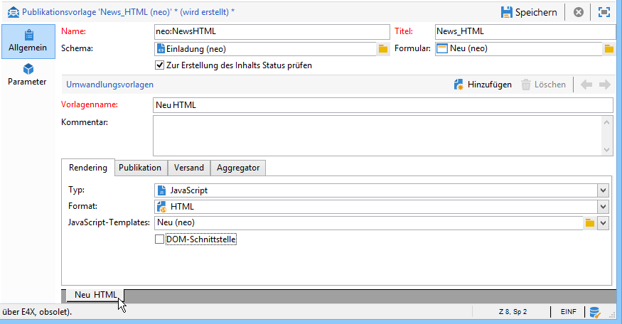
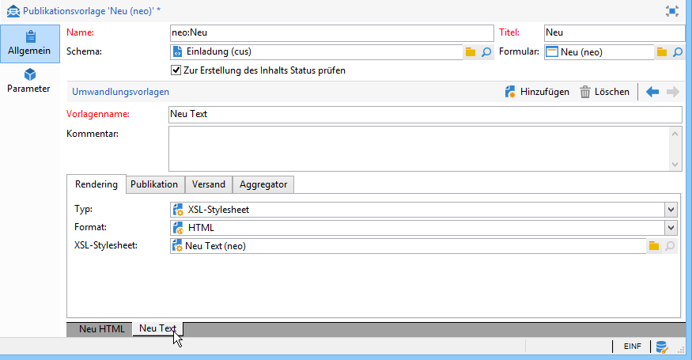
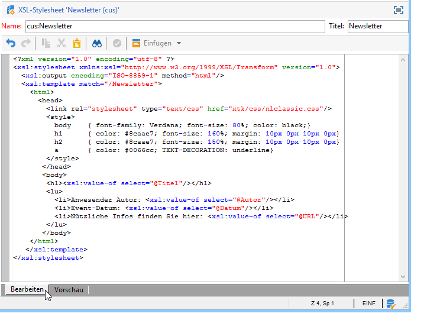
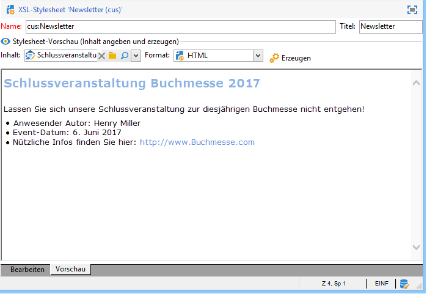

# Layout{#formatting}

## JavaScript-Templates {#javascript-templates}

Ein JavaScript-Template ist ein HTML- oder Text-Dokument, welches JavaScript-Code enthält. Es wird auf die gleiche Weise wie der E-Mail-Inhalt eines Versands erstellt.

### Identifizierung von JavaScript-Templates {#identification-of-a-javascript-template}

Ein JavaScript-Template wird wie Schemata oder Formulare über seinen Namen und Namensraum identifiziert. Es wird jedoch empfohlen, den Namen mit **.js** zu ergänzen.

### Struktur von JavaScript-Templates {#structure-of-a-javascript-template}

Das folgende Beispiel zeigt ein auf dem Schema &quot;cus:Buch&quot; basierendes JavaScript-Template für ein HTML-Layout:

```
<html>
  <body>
    <!-- Title of book -->
    <h1><%= content.@name %></h1>
    <ul>
      <% for each(var chapter in content.chapter) { %>
        <li><%= chapter.@name %></li>
      <% }%>
    </ul>
  </body>
</html>
```

Die verschiedenen JavaScript-Anweisungen werden wie folgt dargestellt:

* Verbindungsfelder: zeigt den Dateninhalt mit der Syntax **`<%= <source> %>`** an, wobei `<source>` das Quellfeld der anzuzeigenden Daten bezeichnet.
* Anweisungsblock: führt zwischen den Tags &lt;% und %> enthaltene JavaScript-Anweisungen aus.

Das Objekt **content** steht für das Hauptelement des XML-Quelldokuments.

Die nächste Zeile unseres Beispiels zeigt den Inhalt des Buchtitels:

```
<h1><%= content.@name %></h1>
```

Der anschließende Code bezieht sich auf das Kollektionselement `<chapter>`:

```
<% for each(var chapter in content.chapter) { %>
  <li><%= chapter.@name %></li>
<% }%>
```

Attribute und Elemente des Inhalts werden wie JavaScript-Objekte dargestellt und berücksichtigen die Struktur des Quelldokuments.

**Beispiel**:

* **content.@name**: gibt den Wert des Attributs „name“ des Hauptelements aus.
* **content.@`['name']`**: identisch mit dem **Inhalt.@name**-Syntax
* **content.chapter.length**: gibt die Anzahl an Elementen des Kollektionselements `<chapter` aus
* **content.chapter`[0]`.@name**: gibt den Namen des ersten Elements von `<chapter>` aus
* **chapter.name()**: gibt den Namen des Elements `<chapter>` aus
* **chapter.parent().name()**: gibt den Namen des Elternelements von `<chapter>` aus

>[!CAUTION]
>
>Da das Zeichen &#39;-&#39; in JavaScript bereits belegt ist, muss die Abfrage eines Attributs oder Elements, das dieses Zeichen enthält, über die `['<field>']`-Syntax erfolgen.
>
>Beispiel: `content.@['offer-id']`.

Zur Erstellung des Ausgabedokuments stehen alle üblichen Programmiersprachen-Elemente (Variablen, Schleifen, Tests, bedingte Anweisungen, Funktionen usw.) zur Verfügung. Des Weiteren können SOAP-APIs zur Anreicherung des Dokuments eingesetzt werden.

Beispiele:

* Bedingte Anweisung:

   ```
   <% if (content.@number == 1 || content.@language == 'en') { %>
   <!-- Content to be displayed if test is true--> 
   <% } %>
   ```

* Funktionsaufruf:

   ```
   <!-- Displays a horizontal bar -->
   ;<% function DisplayHorizontalBar() { %>
     <hr/>
   <% } %> 
   
   <!-- The same function in a block  -->
   <% 
   function DisplayHorizontalBar2()
   {
     document.write('<hr/>');
   }
   %> 
   
   <!-- Returns the value in uppercase -->
   <% 
   function formatName(value)
   { 
     return value.toUpperCase(); 
   }
   %>
   
   <!-- Call functions -->
   <%= DisplayHorizontalBar1() %>
   <%= DisplayHorizontalBar2() %>
   <%= formatName(content.@name) %>
   ```

* Deklaration und Aufruf von Variablen:

   ```
   <%  var counter = 0; %>
   
   <%= counter += 10 %>
   ```

* Abruf und Anzeige eines Empfängernamens mit statischen Methoden:

   ```
   <% var recipient = nms.recipient.get(1246); %>
   <%= recipient.lastName %>
   ```

* Abruf und Anzeige eines Empfängernamens mit dynamischen Methoden:

   ```
   <% var query = xtk.queryDef.create(
     <queryDef schema="nms:recipient" operation="get">
       <select>
         <node expr="@lastName"/>
       </select>
       <where>
         <condition expr="@id=1246"/>
       </where>
     </queryDef>);
   
     var recipient = query.ExecuteQuery();
   %>
   
   <%= recipient.@lastName %>
   ```

### Verwendung von JavaScript-Templates {#including-a-javascript-template}

Sie haben die Möglichkeit, eine Bibliothek mit Funktionen oder Variablen anzulegen, um später erneut darauf zugreifen zu können. Importieren Sie hierfür das entsprechende JavaScript-Template unter Verwendung der Funktion **eval**. Auf diese Weise können Sie Kontexte mit zusätzlichen, in anderen JavaScript-Templates deklarierten Funktionen anreichern.

**Beispiel**: Import des Templates **common.js**.

```
<% eval(xtk.javascript.get("cus:common.js").data);  %>
```

### Bearbeitung eines JavaScript-Templates {#editing-a-javascript-template}

Der Inhalt des JavaScript-Templates wird im Editor erfasst:



>[!NOTE]
>
>Um JavaScript-Objekte initialisieren zu können, muss das Schema des verknüpften Datenmodells angegeben werden.

Sie können jederzeit eine Vorschau des Ausgabedokuments erzeugen, indem Sie einen Inhalt und das Ausgabeformat (HTML, Text, XML) angeben und anschließend auf die Schaltfläche **[!UICONTROL Erzeugen]** klicken.



>[!NOTE]
>
>Es ist nicht erforderlich, etwaige Änderungen vor der Vorschauanzeige zu speichern.

### Beispiel zur Erstellung und Verwendung eines JavaScript-Templates {#example-of-how-to-create-and-use-a-javascript-template}

Im Folgenden wird die Konfiguration eines JavaScript-Templates dargestellt:



Gehen Sie wie folgt vor:

1. Erstellen Sie folgendes Schema (hier **neo:News**):

   ```
   <srcSchema _cs="Invitation (neo)"   entitySchema="xtk:srcSchema" img="xtk:schema.png" label="Invitation" mappingType="sql" name="news" namespace="neo" xtkschema="xtk:srcSchema">
   
     <enumeration basetype="string" default="en" name="language">
       <value label="Français" name="fr" value="fr"/>
       <value label="English" name="gb" value="gb"/>
     </enumeration>
   
     <enumeration basetype="string" name="css">
       <value label="Blue" name="bl" value="blue"/>
       <value label="Orange" name="or" value="orange"/>
     </enumeration>
   
     <element label="Intervenants" name="attendee">
       <key internal="true" name="id">
         <keyfield xpath="@id"/>
       </key>
       <attribute label="Name" name="name" type="string"/>
       <element label="Image" name="image" target="xtk:fileRes" type="link"/>
       <attribute label="Description" name="description" type="string"/>
       <attribute default="Gid()" label="Id" name="id" type="long"/>
     </element>
   
     <element label="Invitation" name="news" template="ncm:content" xmlChildren="true">
   
       <compute-string expr="@name"/>
       <attribute enum="language" label="Language" name="language" type="string"/>
       <attribute enum="css" label="Stylesheet" name="css" type="string"/>
       <attribute label="Title" name="title" type="string"/>
       <element label="Presentation" name="presentation" type="html"/>
       <attribute label="Date" name="date" type="date"/>
       <element label="Attendees list" name="attendeesList" ordered="true" ref="attendee" unbound="true"/>
   
     </element>
   </srcSchema>
   ```

1. Erstellen Sie das zugeordnete Formular (**neo:News**) vom Typ **[!UICONTROL Content Management]**:

   ```
   <form _cs="News (neo)" entitySchema="xtk:form"  img="xtk:form.png" label="News"  name="news" namespace="neo" type="contentForm" xtkschema="xtk:form">
   
     <container type="iconbox">
       <container label="Invitation">
         <input xpath="@langue"/>
         <input xpath="@css"/>
         <input xpath="@title"/>
         <input xpath="@date"/>
         <input xpath="presentation"/>
       </container>
   
       <container label="Intervenants">
         <container toolbarCaption="Liste des intervenants" type="notebooklist" xpath="attendeesList" xpath-label="@nom">
           <container>
             <input xpath="@nom"/>
             <input img="nl:sryimage.png" newEntityFormChoice="true" xpath="image">
               <sysFilter>
                 <condition expr="@isImage = true"/>
               </sysFilter>
             </input>
             <input xpath="@description"/>
           </container>
         </container>
       </container>
     </container>
   
   </form>
   ```

1. Erstellen Sie die JavaScript-Templates mit den Nachrichteninhalten für das HTML- und das Text-Format.

   * HTML-Format:

      ```
      <html>     
        <head>         
          <title>Newsletter</title>
           <style type="text/css">
            .body {font-family:Verdana, Arial, Helvetica, sans-serif; font-size:10px; color:#514c48; margin-left: auto; margin-right: auto;}
            .body table {width:748; border: solid 1px; cellpadding:0; cellspacing:0"}
           </style>
        </head>     
        <body>
          <p><center><%= mirrorPage %></center></p>
          <center>
            <table>      
             <tr>
              <td>                                                         
                                                   
              </td>
              <td>
                <h1><%= content.@title %></h1>
              </td>
             </tr>
             <tr>
      
             <td>
              <div >                                    
                <h0><%= hello,</h0>                              
                <p><%= content.presentation %></p>                                          
      
                <h0>Useful information</h0>                              
                <p>                                  
                  When? <br/><%= formatDate(content.@date, "%2D %Bl %4Y") %> From 10 AM in your bookshop.</p><br/>                                       
                <p>                                  
                  Who? <br>Meet our favorite authors and illustrators and get a signed copy of their book.</p><br/>                                                         
                <p>                                  
                  Attendance is free but there is a limited number of seats: sign up now!</p>
            </div>
            </td>
      
              <td>                                                    
               <div style="text-align:left; width:210; height:400px; background:url([IMAGE DE FOND])">
      
                  <h0><%= participant %></h0>
                  <%
                  var i
                  var iLength = content.attendeesList.length()
                  for (i=0; i<iLength; i++)
                  { %>
                  <p>
                    <%= generateImgTag(content.attendeesList[i].@["image-id"]) %>  <%= content.attendeesList[i].@description %>
                  </p>  
                  <% }  
                  %>                              
               </div2>
              </td>
          </tr>
        </table>
      </center>
      </body>    
      </html>
      ```

   * Text-Format:

      ```
      <%= content.@title %>
      <%= content.presentation %>
      
      *** When? On <%= formatDate(content.@date, "%2D %Bl %4Y") %> From 10 AM in your bookshop.
      
      *** Who? Come and meet our favorite authors and illustrators and get a signed copy of their books. 
      
      *** Attendance is free but there is a limited number of seats: sign up now!
      
      Guests:
      ******************
      <%
      var i
      var iLength = content.attendeesList.length()
      //for (i=(iLength-1); i>-1; i--)
      for( i=0 ; i<iLength ; i++ )
        { %>
        Description <%= i %> : <%= content.attendeesList[i].@description %>
        <% }  
      %>
      ```

1. Erstellen Sie dann die Publikationsvorlagen für beide Formate:

   * Für das HTML-Format:

      

   * Für das Text-Format:

      

1. Nun können Sie diese Inhaltsvorlage in Ihren Sendungen verwenden.

   Weitere Informationen hierzu finden Sie unter [Verwendung von Inhaltsvorlagen](../../delivery/using/using-a-content-template.md).

## XSL-Stylesheets {#xsl-stylesheets}

Die XSLT-Programmiersprache ermöglicht die Umwandlung eines XML-Dokuments in ein Ausgabedokument eines anderen Formats. Das Ausgabedokument kann in HTML, Text oder erneut in XML erzeugt werden.

Diese Umwandlung wird in einem Stylesheet genannten XML-Dokument beschrieben.

### Identifizierung von Stylesheets {#identifying-a-stylesheet}

Ein Stylesheet wird wie Schemata oder Formulare über seinen Namen und Namensraum identifiziert. Es wird jedoch empfohlen den Namen mit **.xsl** zu ergänzen.

Der Identifikationsschlüssel eines Stylesheets ist eine Zeichenkette, die den Namensraum und den Namen enthält, getrennt durch das Zeichen &#39;:&#39; (z. B. **cus:Buch.xsl**).

### Struktur eines Stylesheets {#structure-of-a-stylesheet}

Das folgende Beispiel zeigt ein auf dem Schema &quot;cus:Buch&quot; basierendes Stylesheet für ein HTML-Ausgabedokument:

```
<?xml version="1.0" encoding="ISO-8859-1" ?>
<xsl:stylesheet xmlns:xsl="http://www.w3.org/1999/XSL/Transform" version="1.0">
  <xsl:output encoding="ISO-8859-1" method="html"/>
  <!-- Point of entry of the stylesheet -->
  <xsl:template match="/book">
    <html>
      <body>
        <!-- Book title -->
        <h1><xsl:value-of select="@name"/></h1>
        <lu>
          <!-- List of chapters -->
          <xsl:for-each select="child::chapter">
            <li><xsl:value-of select="@name"/></li>
          </xsl:for-each>
       </lu>
      </body>
    </html>
   </xsl:template>
</xsl:stylesheet>
```

Ein Stylesheet ist ein XML-Dokument, das folgenden Regeln entspricht:

* Werte von Attributen stehen zwischen Anführungszeichen,
* Elemente weisen einen öffnenden und einen schließenden Tag auf,
* die Zeichen &#39;&lt;&#39; oder &#39;&amp;&#39; werden durch **&#39;&lt;&#39;** oder **&#39;&amp;&#39;** ersetzt,
* jedes XSL-Element verwendet den Namensraum **xsl**.

Ein Stylesheet muss mit der XSL-Stammelement-Markierung **`<xsl:stylesheet>`** beginnen und mit der **`</xsl:stylesheet>`**-Markierung enden. Der XSL-Namensraum muss wie folgt in der öffnenden Markierung definiert werden:

```
<xsl:stylesheet xmlns:xsl="http://www.w3.org/1999/XSL/Transform" version="1.0">
```

Das **`<xsl:output>`**-Element gibt das Format des erstellten Dokuments an. Geben Sie den gewünschten Zeichensatz und das Ausgabeformat an.

```
<xsl:output encoding="ISO-8859-1" method="html"/>
```

Die folgenden Anweisungen beschreiben die Stylesheet-Konfiguration zur Formatierung des Ausgabedokuments.

```
<xsl:template match="/book">
  <html>
    <body>
      <!-- Book title -->
      <h1><xsl:value-of select="@name"/></h1>
      <lu>
        <!-- List of chapters -->
        <xsl:for-each select="child::chapter">
          <li><xsl:value-of select="@name"/></li>
        </xsl:for-each>
      </lu>
    </body>
  </html>
</xsl:template>
```

Standardmäßig sucht der XSLT-Prozessor die sich auf den Wurzel- oder Hauptknoten des XML-Quelldokuments beziehende **Vorlage**. Die Erstellung des Ausgabedokuments geschieht auf Basis dieser **Vorlage**.

Im vorliegenden Beispiel wird ausgehend vom Schema &quot;cus:Buch&quot; eine HTML-Seite erzeugt, die den Titel und die Liste der Kapitel des Buches anzeigt.

>[!NOTE]
>
>Für weiterführende Informationen empfehlen wir Ihnen, die einschlägige Literatur heranzuziehen.

### HTML/XML anzeigen {#displaying-html-xml}

Um ein **HTML**-Feld anzuzeigen, verwenden Sie die Option **disable-output-escaping=&quot;yes&quot;** aus der Anweisung **`<xsl:value-of>`**. Auf diese Weise vermeiden Sie das Ersetzen von Zeichen durch ihre XML-Entität (z. B. &lt; mit &lt;).

Die Anweisung **`<xsl:text>`** mit der Option **disable-output-escaping=&quot;yes&quot;** erlaubt die Verwendung von JavaScript-Tags für Personalisierungsfelder oder bedingte Tests.

Beispiele:

* Anzeige des Inhalts eines HTML-Felds:

   ```
   <xsl:value-of select="summary" disable-output-escaping="yes"/>
   ```

* Einfügen des Personalisierungsfelds **&lt;%= recipient.email %>**:

   ```
   <xsl:text disable-output-escaping="yes"><%= recipient.email %></xsl:text>
   ```

* Hinzufügen der bedingten Anweisung **&lt;% if (recipient.language == &#39;en&#39;) `{` %>**:

   ```
   <xsl:text disable-output-escaping="yes"><% if (recipient.language == 'en') { %></xsl:text>
   ```

### Verwendung von Stylesheets {#including-stylesheets}

Sie haben die Möglichkeit, eine Bibliothek mit Vorlagen oder Variablen anzulegen, die in mehreren Stylesheets verwendet werden. Die unten dargestellte **Vorlage** &quot;longMonth&quot; ist ein typisches Beispiel für die Auslagerung einer Vorlage in ein Stylesheet, welches seine spätere Wiederverwendung ermöglicht.

Die Anweisung **`<xsl:include>`** verweist auf den Namen des in das Dokument einzufügenden Stylesheets.

**Beispiel**: Verwendung des Stylesheets &quot;common.xsl&quot;.

```
<? xml version="1.0" encoding="ISO-8859-1" ?>
<xsl:stylesheet xmlns:xsl="http://www.w3.org/1999/XSL/Transform" version="1.0">
  <xsl:include href="common.xsl"/> 
  <xsl:output encoding="ISO-8859-1" method="jsp" indent="yes"/>
  ...
</xsl:stylesheet>
```

>[!NOTE]
>
>In der Stylesheet-Referenz wird kein Namensraum angegeben. Standardmäßig wird das Stylesheet mit dem Namensraum des Benutzers angelegt.

### Bearbeitung eines Stylesheets {#editing-a-stylesheet}

Der Inhalt des Stylesheets wird im Editor erfasst:



Sie können jederzeit eine Vorschau des Ausgabedokuments erzeugen, indem Sie einen Inhalt und das Ausgabeformat (HTML, Text, XML) angeben und anschließend auf die Schaltfläche **[!UICONTROL Erzeugen]** klicken.



>[!NOTE]
>
>Es ist nicht erforderlich, etwaige Änderungen im Stylesheet vor der Vorschauanzeige zu speichern.

## Hintergrundbild und Symbole {#image-management}

### Adressierung von Bildern {#image-referencing}

Die im HTML-Ausgabedokument angegebenen Bilder können mit relativen oder absoluten Pfadangaben adressiert werden.

Bei der relativen Adressierung kann in den Optionen **NcmRessourcesDir** und **NcmRessourcesDirPreview** die URL des Servers, auf dem die Bilder gespeichert sind, angegeben werden. Die Optionen enthalten den Speicherort der Bilder in der Adobe-Campaign-Clientkonsole für die Publikation und die Vorschau.

Auf beide Optionen kann im Explorer über den Knoten **[!UICONTROL Administration > Plattform > Optionen]** zugegriffen werden.

**Beispiel**:

* NcmResourcesDir = &quot;https://server/images/&quot;
* NcmResourcesDirPreview = &quot;x:/images/&quot;

Bei der Verarbeitung des Stylesheets wird je nach Kontext - Vorschau oder Publikation - das Attribut **_resPath** des Hauptelements des zugrunde liegenden XML-Dokuments automatisch mit einer der beiden Optionen ergänzt.

Beispiel für die Adressierung eines Bilds mit Pfadangabe:

```
/newsletter/image.png"/>
```

>[!NOTE]
>
>Es wird empfohlen, eine Variable zu deklarieren, die die Referenz auf den Server, auf dem die Bilder gespeichert sind, enthält (&quot;resPath&quot; im vorliegenden Beispiel).

### Verwendung öffentlicher Ressourcen {#using-public-resources}

Eine weitere Möglichkeit ist die Verwendung der **[!UICONTROL öffentlichen Ressourcen]**, um die Bilder zu deklarieren und entsprechend der im Softwareverteilungs-Assistenten konfigurierten Instanzparameter auf den Server zu laden.

Im Anschluss daran, können Sie die Bilder in Ihren Inhalten aufrufen. Verwenden Sie hierfür die folgende Syntax im Content-Management-Schema:

```
<element label="Image" name="image" target="xtk:fileRes" type="link"/>
```

Im Formular wird das Bildauswahlfeld mit folgender Syntax deklariert:

```
<input img="nl:sryimage.png" newEntityFormChoice="true" xpath="image">
    <sysFilter>
      <condition expr="@isImage = true"/>
    </sysFilter>
  </input>
```

>[!NOTE]
>
>Konfiguration und Verwendung **[!UICONTROL öffentlicher Ressourcen]** werden in [diesem Abschnitt](../../installation/using/deploying-an-instance.md#managing-public-resources) beschrieben.

## Datumsangaben {#date-display}

Im zugrunde liegenden XML-Quelldokument werden Datumsangaben im internen XML-Format gespeichert: **JJJJ/MM/TT HH:MM:SS** (z. B. 2018/10/01 12:23:30).

Adobe Campaign bietet Formatierungsfunktionen für Datumsangaben in JavaScript-Templates und XSL-Stylesheets, die im Folgenden erläutert werden:

### Formatierung von Datumsangaben in JavaScript {#javascript-date-formatting}

Verwenden Sie die Funktion **formatDate**, um ein Datum im gewünschten Format anzuzeigen. Anzugeben sind der Inhalt des Datums und eine das Ausgabeformat bezeichnende Zeichenkette in folgender Syntax: **%4Y/%2M/%2D %2H%2N%2S**.

Beispiele:

* Zur Anzeige des Datums im Format **31/10/2018**:

   ```
    <%= formatDate(content.@date, "%2D/%2M/%4Y") %>
   ```

* Zur Anzeige des Datums im Format **Juli 2018**:

   ```
   <%
    function displayDate(date)
     {
       var aMonth = 
       [ 'January', 'February', 'March', 'April', 'May', 'June', 'July', 'August', 'September', 'October', 'November', 'December' ];
   
       var month = formatDate(content.@date, "%2M")
       var year = formatDate(content.@date, "%4Y")
   
       return aMonth[month-1]+" "+year;
     }
   %>
   
   <%= displayDate(content.@date) %>
   ```

### Formatierung von Datumsangaben in XSL {#xsl-date-formatting}

In XSLT gibt es keine Standardfunktion zur Verwaltung von Datumsangaben. Adobe Campaign stellt Ihnen daher die externe Funktion **date-format** zur Verfügung. Anzugeben sind der Inhalt des Datums und eine das Ausgabeformat bezeichnende Zeichenkette in folgender Syntax: **%4Y/%2M/%2D %2H%2N%2S**.

Beispiele:

* Zur Anzeige des Datums im Format **01.10.2018**:

   ```
   <xsl:value-of select="external:date-format(@date, '%2D/%2M/%4Y')"/>
   ```

* Zur Anzeige des Datums im Format **Juli 2018**:

   ```
   <!-- Returns the month in the form of a string with the month number as input -->
   <xsl:template name="longMonth">
     <xsl:param name="monthNumber"/>
   
     <xsl:choose>
       <xsl:when test="$monthNumber = 1">January</xsl:when>
       <xsl:when test="$monthNumber = 2">February</xsl:when>
       <xsl:when test="$monthNumber = 3">March</xsl:when>
       <xsl:when test="$monthNumber = 4">April</xsl:when>
       <xsl:when test="$monthNumber = 5">May</xsl:when>
       <xsl:when test="$monthNumber = 6">June</xsl:when>
       <xsl:when test="$monthNumber = 7">July</xsl:when>
       <xsl:when test="$monthNumber = 8">August</xsl:when>
       <xsl:when test="$monthNumber = 9">September</xsl:when>
       <xsl:when test="$monthNumber = 10">October</xsl:when>
       <xsl:when test="$monthNumber = 11">November</xsl:when>
       <xsl:when test="$monthNumber = 12">December</xsl:when>
     </xsl:choose>
   </xsl:template> 
   
   <!-- Display date -->
   <xsl:call-template name="longMonth">
     <xsl:with-param name="monthNumber">
       <xsl:value-of select="external:date-format(@date, '%2M')"/>
     </xsl:with-param>
   </xsl:call-template>
    <xsl:value-of select="external:date-format(@date, '%4y')"/>
   ```
