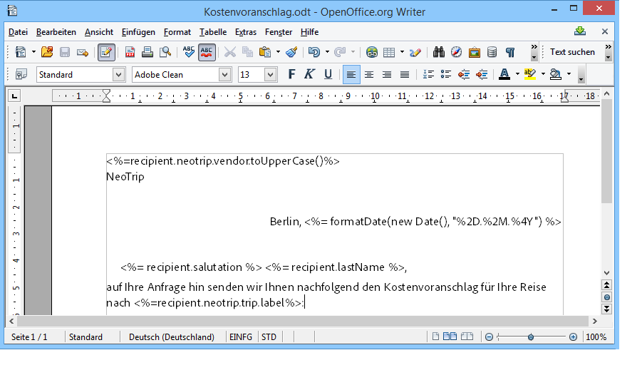
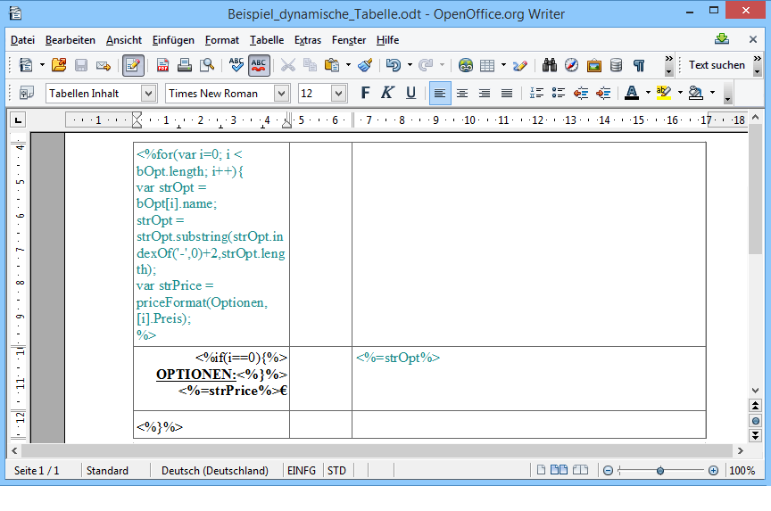
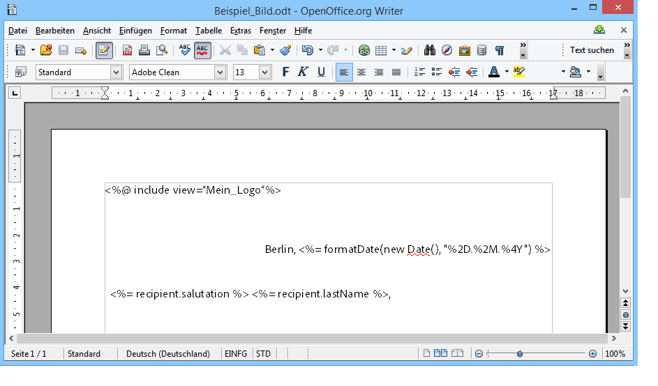
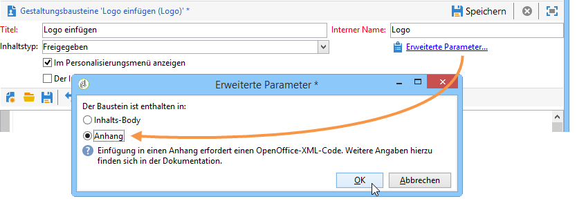
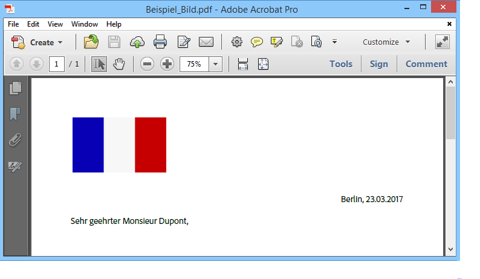

# Personalisierte PDF-Dokumente erstellen{#generating-personalized-pdf-documents}

## Über PDF-Dateien mit Variablen {#about-variable-pdf-documents}

Adobe Campaign ermöglicht ausgehend von LibreOffice- oder Microsoft-Word-Dateien das Erstellen von PDF-Dateien mit Variablen, die für personalisierte E-Mail-Anhänge oder Briefpost-Sendungen genutzt werden können.

Unterstützt werden die Formate &quot;.docx&quot;, &quot;.doc&quot; und &quot;.odt&quot;.

Um die entsprechenden Dokumente zu personalisieren, stehen Ihnen die gleichen JavaScript-Funktionen zur Verfügung, die auch bei E-Mails Verwendung finden.

Aktivieren Sie bei der Erstellung des E-Mail-Anhangs die Option **[!UICONTROL Dateiinhalt wird zum Zeitpunkt der Absendung für jede Nachricht personalisiert und in PDF konvertiert]**. Weitere Informationen zum Anhängen einer berechneten Datei finden Sie im Abschnitt [Anhänge erstellen](../../delivery/using/attaching-files.md).

Beispiel der Personalisierung eines Rechnungskopfes:



Die Erzeugung dynamischer Tabellen und der Einschluss von Bildern über URLs wird nachfolgend dargestellt.

## Dynamische Tabellen erstellen {#generating-dynamic-tables}

Gehen Sie wie folgt vor, um eine dynamische Tabelle zu erzeugen:

* Erstellen Sie eine Tabelle mit drei Zeilen und einer beliebigen Anzahl an Spalten. Konfigurieren Sie das Layout (Rahmen usw.).
* Bewegen Sie den Cursor auf die Tabelle und klicken Sie im Menü auf **[!UICONTROL Tabelle > Tabelleneigenschaften]**. Geben Sie im **[!UICONTROL Tabelle]**-Tab einen mit **NlJsTable** beginnenden Titel ein.
* Definieren Sie in der ersten Zelle der ersten Zeile eine Schleife (z. B. &quot;for&quot;), die die Iteration der Werte, die Sie anzeigen möchten, ermöglicht.
* Fügen Sie in jeder Zelle der zweiten Zeile die Scripts ein, die die anzuzeigenden Werte ausgeben.
* Schließen Sie die Schleife in der dritten und letzten Zeile der Tabelle.

   Beispiel der Erstellung einer dynamischen Tabelle:

   

## Externe Bilder einfügen {#inserting-external-images}

Sie haben die Möglichkeit, ein Dokument mit Bildern zu personalisieren, deren URL in einem Feld des Empfängerprofils gespeichert ist.

Konfigurieren Sie hierzu einen Gestaltungsbaustein und verweisen Sie auf diesen im angehängten Dokument.

**Anwendungsbeispiel: Einfügen eines personalisierten Logos in Abhängigkeit vom Herkunftsland des Empfängers**

**1. Schritt: Erstellung des Anhangs**

* Fügen Sie den Verweis auf den Gestaltungsbaustein ein: **&lt;%@ include view=&quot;Baustein-Name&quot; %>**.
* Fügen Sie den (eventuell personalisierten) Inhalt in den Nachrichten-Textkörper ein.



**2. Schritt: Erstellung des Gestaltungsbausteins**

* Gehen Sie in das Menü **[!UICONTROL Ressourcen > Kampagnenverwaltung > Gestaltungsbausteine]**.
* Erstellen Sie einen neuen Baustein mit dem Titel &quot;Mein Logo&quot; und dem internen Namen &quot;Mein_Logo&quot;.
* Öffnen Sie den Link **[!UICONTROL Erweiterte Parameter...]** ... und geben Sie an, dass der Baustein in einem Anhang enthalten ist. Mit Auswahl dieser Option wird die Definition des Gestaltungsbausteins direkt in den Inhalt der OpenOffice-Datei kopiert.****

   

   Innerhalb des Gestaltungsbausteins sind zwei Deklarierungstypen zu unterscheiden:

   * Der Adobe Campaign-Code der Personalisierungsfelder: Die Zeichen „Kleiner als“ und „Größer als“ müssen durch eine Escape-Sequenz ersetzt werden (`&lt;` und `&gt;`).
   * Der OpenOffice-XML-Code wird vollständig in das OpenOffice-Dokument kopiert.

Im Beispiel weist der Gestaltungsbaustein folgendes Format auf:

```
<% if (recipient.country.label == "Germany") { %>
<draw:frame svg:width="4cm" svg:height="3cm">
<draw:image xlink:href=https://..../logo_germany.png />
</draw:frame>
<% } else
if (recipient.country.label == "USA")
{ %>
<draw:frame svg:width="4cm" svg:height="3cm">
<draw:image xlink:href=https://..../logo_USA.png />
</draw:frame>
<% } %>
```

Die Personalisierung bezüglich des Herkunftslands des Empfängers wurde korrekt konfiguriert:


