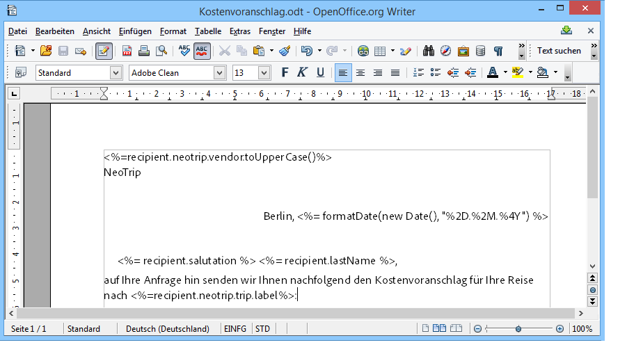
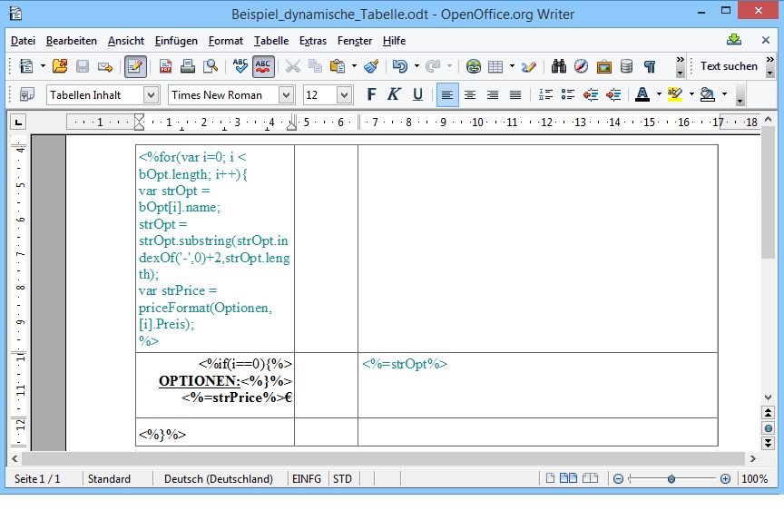
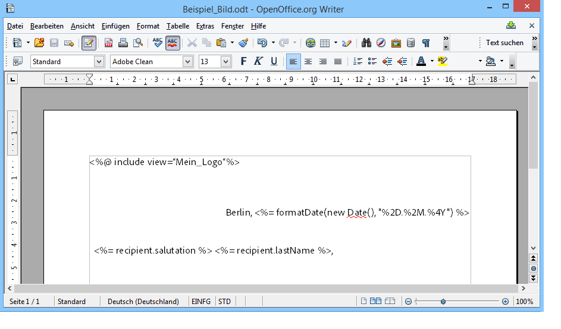
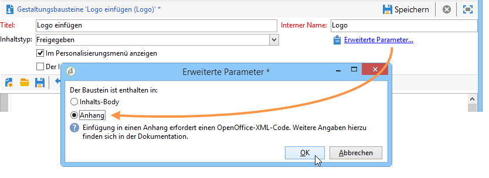
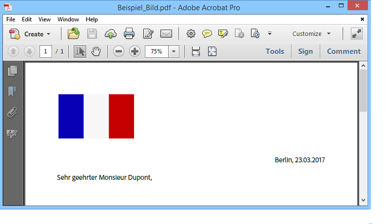

<?xml version="1.0" encoding="UTF-8"?>
<xliff xmlns="urn:oasis:names:tc:xliff:document:1.2" xmlns:okp="okapi-framework:xliff-extensions" xmlns:its="http://www.w3.org/2005/11/its" xmlns:itsxlf="http://www.w3.org/ns/its-xliff/" version="1.2" its:version="2.0">
<file original="help/delivery/using/generating-personalized-pdf-documents.md.mdsc" source-language="en-US" target-language="en-XX" datatype="x-text/markdown">
<body>
<trans-unit id="tu11" xml:space="preserve">
<source xml:lang="en-US">https://experienceleague.adobe.com/docs/campaign/campaign-v8/send/emails/attaching-files.html?lang=de</source>
<target xml:lang="en-XX">https://experienceleague.adobe.com/docs/campaign/campaign-v8/send/emails/attaching-files.html?lang=de</target>
</trans-unit>
<trans-unit id="tu27" xml:space="preserve">
<source xml:lang="en-US">https://experienceleague.adobe.com/de/docs/control-panel/using/instances-settings/url-permissions</source>
<target xml:lang="en-XX">https://experienceleague.adobe.com/de/docs/control-panel/using/instances-settings/url-permissions</target>
</trans-unit>
<trans-unit id="tu1" restype="x-YAML_METADATA_HEADER_VALUE" xml:space="preserve">
<source xml:lang="en-US">Generate personalized PDF documents</source>
<target xml:lang="en-XX">Erstellen von personalisierten PDF-Dokumenten</target>
</trans-unit>
<trans-unit id="tu2" restype="x-YAML_METADATA_HEADER_VALUE" xml:space="preserve">
<source xml:lang="en-US">Learn how to generate personalized PDF documents</source>
<target xml:lang="en-XX">Erfahren Sie, wie Sie personalisierte PDF-Dokumente erstellen</target>
</trans-unit>
<trans-unit id="tu3" xml:space="preserve">
<source xml:lang="en-US">Also applies to v8</source>
<target xml:lang="en-XX">Gilt auch für v8</target>
</trans-unit>
<trans-unit id="tu4" xml:space="preserve">
<source xml:lang="en-US">Also applies to Campaign v8</source>
<target xml:lang="en-XX">Gilt auch für Campaign v8</target>
</trans-unit>
<trans-unit id="tu5" xml:space="preserve">
<source xml:lang="en-US">Generate personalized PDF documents</source>
<target xml:lang="en-XX">Erstellen von personalisierten PDF-Dokumenten</target>
</trans-unit>
<trans-unit id="tu6" xml:space="preserve">
<source xml:lang="en-US">About variable PDF documents</source>
<target xml:lang="en-XX">Über variable PDF-Dateien</target>
</trans-unit>
<trans-unit id="tu7" xml:space="preserve">
<source xml:lang="en-US">Adobe Campaign lets you generate variable PDF documents for email attachments from LibreOffice or Microsoft Word documents.</source>
<target xml:lang="en-XX">Mit Adobe Campaign können Sie aus LibreOffice- oder Microsoft Word-Dokumenten variable PDF-Dokumente für E-Mail-Anhänge erstellen.</target>
</trans-unit>
<trans-unit id="tu8" xml:space="preserve">
<source xml:lang="en-US">The following extensions are supported: ".docx", ".doc", and ".odt".</source>
<target xml:lang="en-XX">Unterstützt werden die Formate ".docx", ".doc" und ".odt".</target>
</trans-unit>
<trans-unit id="tu9" xml:space="preserve">
<source xml:lang="en-US">To personalize your documents, the same JavaScript functionalities as for email personalization are available.</source>
<target xml:lang="en-XX">Um die entsprechenden Dokumente zu personalisieren, stehen Ihnen die gleichen JavaScript-Funktionen zur Verfügung, die auch bei E-Mails Verwendung finden.</target>
</trans-unit>
<trans-unit id="tu10" xml:space="preserve">
<source xml:lang="en-US">You need to activate the <ph id="1" ctype="x-STRONG_EMPHASIS">**[!UICONTROL </ph>"The content of the file is personalized and converted to PDF during the delivery of each message"<ph id="3" ctype="x-LINK_REF">]**</ph> option. This option is accessible when you attach the file to the delivery email. For more on attaching a calculated file, refer the <ph id="5" ctype="x-LINK">&lbrack;</ph>Campaign v8 documentation<ph id="6" ctype="x-LINK">[#$tu11]{target="_blank"}</ph>.</source>
<target xml:lang="en-XX">Sie müssen die Option <ph id="1" ctype="x-STRONG_EMPHASIS">**[!UICONTROL </ph>Dateiinhalt wird zum Zeitpunkt des Versand für jede Nachricht personalisiert und in PDF konvertiert<ph id="3" ctype="x-LINK_REF">]**</ph> aktivieren. Diese Option ist verfügbar, wenn Sie die Datei an den E-Mail-Versand anhängen. Weitere Informationen zum Anhängen einer berechneten Datei finden Sie in der <ph id="5" ctype="x-LINK">&lbrack;</ph>Dokumentation zu Campaign v8<ph id="6" ctype="x-LINK">[#$tu11]{target="_blank"}</ph>.</target>
</trans-unit>
<trans-unit id="tu12" xml:space="preserve">
<source xml:lang="en-US">Example of an invoice header personalization:</source>
<target xml:lang="en-XX">Beispiel der Personalisierung eines Rechnungs-Headers:</target>
</trans-unit>
<trans-unit id="tu13" xml:space="preserve">
<source xml:lang="en-US"><ph id="1" ctype="x-IMAGE"></ph></source>
<target xml:lang="en-XX"><ph id="1" ctype="x-IMAGE"></ph></target>
</trans-unit>
<trans-unit id="tu14" xml:space="preserve">
<source xml:lang="en-US">To generate dynamic tables or include images via a URL, you need to follow a specific process.</source>
<target xml:lang="en-XX">Die Erzeugung dynamischer Tabellen und der Einschluss von Bildern über URLs wird nachfolgend dargestellt.</target>
</trans-unit>
<trans-unit id="tu15" xml:space="preserve">
<source xml:lang="en-US">Generate dynamic tables</source>
<target xml:lang="en-XX">Erzeugen von dynamischen Tabellen</target>
</trans-unit>
<trans-unit id="tu16" xml:space="preserve">
<source xml:lang="en-US">The procedure for generating dynamic tables is as follows:</source>
<target xml:lang="en-XX">Gehen Sie wie folgt vor, um eine dynamische Tabelle zu erzeugen:</target>
</trans-unit>
<trans-unit id="tu17" xml:space="preserve">
<source xml:lang="en-US">Create a table with three lines and as many columns as necessary, then configure its layout (borders, etc.).</source>
<target xml:lang="en-XX">Erstellen Sie eine Tabelle mit drei Zeilen und einer beliebigen Anzahl an Spalten. Konfigurieren Sie das Layout (Rahmen usw.).</target>
</trans-unit>
<trans-unit id="tu18" xml:space="preserve">
<source xml:lang="en-US">Place your cursor on the table and click the <ph id="1" ctype="x-STRONG_EMPHASIS">**[!UICONTROL </ph>Table > Table properties<ph id="3" ctype="x-LINK_REF">]**</ph> menu. Go to the <ph id="5" ctype="x-STRONG_EMPHASIS">**[!UICONTROL </ph>Table<ph id="7" ctype="x-LINK_REF">]**</ph> tab and enter a name beginning with <ph id="9" ctype="x-STRONG_EMPHASIS">**</ph>NlJsTable<ph id="10" ctype="x-STRONG_EMPHASIS">**</ph>.</source>
<target xml:lang="en-XX">Bewegen Sie den Cursor auf die Tabelle und klicken Sie im Menü auf <ph id="1" ctype="x-STRONG_EMPHASIS">**[!UICONTROL </ph>Tabelle > Tabelleneigenschaften<ph id="3" ctype="x-LINK_REF">]**</ph>. Geben Sie im <ph id="5" ctype="x-STRONG_EMPHASIS">**[!UICONTROL </ph>Tabelle<ph id="7" ctype="x-LINK_REF">]**</ph>-Tab einen mit <ph id="9" ctype="x-STRONG_EMPHASIS">**</ph>NlJsTable<ph id="10" ctype="x-STRONG_EMPHASIS">**</ph> beginnenden Titel ein.</target>
</trans-unit>
<trans-unit id="tu19" xml:space="preserve">
<source xml:lang="en-US">In the first cell of the first line, define a loop ("for", for example) that enables iteration on the values you want to display in the table.</source>
<target xml:lang="en-XX">Definieren Sie in der ersten Zelle der ersten Zeile eine Schleife (z. B. "for"), die die Iteration der Werte, die Sie anzeigen möchten, ermöglicht.</target>
</trans-unit>
<trans-unit id="tu20" xml:space="preserve">
<source xml:lang="en-US">In each cell of the second line of the table, insert scripts that return the values to display.</source>
<target xml:lang="en-XX">Fügen Sie in jeder Zelle der zweiten Zeile die Skripts ein, die die anzuzeigenden Werte ausgeben.</target>
</trans-unit>
<trans-unit id="tu21" xml:space="preserve">
<source xml:lang="en-US">Close the loop in the third and last line of the table.</source>
<target xml:lang="en-XX">Schließen Sie die Schleife in der dritten und letzten Zeile der Tabelle.</target>
</trans-unit>
<trans-unit id="tu22" xml:space="preserve">
<source xml:lang="en-US">Example of a dynamic table definition:</source>
<target xml:lang="en-XX">Beispiel der Erstellung einer dynamischen Tabelle:</target>
</trans-unit>
<trans-unit id="tu23" xml:space="preserve">
<source xml:lang="en-US"><ph id="1" ctype="x-IMAGE"></ph></source>
<target xml:lang="en-XX"><ph id="1" ctype="x-IMAGE"></ph></target>
</trans-unit>
<trans-unit id="tu24" xml:space="preserve">
<source xml:lang="en-US">Insert external images</source>
<target xml:lang="en-XX">Einfügen externer Bilder</target>
</trans-unit>
<trans-unit id="tu25" xml:space="preserve">
<source xml:lang="en-US"><ph id="1" ctype="x-regxph" equiv-text="&lbrack;!IMPORTANT">[!IMPORTANT]</ph></source>
<target xml:lang="en-XX"><ph id="1" ctype="x-regxph" equiv-text="&lbrack;!IMPORTANT">[!IMPORTANT]</ph></target>
</trans-unit>
<trans-unit id="tu26" xml:space="preserve">
<source xml:lang="en-US">Release 7.4.4 (build 9401) includes an update to the external URL allow list. Make sure the domains used for external images in your attachments are added to your instance's approved allow list so that resources continue to load without interruption. As a Campaign Administrator, use the Control Panel to add and manage allow-listed URLs. See <ph id="1" ctype="x-LINK">&lbrack;</ph>Add URL permissions<ph id="2" ctype="x-LINK">[#$tu27]{target="_blank"}</ph> for steps.</source>
<target xml:lang="en-XX">Version 7.4.4 (Build 9401) umfasst eine Aktualisierung der Zulassungsliste für externe URLs. Stellen Sie sicher, dass die für externe Bilder in den Anhängen verwendeten Domains der genehmigten Zulassungsliste Ihrer Instanz hinzugefügt werden, damit Ressourcen weiterhin ohne Unterbrechung geladen werden. Verwenden Sie als Campaign-Admin das Control Panel, um der Zulassungsliste URLs hinzuzufügen und diese zu verwalten. Entsprechende Schritte finden Sie unter <ph id="1" ctype="x-LINK">&lbrack;</ph>Hinzufügen von URL-Berechtigungen<ph id="2" ctype="x-LINK">[#$tu27]{target="_blank"}</ph>.</target>
</trans-unit>
<trans-unit id="tu28" xml:space="preserve">
<source xml:lang="en-US">The insertion of external images is useful if, for instance, you want to personalize a document with an image whose URL is entered in a field of the recipient.</source>
<target xml:lang="en-XX">Sie haben die Möglichkeit, ein Dokument mit Bildern zu personalisieren, deren URL in einem Feld des Empfängerprofils gespeichert ist.</target>
</trans-unit>
<trans-unit id="tu29" xml:space="preserve">
<source xml:lang="en-US">To do this, you need to configure a personalization block, then include a call to the personalization block in the attachment.</source>
<target xml:lang="en-XX">Konfigurieren Sie hierzu einen Gestaltungsbaustein und verweisen Sie auf diesen im angehängten Dokument.</target>
</trans-unit>
<trans-unit id="tu30" xml:space="preserve">
<source xml:lang="en-US"><ph id="1" ctype="x-STRONG_EMPHASIS">**</ph>Example: insert a personalized logo depending on the recipient's country<ph id="2" ctype="x-STRONG_EMPHASIS">**</ph></source>
<target xml:lang="en-XX"><ph id="1" ctype="x-STRONG_EMPHASIS">**</ph>Anwendungsbeispiel: Einfügen eines personalisierten Logos in Abhängigkeit vom Herkunftsland des Empfängers<ph id="2" ctype="x-STRONG_EMPHASIS">**</ph></target>
</trans-unit>
<trans-unit id="tu31" xml:space="preserve">
<source xml:lang="en-US"><ph id="1" ctype="x-STRONG_EMPHASIS">**</ph>Step 1: create the attachment:<ph id="2" ctype="x-STRONG_EMPHASIS">**</ph></source>
<target xml:lang="en-XX"><ph id="1" ctype="x-STRONG_EMPHASIS">**</ph>1. Schritt: Erstellung des Anhangs<ph id="2" ctype="x-STRONG_EMPHASIS">**</ph></target>
</trans-unit>
<trans-unit id="tu32" xml:space="preserve">
<source xml:lang="en-US">Insert the call to the personalization block: <ph id="1" ctype="x-STRONG_EMPHASIS">**</ph>&lt;%@ include view="blockname" %><ph id="2" ctype="x-STRONG_EMPHASIS">**</ph>.</source>
<target xml:lang="en-XX">Fügen Sie den Verweis auf den Gestaltungsbaustein ein: <ph id="1" ctype="x-STRONG_EMPHASIS">**</ph>&lt;%@ include view="Baustein-Name" %><ph id="2" ctype="x-STRONG_EMPHASIS">**</ph>.</target>
</trans-unit>
<trans-unit id="tu33" xml:space="preserve">
<source xml:lang="en-US">Insert your content (personalized or not) into the body of the file.</source>
<target xml:lang="en-XX">Fügen Sie den (eventuell personalisierten) Inhalt in den Nachrichten-Textkörper ein.</target>
</trans-unit>
<trans-unit id="tu34" xml:space="preserve">
<source xml:lang="en-US"><ph id="1" ctype="x-IMAGE"></ph></source>
<target xml:lang="en-XX"><ph id="1" ctype="x-IMAGE"></ph></target>
</trans-unit>
<trans-unit id="tu35" xml:space="preserve">
<source xml:lang="en-US"><ph id="1" ctype="x-STRONG_EMPHASIS">**</ph>Step 2: create the personalization block:<ph id="2" ctype="x-STRONG_EMPHASIS">**</ph></source>
<target xml:lang="en-XX"><ph id="1" ctype="x-STRONG_EMPHASIS">**</ph>2. Schritt: Erstellung des Gestaltungsbausteins<ph id="2" ctype="x-STRONG_EMPHASIS">**</ph></target>
</trans-unit>
<trans-unit id="tu36" xml:space="preserve">
<source xml:lang="en-US">Go to the <ph id="1" ctype="x-STRONG_EMPHASIS">**[!UICONTROL </ph>Resources > Campaign management > Personalization blocks<ph id="3" ctype="x-LINK_REF">]**</ph> menu of the Adobe Campaign console.</source>
<target xml:lang="en-XX">Gehen Sie in das Menü <ph id="1" ctype="x-STRONG_EMPHASIS">**[!UICONTROL </ph>Ressourcen > Kampagnenverwaltung > Gestaltungsbausteine<ph id="3" ctype="x-LINK_REF">]**</ph>.</target>
</trans-unit>
<trans-unit id="tu37" xml:space="preserve">
<source xml:lang="en-US">Create a new "My Logo" personalization block with "My_Logo" as an internal name.</source>
<target xml:lang="en-XX">Erstellen Sie einen neuen Baustein mit dem Titel "Mein Logo" und dem internen Namen "Mein_Logo".</target>
</trans-unit>
<trans-unit id="tu38" xml:space="preserve">
<source xml:lang="en-US">Click on the <ph id="1" ctype="x-STRONG_EMPHASIS">**[!UICONTROL </ph>Advanced parameters...<ph id="3" ctype="x-LINK_REF">]**</ph> link then check the <ph id="5" ctype="x-STRONG_EMPHASIS">**[!UICONTROL </ph>"The content of the block is included in an attachment"<ph id="7" ctype="x-LINK_REF">]**</ph> option. This lets you copy the definition of the personalization block directly into the content of the OpenOffice file.</source>
<target xml:lang="en-XX">Klicken Sie auf den Link <ph id="1" ctype="x-STRONG_EMPHASIS">**[!UICONTROL </ph>Erweiterte Parameter…<ph id="3" ctype="x-LINK_REF">]**</ph> und aktivieren Sie die Option <ph id="5" ctype="x-STRONG_EMPHASIS">**[!UICONTROL </ph>Der Inhalt des Bausteins wird als Anhang angefügt<ph id="7" ctype="x-LINK_REF">]**</ph>. So können Sie die Definition des Gestaltungsbausteins direkt in den Inhalt der OpenOffice-Datei kopieren.</target>
</trans-unit>
<trans-unit id="tu39" xml:space="preserve">
<source xml:lang="en-US"><ph id="1" ctype="x-IMAGE"></ph></source>
<target xml:lang="en-XX"><ph id="1" ctype="x-IMAGE"></ph></target>
</trans-unit>
<trans-unit id="tu40" xml:space="preserve">
<source xml:lang="en-US">You need to differentiate two types of declarations within the personalization block:</source>
<target xml:lang="en-XX">Innerhalb des Gestaltungsbausteins sind zwei Deklarierungstypen zu unterscheiden:</target>
</trans-unit>
<trans-unit id="tu41" xml:space="preserve">
<source xml:lang="en-US">The Adobe Campaign code of the personalization fields for which the "open" and "closed" chevrons must be replaced with escape characters (respectively <ph id="1" ctype="x-CODE">`&amp;lt;`</ph> and <ph id="2" ctype="x-CODE">`&amp;gt;`</ph>).</source>
<target xml:lang="en-XX">Der Adobe Campaign-Code der Personalisierungsfelder: Die Zeichen „Kleiner als“ und „Größer als“ müssen durch eine Escape-Sequenz ersetzt werden (<ph id="1" ctype="x-CODE">`&amp;lt;`</ph> und <ph id="2" ctype="x-CODE">`&amp;gt;`</ph>).</target>
</trans-unit>
<trans-unit id="tu42" xml:space="preserve">
<source xml:lang="en-US">The entire OpenOffice XML code will be copied into the OpenOffice document.</source>
<target xml:lang="en-XX">Der OpenOffice-XML-Code wird vollständig in das OpenOffice-Dokument kopiert.</target>
</trans-unit>
<trans-unit id="tu43" xml:space="preserve">
<source xml:lang="en-US">In the example, the personalization block looks like this:</source>
<target xml:lang="en-XX">Im Beispiel weist der Gestaltungsbaustein folgendes Format auf:</target>
</trans-unit>
<trans-unit id="tu44" xml:space="preserve">
<source xml:lang="en-US">Depending on the recipient's country, personalization is visible in the document linked to the delivery:</source>
<target xml:lang="en-XX">Die Personalisierung bezüglich des Herkunftslands des Empfängers wurde korrekt konfiguriert:</target>
</trans-unit>
<trans-unit id="tu45" xml:space="preserve">
<source xml:lang="en-US"><ph id="1" ctype="x-IMAGE"></ph></source>
<target xml:lang="en-XX"><ph id="1" ctype="x-IMAGE"></ph></target>
</trans-unit>
</body>
</file>
</xliff>