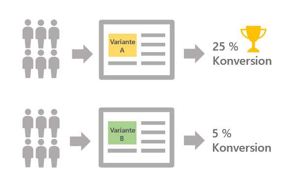

# Erste Schritte mit A/B-Tests {#get-started-a-b-testing}

Mit A/B-Tests können Sie mehrere Versionen eines Versands miteinander vergleichen, um herauszufinden, welche Version die größte Wirkung auf die Zielgruppe hat.

Dazu müssen Sie zunächst mehrere Versandvarianten definieren. Jede Variante wird dann an Testpopulationen gesendet, um zu ermitteln, welche in Abhängigkeit von den von Ihnen gewählten Kriterien (Öffnungen, Spam-Beschwerden, Klicks auf einen bestimmten Link usw.) besser abschneidet.

Im folgenden Beispiel wurde die Zielgruppe des Versands in zwei Gruppen aufgeteilt, die jeweils 50 % der Zielgruppe ausmachen. Jede Gruppe erhält zwei Versionen des Versands mit zwei verschiedenen Werbeangeboten. Nach der Ausführung des Versands wird festgestellt, dass Variante A besser abschneidet – basierend auf der Anzahl der Klicks auf die Werbeangebote.

Mit Campaign Classic werden A/B-Tests über Workflows implementiert, in denen Sie die Zielpopulation sowie die Gruppen, die jede Variante erhalten sollen, festlegen (siehe [A/B-Tests konfigurieren](../../delivery/using/configuring-a-b-testing.md)).

Die wichtigsten Schritte sind:

1. **Festlegen** der gewünschten Population.
1. **Aufteilen der Population** in Untermengen, mit denen Sie die Varianten Ihres Versands testen möchten.

   Sie können beispielsweise eine Version eines Versands an einen kleinen Teil der Zielgruppe und eine andere an die restliche Zielgruppe senden. Auf diese Weise können Sie eine neue Version eines Versands testen, im Gegensatz zum Versand, der normalerweise an Ihre Kunden gesendet wird. Sie können die Zielgruppe auch in drei Gruppen unterteilen, um ihnen drei verschiedene Versionen eines Versands zu senden.

1. **Erstellen mehrerer Versionen** des Versands, die den einzelnen Untermengen entsprechen. Die zu testende Variante kann der Betreff, der Inhalt der Nachricht, der Name des Absenders usw. sein.
1. Starten Sie den Workflow und analysieren Sie anhand der **Versandlogs** das Verhalten der Untermengen für jede Variante.

>[!NOTE]
>
>Mithilfe von Workflows können Sie Ihre Prozesse auch automatisieren, indem Sie automatisch die Versandvariante identifizieren, die besser abgeschnitten hat, und diese dann an die verbleibende Population senden. Weitere Informationen dazu finden Sie im [entsprechenden Anwendungsbeispiel](../../delivery/using/a-b-testing-use-case.md).
