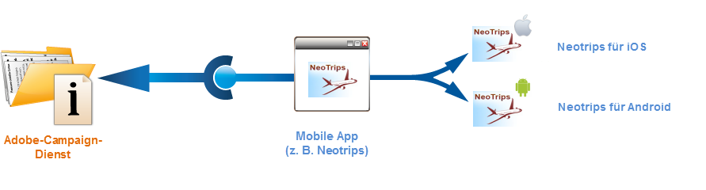
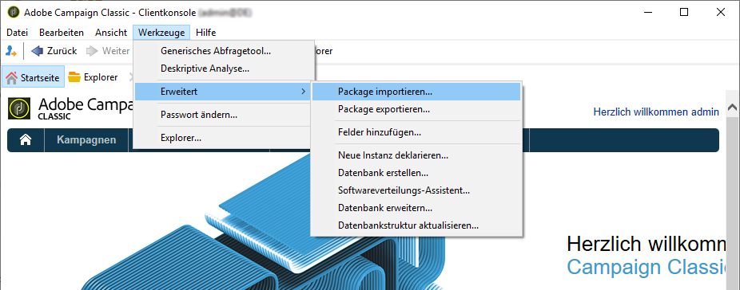
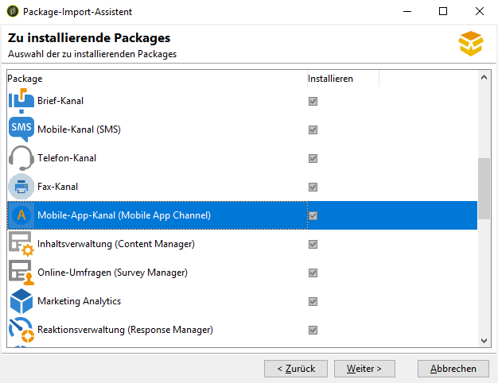
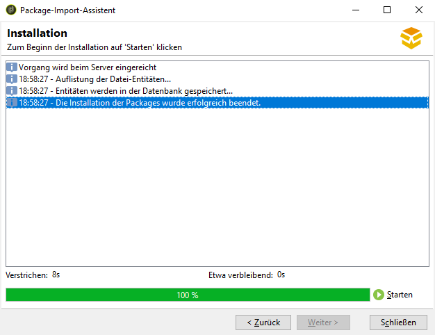

# Erste Schritte mit der Mobile-App-Konfiguration

In diesem Abschnitt finden Sie ein Konfigurationsbeispiel, das auf einem Unternehmen basiert, das Urlaubspakete online anbietet. Seine Mobile App (Neotrips) steht Kunden in zwei Versionen zur Verfügung: Neotrips für Android und Neotrips für iOS.

Um Push-Benachrichtigungen in Adobe Campaign senden zu können, müssen Sie folgende Schritte befolgen:

* Erstellen Sie für die Neotrips-App einen Informationsdienst vom Typ **[!UICONTROL Mobile App]**. Die Vorgehensweise für iOS finden Sie in [diesem Abschnitt](../../delivery/using/configuring-the-mobile-application.md#configuring-ios-service). Die Vorgehensweise für Android finden Sie in [diesem Abschnitt](../../delivery/using/configuring-the-mobile-application-android.md#configuring-android-service).
* Fügen Sie diesem Dienst die iOS- und Android-Versionen der Mobile App hinzu.
* Erstellen Sie einen Versand sowohl für iOS als auch für Android. [Mehr dazu erfahren Sie auf dieser Seite](../../delivery/using/creating-notifications.md).

>[!NOTE]
>
>Im Tab **[!UICONTROL Abonnements]** des Dienstes finden Sie alle Abonnenten, d. h. alle Nutzer, die die App auf ihrem Mobilgerät installiert und dem Erhalt von Benachrichtigungen zugestimmt haben.

## Package-Installation {#installing-package-ios}

Wenn Sie Campaign als Hybrid- oder gehostete Bereitstellung nutzen, wenden Sie sich an die Adobe-Kundenunterstützung, um Zugriff auf den Kanal für Push-Benachrichtigungen in Campaign zu erhalten.

Als Kunde einer On-Premise-Bereitstellung von Campaign müssen Sie die folgenden Installationsschritte ausführen:

1. Greifen Sie über **[!UICONTROL Tools > Erweitert > Package-Import...]** in der Adobe-Campaign-Clientkonsole auf den Package-Import-Assistenten zu.

   

1. Wählen Sie **[!UICONTROL Standard-Package installieren]** aus.

1. Markieren Sie in der angezeigten Liste **[!UICONTROL Mobile-App-Kanal (Mobile App Channel)]**.

   

1. Klicken Sie auf **[!UICONTROL Weiter]** und dann auf **[!UICONTROL Starten]**, um die Package-Installation zu starten.

   Sobald die Packages installiert sind, wird in der Fortschrittsleiste **100 %** angezeigt. Folgende Meldung wird in den Installationsprotokollen angezeigt: **[!UICONTROL Die Installation der Packages wurde erfolgreich beendet]**.

   

1. **[!UICONTROL Schließen]** Sie das Installationsfenster.

Nach Abschluss dieses Schritts können Sie Ihre Android- und iOS-Mobile-Apps konfigurieren.
Näheres hierzu finden Sie in den folgenden Abschnitten:

* [Konfigurationsschritte für iOS](../../delivery/using/configuring-the-mobile-application.md)

* [Konfigurationsschritte für Android](../../delivery/using/configuring-the-mobile-application-android.md)
