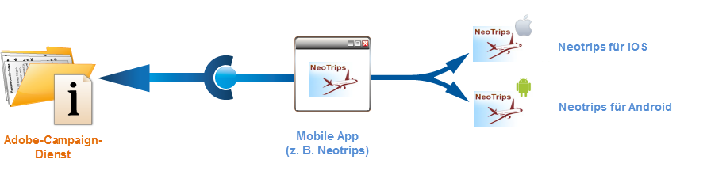
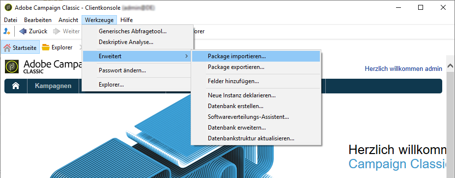
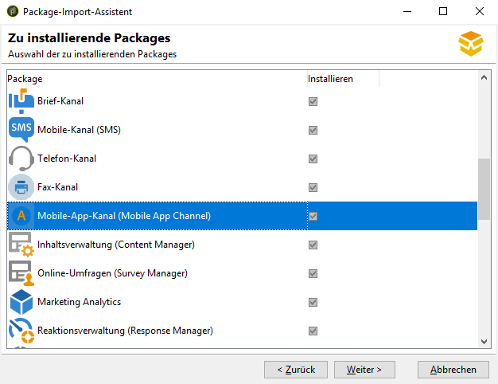
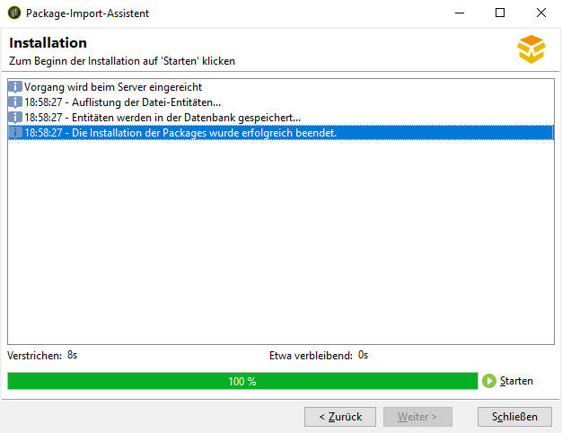

# Erste Schritte mit der Mobile-App-Konfiguration

In diesem Abschnitt finden Sie ein Konfigurationsbeispiel, das auf einem Unternehmen basiert, das Urlaubspakete online anbietet. Seine Mobile App (Neotrips) steht Kunden in zwei Versionen zur Verfügung: Neotrips für Android und Neotrips für iOS.

Um Push-Benachrichtigungen in Adobe Campaign senden zu können, müssen Sie folgende Schritte befolgen:

* Erstellen Sie für die Neotrips-App einen Informationsdienst vom Typ **[!UICONTROL Mobile App]**. Die Vorgehensweise für iOS finden Sie in [diesem Abschnitt](configuring-the-mobile-application.md#configuring-ios-service). Die Vorgehensweise für Android finden Sie in [diesem Abschnitt](configuring-the-mobile-application-android.md#configuring-android-service).
* Fügen Sie diesem Dienst die iOS- und Android-Versionen der Mobile App hinzu.
* Erstellen Sie einen Versand sowohl für [iOS](create-notifications-ios.md) als auch für [Android](create-notifications-android.md).

>[!NOTE]
>
>Auf der Registerkarte **[!UICONTROL Abonnements]** des Service finden Sie alle Abonnenten, d. h. alle Nutzer, die die Mobile App auf ihrem Mobilgerät installiert und dem Erhalt von Benachrichtigungen zugestimmt haben.

## Installieren des Package {#installing-package-ios}

[!BADGE Hybrid und On-Premise]{type=Caution url="https://experienceleague.adobe.com/docs/campaign-classic/using/installing-campaign-classic/architecture-and-hosting-models/hosting-models-lp/hosting-models.html?lang=de" tooltip="Gilt nur für Hybrid- und On-Premise-Bereitstellungen"}

 [Video zur Installation des Mobile-App-Package ](https://experienceleague.adobe.com/docs/campaign-classic-learn/tutorials/sending-messages/push-channel/installing-the-mobile-app-channel.html?lang=de#sending-messages)

Wenn Sie Campaign als Hybrid- oder gehostete Bereitstellung nutzen, wenden Sie sich an die [Adobe-Kundenunterstützung](https://helpx.adobe.com/de/enterprise/admin-guide.html/enterprise/using/support-for-experience-cloud.ug.html), um Zugriff auf den Kanal für Push-Benachrichtigungen in Campaign zu erhalten.

Wenn Sie Campaign als On-Premise-Bereitstellung nutzen, müssen Sie ein integriertes Paket installieren.

>[!CAUTION]
>
>Weitere Informationen zu integrierten Campaign-Paketen, Best Practices und Empfehlungen finden Sie auf [dieser Seite](../../installation/using/installing-campaign-standard-packages.md).

Die Installationsschritte sind:

1. Greifen Sie über **[!UICONTROL Werkzeuge > Erweitert > Package-Import]** in der Adobe Campaign-Client-Konsole auf den Package-Import-Assistenten zu.

   

1. Wählen Sie **[!UICONTROL Standard-Package installieren]** aus.

1. Markieren Sie in der angezeigten Liste **[!UICONTROL Mobile-App-Kanal (Mobile App Channel)]**.

   

1. Klicken Sie auf **[!UICONTROL Weiter]** und dann auf **[!UICONTROL Starten]**, um die Package-Installation zu starten.

   Sobald die Packages installiert sind, wird in der Fortschrittsleiste **100 %** angezeigt. Folgende Meldung wird in den Installationsprotokollen angezeigt: **[!UICONTROL Die Installation der Packages wurde erfolgreich beendet]**.

   

1. **[!UICONTROL Schließen]** Sie das Installationsfenster.

Nach Abschluss dieses Schritts können Sie Ihre Android- und iOS-Apps konfigurieren.
Näheres hierzu finden Sie in den folgenden Abschnitten:

* [Konfigurationsschritte für iOS](configuring-the-mobile-application.md)

* [Konfigurationsschritte für Android](configuring-the-mobile-application-android.md)
