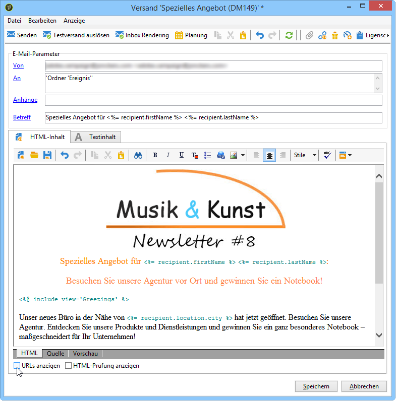
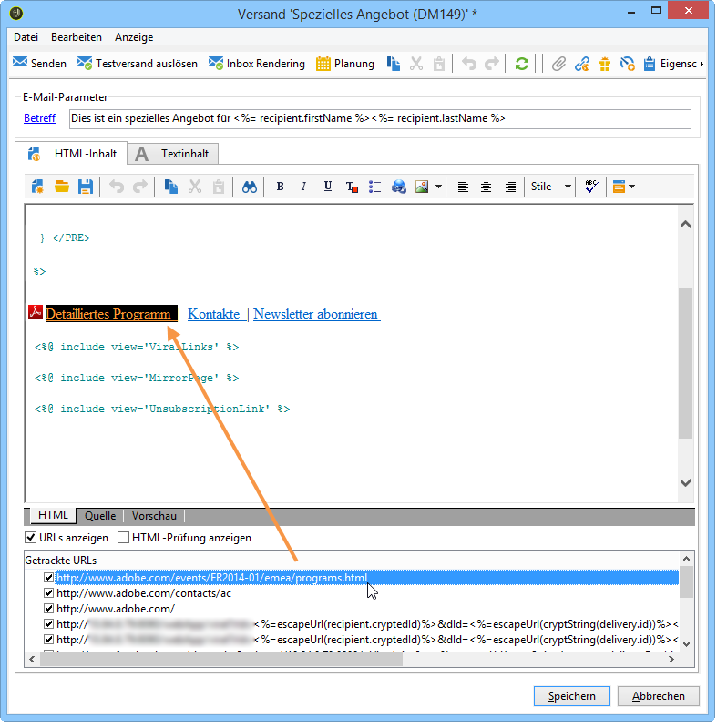
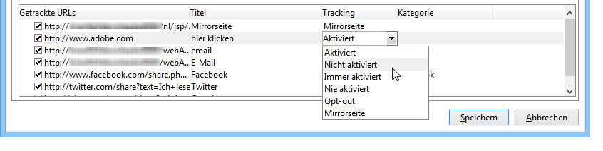

# Getrackte Links konfigurieren{#how-to-configure-tracked-links}

Sie haben die Möglichkeit, für jeden Versand die Zustellung und Klicks auf enthaltene Links zu verfolgen. Auf diese Weise kann das Verhalten der Nachrichtenempfänger analysiert werden.

>[!NOTE]
>
>Der Begriff Tracking bezieht sich auf den Umgang der Empfänger mit Nachrichten, während Webtracking das Surf-Verhalten von Empfängern dokumentiert (besuchte Seiten, Bestellungen usw.).
>
>Die Konfiguration des Webtrackings wird in [diesem Abschnitt](../../configuration/using/about-web-tracking.md) beschrieben.

Das Tracking von Nachrichten ist standardmäßig aktiviert. Um das Tracken von URLs zu personalisieren, gehen Sie folgendermaßen vor:

1. Wählen Sie die Option **[!UICONTROL URLs anzeigen]** im unteren Bereich des Versand-Assistenten unter dem Nachrichtentext aus.

   

   Sobald Sie eine URL in der Liste der getrackten URLs markieren, wird sie im Versandinhalt optisch hervorgehoben. (Dies gilt nicht für den Mirrorseite-Link und den Abmelde-Link, die zum Standard-Package der Anwendung gehören.)

   

1. Aktivieren oder deaktivieren Sie das Tracking für jede in der Nachricht enthaltene URL.

   >[!IMPORTANT]
   >
   >Wenn die URL des Links als Titel verwendet wird, empfiehlt es sich, das Tracking zu deaktivieren, damit die Nachricht nicht wegen des Verdachts auf Phishing zurückgewiesen wird.
   >
   >Wenn Sie z. B. die URL www.adobe.com in die Nachricht einfügen und das Tracking aktivieren, wird der Hyperlink in https://nlt.adobe.net/r/?id=xxxxxx umgewandelt. Dieser wird u. U. von den E-Mail-Programmen der Empfänger als Spam interpretiert.

1. Der Tracking-Titel kann angepasst werden. Doppelklicken Sie auf den zu ändernden Titel und geben Sie den neuen Titel ein.

   >[!NOTE]
   >
   >Die Anpassung der Titel der getrackten URLs dient auch der besseren Lesbarkeit der Tracking-Informationen. Identische URLs oder Titel werden bei der Klick-Zählung zusammengefasst.

1. Sie können den gewünschten Tracking-Modus in der Spalte **[!UICONTROL Tracking]** ändern. Wählen Sie dazu einen neuen Modus wie unten dargestellt aus.

   

   Für jede einzelne URL können Sie den Tracking-Modus auf einen dieser Werte festlegen.

   * **[!UICONTROL Aktiviert]**: Aktiviert das Tracking dieser URL.
   * **[!UICONTROL Nicht aktiviert]**: Deaktiviert das Tracking dieser URL.
   * **[!UICONTROL Immer aktiviert]**: Aktiviert immer das Tracking dieser URL. Diese Eingabe wird gespeichert, sodass das Tracking automatisch aktiviert wird, wenn die URL das nächste Mal in einem Nachrichtentext vorkommt.
   * **[!UICONTROL Nie aktiviert]**: Aktiviert nie das Tracking dieser URL. Diese Eingabe wird gespeichert, sodass das Tracking automatisch deaktiviert wird, wenn die URL das nächste Mal in einem Nachrichtentext vorkommt.
   * **[!UICONTROL Opt-out]**: Diese URL wird als Opt-out-URL behandelt.
   * **[!UICONTROL Mirrorseite]**: Diese URL wird als Mirrorseite behandelt.

1. Zusätzlich können Sie für jede getrackte URL in der Dropdown-Liste der Spalte **[!UICONTROL Kategorie]** eine Kategorie auswählen. Diese Kategorien können angezeigte Berichte sein, wie z. B. in **[!UICONTROL URLs und Clickstreams]** (siehe [diesen Abschnitt](../../reporting/using/reports-on-deliveries.md#urls-and-click-streams)). Kategorien werden in einer speziellen Auflistung definiert: **[!UICONTROL urlCategory]** (siehe [Auflistungen verwalten](../../platform/using/managing-enumerations.md)).
