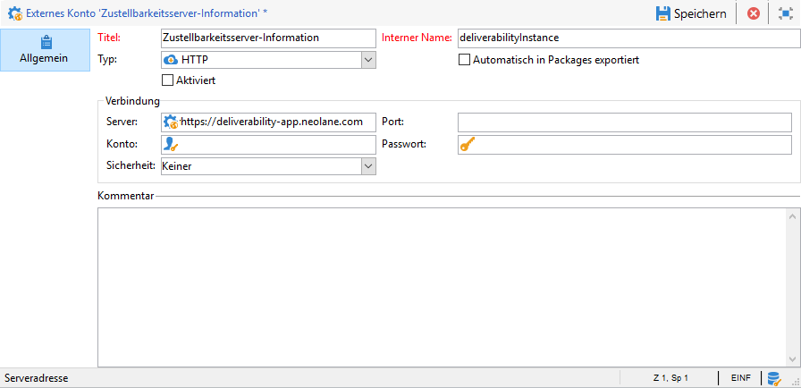

# Inbox Rendering{#inbox-rendering}

## Über Inbox Rendering {#about-inbox-rendering}

Bevor Sie die Schaltfläche **Senden** betätigen, sollten Sie sicherstellen, dass Ihre Nachricht den Empfängern in unterschiedlichen Webclients, Webmails und Geräten optimal dargestellt wird.

Zu diesem Zweck nutzt Adobe Campaign die webbasierte E-Mail-Test-Software [Litmus](https://litmus.com/email-testing), mit der die Darstellung der Seiten sichtbar und in einem Bericht verfügbar gemacht werden kann. Dadurch haben Sie die Möglichkeit, sich die gesendete Nachricht als Vorschau in den unterschiedlichen Umgebungen der Empfänger anzusehen und die Kompatibilität mit den wichtigsten Desktops und Anwendungen zu überprüfen.

Litmus verfügt über zahlreiche Funktionen zur E-Mail-Validierung und Vorschau. Autoren von E-Mail-Inhalten können Nachrichten in der Vorschau in über 70 E-Mail-Rendering-Systemen betrachten, wie z. B. im Gmail-Posteingang oder im Apple Mail Client.

Die für das **Inbox Rendering** in Adobe Campaign verfügbaren Clients für Mobilgeräte, SMS und Webmail finden Sie auf der Litmus-[Website](https://litmus.com/email-testing) (wählen Sie dazu die Option zum **Anzeigen aller E-Mail-Clients** aus).

>[!NOTE]
>
>Zum Testen der Personalisierung in Sendungen ist kein Inbox Rendering nötig. Die Personalisierung kann auch mit Adobe-Campaign-Tools, z. B. der **[!UICONTROL Vorschau]** und [Testsendungen](../../delivery/using/steps-validating-the-delivery.md#sending-a-proof), überprüft werden.

## Inbox Rendering aktivieren{#activating-inbox-rendering}

Für gehostete und hybride Clients wird das Inbox Rendering auf Ihrer Instanz vom technischen Support und von Beratern von Adobe konfiguriert. Weiterführende Informationen dazu erhalten Sie von Ihrem Adobe-Kundenbetreuer.

Gehen Sie bei On-Premise-Installationen wie folgt vor, um das Inbox Rendering zu konfigurieren.

1. Installieren Sie das **[!UICONTROL Inbox Rendering (IR)]**-Package über das Menü **[!UICONTROL Tools]** > **[!UICONTROL Erweitert]** > **[!UICONTROL Package-Import]**. Weitere Informationen hierzu finden Sie unter [Installieren von Campaign Classic-Standardpaketen](../../installation/using/installing-campaign-standard-packages.md).
1. Konfigurieren Sie ein externes HTTP-Konto über den Knoten **[!UICONTROL Administration]** > **[!UICONTROL Plattform]** > **[!UICONTROL Externe Konten]**. Weitere Informationen hierzu finden Sie unter [Externes Konto erstellen](../../platform/using/external-accounts.md#creating-an-external-account).
1. Legen Sie die Parameter für das externe Konto wie folgt fest:
   * **[!UICONTROL Titel]**: Zustellbarkeits-Server-Information
   * **[!UICONTROL Interner Name]**: deliverabilityInstance
   * **[!UICONTROL Typ]**: HTTP
   * **[!UICONTROL Server]**: https://deliverability-app.neolane.net/deliverability
   * **[!UICONTROL Verschlüsselung]**: Keine
   * Kreuzen Sie die Option **[!UICONTROL Aktiviert]** an.

   

1. Wechseln Sie zum Knoten **[!UICONTROL Administration]** > **[!UICONTROL Plattform]** > **[!UICONTROL Optionen]**. Suchen Sie nach der Option **[!UICONTROL DmRendering_cuid]** und wenden Sie sich an den Support, um die ID der Versandberichte abzurufen, die in das Feld **[!UICONTROL Wert (Text)]** kopiert werden muss.
1. Bearbeiten Sie die Datei **serverConf.xml**, um einen Aufruf an den Litmus-Server zuzulassen. Fügen Sie dem Abschnitt `<urlPermission>` die folgende Zeile hinzu:

   ```
   <url dnsSuffix="deliverability-app.neolane.net" urlRegEx="https://.*"/>
   ```

1. Laden Sie die Konfiguration mit dem folgenden Befehl neu:

   ```
   nlserver config -reload
   ```

>[!NOTE]
>
>Möglicherweise müssen Sie sich von der Konsole abmelden und sich wieder anmelden, um das Inbox Rendering verwenden zu können.

## Über Litmus-Token {#about-litmus-tokens}

Da Litmus ein Dienst eines Drittanbieters ist, wird für jede Nutzung eine Gebühr erhoben. Jedes Mal, wenn ein Benutzer die Litmus-Funktion aufruft, wird ein bestimmter Betrag vom Guthaben abgezogen.

In Adobe Campaign entspricht das Guthaben der Anzahl der verfügbaren Renderings (auch Tokens genannt).

>[!NOTE]
>
>Die Anzahl der verfügbaren Litmus-Token hängt von der von Ihnen erworbenen Campaign-Lizenz ab. Diese Information können Sie Ihrem Lizenzabkommen entnehmen.

Jedes Mal, wenn Sie in einem Versand die Funktion **[!UICONTROL Inbox Rendering]** verwenden, wird die verfügbare Anzahl der Token um jeweils eins verringert.

>[!IMPORTANT]
>
>Token werden für jedes einzelne Rendering abgezogen, und nicht für den gesamten Inbox-Rendering-Bericht.
>
>* Das bedeutet, dass jedes Mal, wenn ein Inbox-Rendering-Bericht erstellt wird, pro E-Mail-Client ein Token abgezogen wird: ein Token für das Rendering in Outlook 2000, einer für das Rendering in Outlook 2010, einer für das Rendering in Apple Mail 9 usw.
>* Wenn Sie für denselben Versand das Inbox Rendering wiederholen, wird die Anzahl der verfügbaren Token nochmals um die Anzahl der erzeugten Renderings reduziert.

>


Die Anzahl der restlichen Token wird in der **[!UICONTROL Zusammenfassung]** des Berichts [Inbox Rendering-Bericht](#inbox-rendering-report) angezeigt.


Normalerweise wird die Inbox-Rendering-Funktion zum Testen des HTML-Gerüsts einer neu erstellten E-Mail verwendet. Pro Rendering sind ca. 70 Token erforderlich (abhängig von der Anzahl der getesteten Umgebungen). In manchen Fällen sind aber mehrere Inbox-Rendering-Berichte erforderlich, um Ihren Versand vollständig zu testen. Es könnte deshalb eine größere Anzahl von Token nötig sein, um mehrere Prüfungen durchzuführen.

## Inbox-Rendering-Bericht aufrufen {#accessing-the-inbox-rendering-report}

Nachdem Sie Ihren E-Mail-Versand erstellt und seinen Inhalt sowie die Zielpopulation definiert haben, folgen Sie den unten stehenden Schritten.

Weiterführende Informationen zur Erstellung, Konzeption und Ausrichtung eines Versands finden Sie in [diesem Abschnitt](../../delivery/using/about-email-channel.md).

1. Wählen Sie in der Symbolleiste des Versands die Schaltfläche **[!UICONTROL Inbox Rendering]** aus.
1. Wählen Sie **[!UICONTROL Analysieren]** aus, um den Aufnahmeprozess zu starten.

   

   Ein Testversand wird durchgeführt. Nur wenige Minuten nach dem Absenden der E-Mails kann auf die Rendering-Miniaturansichten in diesem Testversand zugegriffen werden. Weiterführende Informationen dazu finden Sie in [diesem Abschnitt](../../delivery/using/steps-validating-the-delivery.md#sending-a-proof).

1. Nach dem Absenden erscheint der Testversand in der Versandliste. Dort kann er durch einen Doppelklick geöffnet werden.

   

1. Gehen Sie zum Tab **Inbox Rendering** des Testversands.

   

   Der Inbox-Rendering-Bericht wird angezeigt.

## Inbox-Rendering-Bericht {#inbox-rendering-report}

Dieser Bericht enthält Informationen zum Inbox Rendering, d. h. zur Darstellung der E-Mail in der Inbox des Empfängers. Die Renderings können unterschiedlich aussehen, je nachdem ob die E-Mail in einem Browser, auf einem Mobilgerät oder über eine E-Mail-Anwendung geöffnet wird.

Die **[!UICONTROL Zusammenfassung]** des Berichts zeigt die Anzahl der empfangenen, als Spam gekennzeichneten und nicht empfangenen Nachrichten oder die Anzahl der Nachrichten, deren Empfang ausstehend ist, in einer Liste und in einer farbcodierten Grafik.


Bewegen Sie die Maus über das Diagramm, um Informationen zu jeder Farbe aufzurufen.

Der Hauptteil des Berichts ist in drei Bereiche unterteilt: **[!UICONTROL Mobiltelefon]**, **[!UICONTROL E-Mail-Clients]** und **[!UICONTROL Webmails]**. Scrollen Sie im Bericht nach unten, um sich alle in diese drei Kategorien unterteilten Renderings anzusehen.


Klicken Sie auf eine der Karten, um das entsprechende Rendering im Detail anzusehen. Das Rendering wird für das jeweils ausgewählte Empfangsmedium angezeigt.


