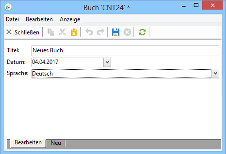
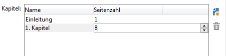
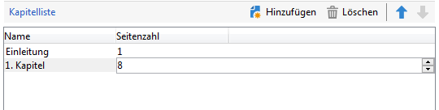
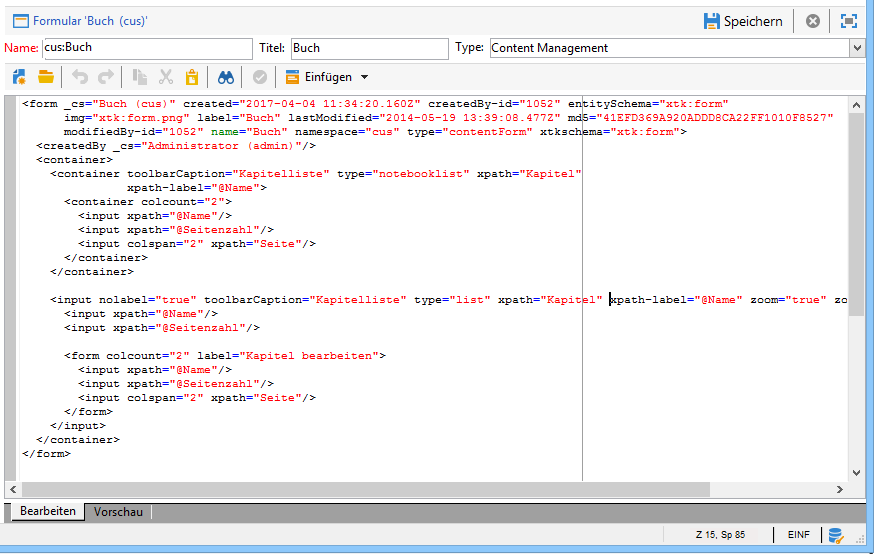
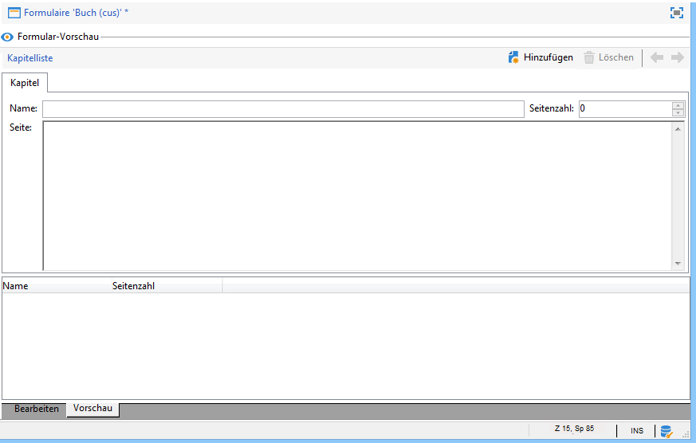

# Formulare{#input-forms}

Im Folgenden werden einige Grundprinzipien bezüglich der Formulare in Adobe Campaign dargestellt.

Weiterführende Informationen zu Formularen finden Sie in [diesem Abschnitt](../../configuration/using/identifying-a-form.md).

## Formularstruktur {#form-structure}

The XML document of an input form must contain the **`<form>`** root element with the **name** and **namespace** attributes to populate the form name and its namespace, respectively.

```
<form name="form_name" namespace="name_space">
...
</form>
```

Standardmäßig ist ein Formular mit dem Datenschema verknüpft, das denselben Namen und denselben Namespace hat. Um ein Formular mit einem anderen Namen zu verknüpfen, geben Sie den Schemaschlüssel im **entity-schema** -Attribut des **`<form>`** Elements ein.

Nachfolgend wird die Struktur eines Formulars anhand des Datenschemas &quot;cus:Buch&quot; verdeutlicht:



Das entsprechende XML-Dokument stellt sich wie folgt dar:

```
<form name="book" namespace="cus" type="contentForm">
  <input xpath="@name"/>
  <input xpath="@date"/>
  <input xpath="@language"/>
</form>
```

The description of the edit elements begins with the **`<form>`** root element.

An edit control is entered in an **`<input>`** element with the **xpath** attribute containing the path of the field in its schema.

**Informationen zur XPath-Syntax:**

Die XPath-Sprache wird in Adobe Campaign verwendet, um ein zu einem Datenschema gehörendes Element oder Attribut zu adressieren.

XPath ist eine Syntax, die es ermöglicht, einen Knoten in der Baumstruktur eines XML-Dokuments zu lokalisieren.

Elemente werden mit ihren Namen bezeichnet, während den Namen von Attributen ein &quot;@&quot;-Zeichen vorangestellt wird.

Beispiele:

* **@Datum**: markiert das Attribut mit Namen &quot;Datum&quot;;
* **chapter/@title**: wählt das Attribut &quot;title&quot;unter dem `<chapter>` Element aus
* **../@Datum**: markiert das Datum des dem aktuellen Element übergeordneten Elternelements.

Das Eingabefeld passt sich automatisch dem gewählten Datentyp an und verwendet den im Schema angegebenen Titel.

Standardmäßig wird jedes Feld, je nach Datentyp, einzeilig über den gesamten verfügbaren Platz angezeigt.

>[!CAUTION]
>
>The input form must reference a **type=&quot;contentForm&quot;** attribute on the **`<form>`** element to automatically add the frame required for content to be input.

## Layout {#formatting}

Die Anordnung der Steuerelemente untereinander ähnelt dem in einer HTML-Tabelle verwendeten Layout. Sie haben die Möglichkeit, ein Steuerelement in mehrere Spalten aufzuteilen, Elemente zu verschachteln oder die Verwendung des vorhandenen Platzes zu definieren. Es ist jedoch zu beachten, dass nur die Proportionen der Elemente zueinander und ihre Anordnung konfiguriert werden können. Die Angabe fester Größen für einzelne Elemente ist nicht möglich.

Weiterführende Informationen hierzu finden Sie in [diesem Abschnitt](../../configuration/using/form-structure.md#formatting).

## Listen-Steuerelemente {#list-type-controls}

Zur Anzeige von Kollektionselementen ist die Verwendung von Listenelementen erforderlich.

### Listen in Spalten {#column-list}

Dieses Steuerelement zeigt eine Liste mit editierbaren Spalten und einer Symbolleiste mit den Schaltflächen &quot;Hinzufügen&quot; und &quot;Löschen&quot; an.



```
<input xpath="chapter" type="list">
  <input xpath="@name"/>
  <input xpath="@number"/>
</input>
```

Das Steuerelement Liste muss vom Attribut **type=&quot;list&quot;** begleitet werden, der Listenpfad muss auf das Kollektionselement verweisen.

The columns are declared by the child **`<input>`** elements of the list.

>[!NOTE]
>
>Die Schaltflächen zum Sortieren (Pfeil nach oben und Pfeil nach unten) werden automatisch hinzugefügt, wenn das Attribut **ordered=&quot;true&quot;** das Kollektionselement im Datenschema begleitet.

Standardmäßig werden die Schaltflächen der Symbolleiste vertikal ausgerichtet. Sie können jedoch auch horizontal angezeigt werden:



```
<input nolabel="true" toolbarCaption="List of chapters" type="list" xpath="chapter">
  <input xpath="@name"/>
  <input xpath="@number"/>
</input>
```

Das **toolbarCaption**-Attribut sorgt für die horizontale Ausrichtung der Symbolleiste und die Anzeige des Titels über der Liste.

>[!NOTE]
>
>Um die Anzeige des Kollektionselement-Titels links der Steuerelemente zu unterbinden, ist das Attribut **nolabel=&quot;true&quot;** zu verwenden.

#### In Listen zoomen {#zoom-in-a-list}

Das Hinzufügen und Bearbeiten von Listendaten kann in einem separaten Formular konfiguriert werden.

Dies ist in folgenden Fällen zu empfehlen:

* zur Erleichterung der Dateneingabe,
* im Fall von mehrzeiligen Steuerelementen,
* zur Anzeige aller Felder, wenn die Spalten der Liste nur die wichtigsten Felder des Kollektionselements enthalten.


```
<input nolabel="true" toolbarCaption="List of chapters" type="list" xpath="chapter" zoom="true" zoomOnAdd="true">
  <input xpath="@name"/>
  <input xpath="@number"/>

  <form colcount="2" label="Editing a chapter">
    <input xpath="@name"/>
    <input xpath="@number"/>
    <input colspan="2" xpath="page"/>
  </form>
</input>
```

Die Definition des Bearbeitungsformulars wird über das **`<form>`** Element unter dem Listenelement angegeben. Die Struktur des Formulars ist identisch mit der Struktur des Eingabefelds.

Eine **[!UICONTROL Detail]** Schaltfläche wird automatisch hinzugefügt, wenn das Attribut **zoom=&quot;true&quot;** in die Listendefinition eingegeben wird. Dadurch können Sie das Bearbeitungsformular in der ausgewählten Zeile öffnen.

>[!NOTE]
>
>Das Attribut **zoomOnAdd=&quot;true&quot;** bewirkt das automatische Öffnen des Bearbeitungsformulars bei Einfügung eines Listenelements.

### Tab-Liste {#tab-list}

In dieser Art Liste werden die Kollektionselemente in Form von verschiedenen Tabs dargestellt.


```
<container toolbarCaption="List of chapters" type="notebooklist" xpath="chapter" xpath-label="@name">
  <container colcount="2">
    <input xpath="@name"/>
    <input xpath="@number"/>
    <input colspan="2" xpath="page"/>
  </container>
</container>
```

Das Steuerelement &quot;Liste&quot; muss mit dem Attribut **type=&quot;notebooklist&quot;** angegeben werden und der Pfad muss sich auf das Kollektionselement beziehen.

Der Tab-Titel entspricht dem im Attribut **xpath-label** angegebenen Wert.

The edit controls must be declared under a **`<container>`** element that is a child of the list control.

Mithilfe der Schaltflächen der Symbolleiste können Sie Elemente zur Liste hinzufügen oder von der Liste entfernen.

>[!NOTE]
>
>Die Rechts-/Links-Pfeile zum Anordnen der Tabs werden automatisch hinzugefügt, wenn das Attribut **ordered=&quot;true&quot;** im Kollektionselement des Datenschemas notiert ist.

## Container {#containers}

Mit Behältern können Sie einen Satz von Steuerelementen gruppieren. Sie existieren über das **`<container>`** Element. Sie wurden bereits zur Formatierung von Steuerelementen in mehreren Spalten und zur Steuerung der Tab-Liste verwendet.

Container und ihre Verwendung in Formularen werden in [diesem Abschnitt](../../configuration/using/form-structure.md#containers) näher beschrieben.

## Formulare bearbeiten {#editing-forms}

Der XML-Code des Formulars wird im Editor erfasst:



The **[!UICONTROL Preview]** tab lets you view the input form:


