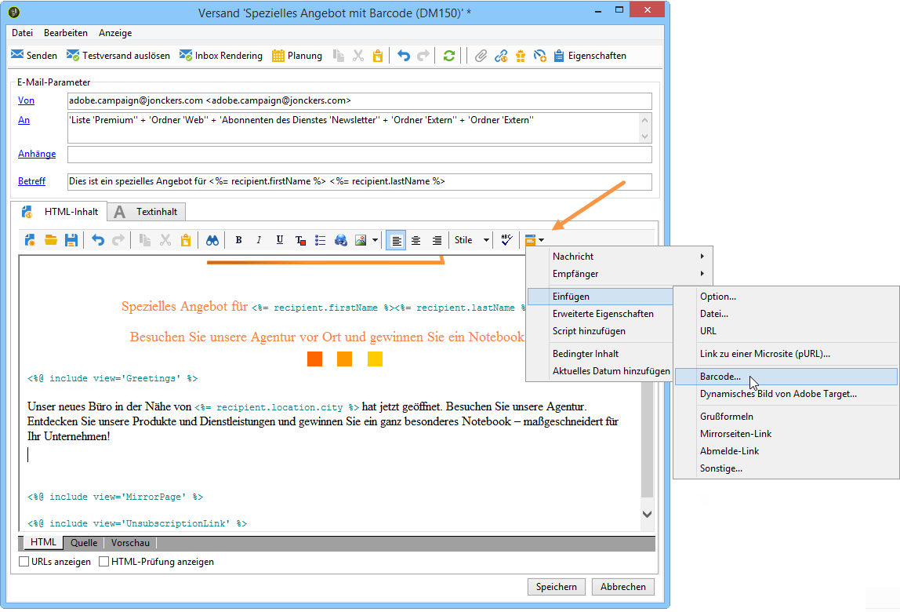
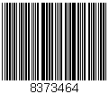
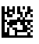
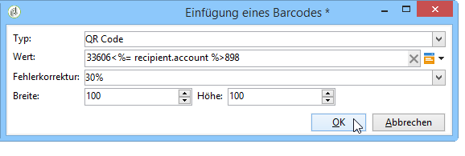
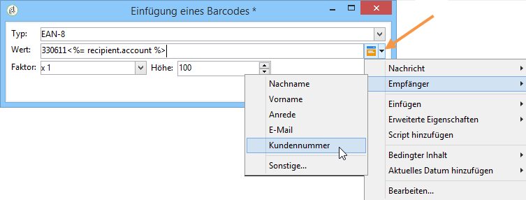
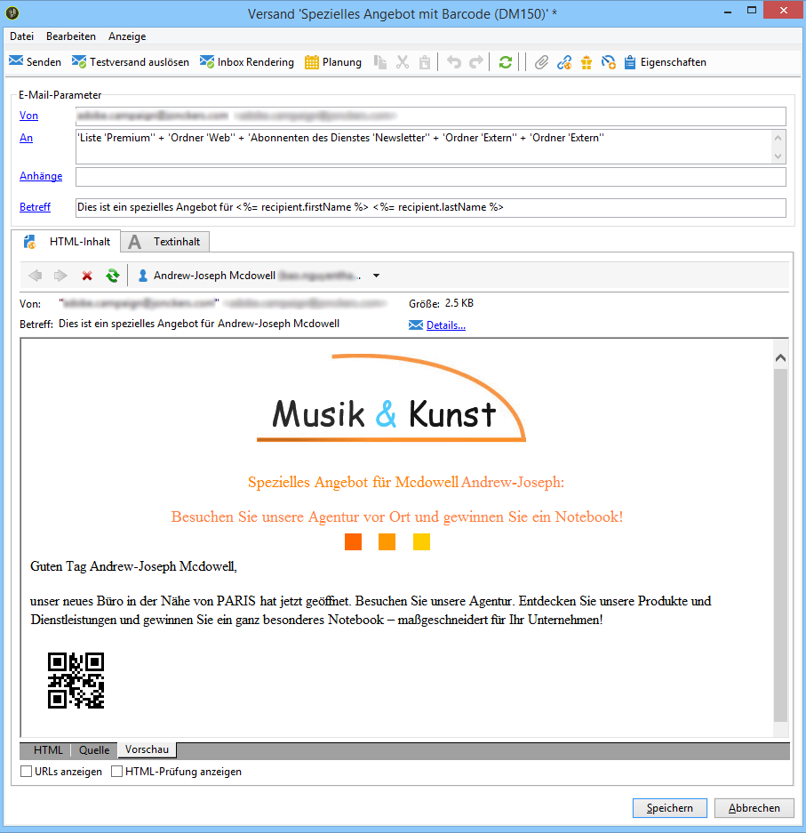
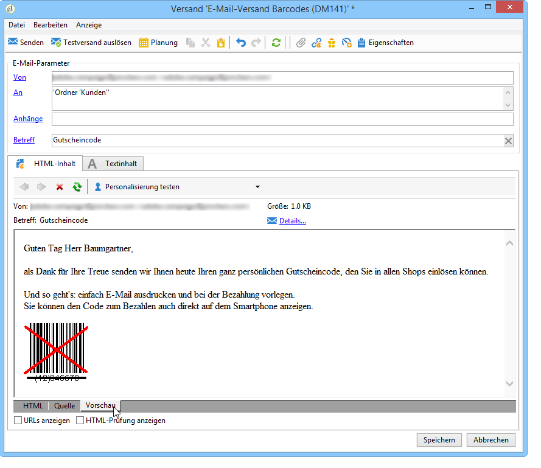

# Einfügen eines Barcodes in eine E-Mail{#insert-a-barcode-in-an-email}

Die Barcode-Lösung bietet die Möglichkeit, verschiedene ein- oder zweidimensionale Code-Typen in den gängigsten Normen zu erstellen.

Es ist möglich, einen Barcode dynamisch als Bitmap unter Verwendung eines Werts zu generieren, der mithilfe von Kundenkriterien definiert wurde. Personalisierte Barcodes können in E-Mail-Kampagnen aufgenommen werden. Die Empfängerin bzw. der Empfänger kann die Nachricht drucken und sie dem ausstellenden Unternehmen zum Scannen vorlegen (z. B. beim Auschecken).

Positionieren Sie den Cursor im Inhalt an der Stelle, an der der Barcode eingefügt werden soll, und klicken Sie auf die Personalisierungsschaltfläche. Wählen Sie **[!UICONTROL Einfügen > Barcode...]**.

Konfigurieren Sie dann die verschiedenen Elemente je nach Bedarf:

1. Wählen Sie den Barcode-Typ aus.

   * Für das 1D-Format stehen in Adobe Campaign folgende Typen zur Verfügung: Codabar, Code 128, GS1-128 (vormals EAN-128), UPC-A, UPC-E, ISBN, EAN-8, Code39, Interleaved 2 of 5, POSTNET und Royal Mail (RM4SCC).

     Beispiel eines 1D-Barcodes:

     

   * Die Typen DataMatrix und PDF417 betreffen das 2D-Format.

     Beispiel eines 2D-Barcodes:

     

   * Wählen Sie zum Einfügen eines QR-Codes seinen Typ aus und geben Sie die anzuwendende Fehlerkorrekturrate an. Diese Rate definiert die Menge der wiederholten Informationen und die Toleranz bei Verschlechterung.

     

     Beispiel eines QR-Codes:

     

1. Geben Sie die gewünschte Größe des Barcodes an. Durch Angabe eines Faktors von x1 bis x10 kann die Größe angepasst werden.
1. Im Feld **[!UICONTROL Wert]** können Sie den Wert des Barcodes definieren. Dieser kann einem Sonderangebot entsprechen und die Funktion von Kriterien übernehmen. Es kann sich um einen Wert eines mit den Kundinnen und Kunden verknüpften Datenbankfelds handeln.

   Unten stehendes Beispiel zeigt einen EAN-8-Barcode, in dem die Kundennummer eines Empfängers enthalten ist. Klicken Sie auf die Personalisierungsschaltfläche rechts vom Feld **[!UICONTROL Wert]** und wählen Sie die Option **[!UICONTROL Empfänger > Kundennummer]**.

   

1. Im Feld **[!UICONTROL Höhe]** können Sie die Höhe des Barcodes anpassen, ohne die Breite und somit die Abstände zwischen den Balken zu verändern.

   Es erfolgt keine einschränkende Kontrolle Ihrer Eingaben in Bezug auf den Barcode-Typ. Sollte ein falscher oder nicht kompatibler Wert eingegeben werden, sehen Sie dies erst in der **Vorschau**. In diesem Fall ist der Barcode rot durchkreuzt.

   >[!NOTE]
   >
   >Der einem Barcode zugewiesene Wert hängt von seinem Typ ab. Beispielsweise muss ein EAN-8-Typ genau 8 Ziffern haben.
   >
   >Die Personalisierungsschaltfläche rechts vom Feld **[!UICONTROL Wert]** ermöglicht das Hinzufügen von Daten zusätzlich zum Wert selbst. Dadurch wird der Barcode angereichert, sofern dies vom Barcode-Standard akzeptiert wird.
   >
   >Wenn Sie beispielsweise einen GS1-128-Barcode verwenden und zusätzlich zum Wert die Kontonummer einer Empfängerin bzw. eines Empfängers angeben möchten, klicken Sie auf die Personalisierungsschaltfläche und wählen Sie die Option **[!UICONTROL Empfänger > Kundennummer]**. Wenn die Kontonummer der ausgewählten Empfängerin bzw. des ausgewählten Empfängers korrekt eingegeben wird, wird sie vom Barcode berücksichtigt.

Nachdem diese Elemente konfiguriert wurden, können Sie Ihre E-Mail abschließen und senden. Um Fehler zu vermeiden, sollten Sie vor dem Versand stets sicherstellen, dass Ihr Inhalt korrekt angezeigt wird. Klicken Sie hierzu auf die Registerkarte **[!UICONTROL Vorschau]**.

>[!NOTE]
>
>Sollte ein Barcode-Wert sich als ungültig erweisen, erscheint das entsprechende Bild in der Vorschau rot durchkreuzt.

