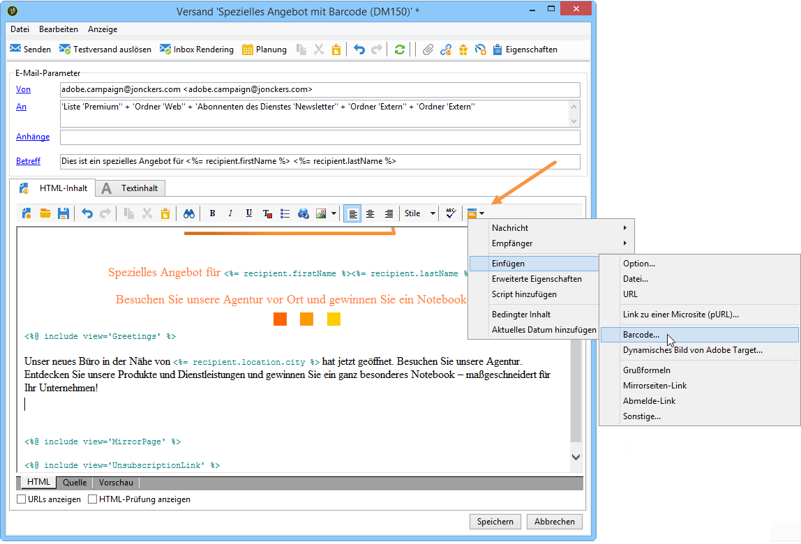
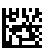
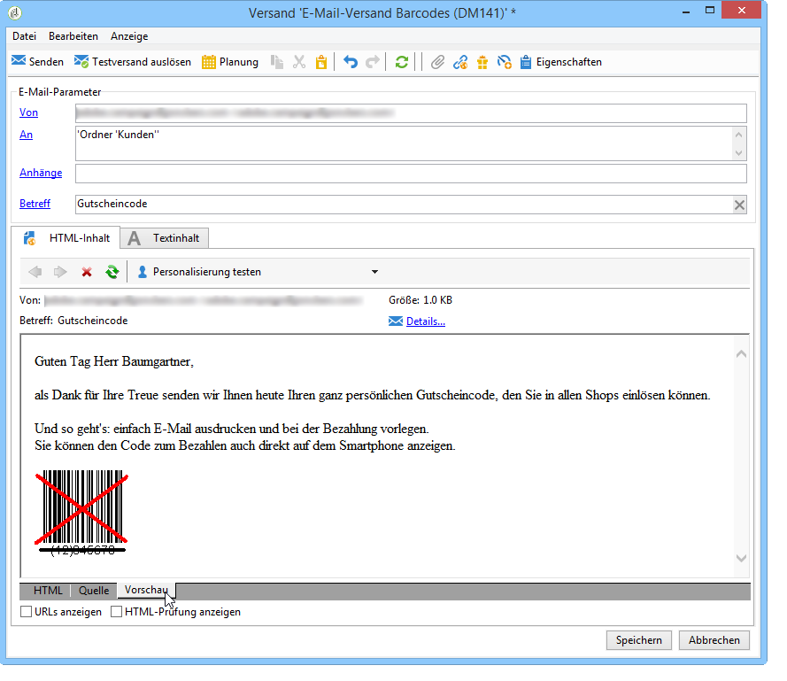

# Barcode in eine E-Mail einfügen{#inserting-a-barcode-in-an-email}

Die Barcode-Lösung bietet die Möglichkeit, verschiedene ein- oder zweidimensionale Code-Typen in den gängigsten Normen zu erstellen.

Barcodes können in Form eines Bitmaps dynamisch mithilfe eines durch Kundenkriterien definierten Werts erzeugt werden. Personalisierte Barcodes lassen sich dann über E-Mails in Marketingkampagnen integrieren. Der Empfänger kann die Nachricht ausdrucken und sie dem Unternehmen (z. B. bei einem Zahlvorgang) zum Scannen vorlegen.

To insert a barcode into an email, place the cursor in the content where you want to display it, then click the personalization button. Select **[!UICONTROL Include > Barcode...]**.

Konfigurieren Sie dann die verschiedenen Elemente je nach Bedarf:

1. Wählen Sie den Barcode-Typ aus.

   * Für das 1D-Format stehen in Adobe Campaign folgende Typen zur Verfügung: Codabar, Code 128, GS1-128 (vormals EAN-128), UPC-A, UPC-E, ISBN, EAN-8, Code39, Interleaved 2 of 5, POSTNET und Royal Mail (RM4SCC).

      Beispiel eines 1D-Barcodes:

      

   * Die Typen DataMatrix und PDF417 betreffen das 2D-Format.

      Beispiel eines 2D-Barcodes:

      

   * Bei der Wahl eines QR-Codes ist die anzuwendende Fehlerkorrektur anzugeben. Die Quote bezeichnet den zu wiederholenden Informationsanteil und damit eine mehr oder weniger ausgeprägte Toleranz bei partieller Unlesbarkeit.

      

      Beispiel eines QR-Codes:

      

1. Geben Sie die gewünschte Größe des Barcodes an. Durch Angabe eines Faktors von x1 bis x10 kann die Größe angepasst werden.
1. Mit dem **[!UICONTROL Value]** Feld können Sie den Wert des Barcodes definieren. Ein Wert kann mit einem bestimmten Angebot übereinstimmen und die Funktion eines Kriteriums sein. Es kann sich dabei um den Wert eines Datenbankfelds handeln, das mit den Kunden verknüpft ist.

   Dieses Beispiel zeigt einen EAN-8-Barcode, dem die Kontonummer eines Empfängers hinzugefügt wurde. Um diese Kontonummer hinzuzufügen, klicken Sie auf die Personalisierungsschaltfläche rechts neben dem **[!UICONTROL Value]** Feld und wählen Sie **[!UICONTROL Recipient > Account number]**.

   

1. The **[!UICONTROL Height]** field lets you configure the height of the barcode without changing its width, by altering the amount of space between each bar.

   Bitte beachten Sie, dass keine einschränkende Kontrolle Ihrer Eingaben in Bezug auf den Barcode-Typ erfolgt. Sollte ein falscher oder nicht kompatibler Wert eingegeben werden, sehen Sie dies erst in der **Vorschau**. In diesem Fall ist der Barcode rot durchkreuzt.

   >[!NOTE]
   >
   >Der einem Barcode zugeteilte Wert ist vom Typ abhängig. So muss beispielsweise ein EAN-8-Barcode genau acht Ziffern enthalten.
   >
   >Mit der Personalisierungsschaltfläche rechts neben dem **[!UICONTROL Value]** Feld können Sie zusätzlich zu dem Wert selbst Daten hinzufügen. Dadurch wird der Barcode angereichert, sofern er vom Barcode-Standard akzeptiert wird.
   >
   >For example, if you are using a GS1-128 type barcode and want to enter the account number of a recipient in addition to the value, click the personalization button and select **[!UICONTROL Recipient > Account number]**. If the account number of the selected recipient is entered correctly, the barcode takes it into account.

Nachdem diese Elemente konfiguriert wurden, können Sie Ihre E-Mail abschließen und senden. Um Fehler zu vermeiden, sollten Sie stets sicherstellen, dass Ihr Inhalt korrekt angezeigt wird, bevor Sie eine Bereitstellung durchführen, indem Sie auf die **[!UICONTROL Preview]** Registerkarte klicken.

>[!NOTE]
>
>Sollte ein Barcode-Wert sich als ungültig erweisen, erscheint das entsprechende Bild in der Vorschau rot durchkreuzt.

