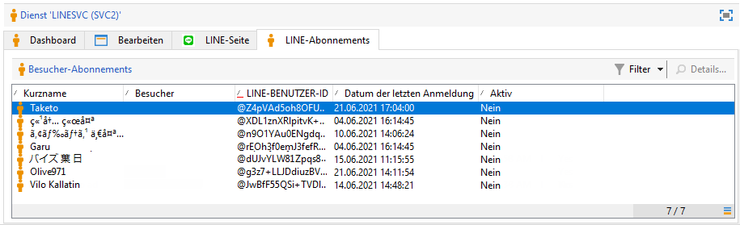

# LINE-Kanal{#line-channel}

LINE ist ein kostenfreier Dienst für Instant Messaging, VoIP und Video, der auf Smartphones (iPhone, Android, Windows Phone, BlackBerry, Nokia) und auf PC genutzt werden kann. Adobe Campaign ermöglicht Ihnen den Versand von LINE-Nachrichten.

LINE ist nur für On-Premise-Installationen oder Managed Services verfügbar.

LINE kann auch mit dem Transaktionsnachrichten-Modul kombiniert werden, sodass Echtzeitnachrichten über die auf den Mobilgeräten der Konsumenten installierten LINE-App gesendet werden können. Weiterführende Informationen dazu finden Sie auf dieser [Seite](../../message-center/using/transactional-messaging-architecture.md#transactional-messaging-and-line).

Die folgenden Abschnitte enthalten Informationen, die speziell für den LINE-Kanal gelten. Globale Informationen zum Erstellen einer Bereitstellung finden Sie in[diesem Abschnitt](../../delivery/using/steps-about-delivery-creation-steps.md).

Wie bei anderen Kanälen haben Sie bei Verwendung des LINE-Kanals folgende Möglichkeiten:

1. Versanderstellung
1. Konfiguration des Nachrichteninhalts
1. Zielgruppe bestimmen
1. Nachrichtenversand
1. Versandverfolgung (Tracking, Quarantänen, Berichte etc.).

## LINE-Kanal einrichten {#setting-up-line-channel}

### Erstellung eines LINE-Kontos und eines externen Kontos {#creating-a-line-account-and-an-external-account-}

>[!NOTE]
>
>Vor der Erstellung eines LINE-Kontos und eines externen Kontos müssen Sie das LINE-Package auf Ihrer Instanz installieren. Weiterführende Informationen dazu finden Sie im Installationshandbuch im Abschnitt [LINE](../../installation/using/installing-campaign-standard-packages.md#line-package).

Sie müssen zunächst ein LINE-Konto erstellen und dieses mit Adobe Campaign verknüpfen, damit Sie LINE-Nachrichten an diejenigen Benutzer senden können, die Ihr LINE-Konto in ihrer Mobile App hinzugefügt haben. Externe Konten und das LINE-Konto können nur vom funktionalen Administrator der Plattform verwaltet werden.

Weiterführende Informationen zur Erstellung und Konfiguration eines LINE-Kontos finden Sie unter folgendem Link [https://developers.line.me/](https://developers.line.me/).

To create and configure a LINE service, see [Managing subscriptions](../../delivery/using/managing-subscriptions.md).

Gehen Sie wie folgt vor, um ein externes Konto zu erstellen:

1. Gehen Sie im Navigationsbaum in das Menü **Administration** > **Plattform** > **Externe Konten**.
1. Erstellen Sie ein neues Konto mithilfe der Schaltfläche **Neu**.

   

1. Füllen Sie die Felder **Titel** und **Interner Name** aus.
1. In the **[!UICONTROL Type]** field, select Routing and in the **Channel** field, select LINE.
1. Click **[!UICONTROL Save]** to create your LINE external account.
1. Ein **LINE**-Personalisierungsfeld wird daraufhin unter dem Symbol **Allgemein** angezeigt. Füllen Sie die folgenden Felder aus:

   

   * **Kanalalias**: über Ihr LINE-Konto auf der Registerkarte **[!UICONTROL Channels]** > **[!UICONTROL Technical configuration]** .
   * **Kennung des Kanals**: Entnehmen Sie die Kennung dem Tab **Channels** > **Basic Information panel** Ihres LINE-Kontos.
   * **Geheimschlüssel des Kanals**: Entnehmen Sie den Geheimschlüssel dem Tab **Channels** > **Basic Information panel** Ihres LINE-Kontos.
   * **Zugriffstoken**: wird über Ihr LINE-Konto im Developer Portal oder durch Klicken auf die **[!UICONTROL Get access token]** Schaltfläche bereitgestellt.
   * **Ablaufdatum des Zugriffstokens**: dient der Angabe des Zugriffstoken-Ablaufdatums.
   * **LINE-Abonnement-Dienst**: dient der Angabe des Dienstes, für den die Nutzer angemeldet werden.

>[!NOTE]
>
>Sie müssen überprüfen, ob die **[!UICONTROL LINE access token update (updateLineAccessToken)]** und die **[!UICONTROL Delete blocked LINE users (deleteBlockedLineUsers)]** Workflows gestartet wurden. Klicken Sie im Explorer auf , **[!UICONTROL Administration > Production > Technical workflows > LINE workflows]** um den Status der Workflows zu überprüfen.

## Versand erstellen {#creating-the-delivery}

Gehen Sie wie folgt vor, um einen **LINE**-Versand zu erstellen:

>[!NOTE]
>
>Allgemeine Methoden zur Versanderstellung finden Sie in [diesem Abschnitt](../../delivery/using/steps-about-delivery-creation-steps.md).

1. Wählen Sie auf der **[!UICONTROL Campaigns]** Registerkarte **[!UICONTROL Deliveries]** und klicken Sie auf die **[!UICONTROL Create]** Schaltfläche.
1. In the window that appears, select **[!UICONTROL LINE V2 delivery]** delivery template.

   

1. Geben Sie für Ihren Versand einen Titel, einen Code und eine Beschreibung ein. Weiterführende Informationen dazu finden Sie in [diesem Abschnitt](../../delivery/using/steps-create-and-identify-the-delivery.md#identifying-the-delivery).
1. Click **[!UICONTROL Continue]** to create your delivery.

## Nachrichteninhalt konfigurieren {#defining-the-content}

Um den Inhalt eines LINE-Versands zu definieren, fügen Sie zu Ihrem Versand zunächst einen Nachrichtentyp hinzu. Jeder LINE-Versand kann maximal fünf Nachrichten enthalten.

Sie können aus zwei Nachrichtentypen auswählen:

* Textnachrichten
* Bild und Link

### Konfiguration eines Textnachrichten-Versands {#configuring-a-text-message-delivery}

Bei einem LINE-Versand vom Typ **Textnachrichten** handelt es sich um eine Nachricht, die in Textform an Empfänger gesendet wird.

Die Konfiguration dieses Nachrichtentyps ähnelt der Konfiguration des **Text**-Formats in einer E-Mail. Lesen Sie für weiterführende Informationen diese [Seite](../../delivery/using/defining-the-email-content.md#message-content).

### Konfiguration eines Bild-und-Link-Versands {#configuring-an-image-and-link-delivery}

Bei einem LINE-Versand vom Typ **Bild und Link** handelt es sich um eine Nachricht in Form eines Bildes, das eine oder mehrere URLs enthalten kann.

Dabei können folgende Elemente verwendet werden:

* **Personalisiertes Bild**

   >[!NOTE]
   >
   >Sie können die Variable **%SIZE%** verwenden: Mithilfe dieser Variable lässt sich die Anzeige je nach Bildschirmgröße der Mobilgeräte von Nachrichtenempfängern optimieren.

   

* **Bild-URL**

   

   Bild-URLs dienen der Verwendung von Bildern mit unterschiedlicher Auflösung, um die Sichtbarkeit der Sendung auf unterschiedlichen Mobilgeräten zu optimieren. Nur Bilder mit derselben Breite und Höhe werden unterstützt:

   Bilder können entsprechend der Bildschirmgröße definiert werden:

   * 1040 px
   * 700 px
   * 460 px
   * 300 px
   * 240 px
   >[!NOTE]
   >
   >Die Größe 1040 x 1040 Pixel ist für LINE-Bilder mit Links zwingend.

   Fügen Sie dann Alternativtext hinzu, der auf dem Mobilgerät des Empfängers angezeigt wird.

* und **[!UICONTROL Links]**.

   

   Im **[!UICONTROL Links]** Abschnitt können Sie zwischen verschiedenen Layouts wählen, die das Bild in mehrere klickbare Bereiche unterteilen. Anschließend können Sie jedem Benutzer einen eigenen Link zuweisen.

>[!NOTE]
>
>Die Syntax &lt;%@ include option=&#39;NmsServer_URL&#39; %>/webApp/APP3?id=&lt;%=escapeUrl(cryptString(visitor.id))%> ermöglicht es, einen WebApp-Link in eine LINE-Nachricht einzuschließen.

### Empfehlungen {#recommendations}

* Wenn Sie einen LINE-Versand erstmals an einen neuen Empfänger senden, sind Sie verpflichtet, die offizielle LINE-Mitteilung hinzuzufügen, in der die Nutzungsbedingungen sowie die Einverständniserklärung enthalten sind. Der offizielle Text ist unter folgendem Link verfügbar: [https://terms.line.me/OA_privacy/](https://terms.line.me/OA_privacy/sp?lang=fr).

## Zielgruppe bestimmen {#selecting-the-target-population}

Die Auswahl der Empfänger einer LINE-Zustellung ist ähnlich wie die Definition der Empfänger der E-Mail-Zustellung. Weitere Informationen finden Sie unter [Zielgruppen](../../delivery/using/steps-defining-the-target-population.md)identifizieren.

Die Zielgruppenbestimmung ist auf **Besucher** ausgerichtet.

## Nachrichten senden {#sending-messages}

Nach Abschluss der Konfiguration Ihres Versands können Sie ihn an die zuvor bestimmte Zielgruppe senden.

Das Senden von LINE-Zustellungen ist mit dem Senden einer E-Mail-Zustellung vergleichbar. Weitere Informationen zum Senden einer Lieferung finden Sie unter [Senden von Nachrichten](../../delivery/using/sending-messages.md).

## Zugriff auf Berichte {#accessing-reports}

Sie können Berichte zum LINE-Dienst anzeigen, indem Sie im Explorer auf **[!UICONTROL Profiles and Targets > Services and Subscriptions > LINE]** klicken. Klicken Sie dann auf das **[!UICONTROL Reports]** Symbol im LINE-Dienst.

Um Berichte zu LINE-Auslieferungen anzuzeigen, klicken Sie auf **[!UICONTROL Campaign Management > Deliveries]** und wählen Sie dann die gewünschte Auslieferung aus. Die Verfolgungsberichte geben die Clickthrough-Rate an. LINE berücksichtigt nicht den offenen Tarif.

## Beispiel: Erstellung und Versand einer personalisierten LINE-Nachricht {#example--create-and-send-a-personalized-line-message}

In diesem Beispiel wird aufgezeigt, wie Sie eine Textnachricht und ein Bild, die je nach Empfänger personalisiert werden, erstellen und konfigurieren können.

1. Create your LINE delivery by clicking the **[!UICONTROL Create]** button from the **[!UICONTROL Campaign]** tab.

   

1. Select the **[!UICONTROL LINE V2 delivery]** delivery template and name your delivery.

   

1. Wählen Sie im Konfigurationsfenster Ihres Versands Ihre Zielpopulation aus.

   

1. Klicken Sie auf **[!UICONTROL Add]** , um eine Nachricht zu erstellen, und wählen Sie die **[!UICONTROL Message type]**.

   Hier möchten wir zunächst eine Textnachricht erstellen.

   

1. Place your cursor in the place where you want to insert the personalized text and click the drop-down icon then select **[!UICONTROL Visitor > First name]**.

   

1. Gehen Sie wie folgt vor, um ein Bild hinzuzufügen und wählen Sie **[!UICONTROL Image and links]** in der **[!UICONTROL Message type]** Dropdown-Liste aus.

   Fügen Sie Ihre Bild-URL hinzu.

   

1. Wählen Sie im Bereich **[!UICONTROL Links]** das Layout aus, gemäß dem Ihr Bild in mehrere anklickbare Bereiche unterteilt wird.
1. Weisen Sie jedem Bereich des Bildes eine URL zu.

   

1. Save your delivery then click **[!UICONTROL Send]** to analyze and send it to the target.

   Der Versand wird an die Zielgruppe gesendet:

   
