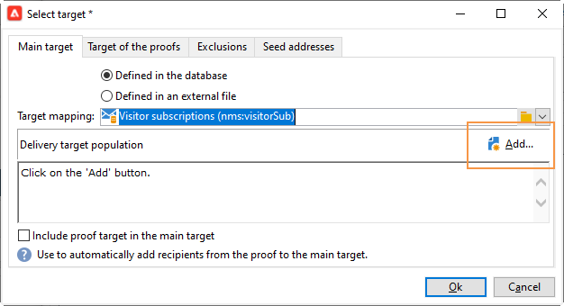

# Erstellung eines LINE-Versands{#line-channel}

>[!NOTE]
>
>[!DNL LINE] ist nur für On-Premise-Installationen oder Managed Services verfügbar.

[!DNL LINE] ist eine Anwendung für kostenlose Instant Messaging-, Sprach- und Videoanrufe, die auf jedem mobilen Betriebssystem und auf jedem PC verfügbar sind.

[!DNL LINE] kann auch mit dem Transaktionsnachrichten-Modul kombiniert werden, um Echtzeit-Nachrichten an die  [!DNL LINE] App zu senden, die auf Mobilgeräten für Endverbraucher installiert ist. Weiterführende Informationen hierzu finden Sie auf dieser [Seite](../../message-center/using/transactional-messaging-architecture.md#transactional-messaging-and-line).

Die Schritte zur Verwendung des Kanals [!DNL LINE] sind:

1. [LINE-Kanal einrichten](#setting-up-line-channel)
1. [Versanderstellung](#creating-the-delivery)
1. [Konfigurieren des Inhaltstyps](#defining-the-content)
1. [Versandverfolgung (Tracking, Quarantänen, Berichte etc.)](#accessing-reports)

## LINE-Kanal einrichten {#setting-up-line-channel}

Bevor Sie ein [!DNL LINE]-Konto und ein externes Konto erstellen, müssen Sie zunächst das LINE-Paket auf Ihrer Instanz installieren. Weitere Informationen hierzu finden Sie im Abschnitt [LINE](../../installation/using/installing-campaign-standard-packages.md#line-package) im Installationshandbuch.

Sie müssen zunächst ein [!DNL LINE]-Konto erstellen, damit Sie es dann mit Adobe Campaign verknüpfen können. Anschließend können Sie [!DNL LINE]-Nachrichten an Benutzer senden, die Ihr [!DNL LINE]-Konto in ihrer Mobile App hinzugefügt haben. Externe Konten und das Konto [!DNL LINE] können nur vom funktionalen Administrator der Plattform verwaltet werden.

Informationen zum Erstellen und Konfigurieren eines [!DNL LINE]-Kontos finden Sie in der [Dokumentation für LINE-Entwickler](https://developers.line.me/).

### Erstellen und Konfigurieren des LINE-Dienstes {#configure-line-service}

So erstellen Sie Ihren [!DNL LINE]-Dienst:

1. Wählen Sie auf der Adobe Campaign Classic-Homepage den Tab **[!UICONTROL Profile und Zielgruppen]** aus.

1. Wählen Sie im Menü links **[!UICONTROL Dienste und Abonnements]** aus und klicken Sie auf **[!UICONTROL Erstellen]**.

   

1. Fügen Sie Ihrem neuen Dienst eine **[!UICONTROL Beschriftung]** und **[!UICONTROL Interner Name]** hinzu.

1. Wählen Sie **[!UICONTROL LINE]** aus der Dropdown-Liste **[!UICONTROL Typ]** aus.

   

1. Klicken Sie auf **[!UICONTROL Speichern]**.

Weitere Informationen zu Abonnements und Diensten finden Sie unter [Abonnements verwalten](managing-subscriptions.md).

### Externes LINE-Konto konfigurieren {#configure-line-external}

Nachdem Sie den Dienst [!DNL LINE] erstellt haben, müssen Sie das externe Konto [!DNL LINE] in Adobe Campaign konfigurieren:

1. Gehen Sie im Navigationsbaum in das Menü **[!UICONTROL Administration]** > **[!UICONTROL Plattform]** > **[!UICONTROL Externe Konten]**.

1. Wählen Sie das integrierte externe Konto **[!UICONTROL LINE V2 Routing]** aus.

   

1. Klicken Sie in Ihrem externen Konto auf den Tab **[!UICONTROL LINE]** , um mit der Konfiguration Ihres externen Kontos zu beginnen. Füllen Sie die folgenden Felder aus:

   

   * **[!UICONTROL Kanalalias]**: wird über Ihr  [!DNL LINE] Konto im Tab  **[!UICONTROL Kanäle]**  >  **[!UICONTROL Technische]** Konfiguration bereitgestellt.
   * **[!UICONTROL Kanal-ID]**: wird über Ihr  [!DNL LINE] Konto im Tab  **[!UICONTROL Kanäle]**  >  **[!UICONTROL Grundlegende Informationen]** bereitgestellt.
   * **[!UICONTROL geheimer Kanalschlüssel]**: wird über Ihr  [!DNL LINE] Konto im Tab  **[!UICONTROL Kanäle]**  >  **[!UICONTROL Grundlegende Informationen]** bereitgestellt.
   * **[!UICONTROL Zugriffstoken]**: wird über Ihr  [!DNL LINE] Konto im Entwicklerportal oder durch Klicken auf die Schaltfläche Zugriff  **[!UICONTROL erhalten]** Token bereitgestellt.
   * **[!UICONTROL Ablaufdatum des Zugriffstokens]**: dient der Angabe des Zugriffstoken-Ablaufdatums.
   * **[!UICONTROL LINE-Abonnement-Dienst]**: dient der Angabe des Dienstes, für den die Nutzer angemeldet werden.

1. Nachdem Sie die Konfiguration abgeschlossen haben, klicken Sie auf **[!UICONTROL Speichern]**.

1. Wählen Sie im **[!UICONTROL Explorer]** **[!UICONTROL Administration]** > **[!UICONTROL Produktion]** > **[!UICONTROL Technische Workflows]** > **[!UICONTROL LINE-Workflows]** aus, um zu überprüfen, ob das **[!UICONTROL LINE V2-Zugriffstoken-Update (updateLineAccessToken)&lt;a 11/> und**[!UICONTROL  Bereinigung der gesperrten LINE-Benutzer (deleteBlockedLineUsers)]**-Workflows.]**

Der [!DNL LINE] ist jetzt in Adobe Campaign konfiguriert. Sie können mit der Erstellung und dem Versand von LINE-Sendungen an Abonnenten beginnen.

## LINE-Versand erstellen {#creating-the-delivery}

>[!NOTE]
>
>Beim erstmaligen Versand eines [!DNL LINE]-Versands an einen neuen Empfänger müssen Sie die offizielle LINE-Nachricht bezüglich der Nutzungsbedingungen und der Zustimmung zum Versand hinzufügen. Die offizielle Nachricht ist unter [dem folgenden Link](https://terms.line.me/OA_privacy/) verfügbar.

Gehen Sie wie folgt vor, um einen [!DNL LINE]-Versand zu erstellen:

1. Verwenden Sie im Tab **[!UICONTROL Kampagnen]** **[!UICONTROL Sendungen]** und danach die Schaltfläche **[!UICONTROL Erstellen]**.

   

1. Wählen Sie die Versandvorlage **[!UICONTROL LINE V2 delivery]** aus.

   

1. Identifizieren Sie Ihren Versand mit einem **[!UICONTROL Titel]**, **[!UICONTROL Versandcode]** und einer **[!UICONTROL Beschreibung]**. Weiterführende Informationen hierzu finden Sie in [diesem Abschnitt](steps-create-and-identify-the-delivery.md#identifying-the-delivery).

1. Bestätigen Sie durch Verwendung der Schaltfläche **[!UICONTROL Fortfahren]** die Versanderstellung.

1. Wählen Sie im Versand-Editor **[!UICONTROL To]** aus, um die Empfänger Ihres [!DNL LINE]-Versands anzusprechen. Das Targeting erfolgt über **[!UICONTROL Besucheranmeldungen (nms:visitorSub)]**.

   Weitere Informationen hierzu finden Sie unter [Zielpopulationen identifizieren](steps-defining-the-target-population.md).

   

1. Klicken Sie auf **[!UICONTROL Hinzufügen]** , um Ihre **[!UICONTROL Zielpopulation für Sendungen]** auszuwählen.

   

1. Wählen Sie aus, ob Sie [!DNL LINE]-Abonnenten direkt als Ziel auswählen möchten oder ob Sie Benutzer abhängig von ihrem [!DNL LINE]-Abonnement als Ziel auswählen möchten, und klicken Sie auf **[!UICONTROL Weiter]**. In diesem Beispiel haben wir **[!UICONTROL Nach LINE V2-Abonnement]** ausgewählt.

1. Wählen Sie **[!UICONTROL Line-V2]** in der Dropdown-Liste **[!UICONTROL Ordner]** und dann Ihren [!DNL LINE]-Dienst aus. Klicken Sie auf **[!UICONTROL Beenden]** und dann auf **[!UICONTROL OK]**, um Ihren Versand zu personalisieren.

   

1. Klicken Sie in Ihrem Versand-Editor auf **[!UICONTROL Hinzufügen]** , um eine oder mehrere Nachrichten hinzuzufügen und den **[!UICONTROL Inhaltstyp]** auszuwählen.

   Weitere Informationen zu den verschiedenen verfügbaren **[!UICONTROL Inhaltstypen]** finden Sie unter [Inhaltstyp ](#defining-the-content) definieren.

   

1. Nach Abschluss der Konfiguration Ihres Versands können Sie ihn an die zuvor bestimmte Zielgruppe senden.

   Weitere Informationen zum Versand finden Sie unter [Nachrichten senden](sending-messages.md).

1. Rufen Sie nach dem Versand Ihrer Nachricht Ihren Bericht auf, um die Effektivität Ihres Versands zu messen.

   Weitere Informationen zu [!DNL LINE] -Berichten finden Sie unter [Zugriff auf Berichte](#accessing-reports).

## Inhaltstyp definieren {#defining-the-content}

Um den Inhalt eines [!DNL LINE]-Versands zu definieren, müssen Sie zunächst einen Nachrichtentyp zu Ihrem Versand hinzufügen. Jeder [!DNL LINE]-Versand kann bis zu fünf Nachrichten enthalten.

Es stehen drei Nachrichtentypen zur Auswahl:

* [Textnachrichten](#configuring-a-text-message-delivery)
* [Bild und Link](#configuring-an-image-and-link-delivery)
* [Video-Nachricht](#configuring-a-video-message-delivery)

### Konfiguration eines Textnachrichten-Versands {#configuring-a-text-message-delivery}

>[!NOTE]
>
>Die `<%@ include option='NmsServer_URL' %>/webApp/APP3?id=<%=escapeUrl(cryptString(visitor.id))%>`-Syntax ermöglicht es Ihnen, einen Link zu einer Web-App in eine LINE-Nachricht einzuschließen.

Ein **[!UICONTROL Textnachrichten]** [!DNL LINE]-Versand ist eine Nachricht, die in Textform an Empfänger gesendet wird.

Die Konfiguration für diesen Nachrichtentyp ähnelt der Konfiguration von **[!UICONTROL Text]** in einer E-Mail. Weitere Informationen finden Sie auf dieser [Seite](defining-the-email-content.md#message-content).

### Konfiguration eines Bild-und-Link-Versands {#configuring-an-image-and-link-delivery}

Ein **[!UICONTROL Bild- und Link-Versand]** [!DNL LINE] ist eine Nachricht, die an Empfänger in Form eines Bildes gesendet wird, das eine oder mehrere URLs enthalten kann.

Dabei können folgende Elemente verwendet werden:

* **[!UICONTROL Personalisiertes Bild]**

   >[!NOTE]
   >
   >Sie können die Variable **%SIZE%** verwenden, um die Bildanzeige entsprechend der Bildschirmgröße des Mobilgeräts des Empfängers zu optimieren.

   

* eine **[!UICONTROL Bild-URL]** pro Bildschirmgröße des Geräts,

   

   Mit der Option **[!UICONTROL Bilder nach Bildschirmgröße des Geräts definieren]** können Sie verschiedene Bildauflösungen verwenden, um die Sichtbarkeit der Bereitstellung auf Mobilgeräten zu optimieren. Es werden nur Bilder mit derselben Höhe und Breite unterstützt.

   Bilder können entsprechend der Bildschirmgröße definiert werden:

   * 1040 px
   * 700 px
   * 460 px
   * 300 px
   * 240 px

   >[!CAUTION]
   >
   >Die Größe 1040 x 1040 Pixel ist für LINE-Bilder mit Links zwingend.

   Fügen Sie dann Alternativtext hinzu, der auf dem Mobilgerät des Empfängers angezeigt wird.

* **[!UICONTROL Links]**

   Im Abschnitt **[!UICONTROL Links]** können Sie zwischen verschiedenen Layouts wählen, durch die Ihr Bild in mehrere anklickbare Bereiche unterteilt wird. Anschließend können Sie jedem von ihnen eine dedizierte **[!UICONTROL Link-URL]** zuweisen.

   

### Konfigurieren eines Videonachrichten-Versands {#configuring-a-video-message-delivery}

Ein **[!UICONTROL Video message]** [!DNL LINE]-Versand ist eine Nachricht, die an Empfänger in Form eines Videos gesendet wird, das eine URL enthalten kann.

Im Feld **[!UICONTROL Vorschau Bild-URL]** können Sie die URL eines Vorschaubilds mit einer Zeichenbeschränkung von 1000 hinzufügen. JPEG und PNG werden mit einer Dateigrößenbeschränkung von 1 MB unterstützt.

Im Feld **[!UICONTROL Videobild-URL]** können Sie die URL Ihrer Videodatei mit einer Zeichenbeschränkung von 1000 hinzufügen. Nur das MP4-Format wird mit einer Dateigrößenbeschränkung von 200 MB unterstützt.

Beachten Sie, dass bei der Wiedergabe auf einigen Geräten breite oder große Videos abgeschnitten werden können.

## Zugriff auf Berichte {#accessing-reports}

Nach dem Versand können Sie Ihre [!DNL LINE] Berichte über das Menü **[!UICONTROL Kampagnenverwaltung]** > **[!UICONTROL Sendungen]** im **[!UICONTROL Explorer]** anzeigen.

>[!NOTE]
>
>Die Tracking-Berichte geben die Clickthrough-Rate an. [!DNL LINE] berücksichtigt nicht den Öffnungsgrad.

Rufen Sie für [!DNL LINE]-Dienstberichte das Menü **[!UICONTROL Profile und Zielgruppen]** > **[!UICONTROL Dienste und Abonnements]** > **[!UICONTROL LINE-V2]** im Tab **[!UICONTROL Explorer]** auf. Klicken Sie dann auf das Symbol **[!UICONTROL Berichte]** im Dienst [!DNL LINE].

## Beispiel: Erstellung und Versand einer personalisierten LINE-Nachricht {#example--create-and-send-a-personalized-line-message}

In diesem Beispiel wird aufgezeigt, wie Sie eine Textnachricht und ein Bild, die je nach Empfänger personalisiert werden, erstellen und konfigurieren können.

1. Erstellen Sie Ihren [!DNL LINE]-Versand, indem Sie im Tab **[!UICONTROL Kampagne]** auf die Schaltfläche **[!UICONTROL Erstellen]** klicken.

   

1. Wählen Sie die LINE-Versandvorlage **[!UICONTROL LINE V2-Bereitstellung]** aus und benennen Sie Ihren Versand.

   

1. Wählen Sie im Konfigurationsfenster Ihres Versands Ihre Zielpopulation aus.

   Weitere Informationen hierzu finden Sie unter [Zielpopulationen identifizieren](steps-defining-the-target-population.md).

   

1. Klicken Sie auf **[!UICONTROL Hinzufügen]** , um Ihre Nachricht zu erstellen, und wählen Sie den Inhaltstyp **[!UICONTROL a3/> aus.]**

   Hier möchten wir zunächst eine **[!UICONTROL Textnachricht]** erstellen.

   

1. Platzieren Sie den Cursor an die Stelle, an der der personalisierte Text eingefügt werden soll, und klicken Sie auf das Dropdown-Symbol und wählen Sie **[!UICONTROL Besucher]** > **[!UICONTROL Vorname]** aus.

   

1. Gehen Sie ebenso vor, um ein Bild hinzuzufügen, indem Sie **[!UICONTROL Bild und Link]** in der Dropdown-Liste **[!UICONTROL Nachrichtentyp]** auswählen.

   Fügen Sie Ihre **[!UICONTROL Bild-URL]** hinzu.

   

1. Wählen Sie im Bereich **[!UICONTROL Links]** das Layout aus, gemäß dem Ihr Bild in mehrere anklickbare Bereiche unterteilt wird.

1. Weisen Sie jedem Bereich des Bildes eine URL zu.

   

1. Speichern Sie Ihren Versand und verwenden Sie die Schaltfläche **[!UICONTROL Senden]**, um den Versand zu analysieren und ihn anschließend an die Zielgruppe zu senden.

   Der Versand wird an die Zielgruppe gesendet:

   

