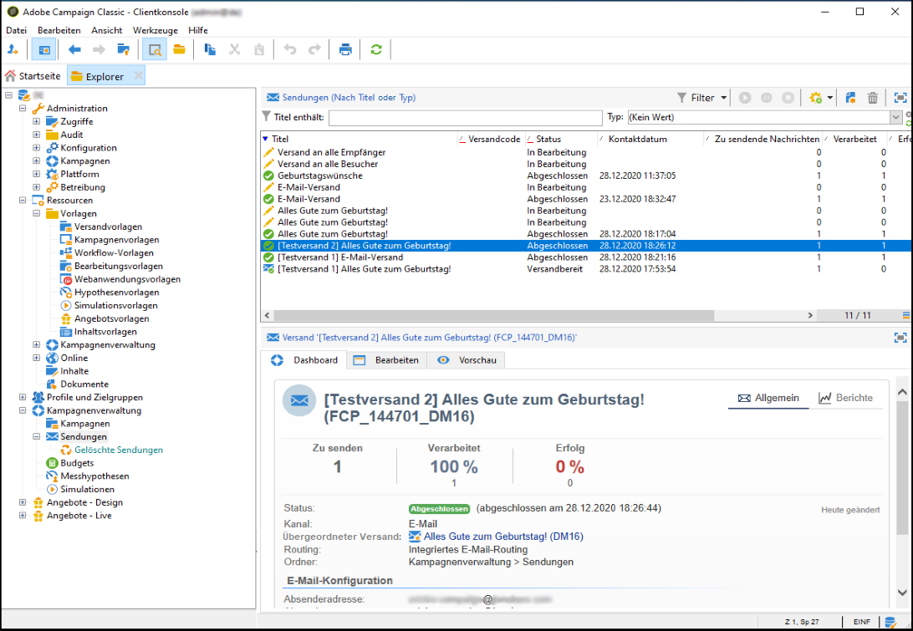

# Auf die Versandliste zugreifen {#list-of-deliveries}

Auf die Liste aller Sendungen kann im Knoten **[!UICONTROL Kampagnenverwaltung > Sendungen]** zugegriffen werden.

Standardmäßig zeigt die Versandliste die Titel und Status aller im ausgewählten Knoten erstellten Sendungen sowie die Anzahl der zu versendenden, der verarbeiteten und der erfolgreich zugestellten Nachrichten an.

* Die Angabe **[!UICONTROL Zu sendende Nachrichten]** entspricht der Anzahl der Empfänger in der Zielgruppe, nach der Analyse aber vor Absendung.
* In der Spalte **[!UICONTROL Erfolg]** wird die Anzahl der erfolgreich zugestellten Nachrichten angezeigt.
* Die Spalte **[!UICONTROL Verarbeitet]** enthält die Summe der zugestellten und fehlerhaften Nachrichten.

>[!NOTE]
>
>Bei umfangreichen Sendungen kann es nützlich sein, diese Werte zu aktualisieren. Machen Sie einen Rechtsklick auf dem entsprechenden Versand. Wählen Sie **[!UICONTROL Aktion > Sende- und Berichtindikatoren neu berechnen...]** und folgen Sie den einzelnen Schritten des Assistenten.

**Verwandte Themen:**

* [Versand-Dashboard](../../delivery/using/delivery-dashboard.md)
* [Versandstatus](../../delivery/using/delivery-statuses.md)
